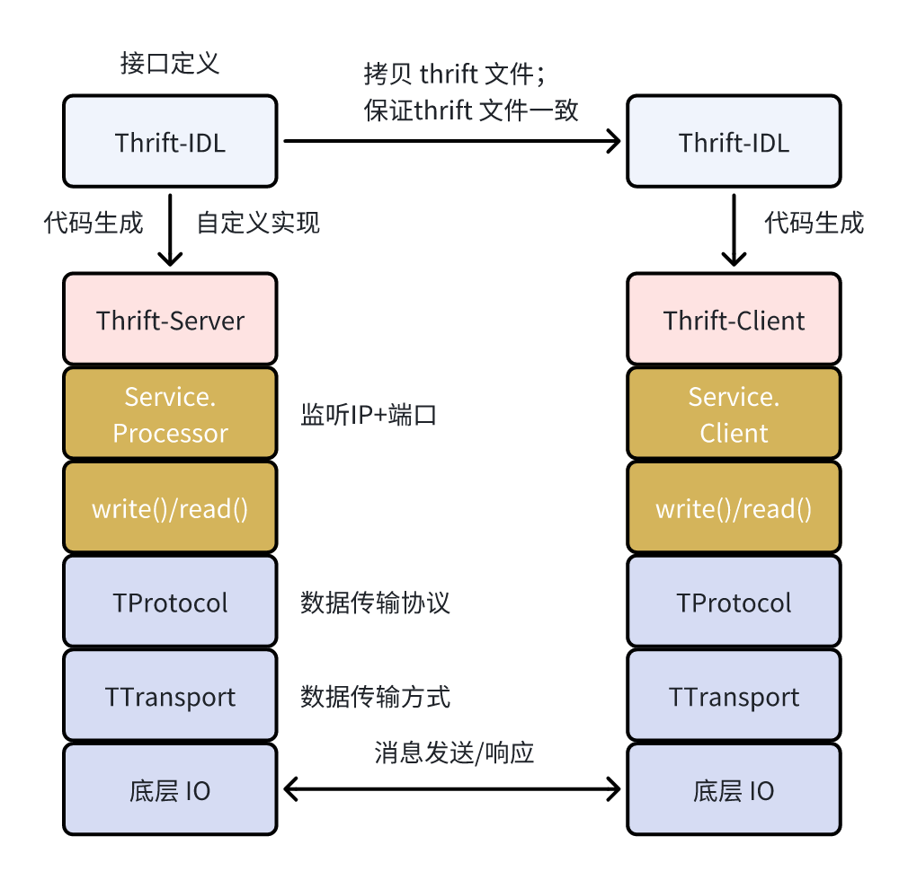
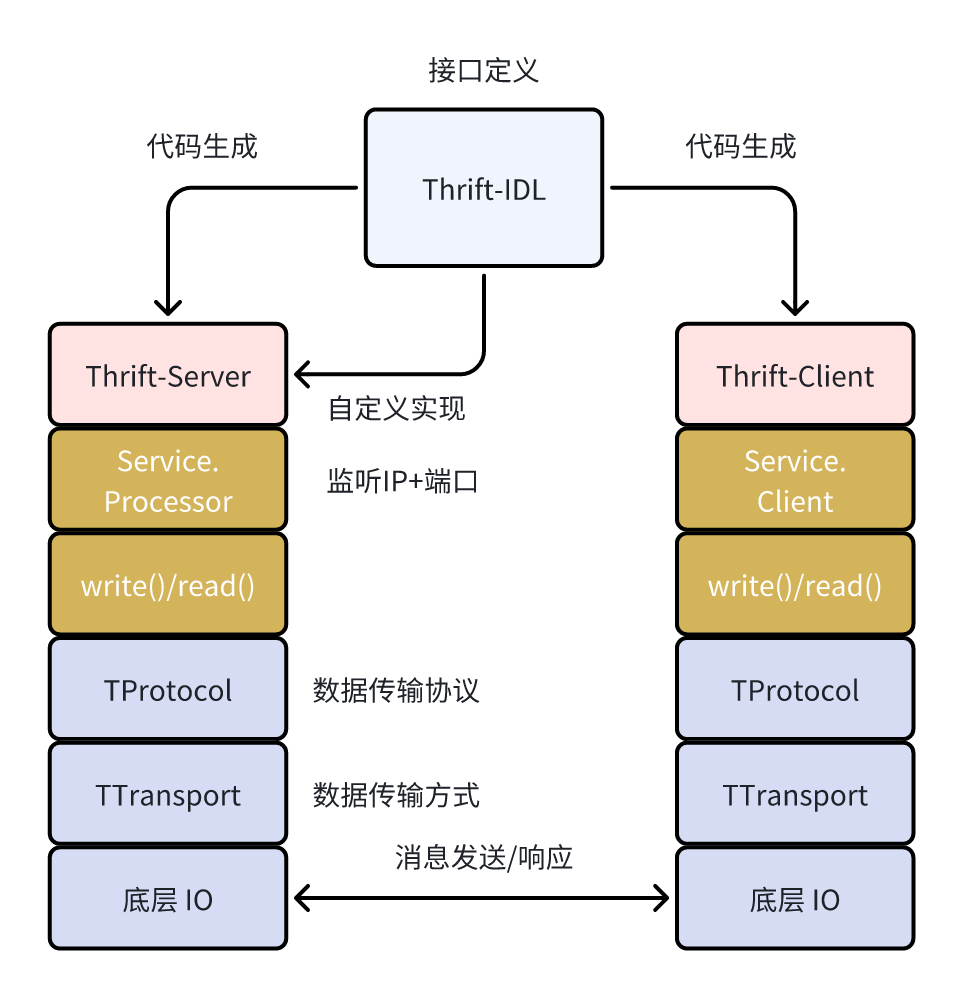

# RPC / gRPC 框架 / Thrift框架

## 1 RPC

RPC（Remote Procedure Call），即“远程过程调用”，它的核心思想是：让你在一台计算机上调用另一台计算机上的函数，就像调用本地函数一样简单。RPC本质：

1. 屏蔽底层网络通信细节。
2. 提供透明的函数调用方式。
3. 让服务端专注“提供功能”，客户端专注“使用功能”。

没有 RPC 时，需要按照如下的步骤调用远程服务：

1. 建立 TCP/HTTP 连接
2. 自定义通信协议
3. 自己序列化/反序列化数据
4. 处理网络超时、断线重连等问题

其调用流程如下，是一个极为复杂、重复且容易出错的过程：

```go
客户端                                     服务端
  |                                         |
  | --- ---> 建立连接 (TCP/HTTP) ---------->  |
  | -------> 构造消息（手动） ---------------> |
  | <------- 解析响应（手动） <--------------- |

```

#### 1.1 RPC 的执行流程

如果有了 RPC 框架的话，上述流程会变得非常简单，RPC 框架会自动生成通信代码：

+ 定义函数接口（.proto / .thrift / .idl 文件）
+ 框架生成 stub（客户端） 和 skeleton（服务端）
+ 自动处理序列化、网络传输、错误处理等

使用 RPC 的调用流程图如下：

```go
Client                      RPC Framework                    Server
  |                               |                             |
  |  client.Add(1, 2) -------->   |                             |
  |     (looks like local call)   |                             |
  |                               |  serialize parameters       |
  |                               |  open connection & send --->|
  |                               |                             |
  |                               |        wait for response    |
  |                               |<----------------------------|
  |                               |  receive & deserialize      |
  |<------------------------------|                             |
  |        return result (3)                                    |

```

#### 1.2 什么是普通 RPC 和流式 RPC

**普通 RPC（Unary RPC）**

普通 RPC 主要特点是其客户端发送一个请求，服务端返回一个响应。其类似于函数调用如：`result := Add(a, b)`。下面是一个 gRPC 的调用案例：

```go
resp, err := client.Echo(ctx, &EchoRequest{Message: "hi"})
```

**流式 RPC（Streaming RPC）**

流式 RPC 使用流（Stream）来持续发送或接收多个消息，适用于需要持续交互或大量数据传输的场景。

| 类型                    | 含义                                 | 使用场景             |
| ----------------------- | ------------------------------------ | -------------------- |
| Server Streaming        | 客户端发一个请求，服务端返回多个响应 | 聊天记录查询、日志流 |
| Client Streaming        | 客户端发多个请求，服务端返回一个响应 | 文件上传、批量写入   |
| Bidirectional Streaming | 双方都可以发送多个消息               | 聊天、实时协作       |

三种流式 RPC 示意图：

1. Server Streaming：

```
客户端 → 请求
服务端 → 响应1
        → 响应2
        → 响应3
```

2. Client Streaming：

```
客户端 → 请求1
客户端 → 请求2
客户端 → 请求3
服务端 → 最终响应
```

3. 双向 Streaming：

```
客户端 → 请求1       ← 响应A
客户端 → 请求2       ← 响应B
客户端 → 请求3       ← 响应C
```


#### 1.3 RPC 的优势

| 好处         | 描述                                      |
| ------------ | ----------------------------------------- |
| 简化开发     | 像本地函数一样使用远程服务                |
| 统一通信协议 | 避免手写序列化/反序列化代码               |
| 跨语言支持   | 支持不同语言客户端调用同一服务（如 gRPC） |
| 易于维护     | 接口定义集中、通信逻辑自动生成            |
| 更安全/稳定  | 框架内建认证、超时控制、重试机制          |

我们对 RPC 可以跨语言的优势进行重点分析。RPC 框架之所以能够跨语言，让“不同语言的客户端调用同一服务”，关键在于 **抽象接口定义 + 自动代码生成**。

**接口定义语言 IDL 时跨语言可行的核心机制。**

IDL（Interface Definition Language）是一种与编程语言无关的描述接口的语言。你只需要用 IDL 文件（如 `.proto` / `.thrift`）定义服务接口和数据结构，RPC 框架就能：

- 解析这个文件
- 生成不同语言的客户端 & 服务端代码

以 gRPC 的 `.proto` 为例:

```protobuf
syntax = "proto3";

service Greeter {
  rpc SayHello (HelloRequest) returns (HelloReply);
}

message HelloRequest {
  string name = 1;
}

message HelloReply {
  string message = 1;
}
```

同时， RPC 框架提供“语言绑定”工具，根据 `.proto` 文件自动生成目标语言的代码。例如，有了上述的 .proto 文件，可以生成对应的 Go 、Python、Java、Node.js 或 C# 等不同语言的服务端与客户端，其内部封装了数据结构（HelloRequest / HelloReply）、网络序列化（protobuf）、通信逻辑（发请求、收响应）以及类型检查（防止参数不匹配）。

**跨语言机制实现的另一个关键点是：无论客户端用哪种语言，生成的代码最终都会通过 统一协议 通信（比如 gRPC 使用 HTTP/2 + Protobuf）。**

```
Go Client   ---->|
Python Client---->|     gRPC Server（任意语言实现） <---- Java Client
Node.js Client--->|
```

特点如下：

+ 客户端把数据转成 **protobuf 二进制格式**
+ 服务端用同样的 `.proto` 描述反序列化出来，处理后返回
+ 双方协议一致，语言无关

假设你写了一个用 **Java 实现的服务端**，只要你把 `.proto` 文件分享给：

- Go 开发者 → 他用 `protoc` 生成 Go 客户端代码
- Python 开发者 → 他用 Python 工具生成客户端
- JavaScript 开发者 → 也一样

然后他们都能无障碍调用这个服务！综上，我们对跨语言特性进行关键总结：

| 关键点       | 描述                                                         |
| ------------ | ------------------------------------------------------------ |
| 通信协议统一 | 所有语言生成代码都使用同一套底层协议（如 gRPC 用 HTTP/2 + Protobuf） |
| 接口定义一致 | 通过 `.proto`、`.thrift` 这样的 IDL 保持接口定义一致         |
| 自动生成代码 | 框架自动生成不同语言的客户端和服务端代码                     |
| 序列化统一   | 使用跨语言的序列化格式（如 protobuf、JSON、thrift binary）   |


#### 1.4 常见 RPC 框架

| 框架名称   | 所属组织   | 常用语言                  | 底层协议   | 序列化格式    | 是否支持流式 | 是否跨语言 | 是否支持 HTTP |
| ---------- | ---------- | ------------------------- | ---------- | ------------- | ------------ | ---------- | ------------- |
| **gRPC**   | Google     | Go、Java、Python、C++ 等  | HTTP/2     | Protobuf      | 强           | 支持       | 支持          |
| **Thrift** | Apache     | Go、Java、C++、Python 等  | TCP / HTTP | Binary / JSON | 有限支持     | 支持       | 支持          |
| Dubbo      | 阿里巴巴   | Java（主）                | TCP        | Hessian2      | 部分支持     | 有限支持   | 支持          |
| JSON-RPC   | 社区协议   | JavaScript、Python、Go 等 | HTTP/1.x   | JSON          | 有限支持     | 支持       | 支持          |
| XML-RPC    | W3C / 社区 | Java、PHP 等              | HTTP/1.x   | XML           | 有限支持     | 支持       | 支持          |
| Tars       | 腾讯       | C++、Java、Go             | TCP        | 自定义二进制  | 部分支持     | 有限支持   | 支持          |

我们主要对 gRPC 以及 Thrift 两种通用的 RPC 框架进行其优势、缺点、原理方面的分析：

**gRPC**

+ 优势：
  + 高性能，基于 HTTP/2，支持多路复用
  + 使用 Protobuf，序列化效率高
  + 支持四种调用模式：Unary、Client Stream、Server Stream、Bidirectional Stream
  + 支持 TLS、认证、负载均衡、拦截器等
  + 强大的跨语言能力，Google 内部广泛使用

+ 缺点：
  + 可读性不如 JSON（需 Protobuf）
  + 依赖 HTTP/2，不适用于不支持它的环境
  + 相较 RESTful API 学习成本高一点

+ 底层原理：
  + 使用 HTTP/2 作为传输协议
  + 使用 Protobuf 进行高效序列化
  + 建立连接后多路复用 stream 进行双向通信

**Thrift**

+ 优势：

  - 灵活，支持多种序列化协议（Binary、JSON、Compact）

  - 支持多种传输方式（TCP、HTTP、内存等）

  - 跨语言支持强（Go、Java、C++、Python 等）

+ 缺点：

  - 文档较少，生态和 gRPC 相比稍弱

  - 流式支持较差

  - 性能略逊于 gRPC（尤其在流式和压缩上）

+ 底层原理：
  + 基于 TTransport（TCP/HTTP）和 TProtocol（Binary/JSON）层分离设计
  + 使用 IDL（.thrift）生成代码，支持客户端和服务端


## 2 gRPC 

对于使用 gRPC 框架的实践，共包括下面五个步骤：

1. 定义 `.proto` 文件
2. 生成 Go 代码
3. 编写服务端（Go）
4. 编写客户端（Go）
5. 运行效果说明

#### 2.1 定义 `helloworld.proto` 文件

文件名：`helloworld.proto`

```go
syntax = "proto3";

package helloworld;

option go_package = "grpc-demo/helloworld;helloworld";

// 定义服务
service Greeter {
  rpc SayHello (HelloRequest) returns (HelloReply);
}

// 请求结构
message HelloRequest {
  string name = 1;
}

// 响应结构
message HelloReply {
  string message = 1;
}
```

这段 `.proto` 文件是使用 Protocol Buffers（proto3 语法）定义的 gRPC 接口规范，描述了一个名为 `Greeter` 的服务，其中包含一个 `SayHello` 方法，该方法接收一个包含字符串字段 `name` 的请求消息 `HelloRequest`，返回一个包含字符串字段 `message` 的响应消息 `HelloReply`。

该文件用于自动生成不同语言的客户端和服务端代码，使它们之间能通过 gRPC 协议远程调用该服务。


#### 2.2 生成 Go 代码

安装插件（只需一次）：

```
sudo go install google.golang.org/protobuf/cmd/protoc-gen-go@latest
sudo go install google.golang.org/grpc/cmd/protoc-gen-go-grpc@latest

// 验证
which protoc-gen-go
which protoc-gen-go-grpc

// 安装依赖
go get google.golang.org/protobuf@latest
go get google.golang.org/grpc@latest
```

执行生成命令：

```
protoc --proto_path=../proto \
       --go_out=. \
       --go-grpc_out=. \
       ../proto/helloworld.proto
```

这会生成两个文件：`helloworld.pb.go` 和 `helloworld_grpc.pb.go`

其中，helloworld.pb.go 为消息结构定义和序列化代码，其中包含`.proto` 文件中定义的所有 `message` 结构（如 `HelloRequest` 和 `HelloReply`）的 Go 结构体表示，并提供这些结构体的 **序列化 / 反序列化 / 比较 / 拷贝** 等功能。其大致内容如下：

```go
type HelloRequest struct {
    Name string
}
type HelloReply struct {
    Message string
}
```

 `helloworld_grpc.pb.go` 中生成了服务接口与 gRPC 绑定代码，其有下面几个功能：

+ 定义服务接口 `GreeterServer`，用于服务端实现
+ 定义客户端接口 `GreeterClient`，用于客户端调用
+ 实现注册服务、创建客户端 stub 等 gRPC 相关的底层逻辑

大致内容如下：

```go
type GreeterClient interface {
    SayHello(ctx context.Context, in *HelloRequest, ...) (*HelloReply, error)
}

type GreeterServer interface {
    SayHello(context.Context, *HelloRequest) (*HelloReply, error)
}
```

| 文件名                  | 主要内容                          | 生成命令          | 功能分类   |
| ----------------------- | --------------------------------- | ----------------- | ---------- |
| `helloworld.pb.go`      | 消息类型（message）定义与处理逻辑 | `--go_out=.`      | 数据结构层 |
| `helloworld_grpc.pb.go` | 服务接口与 gRPC 通信绑定逻辑      | `--go-grpc_out=.` | RPC 通信层 |


#### 2.3 编写服务端

文件：`server.go`

```go
package main

import (
	"context"
	"fmt"
	"log"
	"net"

	"google.golang.org/grpc"              // 导入 gRPC 框架库
	pb "grpc-server/grpc-demo/helloworld" // 导入生成的 gRPC 协议代码包（根据 proto 文件生成）
)

// 定义服务结构体，嵌入生成的默认实现结构体（用于版本兼容）
type greeterServer struct {
	pb.UnimplementedGreeterServer
}

// SayHello 实现 SayHello 方法（对应 proto 中的 rpc 方法）
// 接收一个 HelloRequest，返回一个 HelloReply
func (s *greeterServer) SayHello(ctx context.Context, req *pb.HelloRequest) (*pb.HelloReply, error) {
	reply := fmt.Sprintf("Hello, %s", req.Name) // 拼接问候语
	return &pb.HelloReply{Message: reply}, nil  // 返回响应
}

func main() {
	// 启动 TCP 监听，绑定 50051 端口
	lis, err := net.Listen("tcp", ":50051")
	if err != nil {
		log.Fatalf("Failed to listen: %v", err)
	}

	// 创建 gRPC 服务器实例
	s := grpc.NewServer()

	// 将我们实现的 greeterServer 注册到 gRPC 服务器
	pb.RegisterGreeterServer(s, &greeterServer{})

	log.Println("gRPC server listening on :50051")

	// 启动服务器，开始阻塞式监听来自客户端的请求
	if err := s.Serve(lis); err != nil {
		log.Fatalf("Failed to serve: %v", err)
	}
}
```

这段代码实现了一个基础的 gRPC 服务端，它监听本地 `50051` 端口，提供一个远程方法 `SayHello`，接收客户端发送的名字，并返回一个问候字符串（例如 "Hello, Alice"）。该服务基于 `.proto` 文件定义，支持通过 gRPC 协议与客户端远程通信。


#### 2.4 编写客户端

文件：`client.go`

```go
package main

import (
	"context"
	"log"
	"time"

	"google.golang.org/grpc"              // 导入 gRPC 框架库
	pb "grpc-client/grpc-demo/helloworld" // 导入根据 proto 文件生成的 gRPC 客户端代码
)

func main() {
	// 建立与 gRPC 服务端的连接（连接到 localhost:50051）
	// grpc.WithInsecure(): 允许使用不加密的连接（仅用于开发测试）
	// grpc.WithBlock(): 阻塞直到连接成功（否则是异步连接）
	conn, err := grpc.Dial("localhost:50051", grpc.WithInsecure(), grpc.WithBlock())
	if err != nil {
		log.Fatalf("Did not connect: %v", err)
	}
	defer conn.Close() // 程序结束时关闭连接

	// 创建一个 gRPC 客户端实例
	client := pb.NewGreeterClient(conn)

	// 创建上下文，设置 1 秒超时，防止调用卡死
	ctx, cancel := context.WithTimeout(context.Background(), time.Second)
	defer cancel()

	// 调用远程 SayHello 方法，并传入 HelloRequest 请求参数
	resp, err := client.SayHello(ctx, &pb.HelloRequest{Name: "World"})
	if err != nil {
		log.Fatalf("Could not greet: %v", err)
	}

	// 输出服务端返回的响应信息
	log.Printf("Greeting: %s", resp.Message)
}
```

这段代码是 gRPC 客户端的实现，它连接到本地运行的 gRPC 服务端（端口 50051），调用远程的 `SayHello` 方法，发送一个名字参数（如 `"World"`），然后接收并打印服务端返回的问候语（如 `"Hello, World"`）。它演示了客户端如何建立连接、创建上下文、发送请求以及处理响应的标准流程。


#### 2.5 运行 Run

1. 启动服务端：go run server.go，服务端输出：gRPC server listening on :50051
2. 启动客户端：go run client.go
3. 客户端输出响应：Greeting: Hello, World


## 3 Thrift RPC

同理，thrift 也是一个类似的 RPC 框架，其使用步骤如下。

#### 3.1 定义 hello.thrift 文件

创建一个 `hello.thrift` 文件，放在一个 `idl/` 或根目录中：

```go
namespace go hello

service HelloService {
  string SayHello(1:string name)
}
```

#### 3.2 生成 Go 代码

先安装 Thrift 工具（如未安装）：

```
brew install thrift
```

然后在 `thrift-server` 和 `thrift-client` 中运行：

```
thrift -r --gen go hello.thrift
// 加载依赖
go get github.com/apache/thrift@latest
```

会生成 `gen-go/hello/HelloService.go` 等代码。生成后的目录概述如下：

```
thrift-server/
├── gen-go/
│   └── hello/
│       ├── HelloService.go   # Thrift 生成的服务接口代码
├── handler/
│   └── hello_handler.go      # 实现接口
├── main.go                   # 启动服务
├── hello.thrift              # IDL 文件

thrift-client/
├── gen-go/
│   └── hello/
│       ├── HelloService.go   # 同上，复制或重新生成
├── main.go                   # 调用服务
├── hello.thrift              # IDL 文件
```

#### 3.3 编写服务端

handler/hello_handler.go

```go
package handler

import (
	"context"
	"thrift-server/gen-go/hello" // 引入由 Thrift 工具生成的接口定义代码
)

// HelloHandler 是 HelloService 接口的实现者，用于处理客户端发来的请求。
type HelloHandler struct{}

// SayHello 实现了 hello.HelloService 接口中的 SayHello 方法。
// 接收一个字符串 name，返回一个问候语 "Hello, name"。
func (h *HelloHandler) SayHello(ctx context.Context, name string) (string, error) {
	return "Hello, " + name, nil
}
```

该文件定义了 `HelloHandler` 类型，并实现了 Thrift 接口 `HelloService` 的 `SayHello` 方法。服务端在启动时会将该 handler 注册到 Thrift 服务中，使其可以响应客户端对 `SayHello` 方法的调用，实现了简单的 RPC 问候逻辑。

这里注意：你看到的 `ctx context.Context` **并不是多余的，也不会有任何影响**，反而是更推荐的做法，特别是在 **使用 Thrift 的 Go 语言服务中**。

```go
// 推荐写法（带 context）:
func (h *HelloHandler) SayHello(ctx context.Context, name string) (string, error)

// 非推荐写法（不带 context）:
func (h *HelloHandler) SayHello(name string) (string, error)

```

**Thrift 的 Go 生成代码默认接口就带 `context.Context`**（从较新版的 Thrift 开始）：

```
type HelloService interface {
    SayHello(ctx context.Context, name string) (string, error)
}
```

所以你的 handler 实现必须匹配这个签名。其作用如下：

**便于控制请求生命周期**（取消/超时）：

- 如果客户端设置了超时或取消请求，`ctx` 可以检测到，提前终止处理。
- 举例：数据库请求、调用下游服务等可以用 `ctx.Done()` 或 `ctx.Err()` 做中断控制。

**可传递元信息（metadata）**：

- 比如传递 trace id、user token、语言、区域等。
- 通过中间件注入上下文，也方便 observability（可观测性）和链路追踪。

------

main.go

```go
package main

import (
	"context"
	"log"
	"net"

	"thrift-server/gen-go/hello"   // 引入 Thrift 生成的服务接口定义
	"thrift-server/handler"        // 引入自定义的服务实现

	"github.com/apache/thrift/lib/go/thrift" // 引入 Thrift 的 Go 库
)

func main() {
	addr := "localhost:9090" // 服务监听地址和端口

	// 创建处理器，绑定服务实现逻辑（handler.HelloHandler 实现了 HelloService 接口）
	processor := hello.NewHelloServiceProcessor(&handler.HelloHandler{})

	// 创建一个基于 TCP 的服务端 socket，用于监听客户端请求
	transport, err := thrift.NewTServerSocket(addr)
	if err != nil {
		log.Fatalf("Error opening socket: %v", err)
	}

	// 创建 Thrift 服务端对象，使用 TSimpleServer2 实现
	server := thrift.NewTSimpleServer2(processor, transport)

	log.Println("Starting Thrift server on", addr)
	// 启动服务端，开始监听并处理客户端请求
	if err := server.Serve(); err != nil {
		log.Fatalf("Error starting server: %v", err)
	}
}
```

这段代码是 Thrift 服务端的启动入口。它做了以下几件事：

1. 指定监听地址（9090端口）。
2. 创建并注册服务处理器 `HelloHandler`，处理客户端调用的 `SayHello` 方法。
3. 使用 Thrift 提供的 `TSimpleServer2` 启动 TCP 服务，接收客户端的 RPC 请求并返回响应。


#### 3.4 编写客户端

main.go

```go
package main

import (
	"context"
	"log"

	"thrift-client/gen-go/hello" // 引入 Thrift 自动生成的客户端接口定义

	"github.com/apache/thrift/lib/go/thrift" // 引入 Thrift Go 库
)

func main() {
	// 创建一个到服务端的 TCP 连接（对应服务端监听地址）
	transport, err := thrift.NewTSocket("localhost:9090")
	if err != nil {
		log.Fatalf("Error opening socket: %v", err)
	}

	// 创建默认的二进制协议工厂（可选用 JSON、Compact 等）
	protocolFactory := thrift.NewTBinaryProtocolFactoryDefault()

	// 创建客户端对象，绑定传输层和协议
	client := hello.NewHelloServiceClientFactory(transport, protocolFactory)

	// 打开连接，准备与服务端通信
	if err := transport.Open(); err != nil {
		log.Fatalf("Error opening transport: %v", err)
	}
	defer transport.Close()

	// 调用远程方法 SayHello，发送参数 "Thrift"
	resp, err := client.SayHello(context.Background(), "Thrift")
	if err != nil {
		log.Fatalf("Error calling SayHello: %v", err)
	}

	// 打印从服务端返回的结果
	log.Println("Response from server:", resp)
}
```

这段代码是一个 Thrift 客户端程序，用于连接本地 9090 端口上的 Thrift 服务端，调用远程方法 `SayHello` 并输出返回的问候语。它展示了一个典型的 RPC 客户端通信流程：建立连接 → 创建客户端对象 → 调用服务方法 → 处理响应。

#### 3.5 运行 - Run

1. thrift-server` 启动服务：`go run main.go
2. thrift-client` 调用服务：`go run main.go


## 4 Thrfit - 共享 IDL

在项目实践中，**Thrift 完全可以将 IDL（即 `.thrift` 文件）封装成一个独立项目**，供服务端和多个客户端项目（包括跨语言的）统一引入。这种做法是微服务架构或多团队协作开发中的常见实践，有如下优点：

1. 统一规范接口定义：避免服务端和客户端使用不同版本的 `.thrift` 文件。
2. 便于管理和版本控制：IDL 项目可以作为 Git 子模块或包管理依赖进行版本发布。
3. 支持多语言生成代码：不同语言的客户端只需拉取 IDL，然后用对应 Thrift 编译器生成代码即可。
4. 降低耦合：client 和 server 都只依赖于 IDL，不直接依赖彼此代码结构。

#### 4.1 项目结构

thrift-idl 项目结构：推荐通过 `Makefile` 或构建脚本统一从 `thrift-idl` 生成 `gen-go`、`gen-java` 等代码目录。

```go
thrift-idl/
├── hello.thrift           # 定义服务与数据结构
├── Makefile / 编译脚本     # 可自动生成多语言 stub
```

然后服务端和客户端只需拉取 IDL，然后用对应 Thrift 编译器生成代码即可。生成的项目结构如下

```
thrift-server/
├── go.mod
├── main.go
├── gen-go/hello/          # 引入或复制生成的 Go 文件

thrift-client/
├── go.mod
├── main.go
├── gen-go/hello/
```


#### 4.2 跨项目实践设计

以下是一个完整的 **Thrift 跨项目结构设计** 和 **构建脚本示例**，适用于服务端和多个客户端分别开发、共享 `.thrift` 接口定义的情况。

```go
thrift-idl/                # 专门存放 .thrift 接口定义的仓库（或项目）
├── hello.thrift
├── gen-go/                # 编译后生成的 Go 文件
└── Makefile               # 编译多语言代码的脚本

thrift-server/             # 服务端项目
├── go.mod
├── main.go
└── gen-go -> ../thrift-idl/gen-go  # 可软链接或拷贝生成目录

thrift-client/             # 客户端项目
├── go.mod
├── main.go
└── gen-go -> ../thrift-idl/gen-go  # 同样软链接或拷贝
```

##### 4.2.1 thrift-idl

thrift-idl 项目结构如下：

```ga
thrift-idl/                # 专门存放 .thrift 接口定义的仓库（或项目）
├── hello.thrift
├── gen-go/                # 编译后生成的 Go 文件
├── gen-py/                # 编译后生成的 Python 文件
└── Makefile               # 编译多语言代码的脚本
```

其中 hello.thrift 内容如下：

```go
namespace go hello
service HelloService {
  string SayHello(1:string name)
}
```

thrift-idl/Makefile 内容如下：

```makefile
# 定义使用的 thrift 命令
THRIFT = thrift

# 定义 Thrift IDL 文件名
SRC = hello.thrift

# 默认目标，执行 make 时会同时生成 Go 和 Python 的代码
all: gen-go gen-py

# 生成 Go 语言代码：使用 thrift 工具将 hello.thrift 编译成 Go 源码
gen-go:
	$(THRIFT) --gen go $(SRC)

# 生成 Python 语言代码：使用 thrift 工具将 hello.thrift 编译成 Python 源码
gen-py:
	$(THRIFT) --gen py $(SRC)

# 清理目标（目前未定义具体操作，可以用于删除生成文件）
clean:
```

这个 `Makefile` 是为了自动化使用 Thrift 工具生成多语言（Go 和 Python）客户端/服务端代码。只需执行 `make` 命令，即可自动把当前目录下的 `hello.thrift` 文件编译为：

- Go 代码（在 `gen-go/` 目录中）
- Python 代码（在 `gen-py/` 目录中）

这种方式简化了手动运行 `thrift --gen` 的过程，适用于跨语言 RPC 项目中使用统一 IDL 文件的场景。

因此，我们只需要在 `thrift-idl/` 项目根目录执行：make 即可以生成对应语言代码。

##### 4.2.2 thrift-server

在 `thrift-server` 和 `thrift-client` 项目中，建议用软链接：ln -s ../thrift-idl/gen-go gen-go 或者  CI/CD 时拷贝文件夹到项目中。

thrift-server 项目结构如下：

```
thrift-server/
├── go.mod
├── main.go
└── gen-go -> ../thrift-idl/gen-go
```

`go.mod` 示例：

```go
module example.com/thrift-server

go 1.20

require github.com/apache/thrift v0.17.0
```

main.go

```go
package main

import (
	"context"
	"log"

	// 引入根据 hello.thrift 自动生成的 Go 代码（HelloService 接口等）
	"example.com/thrift-server/gen-go/hello"

	// Apache Thrift 的 Go 实现库
	"github.com/apache/thrift/lib/go/thrift"
)

// HelloHandler 实现了 HelloService 接口中定义的服务方法
type HelloHandler struct{}

// 实现 SayHello 方法：接收一个名字字符串并返回问候语
func (h *HelloHandler) SayHello(ctx context.Context, name string) (string, error) {
	return "Hello, " + name, nil
}

func main() {
	// 服务监听地址
	addr := "localhost:9090"

	// 创建服务处理器，将我们实现的 HelloHandler 绑定到 Thrift 服务接口
	processor := hello.NewHelloServiceProcessor(&HelloHandler{})

	// 创建服务器端 socket，监听指定地址
	transport, err := thrift.NewTServerSocket(addr)
	if err != nil {
		log.Fatalf("Error opening socket: %v", err)
	}

	// 使用简单的单线程 Thrift 服务框架（TSimpleServer）
	server := thrift.NewTSimpleServer2(processor, transport)

	log.Println("Thrift server listening on", addr)

	// 启动服务
	if err := server.Serve(); err != nil {
		log.Fatalf("Error running server: %v", err)
	}
}
```

这段代码是一个 使用 Apache Thrift 实现的 Go 语言服务端示例。其功能是启动一个 Thrift 服务器，在本地 `9090` 端口监听，并对客户端请求 `SayHello(name)` 返回一条欢迎消息，如 “Hello, Tom”。它使用了 `thrift.NewTSimpleServer2` 创建简单的同步服务，非常适合演示与调试使用。

##### 4.2.3 thrift-client 

`thrift-client` 项目结构如下：

```
thrift-client/
├── go.mod
├── main.go
└── gen-go -> ../thrift-idl/gen-go
```

`go.mod` 示例：

```go
module example.com/thrift-client

go 1.20

require github.com/apache/thrift v0.17.0
```

`main.go`：

```go
package main

import (
	"context"
	"log"

	// 引入根据 hello.thrift 自动生成的客户端代码
	"example.com/thrift-client/gen-go/hello"

	// Apache Thrift 的 Go 实现库
	"github.com/apache/thrift/lib/go/thrift"
)

func main() {
	// 创建一个 TCP Socket，连接到 Thrift 服务端（监听 localhost:9090）
	transport, err := thrift.NewTSocket("localhost:9090")
	if err != nil {
		log.Fatalf("Error creating socket: %v", err)
	}

	// 创建二进制协议工厂（与服务端保持一致）
	protocolFactory := thrift.NewTBinaryProtocolFactoryDefault()

	// 创建客户端实例，传入传输层和协议层
	client := hello.NewHelloServiceClientFactory(transport, protocolFactory)

	// 打开连接
	if err := transport.Open(); err != nil {
		log.Fatalf("Error opening transport: %v", err)
	}
	defer transport.Close() // 程序结束时自动关闭连接

	// 调用远程服务 SayHello 方法，传入参数 "Thrift User"
	resp, err := client.SayHello(context.Background(), "Thrift User")
	if err != nil {
		log.Fatalf("Error calling SayHello: %v", err)
	}

	// 输出服务端返回的结果
	log.Println("Response:", resp)
}
```

这段代码是一个 **Thrift 的 Go 语言客户端示例**，它通过 TCP 连接到本地 `9090` 端口的 Thrift 服务端，调用远程定义的 `SayHello(name)` 方法，并输出返回的问候语。客户端使用的是二进制协议（`TBinaryProtocol`）和基本的 socket 传输，适合演示最小可用的 Thrift 调用流程。

##### 4.2.4 启动 

分别启动服务端和客户端，这样就完成了：

- IDL 代码在 `thrift-idl`，单独管理
- 服务端和客户端分别依赖生成的 `gen-go` 目录（软链接或拷贝）
- 服务端启动监听，客户端调用 RPC

##### 4.2.5 自动化构建脚本 CICD

以下是为这个 Thrift 多项目结构设计的 **自动化构建脚本（CI/CD-friendly）** 示例，使用 `Makefile` 和 shell 脚本可以方便地集成进 GitHub Actions、GitLab CI 或 Jenkins 等 CI 流程。

项目结构更新：

```
thrift-idl/
├── hello.thrift
├── Makefile
├── scripts/
│   └── build-go.sh      # 构建脚本：生成代码并同步到服务端和客户端
```

build-go.sh 内容：

```bash
#!/bin/bash

# 设置路径
PROTO_FILE="hello.thrift"
OUT_DIR="gen-go"
SERVER_DIR="../thrift-server/gen-go"
CLIENT_DIR="../thrift-client/gen-go"

# 清理旧文件
rm -rf ${OUT_DIR}
rm -rf ${SERVER_DIR}
rm -rf ${CLIENT_DIR}

# 生成 Go 代码
echo "🛠 Generating Go code..."
thrift --gen go ${PROTO_FILE}
if [ $? -ne 0 ]; then
  echo "❌ Failed to generate code"
  exit 1
fi

# 复制生成代码到 server/client
echo "📦 Syncing to server and client..."
cp -r gen-go ${SERVER_DIR}
cp -r gen-go ${CLIENT_DIR}

echo "✅ Done!"
```

可以添加其他语言如 `--gen py`、`--gen java`、`--gen js` 等。

Makefile 内容（更新）:

```bash
all: gen-go

gen-go:
	bash scripts/build-go.sh

clean:
	rm -rf gen-go
```

执行以下命令：

```bash
cd thrift-idl
make        # 会自动生成并同步到服务端、客户端
```

在 `thrift-idl/.github/workflows/build.yml` 中添加：

```bash
name: Generate and Sync Thrift Code

on:
  push:
    paths:
      - '**.thrift'

jobs:
  generate-go:
    runs-on: ubuntu-latest
    steps:
      - uses: actions/checkout@v3

      - name: Install Thrift
        run: sudo apt-get install -y thrift-compiler

      - name: Run build
        run: |
          cd thrift-idl
          make
```

**这样，每次你修改 `.thrift` 文件并 push 时，CI 会自动生成和同步代码，保持服务端和客户端一致。**


## 5 Thrift 原理以及架构图（重要）

首先来看没有将 thrift-idl 提取出的架构：



Thrift 的底层传输协议和方式具有高度的可配置性，它不像 gRPC 固定使用 HTTP/2，而是支持多种 传输层（Transport） 和 协议层（Protocol） 的组合。

+ 常见的传输方式包括 `TTransport` 接口下的 TCP 套接字（如 TSocket）、内存缓冲（TMemoryBuffer），甚至支持非阻塞或 HTTP。
+ 协议层方面，Thrift 提供如 TBinaryProtocol（二进制协议）、TCompactProtocol（压缩二进制） 和 TJSONProtocol（JSON 格式） 等。
+ 这种模块化设计让 Thrift 能灵活适配不同场景和语言，但默认配置下通常是使用 **TCP 传输 + 二进制协议**，这保证了高效的数据通信。

项目结构如下：

```
thrift-server/
├── gen-go/
│   └── hello/
│       ├── HelloService.go   # Thrift 生成的服务接口代码
├── handler/
│   └── hello_handler.go      # 实现接口
├── main.go                   # 启动服务
├── hello.thrift              # IDL 文件

thrift-client/
├── gen-go/
│   └── hello/
│       ├── HelloService.go   # 同上，复制或重新生成
├── main.go                   # 调用服务
├── hello.thrift              # IDL 文件
```

如果将 thrift-idl 单独提取出来，则架构如下：



其表述的关键信息有：

1. IDL 代码在 `thrift-idl`，单独管理
2. 服务端和客户端分别依赖生成的 `gen-go` 目录（软链接或拷贝）
3. 服务端启动监听，客户端调用 RPC

项目结构如下：

```
thrift-idl/                # 专门存放 .thrift 接口定义的仓库（或项目）
├── hello.thrift
├── gen-go/                # 编译后生成的 Go 文件
└── Makefile               # 编译多语言代码的脚本

thrift-server/             # 服务端项目
├── go.mod
├── main.go
└── gen-go -> ../thrift-idl/gen-go  # 可软链接或拷贝生成目录

thrift-client/             # 客户端项目
├── go.mod
├── main.go
└── gen-go -> ../thrift-idl/gen-go  # 同样软链接或拷贝
```

除此之外，可以为这个 Thrift 多项目结构设计的 **自动化构建脚本（CI/CD-friendly）** 示例，使用 `Makefile` 和 shell 脚本可以方便地集成进 GitHub Actions、GitLab CI 或 Jenkins 等 CI 流程。

thrift-idl/  项目结构更新为：

```
thrift-idl/
├── hello.thrift
├── Makefile
├── scripts/
│   └── build-go.sh      # 构建脚本：生成代码并同步到服务端和客户端
```

build-go.sh 内容设置为会自动生成并同步到服务端、客户端；Makefile 主要功能为调用 build-go.sh 设置好的内容；同时，在 `thrift-idl/.github/workflows/build.yml` 中添加一些触发条件，其目的是每次你修改 `.thrift` 文件并 push 时，CI 会自动生成和同步代码，保持服务端和客户端一致。