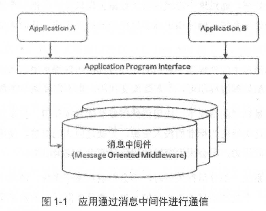

# 第一章 RabbitMQ 简介

## 1.1 什么是消息中间件

#### 1.1.1 消息与MQ

**什么是消息：**

+ 消息 (Message) 是指在应用间传送的数据。
+ 消息可以非常简单，比如只包含文本字符串、JSON 等，也可以很复杂，比如内嵌对象。

**消息队列中间件 (Message Queue Middleware，简称为 MQ) ：**

+ 利用高效可靠的消息传递机制进行与平台无关的数据交流
+ 基于数据通信来进行分布式系统的集成
+ 最终目的：在分布式环境下扩展进程间的通信

#### 1.1.2 两种传递模式

MQ一般有两种传递模式：对点点(P2P, Point-to-Point) 模式和发布/订阅 (Pub/Sub) 模式。

**P2P 模式：**

+ 主要基于队列；
+ 消息生产者发送消息到队列，消息消费者从队列中接收消息，队列的存在使得消息的异步传输成为可能。

**Pub/Sub 模式：**

+ 向一个内容节点发布和订阅消息，这个内容节点称为主题 (topic)；
+ 消息发布者将消息发布到某个主题，而消息订阅者则从主题中订阅消息；
+ 主题使得消息的订阅者与消息的发布者互相保持独立，不需要进行接触即可保证消息的传递；
+ 发布/订阅模式在消息的一对多广播时采用 。

#### 1.1.3 目前开源的MQ

主流的有 RabbitMQ、 Kafka、 ActiveMQ、 RocketMQ 等。 

**MQ 中间件需要考虑的功能设计点：功能解藕 + 充当中介 + 有保证的消息发送 + 同步异步**

1. 提供以松散藕合的灵活方式集成应用程序，能在不同平台之间通信，屏蔽各种平台及协议之间的特性
2. 基于存储和转发的应用程序之间的异步数据发送（即应用程序彼此不直接通信，而是与作为中介的消息中间件通信 ）
3. 提供了有保证的消息发送，应用程序开发人员无须了解远程过程调用 (RPC) 和网络通信协议的细节
4. 能够在客户和服务器之间提供同步和异步的连接，在任何时刻都可以将消息进行传送或者存储转发，这也是它比远程过程调用 RPC 更好的原因 

#### 1.1.4 功能举例



如图所示，应用程序 A 与应用程序 B 通过使用消息中间件的应用程序编程接口 (API， Application Program Interface) 发送消息来进行通信。

+ 消息中间件将消息路由给应用程序 B，这样消息就可存在于完全不同的计算机上。
+ 消息中间件负责处理网络通信，如果网络连接不可用，消息中间件会存储消息 ，直到连接变得可用， 再将消息转发给应用程序 B。
+ 当应用程序 A 发送其消息时，应用程序 B 甚至可以处于不运行状态，消息中间件将保留这份消息，直到应用程序 B 开始执行并消费消息，这样还防止了应用程序 A 因为等待应用程序 B 消费消息而出现阻塞 。

不过对于时间无关或并行处理的场景，它可能是一个极其有用的方法 。


## 1.2 消息中间件的作用

消息中间件的作用可以概括如下

1. **解耦**
   + MQ在处理过程中间插入基于数据的接口层，两边的处理过程都要实现这一接口
   + 允许开发过程中独立地扩展或修改两边的处理过程，只要确保它们遵守同样的接口约束即可 
2. **冗余〈存储) :** 
   + 有些情况下，处理数据的过程会失败。
   + 消息中间件可以把数据进行持久化直到它们已经被完全处理，确保你的数据被安全地保存直到使用完毕。
   + 在把一个消息从消息中间件删除之前，需要你的处理系统明确地指出该消息己经被处理完成。
3. **扩展性:** 
   + MQ解耦了应用的处理过程，使得两端的服务具有更好的扩展性。
4. **削峰（支撑突发访问压力）:** 
   + 在访问量剧增的情况下，应用仍然需要继续发挥作用，但是这样的突发流量并不常见。如果以能处理这类峰值为标准而投入资源，无疑是巨大的浪费 。 
   + 使用消息中间件能够使关键组件支撑突发访问压力，不会因为突发的超负荷请求而完全崩溃 。
5. **可恢复性:** 
   + MQ解耦了应用，当系统一部分组件失效时，不会影响到整个系统 。 
   + 由于MQ的存储机制，即使一个处理消息的进程挂掉，加入消息中间件中的消息仍然可以在系统恢复后进行处理 。
6. **顺序保证:** 
   + 在大多数使用场景下，数据处理的顺序很重要，大部分消息中间件支持一定程度上的顺序性。
7. **缓冲:** 
   + 消息中间件通过一个缓冲层来帮助任务最高效率地执行，写入消息中间件的处理会尽可能快速 。
   + 缓冲层有助于控制和优化数据流经过系统的速度。
8. **异步通信:** 
   + 在很多时候应用不想也不需要立即处理消息 。
   + MQ提供了异步处理机制， 消息放入消息中间件中，但并不立即处理它，在之后需要的时候再慢慢处理 。


## 1.3 RabbitMQ 的起源

RabbitMQ 是采用 Erlang 语言实现 AMQP (Advanced Message Queuing Protocol，高级消息队列协议)的消息中间件，它最初起源于金融系统，用于在分布式系统中存储转发消息 。

为了能够让消息在各个消息队列平台间互融互通，并提高应用程序的灵活性，在 2006 年 6 月，由 Cisco、 Redhat、iMatix 等联合制定了 AMQP 的公开标准。

+ 它是应用层协议的一个开放标准，以解决众多消息中间件的需求和拓扑结构问题 。 
+ 它为面向消息的中间件设计，基于此协议的客户端与消息中间件可传递消息，并不受 产品、开发语 言等条件的限制 。

**RabbitMQ 最初版本实现了 AMQP 的一个关键特性:使用协议本身就可以对队列和交换器 CExchange) 这样的资源进行配置 。**  RabbitMQ 的资源配置能力使其成为构建分布式应用的最完美的通信总线，有助于充分利用基于云的资源和进行快速开发。

**之后，RabbitMQ 不断发展，在易用性、扩展性、可靠性和高可用性等方面均取得卓著表现。**

RabbitMQ 的具体特点可以概括为以下几点：

1. **可靠性:** 
   + RabbitMQ使用一些机制来保证可靠性， 如持久化、传输确认及发布确认等。
2. **灵活的路由 :** 
   + 在消息进入队列之前，通过交换器来路由消息。
   + 对于典型的路由功能， RabbitMQ 己经提供了一些内置的交换器来实现。
   + 针对更复杂的路由功能，可以将多个交换器绑定在一起， 也可以通过插件机制来实现自己的交换器。
3. **扩展性:** 
   + 多个RabbitMQ节点可以组成一个集群，也可以根据实际业务情况动态地扩展集群中节点。
4. **高可用性 :** 
   + 队列可以在集群中的机器上设置镜像，使得在部分节点出现问题的情况下队列仍然可用。
5. 多种协议: 
   + RabbitMQ除了原生支持AMQP协议，还支持STOMP， MQTT等多种消息 中间件协议。
6. 多语言客户端 : 
   + RabbitMQ 几乎支持所有常用语言，比如 Java、 Python、 Ruby、 PHP、 C#、 JavaScript 等。
7. 管理界面 :
   + RabbitMQ 提供了一个易用的用户界面，使得用户可以监控和管理消息、集 群中的节点等。
8. 插件机制: 
   + RabbitMQ 提供了许多插件 ， 以实现从多方面进行扩展，当然也可以编写自己的插件。


## 1.4 RabbitMQ 的安装以及简单使用

根据自己电脑的配置，在本地安装好 RabbitMQ。

[MAC 安装教程](https://blog.csdn.net/m0_73442728/article/details/134704374)

**默认情况下，rabbitmq是没有安装RabbitMQWeb管理界面及授权操作的** 

```
rabbitmq-plugins enable rabbitmq_management
```

#### 1.4.1 RabbitMQ 运行

Mac 使用 RabbitMQ：

```
brew services start rabbitmq;
```

打开浏览器输入 http://localhost:15672/#/

默认账号密码都是guest 

其他配置信息，端口说明：

```
5672
RabbitMQ的通讯端口

25672
RabbitMQ的节点间的CLI通讯端口

15672
RabbitMQ HTTP_API的端口，管理员用户才能访问，用于管理RabbitMQ，需要启动Management插件

1883，8883
MQTT插件启动时的端口

61613、61614
STOMP客户端插件启用的时候的端口

15674、15675
基于webscoket的STOMP端口和MOTT端口
```

#### 1.4.2 RabbitMQ 生产和消费

本节将演示如何使用 RabbitMQ Java客户端生产和消费消息。

首先引入相应的 maven构建文件如下:

```java
<dependency>
	<groupld>com.rabbitmq</groupld> 
  <artifactld>amqp-client</artifactld> 
  <version>4.2.1</version>
</dependency>
```

默认情况下，访 问 RabbitMQ 服务的用户名和密码都是 "guest"，这个账户有限制，默认只能通过本地网络(如 localhost) 访问，远程网络访问受限。

所以在实现生产和消费消息之前，需要另外添加一个用户，并设置相应的访问权限。

添加新用户，用户名为 "root"，密码为 "root123":

```
rabbitmqctl add_user root root
```

为 root用户设置所有权限 :

```
rabbitmqctl set_permissions -p / root ".*" ".*" ".*"
```

设置 root用户为管理员角色:

```
rabbitmqctl set_user_tags root administrator
```

如果读者在使用 RabbitMQ 的过程中遇到类似如下的报错，那么很可能就是账户管理的问题，需要根据上面的步骤进行设置，之后再运行程序。

```
Exception in thread "main" com.rabbitmq.c1ient.AuthenticationFai1ureException: ACCESS REFUSED - Login was refused using authentication mechanism PLAIN. For details see the broker 1ogfi1e.
```

计算机的世界是从 "Hello World!" 开始的 ，这里我们也沿用惯例， 首先生产者发送一条消 息、 "HelloWorld!"至RabbitMQ中， 之后由消费者消费。 

**消费者客户端代码:**

```java
package chapter1.rabbitmq.demo;

import com.rabbitmq.client.Channel;
import com.rabbitmq.client.Connection;
import com.rabbitmq.client.ConnectionFactory;
import com.rabbitmq.client.MessageProperties;

import java.io.IOException;
import java.util.concurrent.TimeoutException;

/**
 * @author: Tjyy
 * @date: 2025-01-12 12:03
 * @description: Rabbit生产者
 */
public class RabbitProducer {
    private static final String EXCHANGE_NAME = "exchange_demo";
    private static final String ROUTING_KEY = "routingkey_demo";
    private static final String QUEUE_NAME = "queue_demo";
    private static final String IP_ADDRESS = "127.0.0.1";
    private static final int PORT = 5672; // RabbitMQ 服务端默认端口号为 5672

    public static void main(String[] args) throws IOException, TimeoutException {
        ConnectionFactory factory = new ConnectionFactory();
        factory.setHost(IP_ADDRESS);
        factory.setPort(PORT);
        factory.setUsername("root");
        factory.setPassword("root");

        Connection connection = factory.newConnection(); // 创建链接
        Channel channel = connection.createChannel(); // 创建信道
        // 创建一个 type = "direct"、持久化的、非自动删除的交换器
        channel.exchangeDeclare(EXCHANGE_NAME, "direct", true, false, null);
        // 创建一个持久化、非排他的、非自动删除的队列
        channel.queueDeclare(QUEUE_NAME, true, false, false, null);
        // 将交换器与队列通过路由键绑定
        channel.queueBind(QUEUE_NAME, EXCHANGE_NAME, ROUTING_KEY);
        // 发送一条持久化的消息： hello world !
        String message = "Hello World!";
        channel.basicPublish(EXCHANGE_NAME, ROUTING_KEY, MessageProperties.PERSISTENT_TEXT_PLAIN, message.getBytes());
        // 关闭资源
        channel.close();
        connection.close();
    }
}
```

上面的生产者客户端的代码首先和 RabbitMQ 服务器建立一个连接 (Connection)， 然后在这个连接之上创建一个信道 Channel。

之后创建一个交换器 Exchange和一个队列 Queue， 并通过路由键进行绑定(在 2.1节中会有关于交换器、队列及路由键的详细解释)。然后发送一条消息，最后关闭资源。

**消费者客户端代码:**

```go
package chapter1.rabbitmq.demo;

import com.rabbitmq.client.AMQP;
import com.rabbitmq.client.Address;
import com.rabbitmq.client.Channel;
import com.rabbitmq.client.Connection;
import com.rabbitmq.client.ConnectionFactory;
import com.rabbitmq.client.Consumer;
import com.rabbitmq.client.DefaultConsumer;
import com.rabbitmq.client.Envelope;

import java.io.IOException;
import java.util.concurrent.TimeUnit;
import java.util.concurrent.TimeoutException;

/**
 * @author: Tjyy
 * @date: 2025-01-12 12:17
 * @description: RabbitMQ 消费者
 */
public class RabbitConsumer {
    private static final String QUEUE_NAME = "queue_demo";
    private static final String IP_ADDRESS = "127.0.0.1";
    private static final int PORT = 5672; // RabbitMQ 服务端默认端口号为 5672

    public static void main(String[] args) throws IOException, TimeoutException, InterruptedException {
        Address[] addresses = new Address[]{
                new Address(IP_ADDRESS, PORT),
        };

        ConnectionFactory factory = new ConnectionFactory();
        factory.setUsername("root");
        factory.setPassword("root");

        //这里的连接方式与生产者的 demo 略有不同 ， 注意辨别区别
        Connection connection = factory.newConnection(addresses); // 创建连接
        final Channel channel = connection.createChannel(); // 创建信道
        channel.basicQos(64); // 设置客户端最多接收的未被 ack 的消息的个数
        Consumer consumer = new DefaultConsumer(channel) {
            @Override
            public void handleDelivery(String consumerTag,
                                       Envelope envelope,
                                       AMQP.BasicProperties properties,
                                       byte[] body) throws IOException {
                System.out.println("recv message:" + new String(body));
                try {
                    TimeUnit.SECONDS.sleep(1);
                }catch (InterruptedException e){
                    e.printStackTrace();
                }
                channel.basicAck(envelope.getDeliveryTag(), false);
            }
        };
        channel.basicConsume(QUEUE_NAME, consumer);
        // 等待函数执行完毕之后，关闭资源
        TimeUnit.SECONDS.sleep(5);
        channel.close();
        connection.close();
    }
}
```

注意这里采用的是继承 DefaultConsurner 的方式来实现消费 ，有过使用经验的读者也许会喜欢采用 QueueingConsurner 的方式来实现消费，但是这里并不推荐， 采用 QueueingConsurner 或许会有一些隐患。

同时，在 RabbitMQ Java 客户端 4.0.0 版本开始将 QueueingConsurner标记为 @Deprecated， 在后面的大版本中会删除这个类，更多详细内容可以参考 4.9.3 节。

**上面的代码，可以先运行RabbitProducer 产生一个消息发送到 MQ 中，之后再运行RabbitConsumer 获取MQ中的消息，并不需要同时运行。**


## 1.5 小结

本章首先针对消息中间件做了 一个摘要性的介绍，包括什么是消息中间件、消息中间件的作用及消息中间件的特点等 。之后引入 RabbitMQ， 对其历史做 一 个简单的阐述，比如 RabbitMQ 具备哪些特点 。

本章后面的篇幅介绍了 RabbitMQ 的安装及简单使用，通过演示生产者生产消息，以及消费者消费消息来给读者 一个对于 RabbitMQ 的最初的印象，为后面的探索过程打下基础。