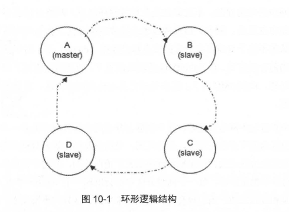
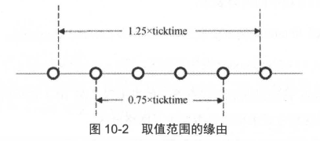
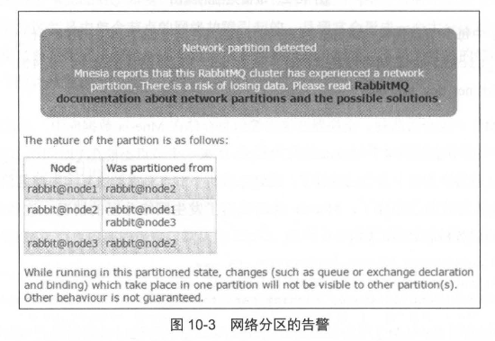

# 第十章 网络分区

网络分区是使用 RabbitMQ 时必须面对的一个问题，它可能导致消息丢失或服务不可用等后果。

+ 虽然可以通过重启或者配置自动化处理来应对这一问题，但深入探讨后会发现，网络分区的复杂性超出了我们的预期。
+ 本章将从网络分区的含义、影响、处理方法及案例分析等多个方面，详细分析这一问题的各个层面。


## 10.1 网络分区的意义

RabbitMQ 集群的网络分区的容错性并不是很高 ， 一般都是使用 Federation 或者 Shovel 来 解决广域网中的使用问题。

> RabbitMQ 集群在面对网络分区时的容错能力并不强，特别是在广域网环境下。网络分区可能导致集群中部分节点无法与其他节点通信，进而引发消息丢失、服务不可用等问题。在这种情况下，RabbitMQ 提供的默认容错机制（如自动节点恢复等）并不足以完全解决这些问题，因此，需要借助额外的机制来增强容错性，确保集群的高可用性和消息的可靠传递。
>
> **其中，Federation 和 Shovel 是两种常用的解决方案，它们各自有不同的特点和适用场景：**
>
> 1. **Federation（联邦机制）**：
>    - **联邦**机制是将不同RabbitMQ集群之间的连接建立起来，允许多个集群相互交换消息。即使它们之间有网络分区，集群之间的消息仍然能够进行转发和同步。
>    - 通过 Federation，消息可以在分区后的不同集群之间传递，因此，即使某些节点与其他节点的通信中断，消息仍可以通过其他路径进行传输。
>    - Federation 的一个特点是它是松耦合的，它允许集群之间相对独立的运行，消息不会同步到所有集群节点，而是根据配置的规则进行选择性转发。这种机制适合需要跨地理区域或大规模集群的情况。
> 2. **Shovel（铲子机制）**：
>    - **Shovel** 机制是一个更为灵活的解决方案，它允许将消息从一个队列传输到另一个队列，或者从一个 RabbitMQ 实例转发到另一个实例。Shovel 可以在网络分区的情况下，将消息从一个分区中的队列复制到另一个分区中的队列。
>    - Shovel 更加集中于消息的物理转移，适用于需要跨网络或不同 RabbitMQ 集群之间同步数据的场景。它能够保证即使出现网络问题，也能将消息“铲”到指定的目标位置，确保消息不会丢失。
>
> 总结来说，**Federation** 和 **Shovel** 机制可以帮助在发生网络分区时保持消息的流动性和高可用性。Federation 主要用于将多个集群连接起来，适合大规模的集群和跨区域的通信，而 Shovel 则适用于跨集群或跨分区的消息转移。它们可以有效解决 RabbitMQ 默认配置下的网络分区问题，提高系统的容错能力。

**不过即使是在局域网环境下，网络分区也不可能完全避免，网络设备（比如中继设备、网卡）出现故障也会导致网络分区。**

1. 当出现网络分区时，不同分区里的节点会认为不属于自身所在分区的节点都已经挂 (down) 了，对于队列、交换器、绑定的操作仅对当前分区有效。
2. 在 RabbitMQ 的默认配置下，即使网络恢复了也不会自动处理网络分区带来的问题。 
3. RabbitMQ 从 3.1 版本开始会自动探测网络分区，并且提供了相应的配置来解决这个问题。

**当一个集群发生网络分区时，这个集群会分成两个部分或者更多，它们互相都认为对方分区内的节点已经挂了，包括队列、交换器及绑定等元数据的创建和销毁都处于自身分区内，与其他分区无关。**

+ 如果原集群中配置了镜像队列，而这个镜像队列又牵涉两个或者更多个网络分区中的节点时 ，**每一个网络分区中都会出现一个 master 节点，对于各个网络分区， 此队列都是相互独立的。**
+ 当然也会有一些其他未知的、怪异的事情发生。
+ **当网络恢复时，网络分区的状态还是会保持，除非你采取了一些措施去解决它。**

如果你没有经历过网络分区，就不算真正掌握 RabbitMQ。网络分区带来的影响大多是负面 的，极端情况下不仅会造成数据丢失，还会影响服务的可用性。

------



**既然网络分区会带来如此负面的影响，为什么 RabbitMQ 还要引入网络分区的设计理念呢？其中一个原因就与它本身的数据一致性复制原理有关。如上一章所述， RabbitMQ 采用的镜像队列是一种环形的逻辑结构 ，如图 10-1 所示 。**

图 10-1 中为某队列配置了 4 个镜像，其中 A 节点作为 master 节点，其余 B、 C 和 D 节点 作为 slave 节点， 4 个镜像节点组成一个环形结构。

1. 假如需要确认 (ack) 一条消息 ，先会在 A 节点即 master 节点上执行确认命令，之后转向 B 节点，然后是 C 和 D 节点，最后由 D 将执行操作返回给 A 节点，这样才真正确认了一条消息，之后才可以继续相应的处理。

2. 在这种一致性数据模型下，如果出现网络波动或者网络故障等异常情况，那么整个数据链的性能就会大大降低 。 

3. 如果 C 节点网络异常，那么整个 A→B→C→D→A 的数据链就会被阻塞，**继而相关服务也会被阻塞** ，所以这里就需要引入网络分区来将异常的节点剥离出整个分区，以确保 RabbitMQ 服务的**可用性及可靠性**  。

   > 舍弃一致性而保障可用性的一个例子

4. 等待网络恢复之后，可以进行相应的处理来将此前的异常节点加入集群中 。

**网络分区对于 RabbitMQ 本身而言有利有弊，读者在遇到网络分区时不必过于惊慌。**

+ 好处：保证可用性；坏处：需要额外操作，镜像 - 1，备份能力降低。

+ 许多情况下，网络分区都是由单个节点的网络故障引起的，且通常会形成 一个大分区和 一个单节点的分区。
+ 如果之前又配置了镜像，那么可以在不影响服务可用性，不丢失消息的情况下从网络分区的情形下得以恢复 。


## 10.2 网络分区的判定

RabbitMQ 集群节点内部通信端口默认为 25672，两两节点之间都会有信息交互 。

如果某节点出现网络故障，或者是端口不通， 则会致使与此节点的交互出现中断 ， 这里就会有个**超时判定机制 ， 继而判定网络分区。**

1. 网络分区的判定是 net_ticktime 这个参数息息相关的 ，此参数默认值为 60 秒 。
2. RabbitMQ集群内部的每个节点之间会每隔四分之一的  net_ticktime 计一次应答 tick 。如果有任何数据被写入节点中，则此节点被认为已经被应答 ticked 。
3. 如果连续 4 次， 某节点都没有被 ticked，则可以判定此节点己处于 "down" 状态，其余节点可以将此节点剥离出当前分区 。

将连续 4 次的 tick 时间记为 T，那么 T 的取值范围为：0.75 * net_ticktime  < T < 1.25 * net_ticktime。图 10-2 可以形象地描绘出这个取值范围的缘由。



RabbitMQ 不仅会将队列、交换器及绑定等信息存储在 Mnesia 数据库中，而且许多围绕网 络分区的一些细节也都和这个 Mnesia的行为相关。如果一个节点不能在 T 时间连上另一个节点， 那么 Mnesia 通常认为这个节点己经挂了。

**就算之后两个节点又重新恢复了内部通信，但是这两个节点都会认为对方已经挂了。**

**Mnesia 此时认定了发生网络分区的情况。这些会被记录到 RabbitMQ 的服务日志之中 ， 如下:**

```
=ERROR REPORT==== 16-0ct-2017 : :18 : 20:55 ===
Mnesia('rabbit@node1'): **ERROR** mnesia event got
{inconsistent database , running partitioned network, 'rabbit@node2'}
```

可以通过 Web 管理界面的方式查看，如果出现图 10-3 这种警告，即发生了网络分区：




## 10.3 网络分区的模拟

正常情况下，很难观察到 RabbitMQ 网络分区的发生。

为了更好地理解网络分区，需要采取某些手段将其模拟出来，以便对其进行相应的分析处理，进而在实际应用环境中遇到类似情 形，可以让你的处理游刃有余。

模拟网络分区的方式有多种，主要分为以下 3 大类：

1. iptables 封禁/解封 IP 地址或者端口号
2. 关闭/开启网卡
3. 挂起/恢复操作系统

**这里只记录 iptables 封禁/解封 IP 地址或者端口号的方式：**

由于 RabbitMQ 集群内部节点通信端口默认为 25672，可以封禁这个端口来模拟出 net_tick+ timeout， 然后再开启此端口让集群判定网络分区的发生。

> 举例说明 ， 整个 RabbitMQ 集群由 3 个节点组成，分别为 node1、node2 和 node3。此时我们要模拟 node2 节点被剥离出当前分区的情形，即模拟 [node1, node3] 和 [node2] 两个分区。
>
> 可以在 node2 上执行如下命令以封禁 25672 端口。如果在配置中修改过这个端口号，将下面的命令改成相应的端口号即可。
>
> ```
> iptables -A INPUT -p tcp --dport 25672 -j DROP 
> iptables -A OUTPUT -p tcp --dport 25672 -j DROP
> ```

等待 75 秒之后以确保出现 net_tick_timeout：

```
=INFO REPORT==== 10-0ct-2017: : 11 : 53 : 03 ===
rabbit on node rabbit@node2 down

=INFO REPORT==== 10-0ct-2017::11:53:03 ===
node rabbit@node2 down: net tick timeout
```

注意此时只判定出 net tick timeout， 要等 node2 网络恢复之后，即解封 25672 端口之后才会判定出现网络分区 。解封命令如下:

```
iptables -D INPUT 1 
iptables -D OUTPUT 1
```

**至此， node2 节 与其他节点的内部通信己经恢复 ，如果此时查看集群的状态可以发现 [node 1, node3] 和 [node2] 已形成两个独立的分区 。**


## 10.4 网络分区的影响

RabbitMQ 集群在发生网络分区之后对于

+ **数据可靠性**
+ **服务可用性**

会有什么样的影响？

对于客户端的表现又是怎样的?

这里主要针对未配置镜像和配置镜像两种情况展开探讨。

### 10.4.1 未配置镜像

#### 发送方

node1、node2 和 node3 这 3 个节点组成一个 RabbitMQ 集群 ，且在这三个节点中分别创建 queue1、 queue2 和 queue3 这三个队列，井且相应的交换器与绑定关系如下 :

| 节点名称 | 交换器   | 绑定 | 队列   |
| -------- | -------- | ---- | ------ |
| node1    | exchange | rk1  | queue1 |
| node2    | exchange | rk2  | queue2 |
| node3    | exchange | rk3  | queue3 |

在网络分区发生之前，客户端分别连接 node1 和 node2 井分别向 queue1 和 queue2 发送消息，对应关系如情形 10-1 所示。

**情形 10 -1** 

| 客户端  | 节点名称 | 交换器   | 绑定 | 队列   |
| ------- | -------- | -------- | ---- | ------ |
| client1 | node1    | exchange | rk1  | queue1 |
| client2 | node2    | exchange | rk2  | queue2 |

client1 那条信息表示：客户端 client1 连接 node1 的 IP 地址，并通过路由键 rk1 向交换器 exchange 发送消息；如果发送成功，消息可以存入队列 queue1 中。


------

采用 iptables 封禁/解封 25672 端口的方式模拟网络分区，使 node1 和 node2 存在于两个 不同的分区之中，对于客户端 client1 和 client2 而言 ，没有任何异常，消息正 常发送也没有消息丢失。

下面我们再转换一下思路，如果上面的 client1 连接 node1 的 IP，并向 queue2 发送消息会发生何种情形。新的对应关系参考情形 10-2：

**情形 10-2**

| 客户端  | 节点名称 | 交换器   | 绑定 | 队列   |
| ------- | -------- | -------- | ---- | ------ |
| client1 | node1    | exchange | rk2  | queue2 |
| client2 | node2    | exchange | rk1  | queue1 |

这里同样采用 iptables 的方式模拟网络分区，使得 node1 和 node2处于两个不同的分区 。 

> 如果客户端在发送消息的时候将 mandatory 参数设置为 true；那么在网络分区之后可以通过 抓包工具看到有 Basic.Return 将发送的消息返回过来 。

这里表示在发生网络分区之后：

1. client1 不能将消息正确地送达到 queue2 中
2. client2 不能将消息送达到 queue1 中

**如果客户端中设置了 ReturnListener 来监听 Basic.Return 的信息，井附带有消息重传机制，那么在整个网络分区前后的过程中可以保证发送端的消息不丢失。**

> 在网络分区之前，queue1 进程存在于 node1 节点中；queue2 的进程存在于 node2 节点中。 在网络分区之后，在 node1 所在的分区并不会创建新的 queue2 进程，同样在 node2 所在的分区也不会创建新的 queue1 的进程。
>
> 这样在网络分区发生之后，虽然可以通过 rabbitmqctl list_queues_name 命令在 node1 节点上查看到 queue2。但是在 node1 上已经没有真实的 queue2 进程的存在。
>
> ```
> [root@node1~]# rabbitmqctl list_queues_name
>  Listening queues...
>  queue1
>  queue2
>  queue3
> ```

client1 将消息发往交换器 exchange 之后并不能路由到 queue2 中，因此消息也就不能存储。 **如果客户端没有设置 mandatory 参数并且没有通过 ReturnListener 进行消息重试(或者 其他措施)来保障消息可靠性 ，那么在发送端就会有消息丢失。**


------

#### 消费方

上面讨论的是消息发送端的情况，下面来探讨网络分区对消费端的影响。

在网络分区之前，分别有客户端连接 node1 和 node2 并订阅消费其上队列中的消息，其对应关系参考情形 10-3。

**情形 10-3:**

| 客户端  | 节点名称 | 队列   |
| ------- | -------- | ------ |
| client3 | node1    | queue1 |
| client4 | node2    | queue2 |

client3 那条信息表示: client3 连接 node1 的 ip 并订阅消费 queue1。

模拟网络分区置 node1 和 node2 于不同的分区之中。

**在发生网络分区的前后，消费端 client3 和 client4 都能正常消费， 无任何异常发生 。**

------

参考情形 10-2，将情形 10-3 中的消费队列交换一下 ，即 client3连接 node1 的 ip 消费 queue2， 其对应关系如情形 10-4 所示。

**情形 10-4:**

| 客户端  | 节点名称 | 队列   |
| ------- | -------- | ------ |
| client3 | node1    | queue2 |
| client4 | node2    | queue1 |

模拟网络分区，将 node1 与 node2 置于两个不同的分区。在发生网络分区前，消费一切正 常。

**在网络分区发生之后，虽然客户端没有异常报错，且可以消费到相关数据，但是此时会有一些怪异的现象发生，比如对于已消费消息的 ack 会失效；在从网络分区中恢复之后，数据不 会丢失。**

------

综上所述，对于未配置镜像的集群，网络分区发生之后 ，队列也会伴随着宿主节点而分散在各自的分区之中。

+ 对于消息发送方而言 ，可以成功发送消息，但是会有路由失败的现象 ， 需要需要配合 mandatory 等机制保障消息的可靠性。
+ 对于消息消费方来说，有可能会有诡异、 不可预知的现象发生，比如对于己消费消息的 ack 会失效。
+ **如果网络分区发生之后，客户端与某分区重新建立通信链路** ，其分区中如果没有相应的队列进程，则会有异常报出。如果从网络分区中恢复之后,数据不会丢失，但是客户端会重复消费。


### 10.4.2 已配置镜像

如果集群中配置了镜像队列，那么在发生网络分区时，情形比未配置镜像队列的情况复杂得多，尤其是发生多个网络分区的时候。

**这里先简单地从 3 个节点分裂成 2 个网络分区的情形展开讨论。**

+ 集群中有 node1、 node2 和 node3 这 3 个节点
+ 分别在这些节点上创建队列 queue1、 queue2 和 queue3， 并配置**镜像队列** 。

+ 采用 iptables 的方式将集群模拟分裂成 [node1, node3] 和 [node2] 这两个网络分区。

镜像队列的相关配置可以参考如下 :

```
ha-mode:exactly 
ha-param: 2 
ha-sync-mode: automatic
```

首先来分析第一种情况。如情形 10-5-1 所示， **3 个队列的 master 镜像和 slave 镜像分别做 相应分布 。**

------

**10-5-1 分区之前**

| 队列   | master | slave |
| ------ | ------ | ----- |
| Queue1 | node1  | node3 |
| Queue2 | node2  | node3 |
| Queue3 | node3  | node2 |

在发生网络分区之后 ， [node1 , node3] 分区中的队列有了新的部署。除了 queue1 未发生改变：

+ queue2 由于原宿主节点 node2 己被剥离当前分区，那么 node3 提升为 master，同时选择 node1 作为 slave
+ queue3 重新选择 node1 作为 其新的 slave。

详细参考情形 10-5-2。

**10-5-2 分区之后**

[node1, node3] 分区：

| 队列   | master | slave |
| ------ | ------ | ----- |
| Queue1 | node1  | node3 |
| Queue2 | node3  | node1 |
| Queue3 | node3  | node1 |

[node2] 分区：

| 队列   | master | slave |
| ------ | ------ | ----- |
| Queue1 | node1  | node3 |
| Queue2 | node2  | []    |
| Queue3 | node2  | []    |

对于 [node2] 分区来讲，queue2 和 queue3 的分布比较容易理解，此分区中只有一个节点，所有 slave 这一列为空。

但是对于 queue1 来讲，其部署还是和分区之前如出一辙，不管是在分区前还是分区后，对于 queue1 来讲生产和消费消息都不会有任何影响，就如没有发生过网络分区一样。

对于队列 queue2 和 queue3 来讲，从网络中恢复分区（恢复为之前的 [node1, node2, node3]） 之后可能会有数据丢失。

------

前面讨论的镜像配置都是 ha-sync-mode=automatic 的情形，当有新的 slave 出现时， 此 slave 会自动同步 master 中的数据。

+ 注意在同步的过程中，集群的整个服务都不可用，客户端连接会被阻塞。
+ 如果 master 中有大量的消息堆积，必然会造成 slave 的同步时间增长，进一 步影响了集群服务的可用性。

如果配置 ha-sync-mode=manual，有新的 slave创建的同时不会去同步 master 上旧的数据，如果此时 master 节点又发生了异常，那么此部分数据将会丢失 。 

------


### 10.4.3 分区处理方式

**网络分区的发生可能会引起消息的丢失，当然这点也有办法解决。**

1. 首先消息发送端要有能够处理 Basic.Return 的能力。
2. 其次，在监测到网络分区发生之后，需要迅速地挂起所有的生产者进程。
3. 之后连接分区中的每个节点消费分区中所有的队列数据，在消费完之后再处理网络分区。
4. 最后在从网络分区中恢复之后再恢复生产者的进程。

**整个过程可以最大程度上保证网络分区之后的消息的可靠性。同样也要注意的是，在整个过程中会伴有大量的消息重复，消费者客户端需要做好相应的幂等性处理。**


## 10.5 手动处理网络分区

为了从网络分区中恢复，首先需要挑选一个信任分区，这个分区才有决定Mnesia 内容的权 限，发生在其他分区的改变将不会被记录到 Mnesia 中而被直接丢弃 。

在挑选完信任分区之后， 重启非信任分区中的节点，如果此时还有网络分区的告警，紧接着重启信任分区中的节点。

**这里有 3 个要点需要详细阐述 :**

1. 何挑选信任分区
2. 如何重启节点
3. 重启的顺序有何考究

**挑选信任分区一般可以按照这几个指标进行, 优先级从前到后:**

1. 分区中要有 disc节点
2. 分区中的节点数最多
3. 分区中的队列数最多
4. 分区中的客户端连接数最多。

**RabbitMQ 中有两种重启方式 :** 

1. 第一种方式是使用 rabbitmqctl stop 命令关闭，然后再用 rabbitmq -server -detached 命令启动 ; 
2. 第二种方式是使用 rabbitmqctl stop app 关闭 ， 然后使用 rabbitmqctl start app 命令启动。
3. 两种方式都可以从网络分区中恢复，但是更加推荐使用第二种方式，包括下一节所讲述的自动处理网络分区的方式， 其内部也是采用的第二种方式进行重启节点。

**RabbitMQ 的重启顺序也比较讲究，必须在以下两种重启顺序中择其一进行重启操作:**

1. 停止其他非信任分区中的所有节点 ， 然后再启动这些节点。如果此时还有网络分区的告警，则再重启信任分区中的节点以去除告警。
2. 关闭整个集群中的节点，然后再启动每一个节点 ， 这里需要确保启动的第一个节点在信任的分区之中。

**在选择哪种重启顺序之前，首先考虑一下队列 "漂移"的现象。所谓的队列"漂移"是在配置镜像 队列的情况下才会发生的。**

假设集群中有3个节点，且配置为镜像模式，具体情形如下：

**情形 10-7-1** 

| 队列   | master | slave       |
| ------ | ------ | ----------- |
| Queue1 | node1  | node2,node3 |
| Queue2 | node2  | node3,node1 |
| Queue3 | node3  | node2,node1 |

这里首先关闭 node3 节点 ，那么 queue3 中的 某个 slave提升为 master，具体变化如下：

**情形 10-7-2** 

| 队列   | master | slave |
| ------ | ------ | ----- |
| Queue1 | node1  | node2 |
| Queue2 | node2  | node1 |
| Queue3 | node2  | node1 |

然后在再关闭 node2 节点，继续演变为如下：

**情形 10-7-3** 

| 队列   | master | slave |
| ------ | ------ | ----- |
| Queue1 | node1  | []    |
| Queue2 | node1  | []    |
| Queue3 | node1  | []    |

此时，如果关闭 node1 节点，然后再启动这 3 个节点。或者不关闭 node1 节点，而启动 node2 和 node3 节点都只会增加 slave 的个数，而不会改变 master 的分布，最终如情形 10-7-4 所示。 

注意这里哪怕关闭了 node1.然后并非先启动 node1 ，而是先启动 node2 或者 node3，对于 master 节点的分布都不会受影响。

**情形 10-7-4** 

| 队列   | master | slave（按照节点启动顺序） |
| ------ | ------ | ------------------------- |
| Queue1 | node1  | node2,node3               |
| Queue2 | node1  | node2,node3               |
| Queue3 | node1  | node2,node3               |

这里就可 以看出 ，随着节点 的重启 ，所有的队列的 master 都" 漂移"到了 node1 节点上 ， 因为在 RabbitMQ 中，除了发布消息，所有的操作都 是在 master 上完成的，如 此大部分压力都 集中到了 node1 节点上，从而不能很好地实现负载均衡。

**基于情形 10-7-2，考虑另外一种情形。如果在关闭节点 node3 之后，又重新启动节点 node3， 那么会有如情形 10-7-5 的变化。**

**情形 10-7-2** 

| 队列   | master | slave |
| ------ | ------ | ----- |
| Queue1 | node1  | node2 |
| Queue2 | node2  | node1 |
| Queue3 | node2  | node1 |

**情形 10-7-5** 

| 队列   | master | slave       |
| ------ | ------ | ----------- |
| Queue1 | node1  | node2,node3 |
| Queue2 | node2  | node1,node3 |
| Queue3 | node2  | node1,node3 |

**之后再重启(先关闭，后启动) node2节点，如情形 10-7-6所示。**

**情形 10-7-6** 

| 队列   | master | slave       |
| ------ | ------ | ----------- |
| Queue1 | node1  | node2,node3 |
| Queue2 | node1  | node2,node3 |
| Queue3 | node1  | node2,node3 |

**继续重启 node1 节点，如情形 10-7-7所示。**

| 队列   | master | slave       |
| ------ | ------ | ----------- |
| Queue1 | node3  | node2,node1 |
| Queue2 | node3  | node2,node1 |
| Queue3 | node3  | node2,node1 |

**如此顺序演变，在配置镜像的集群中重启会有队列"漂移"的情况发生，造成负载不均衡 。** 

**这里采用的是全镜像以作说明，读者可以自行推理对于 2 个节点 ha-mode=exactly 且 ha­ params=2 的镜像配置的演变过程。不管如何，都难以避免队列"漂移"的发生。**


------

**一定要按照前面提及的两种方式择其一进行重启 。** 

如果选择挨个节点重启的方式，同样可以处理网络分区，但是这里会有一个严重的问题，即 Mnesia 内容权限的归属问题。

+ 比如有两个分区 [node1，node2] 和 [node3，node4]
+ 其中 [node1，node2] 为信任分区 。 
+ 此时若按照挨个重启的方式进行重启，比如先重启 node3，在 node3 节点启动之时无法判断其节点的Mnesia 内容走向 [node 1, node2] 分区靠齐还是向 node4 节点靠齐。
+ 至此，如果挨个一轮重启之后，最终集群中的 Mnesia 数据是 [node3， node4] 这个非信任分区，就会造成无法估量的损失。挨个节点重启也有可能会引起二次网络分区的发生。

如果原本配置了镜像队列，从发生网络分区到恢复的过程中队列可能会出现"漂移"的现象。可以重启之前先删除镜像队列的配置 ，这样能够在一定程度上阻止队列的"过分漂移"，即阻止可能所有队列都"漂移"到 一个节点上的情况。

------

**综上，具体的网络分区处理步骤如下所述：**

1. 挂起生产者和消费者进程。这样可以减少消息不必要的丢失，如果进程数过多， 情形又比较紧急，也可跳过此步骤。
2. 删除镜像队列的配置
3. 挑选信任分区
4. 关闭非信任分区中的节点, 采用 rabbitmqctl stop_app 命令关闭 。
5. 启动非信任分区节点，rabbitmqctl start_app 
6. 检查网络分区是否恢复， 如果己经恢复则转步骤 8; 如果还有网络分区的报警则转步骤 7。
7. 重启信任分区中的节点。
8. 添加镜像队列的配置。
9. 恢复生产者和消费者的进程。

**这里还剩下最后一个问题:如何判断己经从网络分区中恢复?**

> 可以使用 rabbitmqctlcluster status 命令检测其输出的 partitions 这一项中是否有节点信息 ， 如果为空则说明己经恢复。如果在 Web 管理界面中看到无任何网络分区的告警，也可说明己经恢复。当然通过 HTTPAPI 的方式来判断也是一种有效的手段 。


## 10.6 自动处理网络分区

RabbitMQ 提供了 三种方法自动地处理网络分区 : pause-mmonty 模式、 pause-all-down 模式和 autoheal模式。默认是 ignore模式，即不自动处理网络分区，所以在这种模式下，当网络分区的时候需要人工介入。

在 rabbitmq.config 配置文件中配置 cluster_partition_handling 参数即可实现相应的功能。默认的 ignore 模式的配置如下，注意最后有个点号 :

```
[{
	rabbit, [
		{cluster_partition_handling, ignore}
	]
}]
```


### 10.6.1 pause-minority 模式

在 pause-minority 模式下，当发生网络分区时，集群中的节点在观察到某些节点 "down" 的时候，会自动检测其自身是否处于"少数派" ， RabbitMQ 会自动关闭这些节点的运作。

这样确保了在发生网络分区的情况下，大多数节点可以继续运行。"少数派"中的节点在分区开始时会关闭，当分区结束时又会启动 。

pause-minority 模式相应的配置如下:

```
[{
	rabbit, [
		{cluster_partition_handling, pause_minority}
	]
}]
```

> 需要注意的是 ， RabbitMQ 也会关闭不是严格意义上的大多数，比如在一个集群中只有两个 节点的时候并不适合采用 pause-minority 的模式，因为其中任何一个节点失败而发生网络分区时， 两个节点都会关闭。当网络恢复时 ， 有可能两个节点会自动启动恢复网络分区，也有可能仍保持关闭状态 。

**然而如果集群中的节点数远大于 2 个时， pause_minority模式比 ignore模式更加可靠 ，特别是网络分区通常是由单节点网络故障而脱离原有分区引起的。**

------

不过也需要考虑 2v2、 3v3 这种被 分裂成对等节点数的分区的情况。所谓的 2v2 这种对等分 区表示原有集群的组成为 [node1, node2, node3, node4]，由 于某种原因分裂成类似 [node1, node2] 和 [node3， node4] 这两个网络分区的情形。 这种情况在跨机架部署时就有可能发生，当 nodel 和 node2 部署在机架 A 上，而 node3 和 node4 部署在机架 B 上 ， 那么有可能机架 A 与机架 B 之间 网络的通断会造成对等分区的出现 。

**当对等分区出现时 ， 会关闭这些分区内的所有节点，对于前面的 [node1， node2] 和 [node3， node4] 的例子而言 ，这四个节 点上的 RabbitMQ 应用都会被关闭 。 只有等待网络恢复之后，才会自动启动所有的节点以求从网络分区中恢复。**


### 10.6.2 pause-if-all-down 模式

在 pause-if-all-down 模式下， RabbitMQ 集群中的节点在和**所配置的列表** 中的任何节点不能交互时才会关闭：

```
[{
	rabbit, [
		{cluster_partition_handling, 
				{pause_if_all_down, ['rabbit@node1'], ignore}
    }
	]
}]
```

**其中 [rabbit@node1] 为前面所说的列表，也可称之为受信节点列表**

如果一个节点与 rabbit@node1 节点无法通信时，则会关闭自身的 RabbitMQ 应用。如果是 rabbit@node1 本身发生了故障造成网络不可用，而其他节点都是正常的情况下， 这种规则会让所有的节点中 RabbitMQ 应用都关闭，待 rabbit@node1 中的网络恢复之后，各个节点再启动自身应用以从网络分区中恢复。

注意到 pause-if-all-down 模式下有 ignore 和 autoheal 两种不同的配置 。 考虑前面 pause-minority 模式中提及的一种情形， node1 和 node2部署在机架 A上，而 node3 和 node4 部 署在机架 B 上 。 

+ 此时配置 `{pause_if_all_down, ['rabbit@node1', 'rabbit@node3'], ignore}`，那么当机架A和机架B的通信出现异常时 ，由 于 node1 和 node2 保持着通信， node3 和 node4 保持着通信
+ 这 4 个节点都不会自行关闭，但是会形成两个分区，所以这样不能实现自动处理的功能。

**如果将配置中的 ignore 替换成 autoheal 就可以处理此种情形 。**


### 10.6.3 ahto-heal 模式

**在 autoheal 模式下 ， 当认为发生网络分区时 ， RabbitMQ 会自动决定 一个获胜的分区，然后重启不在这个分区中的节点来从网络分区中恢复 。**

+ 一个获胜的分区是指客户端连接最多的分区 
+ 如果产生一个平局，即有两个或者多个分区的客户端连接数一样多，那么节点数最多的一个分区就是获胜分区
+ 如果此时节点数也一样多，将以节点名称的字典序来挑选获胜分区

autoheal 模式参考配置如下:

```
[{
	rabbit, [
		{cluster_partition_handling, auto_heal}
	]
}]
```

对于 pause-minority 模式，关闭节点的状态是在网络故障时，也就是判定出 net_tick_timeout 之时，会关闭"少数派"分区中的节点，等待网络恢复之后，即判定出网络分区之后，启动关闭的节点来从网络分区中恢复。 

**autoheal 模式在判定出 net_tick_timeout 之时不做动作，要等到网络恢复之时，在判定出网络分区之后才会有相应的动作，即重启非获胜分区中的节点。**

**在 autoheal 模式下，如果集群中有节点处于非运行状态，那么当发生网络分区的时候，将不会有任何自动处理的动作。**


### 10.6.4 挑选哪种模式

有一点必须要清楚， 允许 RabbitMQ 能够自动处理网络分区并不一定会有正面的成效，也 有可能会带来更多的问题。

每种模式都有自身的优缺点，没有哪种模式是万无一失的，希望根据实际情形做出相应的选择，下面简要概论以下 4 个模式。

1. **ignore 模式**：
   - 发生网络分区时不采取任何措施，需要管理员手动介入。
   - 适用于对网络分区有充分监控和手动管理能力的场景。
2. **pause-minority 模式**：
   - 对于对等分区的处理可能不够理想，可能会关闭所有节点。
   - 通常适用于非跨机架部署、节点数量为奇数的集群。
3. **pause-if-all-down 模式**：
   - 对受信节点的选择尤为重要，尤其是在集群节点硬件配置相同时需谨慎配置。
   - 能够有效处理对等分区的情况，适合在硬件配置明确的环境中使用。
4. **autoheal 模式**：
   - 能够处理多种网络分区情况，但如果集群中有节点处于非运行状态，则会失效。
   - 适用于更复杂的分布式环境，但对节点运行状态有较高要求。

每种模式适用的场景不同，应根据集群结构和业务需求选择最佳方案。


## 10.7 分区的自动化检测

在网络分区发生时，客户端可能会报错，相关日志的检测机制可以发出警报，但此时仍难以确定是否发生了网络分区，需要进一步分析，这可能影响处理网络分区的效率。人工检查的方法包括查看 Web 管理界面或使用 `rabbitmqctl cluster_status` 命令，但这些非自动化的手段并不适合长期使用。

更为有效的方式有以下两种：

1. 通过 HTTP API `/api/nodes`：
   - 检查返回的 JSON 数据中 `partitions` 项是否包含节点信息。
2. 监控 RabbitMQ 服务日志：
   - 搜索是否存在类似 `Mnesia('rabbit@node1') : ERROR : mnesia event got {inconsistent database, running partitioned network, 'rabbit@node2'}` 的日志内容。

这两种方法都可以实现自动化检测。