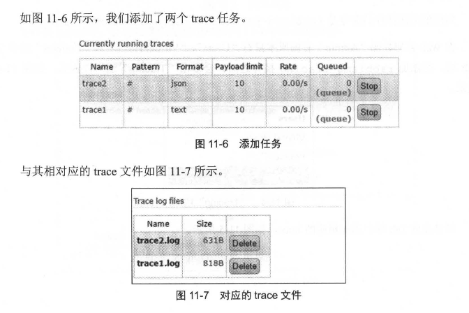

# 第十一章 RabbitMQ 扩展

有关 RabbitMQ 的概念介绍、结构模型和客户端应用等内容可以视为基础篇；关于 RabbitMQ 的管理、配置和运维等内容则属于中级篇；而 RabbitMQ 的原理和网络分区的介绍则是高级篇，主要涵盖 RabbitMQ 在运行时使用的一些核心知识。本章作为一个扩展章节，主要介绍 RabbitMQ 的消息追踪功能以及服务端入站连接的负载均衡。

## 11.1 消息追踪

在使用任何消息中间件时，消息丢失是不可避免的，RabbitMQ 也不例外。

消息丢失可能发生在多种情况，例如：

+ 生产者与 Broker 断开连接且没有重试机制
+ 消费者在处理消息时发生异常，但却提前发送了 ack
+ 交换器没有与任何队列绑定，生产者未能察觉或未采取相应措施
+ RabbitMQ 的集群策略本身可能导致消息丢失。

**因此，需要一个有效的机制来追踪和记录消息的投递过程，以帮助开发和运维人员快速定位和解决问题。**


### 11.1.1 Firehose

在 RabbitMQ 中，可以使用 **Firehose** 功能来实现消息追踪Firehose 能记录每一次消息的发送或消费过程，方便 RabbitMQ 用户进行调试和排错。

------

**假设我们有以下的场景：**

- 一个生产者将消息发送到名为 `exchange1` 的交换器。
- 消费者从名为 `queue1` 的队列中消费消息。

**其原理是：**

1. **生产者向交换器发送消息：**

   - 生产者将消息发布到 `exchange1` 交换器。
   - 假设消息路由键是 `my.routing.key`，这样生产者的消息会通过路由规则送到与该交换器绑定的队列。

2. **Firehose 的作用：**

   - Firehose 功能会将 **每一条生产者发送到 RabbitMQ 的消息**，即 `exchange1` 中的消息，按照特定格式发送到默认的 Firehose 交换器 `amq.rabbitmq.trace`。
   - 这个消息的路由键会是 `publish.exchange1`，表示是从 `exchange1` 交换器发送的消息。

   例如，如果生产者向 `exchange1` 投递了消息，Firehose 会将该消息发送到 `amq.rabbitmq.trace` 交换器，并且其路由键为 `publish.exchange1`，内容是生产者发送的消息。

3. **消费者消费消息：**

   - 消费者从 `queue1` 队列中获取消息并进行处理。

   - 与此类似，Firehose 也会将 **每一条消费者从队列中获取的消息**，即消费者处理的消息，按照特定格式发送到 `amq.rabbitmq.trace` 交换器。

   - 这时，Firehose 会使用路由键 `deliver.queue1`，表示这条消息是从 `queue1` 队列发送到消费者的。

通过 Firehose，RabbitMQ 会追踪每一条消息的完整生命周期，从生产者投递消息到交换器，再到消费者消费消息的全过程。所有消息都被转发到 `amq.rabbitmq.trace` 交换器，并且使用特定的路由键（`publish.{exchangename}` 和 `deliver.{queuename}`）来标记消息的不同状态。这样，开发和运维人员可以方便地追踪、调试和排查问题。

------

要开启 Firehose，可以使用命令：`rabbitmqctl trace_on [-p vhost]`，其中 `[-p vhost]` 是可选参数，用来指定虚拟主机 `vhost`。关闭 Firehose 使用的命令为：`rabbitmqctl trace_off [-p vhost]`。

Firehose 默认是关闭的，并且它的状态是 **非持久化** 的，服务重启后会恢复为默认的关闭状态。开启 Firehose 后，可能会对 RabbitMQ 整体性能产生影响，因为它会额外生成、路由和存储消息。

接下来举例说明 Firehose 的用法。

1. 首先，确保 Firehose 已经开启，然后创建 7 个队列：`queue`、`queue.another`、`queuel`、`queue2`、`queue3`、`queue4` 和 `queue5`。
2. 再创建 2 个交换器：`exchange` 和 `exchange.another`，并分别通过路由键 `rk` 和 `rk.another` 将它们与 `queue` 和 `queue.another` 进行绑定。
3. **最后，将 `amq.rabbitmq.trace` 这个交换器与 `queuel`、`queue2`、`queue3`、`queue4` 和 `queue5` 绑定**

具体示意图可以参考图 11-1。


假设客户端分别向 `exchange` 和 `exchange.another` 发送一条消息 `"trace test payload."`，然后再分别消费 `queue` 和 `queue.another` 中的消息。此时，各队列的消息数量如下：

- `queue1` 中有 2 条消息
- `queue2` 中有 2 条消息
- `queue3` 中有 4 条消息
- `queue4` 和 `queue5` 中各有 1 条消息

当向 `exchange` 发送 1 条消息后，`amq.rabbitmq.trace` 交换器会向 `queue1`、`queue3` 和 `queue4` 发送 1 条内部封装的消息。同样，在向 `exchange.another` 发送 1 条消息后，`amq.rabbitmq.trace` 会向 `queue1` 和 `queue3` 发送 1 条消息。

接下来，消费队列时的变化如下：

- 消费 `queue` 时，`queue2`、`queue3` 和 `queue5` 中会各增加 1 条消息。
- 消费 `queue.another` 时，`queue2` 和 `queue3` 中会各增加 1 条消息。

Firehose 启用时，消息发送和消费过程中，Firehose 会自动封装相应的消息体，并在消息头中添加详细的属性。比如，向 `exchange` 发送的消息 `"trace test payload."` 会被 Firehose 封装成指定格式的消息，并且包含详细的 `headers` 属性。


在消费 queue时， 会将这条消息封装成如图 11-3 中所示的内容:


headers 中的 exchange narne 表示发送此条消息的交换器; routing keys 表示与 exchange_narne 对应的路由键列表 ; properties 表示消息本身的属性，比如 delivery rnode 设置为 2 表示消息需要持久化处理。


### 11.1.2 rabbitmq_tracing 插件

`rabbitmq_tracing` 插件相当于 Firehose 的 GUI 版本，能够跟踪 RabbitMQ 中消息的流入流出情况。这个插件同样会对流入流出的消息进行封装，并将消息日志存储到相应的 trace 文件中。

可以使用 `rabbitmq-plugins enable rabbitmq_tracing` 命令来启用 `rabbitmq_tracing` 插件。

**在 Web管理界面 "Admin" 右侧会多 出 "Tracing" 这一项内容。**

**可以在此 Tab 项中添加相应的 trace， 如图 11-5 所示。**


在添加完 trace 之后 ，会根据匹配的规则将相应的消息日志输出到对应的 trace 文件之中， 文件的默认路径为 /var/tmp/rabbitmq-tracing 可以在页面中直接点击 "Trace log files" 下面的列表直接查看对应的日志文件。

如图 11-6 所示，我们添加了两个 trace 任务 。



再添加完相应的 trace任务之后，会发现多了两个队列，如图 11-8 所示。


就以第一个队列 amq.gen-MoyvSKQau9udet141UdQZw 而言，其所绑定的交换器就是 amq.rabbitmq.trace，如图 11-9 所示。


由此可以看出整个 rabbitmq_tracing 插件和 Firehose 在实现上如出一辙，只不过

rabbitmq tracing插件比 Firehose多了一层 GUI 的包装，更容易使用和管理。 再来补充说明图 11-5 中 Name、 Format、 Max payload bytes、 Pattern 的具体含义。

1.  Name，顾名思义，就是为即将创建的 trace任务取个名称。

2. Format 表示输出的消息日志格式，有 Text 和 JSON 两种， Text 格式的日志方便人类阅读， JSON 的格式方便程序解析。

   > JSON 格式的 payload 默认会采用 Base64 进行编码，如上面的 "trace test pay1oad." 会被编码成" dHJhY2UgdGVzdCBwYX1sb2FkLg==="。

3. `Max payload bytes` 表示每条消息的最大字节限制，单位为字节（B）。例如，如果设置为 10，当消息大小超过 10 字节时，RabbitMQ 会在记录到 trace 文件时将消息内容截断。比如，日志中原本是 `"tracetestpayload."` 的消息，会被截断成 `"tracetest"`。

4. `Pattern` 用于设置匹配模式，类似于 Firehose。例如，`#` 会匹配所有流入和流出的消息，即当客户端生产或消费消息时，相关的消息日志都会被记录下来；`publish.#` 会匹配所有流入的消息；`deliver.#` 会匹配所有流出的消息。


###  11.1.3 案例：可靠性检测

根据 7.1 节的介绍，生产者将消息发送到交换器时，实际上：

+ 通过生产者所连接的信道将消息的路由键与交换器的绑定列表进行匹配，然后将消息路由到相应的队列。
+ 在信道比对完绑定列表之后，消息会被路由到队列并保存。

**那么，在这个过程中，是否会因为 RabbitMQ 内部的缺陷导致偶尔出现消息丢失的情况呢？如果你有类似的疑问，可以使用 RabbitMQ 的消息追踪机制来验证这一点。**

**测试的思路：**

一个交换器通过同一个路由键绑定多个队列，生产者使用相同的路由键发送消息到这个交换器，测试其绑定的队列中是否有消息丢失。

**具体测试案例准备：**

1. 启用 RabbitMQ 集群并开启 `rabbitmq_tracing` 插件。
2. 创建一个交换器 `exchange` 和三个队列 `queue1`、`queue2`、`queue3`，并将它们都用相同的路由键 `"rk"` 进行绑定。
3. 创建 3 个追踪器：`trace1`、`trace2`、`trace3`，分别使用 `"#.queue1"`、`"#.queue2"`、`"#.queue3"` 的模式来追踪从这三个队列消费的消息。
4. 创建一个追踪器 `trace_publish`，使用 `publish.exchange` 的模式来追踪流入交换器 `exchange` 的消息。

**验证过程：**

1. 启动 1 个生产者线程，持续向交换器 `exchange` 发送消息。消息格式为 `"当前时间戳 + 自增计数"`，例如 `"1506067447530-726"`，这样可以帮助在追踪日志中快速找到数据丢失的位置。需要注意设置 `mandatory` 参数，以防止消息路由不到对应队列而误判为丢失。

   > `mandatory` ： 如果消息无法路由到队列，RabbitMQ 会将其返回给生产者，并触发 `basic_return` 回调（如果生产者设置了回调）。

2. 在发送消息之前，将消息以 `[msg, QUEUE_NUM]` 的形式存入一个全局的 `msgMap` 中，用于在消费端进行数据验证。这里的 `QUEUE_NUM` 为 3，对应创建的 3 个队列。

内部生产者线程的细节可以参考代码清单 11-1。

**代码清单 11-1 ProducerThread**

```java
import com.rabbitmq.client.*;

import java.io.IOException;
import java.util.Date;
import java.util.concurrent.BlockingQueue;
import java.util.concurrent.LinkedBlockingQueue;
import java.util.concurrent.TimeUnit;
import java.util.HashMap;

public class ProducerThread implements Runnable {
    // 用于记录测试程序日志
    private static HashMap<String, Integer> msgMap = new HashMap<String, Integer>();
    private static BlockingQueue<String> log2disk = new LinkedBlockingQueue<String>();

    private Connection connection;

    public ProducerThread(Connection connection) {
        this.connection = connection;
    }

    @Override
    public void run() {
        try {
            // 创建一个 RabbitMQ 通道
            Channel channel = connection.createChannel();
            // 添加 ReturnListener，用于监听消息未成功路由时的返回
            channel.addReturnListener(new ReturnListener() {
                @Override
                public void handleReturn(int replyCode, String replyText, String exchange, String routingKey,
                                          AMQP.BasicProperties properties, byte[] body) throws IOException {
                    // 记录返回消息的错误信息
                    String errorInfo = "Basic.Return: " + new String(body) + "\n";
                    try {
                        // 将错误信息添加到日志队列中
                        log2disk.put(errorInfo);
                    } catch (InterruptedException e) {
                        e.printStackTrace();
                        System.out.println(errorInfo);
                    }
                }
            });

            int count = 0;
            while (true) {
                // 创建消息内容，使用时间戳和自增计数器
                String message = new Date().getTime() + "- " + count++;
                synchronized (msgMap) {
                    msgMap.put(message, 3);  // 3 为队列的数量
                }

                // 发送消息到指定的交换器和路由键，mandatory=true 确保消息必须路由成功
                channel.basicPublish("exchange", "routingKey", true, MessageProperties.PERSISTENT_TEXT_PLAIN,
                        message.getBytes());

                try {
                    // QPS=10，限制消息的发送速率
                    TimeUnit.MILLISECONDS.sleep(100);
                } catch (InterruptedException e) {
                    e.printStackTrace();
                }
            }

        } catch (IOException e) {
            e.printStackTrace();
        }
    }
}

```

这段代码展示了一个 RabbitMQ 消息生产者线程的实现。它的作用是模拟一个生产者向交换器发送消息，并且在消息无法路由到队列时，通过 `ReturnListener` 监听返回的消息进行处理。

**注意代码里的存储消息的动作一定要在发送消息之前。**

**如果在代码清单 11-1 中调换顺序，生产者线程在发送完消息之后，并抢占到 msgMap 的对象锁之前 ， 消费者就有可能消费到相应的数据 ， 此时 msgMap 中并没有相应的消息，这样会误报错误 ，如代码清单 11-2 所示。**

```java
// 向交换器发送消息
channel.basicPublish(exchange, routingKey, true, MessageProperties.PERSISTENT_TEXT_PLAIN, message.getBytes());

// 确保对 msgMap 的操作是线程安全的
synchronized (msgMap) {
    msgMap.put(message, QUEUE_NUM);  // 记录消息及其对应的队列数量
}
```

第二步，启动 3 个消费者线程，分别从队列 queue1、queue2 和 queue3 中消费消息。消费者会从存储的 `msgMap` 中查找是否存在相应的消息。如果找到了对应的消息，则将该消息对应的计数值减 1；如果计数值为 0，则从 `msgMap` 中删除该消息。

如果没有找到该消息，则会报错。

代码实现的细节可以参考代码清单 11-3。

**代码清单 11-3 ConsumerThread**

```java
public static class ConsumerThread implements Runnable {
    private Connection connection;
    private String queue;

    public ConsumerThread(Connection connection, String queue) {
        this.connection = connection;
        this.queue = queue;
    }

    public void run() {
        try {
            final Channel channel = connection.createChannel();
            channel.basicQos(64);
            channel.basicConsume(this.queue, new DefaultConsumer(channel) {
                public void handleDelivery(String consumerTag, Envelope envelope,
                                            AMQP.BasicProperties properties,
                                            byte[] body) throws IOException {
                    String msg = new String(body);
                    synchronized (msgMap) {
                        if (msgMap.containsKey(msg)) {
                            int count = msgMap.get(msg);
                            count--;
                            if (count > 0) {
                                msgMap.put(msg, count);
                            } else {
                                msgMap.remove(msg);
                            }
                        } else {
                            String errorInfo = "unknown msg : " + msg + "\n";
                            try {
                                log2disk.put(errorInfo);
                                System.out.println(errorInfo);
                            } catch (InterruptedException e) {
                                e.printStackTrace();
                            }
                        }
                    }
                    channel.basicAck(envelope.getDeliveryTag(), false);
                }
            });
        } catch (IOException e) {
            e.printStackTrace();
        }
    }
}

```

第三步是开启一个检测进程，定期（每隔 10 分钟）检查 `msgMap` 中的数据。

+ 根据之前的描述，`msgMap` 中的键是消息，而每条消息都包含时间戳。
+ 检测进程会将消息中的时间戳与当前时间戳进行对比，如果发现时间差超过 10 分钟，就可以推测可能有消息丢失。
+ 这个推测的前提是队列中没有显著的堆积，并且在生产和消费代码同时运行时，消费消息的速度不会低于生产消息的速度。

相应的检测程序可以参考代码清单 11-4。

**代码清单 11-4 DetectThread**

```java
public static class DetectThread implements Runnable {
    public void run() {
        while (true) {
            try {
                TimeUnit.MINUTES.sleep(10);
            } catch (InterruptedException e) {
                e.printStackTrace();
            }
            synchronized (msgMap) {
                if (msgMap.size() > 0) {
                    long now = new Date().getTime();
                    for (Map.Entry<String, Integer> entry : msgMap.entrySet()) {
                        String msg = entry.getKey();
                        if (now - parseTime(msg) >= 10 * 60 * 1000) {
                            String findLossInfo = "We find loss msg: " + msg + " ,now the time is: " + now + ", and this msg still has " + entry.getValue() + " missed" + " \n";
                            try {
                                log2disk.put(findLossInfo);
                                System.out.println(findLossInfo);
                                msgMap.remove(msg);
                            } catch (InterruptedException e) {
                                e.printStackTrace();
                            }
                        }
                    }
                }
            }
        }
    }

    public static Long parseTime(String msg) {
        int index = msg.indexOf('-');
        String timeStr = msg.substring(0, index);
        Long time = Long.parseLong(timeStr);
        return time;
    }
}

```

如果在检测过程中发现 `msgMap` 中有消息超过 10 分钟未处理，不能立即断定消息丢失。此时，需要使用 trace 进行进一步验证。具体验证方法如下：

1. **count = 3 的情况**：
   - 首先检查 `trace_publish.log` 文件，确认消息是否到达交换器 `exchange`。
   - 如果在 `trace_publish.log` 中找到了相关消息，接下来检查 `trace1.log`、`trace2.log` 和 `trace3.log`，确保这三个 trace 文件中都包含该消息。如果某个文件缺少该消息，就证明存在消息丢失。
2. **count < 3 的情况**：
   - 需要检查 `trace1.log`、`trace2.log` 和 `trace3.log`，确保这三个文件中都包含该消息。如果某个文件没有该消息，说明有消息丢失。
3. **count = 0 的情况**：
   - 如果此时 `count = 0`，说明检测程序异常，可以忽略此情况。

最后，代码中还提到一个主线程部分，其中包括 `PrintLogThread` 线程。此线程用于读取 `log2disk` 队列中的异常日志并将其存盘，功能也可以使用第三方日志工具（如 log4j 或 logback）来实现。

**代码清单 11-5 主线程部分代码展示**

```java
Connection connection = connectionFactory.newConnection();
PrintLogThread printLogThread = new PrintLogThread(logFileAddr); 
ProducerThread producerThread = new ProducerThread(connection); 
ConsumerThread consumerThread1 = new ConsumerThread(connection, "queue1"); 
ConsumerThread consumerThread2 = new ConsumerThread(connection, "queue2"); 
ConsumerThread consumerThread3 = new ConsumerThread(connection, "queue3"); 
DetectThread detectThread = new DetectThread();

System.out.println("starting check msg loss...");

ExecutorService executorService = Executors.newCachedThreadPool(); 
executorService.submit(printLogThread); 
executorService.submit(producerThread); 
executorService.submit(consumerThread1); 
executorService.submit(consumerThread2); 
executorService.submit(consumerThread3); 
executorService.submit(detectThread); 

executorService.shutdown();
```


## 11.2 负载均衡

在面对大量业务访问和高并发请求时，使用高性能的服务器可以增强 RabbitMQ 的负载能力。

+ 当单机容量达到极限时，可以通过集群策略进一步提升负载能力。
+ 然而，这也可能带来负载不均衡的问题。

例如，如果集群中有 3 个节点，而所有客户端都只与其中的一个节点（如 nodel）建立 TCP 连接，这会导致该节点的网络负载过高，难以承受，而其他节点由于负载较轻，反而浪费了硬件资源。因此，负载均衡在集群中非常重要。

对于 RabbitMQ，客户端并不会与集群中的所有节点建立连接，而是选择其中的一个节点进行连接。引入负载均衡后，客户端的连接会均匀地分配到集群的各个节点，避免了之前提到的负载不均衡问题。


负载均衡（Load balancing）是一种计算机网络技术，旨在将负载分配到多个计算机、网络连接、CPU、磁盘驱动器或其他资源中，从而实现最佳资源利用、最大吞吐量、最小响应时间，并避免过载。通过使用多台带有负载均衡功能的服务器组件来代替单一组件，负载均衡还可以通过冗余提高系统的可靠性。

负载均衡技术通常分为两种类型：软件负载均衡和硬件负载均衡。

- **软件负载均衡** 是通过在一台或多台服务器上安装负载均衡软件来实现的。这种技术的优点在于其安装简便、配置简单，操作方便且成本较低。
- **硬件负载均衡** 则是通过安装专用的负载均衡设备（如 F5 负载均衡器）来完成负载均衡功能。与软件负载均衡相比，硬件负载均衡能提供更好的性能，但其成本较高，适用于大流量、大型网站系统。

在针对 RabbitMQ 集群时，主要讨论的是如何使用软件负载均衡技术。当前常见的实现方式包括在客户端内部进行负载均衡，或者使用 HAProxy、LVS 等负载均衡软件来帮助实现这一功能。


### 11.2.1 客户端内部实现负载均衡

在 RabbitMQ 中，客户端连接时可以通过简单的负载均衡算法来实现负载均衡。常见的负载均衡算法包括：

1. **轮询法 (Round Robin)**：将请求按顺序轮流地分配到后端服务器，均衡地对待每一台服务器，而不考虑服务器的连接数或当前负载。多个客户端连接到 RabbitMQ 集群时，可以通过 `RoundRobin.getConnectionAddress()` 获取连接地址。
2. **加权轮询法 (Weighted Round Robin)**：根据服务器的配置和负载能力为每台服务器分配不同的权重。负载较低、配置较高的服务器会处理更多的请求，而负载较高、配置较低的服务器会处理较少的请求。
3. **随机法 (Random)**：通过随机算法选取后端服务器。随着请求次数增多，实际效果会趋近于轮询法，分配到每台服务器的请求数量基本均衡。
4. **加权随机法 (Weighted Random)**：类似加权轮询法，根据服务器的配置和负载分配权重，但它是随机选择服务器，而不是顺序分配。
5. **源地址哈希法 (Source IP Hashing)**：根据客户端的 IP 地址计算哈希值，并用该值对服务器列表的大小取模，得到客户端访问的服务器。这种方法能确保同一 IP 地址的客户端每次连接到同一台服务器。
6. **最小连接数法 (Least Connections)**：动态选择当前连接数最少的服务器进行请求处理。它可以提高服务利用效率，将负载合理地分配到每台服务器。

加权轮询法、加权随机法和最小连接数法的实现并不复杂，读者可以根据自己的需求动手实现这些方法。


### 11.2.2 使用 HAProxy 实现负载均衡

HAProxy 提供高可用性、负载均衡及基于 TCP 和 HTTP 应用的代理，支持虚拟主机，它是免费、快速并且可靠的一种解决方案，包括 Twitter、 Reddit、 StackOverflow、 GitHub 在内的多家知名互联网公司在使用。

**HAProxy 实现了一种事件驱动、单一进程模型，此模型支持非常大的井发连接数。**

**1.安装 HAProxy**

首先，从 HAProxy 官网下载最新版本的安装文件（例如 `haproxy-1.7.8.tar.gz`）。下载链接为 [HAProxy官网](http://www.haproxy.org/#down)，相关文档可参考 [HAProxy文档](http://www.haproxy.org/#docl.7)。

将下载的文件复制到 `/opt` 目录下，并解压：

```
[root@nodel opt]# tar zxvf haproxy-1.7.8.tar.gz
```

解压后进入 HAProxy 源码目录，并通过 `make` 命令编译 HAProxy。在执行 `make` 之前，通常对于 Unix 系统，选择目标平台为 `TARGET=generic`。编译命令如下：

```
[root@nodel opt]# cd haproxy-1.7.8
[root@nodel haproxy-1.7.8]# make TARGET=generic
```

编译完成后，会在目录下生成名为 `haproxy` 的可执行文件。接下来，编辑 `/etc/profile` 文件，将 HAProxy 可执行文件路径添加到 `PATH` 环境变量中：

```
export PATH=$PATH:/opt/haproxy-1.7.8/haproxy
```

最后，执行 `source /etc/profile` 使环境变量生效。

**2.配置 HAProxy**

HAProxy 使用一个配置文件来定义所有的属性，包括从前端 IP 到后端服务器的配置。假设有 3 个 RabbitMQ 节点组成集群，配置如下所述：

- HAProxy 主机：`192.168.0.9:5671`
- RabbitMQ 1：`192.168.0.2:5672`
- RabbitMQ 2：`192.168.0.3:5672`
- RabbitMQ 3：`192.168.0.4:5672`

以下是 HAProxy 绑定配置的示例：

```
# 配置 TCP 模式的前端
listen rabbitmq_cluster  # 定义前端的名称
bind 192.168.0.9:5671    # 配置监听的地址和端口
mode tcp                 # 配置为 TCP 模式
balance roundrobin       # 使用轮询负载均衡算法

# 配置 RabbitMQ 集群节点
server rmq_node1 192.168.0.2:5672 check inter 5000 rise 2 fall 3 weight 1
server rmq_node2 192.168.0.3:5672 check inter 5000 rise 2 fall 3 weight 1
server rmq_node3 192.168.0.4:5672 check inter 5000 rise 2 fall 3 weight 1

# 配置 HAProxy 监控页面
listen monitor  # 定义监控页面的前端名称
bind *:8100     # 监听 8100 端口，提供监控页面
mode http       # 配置为 HTTP 模式
option http-10g # 使用 HTTP 1.0 协议
stats enable    # 启用统计页面
stats uri /stats # 设置访问统计页面的 URI 路径
stats refresh 5s # 设置页面自动刷新间隔为 5 秒
```

在前面的 HAProxy 配置中，`listen rabbitmq_cluster bind 192.168.0.9:5671` 这一行定义了客户端连接的 IP 地址和端口号。配置的负载均衡算法是 `roundrobin`（轮询），但需要注意的是，`roundrobin` 是加权轮询的方式。

与 RabbitMQ 相关的配置是类似于 `server rmq_node1 192.168.0.2:5672 check inter 5000 rise 2 fall 3 weight 1` 的三条配置，它们定义了 RabbitMQ 服务的负载均衡细节。这些配置包含了以下六个部分：

1. **`server <name>`**：定义 RabbitMQ 服务的内部标识，注意这里的 `<name>` 是一个自定义的有意义的名称（例如，`rmq_node1`），而不是 RabbitMQ 节点的真实名称。
2. **`<ip>:<port>`**：指定 RabbitMQ 服务的 IP 地址和端口号。
3. **`check inter <value>`**：定义每隔多少毫秒检查一次 RabbitMQ 服务的健康状况。
4. **`rise <value>`**：指定 RabbitMQ 服务在发生故障之后，需要多少次健康检查才能再次被确认可用。
5. **`fall <value>`**：定义在经历多少次失败的健康检查后，HAProxy 才会停止使用该 RabbitMQ 服务。
6. **`weight <value>`**：设置当前 RabbitMQ 服务的权重，用于加权轮询时的负载分配。

------

代码清单 11-9 中的最后一段配置定义了 HAProxy 的数据统计页面。该页面显示了各个服务节点的状态、连接情况、负载等信息。在运行 HAProxy 服务时，使用 `haproxy -f haproxy.cfg` 命令启动服务后，可以在浏览器中输入 `http://192.168.0.9:8100/stats` 来加载相关的统计页面，如图 11-11 所示。


### 11.2.3 使用 Keepalived 实现高可靠负载均衡

如果前面配置的 HAProxy 主机（例如 `192.168.0.9`）发生故障或网卡失效，尽管 RabbitMQ 集群本身没有问题，但所有的客户端连接会被断开，导致灾难性的后果。因此，确保负载均衡服务的可靠性非常重要。为了实现这一点，可以引入 **Keepalived** 工具。

Keepalived 通过自身的健康检查和资源接管功能实现高可用性（双机热备），并能够进行故障转移。它使用 **VRRP（Virtual Router Redundancy Protocol，虚拟路由冗余协议）** 来提供热备功能，通常将两台 Linux 服务器组成一个热备组，其中一台作为主服务器（Master），另一台作为备份服务器（Backup）。在正常情况下，只有 Master 提供服务，并且会虚拟出一个公共的虚拟 IP 地址（VIP）。这个 VIP 仅存在于 Master 上并对外提供服务。

如果 Keepalived 检测到 Master 宿主机或服务故障，Backup 会自动接管 VIP 并成为新的 Master。故障的 Master 会被从热备组中移除。当原 Master 恢复后，它会重新加入热备组，并默认重新成为 Master，确保实现故障转移和服务的持续可用性。

Keepalived 工作在 OSI 模型的第 3 层、第 4 层和第 7 层：

- **第 3 层**：Keepalived 会定期向热备组中的服务器发送 ICMP 数据包来检测服务器是否故障，如果故障，则将该服务器从热备组移除。
- **第 4 层**：Keepalived 会通过检查 TCP 端口状态来判断服务器是否故障，比如检测 RabbitMQ 的 5672 端口，如果该端口不可用，则将服务器从热备组中移除。
- **第 7 层**：Keepalived 会根据自定义的检测脚本判断服务器上的应用程序是否正常运行，如果出现故障，则将该服务器从热备组中移除。

------

省略 keepalived 安装过程。

在安装时，我们已经创建了 `/etc/keepalived` 目录，并将 `keepalived.conf` 配置文件复制到该目录下，这样 Keepalived 就可以读取该默认配置文件了。如果要将 Keepalived 与前面的 HAProxy 服务结合，需要修改 `/etc/keepalived/keepalived.conf` 配置文件。

本次配置的目标是实现双机热备。具体来说，如图 11-12 所示，两台 Keepalived 服务器之间通过 VRRP 进行交互，虚拟出一个外部访问的 VIP（虚拟 IP 地址）为 192.168.0.100。Keepalived 与 HAProxy 部署在同一台机器上，两个 Keepalived 实例分别匹配两个 HAProxy 实例。这样，通过 Keepalived 实现 HAProxy 的双机热备。

因此，在之前的基础上，我们还需要再部署一台 HAProxy 服务，IP 地址为 192.168.0.8。


整条调用链路如下：客户端通过 VIP（虚拟 IP 地址）建立通信链路，通信链路通过 Keepalived 的 Master 节点路由到对应的 HAProxy 上；HAProxy 通过负载均衡算法将负载分发到集群中的各个节点。在正常情况下，客户端的连接通过图 11-12 中左侧的部分进行负载分发。

当 Keepalived 的 Master 节点挂掉，或者 HAProxy 挂掉且无法恢复时，Backup 节点会提升为 Master，客户端的连接会通过图 11-12 中右侧的部分进行负载分发。

**接下来，我们需要修改 `/etc/keepalived/keepalived.conf` 文件，在 Keepalived 的 Master 节点上进行配置。**

```
# 全局定义
global_defs {
    router_id NodeA
    # 自定义监控脚本
    vrrp_script chk_haproxy {
        script "/etc/keepalived/check_haproxy.sh"   # 监控 HAProxy 的脚本路径
        interval 5                                 # 每 5 秒检查一次
        weight 2                                   # 脚本执行失败时，优先级减少 2
    }
}

# VRRP 实例配置
vrrp_instance V1 {
    state MASTER                               # 当前节点的状态为主节点
    interface eth0                             # 监控的网络接口
    virtual_router_id 1                        # 设置虚拟路由器 ID
    priority 100                               # 设置主节点的优先级为 100
    advert_int 1                               # 广播间隔，单位为秒
    authentication {
        auth_type PASS                         # 认证方式为密码
        auth_pass root123                      # 密码为 root123
    }
    track_script {
        chk_haproxy                            # 使用 chk_haproxy 脚本监控 HAProxy
    }
    virtual_ipaddress {
        192.168.0.10                           # 设置虚拟 IP 地址
    }
}

```

**在 `Backup` 配置中，设置大致与 `Master` 相同，但需要做以下修改：**

1. 修改 `global_defs {}` 中的 `router_id`，例如设置为 `NodeB`。
2. 在 `vrrp_instance V1 {}` 中，将 `state` 设置为 `BACKUP`。
3. 将 `priority` 设置为小于 100 的值。
4. 确保 `Master` 和 `Backup` 配置中的 `virtual_router_id` 保持一致。

**下面简要地展示一下 Backup 的配置 :**

```
global_defs {
    router_id NodeB
}

vrrp_script chk_haproxy {
    script "/etc/keepalived/check_haproxy.sh"
    interval 5
    weight 2
}

vrrp_instance VI_1 {
    state BACKUP            # 设置为BACKUP，表示此服务器为备份服务器
    interface eth0          # 网络接口
    virtual_router_id 1     # 虚拟路由器 ID，与 MASTER 端配置保持一致
    priority 50             # 设置优先级，小于 MASTER 端的100
    advert_int 1            # 广播时间间隔，单位为秒
    authentication {
        auth_type PASS
        auth_pass root123   # 验证密码
    }

    track_script {
        chk_haproxy          # 监控脚本
    }

    virtual_ipaddress {
        192.168.0.10        # 配置虚拟 IP 地址
    }
}

```

为了避免 HAProxy 服务挂掉时 Keepalived 仍然正常工作并未切换到 `Backup`，需要编写一个脚本来检测 HAProxy 的状态。如果 HAProxy 挂掉，该脚本会尝试重启 HAProxy 服务，如果重启失败，则会关闭 Keepalived 服务，从而触发切换到 `Backup` 继续工作。这个脚本对应于上面配置中 `vrrp_script chk_haproxy {}` 中的 `script` 部分，即 `/etc/keepalived/check_haproxy.sh` 文件。记得为该脚本添加可执行权限。

```
#!/bin/bash

# 检查是否存在 haproxy 进程
if [ $(ps -C haproxy --no-header | wc -l) -eq 0 ]; then
    # 如果没有 haproxy 进程，则启动它
    /opt/haproxy-1.7.8/haproxy -f /opt/haproxy-1.7.8/haproxy.cfg
fi

# 等待 2 秒钟，确保服务有时间启动
sleep 2

# 再次检查 haproxy 进程
if [ $(ps -C haproxy --no-header | wc -l) -eq 0 ]; then
    # 如果仍然没有 haproxy 进程，则停止 keepalived 服务
    service keepalived stop
fi
```

配置完成后，使用 `service keepalived start` 命令启动 192.168.0.8 和 192.168.0.9 上的 Keepalived 服务。此时，客户端可以通过虚拟 IP 地址 192.168.0.10 来连接 RabbitMQ 服务。


### 11.2.4 使用 Keepalived+LVS 实现负载均衡

负载均衡的方案有很多，除了 HAProxy 外，还有 LVS（Linux Virtual Server）。LVS 是 Linux 虚拟服务器的简称。

LVS 是 4 层负载均衡，也就是说，它是建立在 OSI 模型的传输层之上。LVS 支持 TCP 和 UDP 的负载均衡，相比其他高层负载均衡方案（如 DNS 域名轮流解析、应用层负载调度、客户端调度等），它的效率非常高。自 1998 年开始，LVS 已经发展成一个成熟的技术项目，能够实现高可伸缩、高可用的网络服务，如 WWW 服务、缓存服务、DNS 服务、FTP 服务、邮件服务、视频/音频点播服务等。许多著名网站和组织也在使用 LVS 架设的集群系统，如 Linux 门户网站（www.linux.com）、Real 公司（提供音视频服务）和全球最大的开源网站 SourceForge（www.sourceforge.net）等。

LVS 主要由三部分组成：

1. **负载调度器 (Load Balancer/Director)**：它是整个集群的前端，负责将客户的请求分发到一组服务器上执行，客户则认为服务来自一个虚拟 IP 地址（VIP）。
2. **服务器池 (Server Pool/Real Server)**：这一组服务器实际处理客户请求，如 RabbitMQ 服务器。
3. **共享存储 (Shared Storage)**：它为服务器池提供共享的存储区域，确保服务器池中的各个服务器拥有相同的内容并提供相同的服务。

LVS 的负载均衡方式主要有三种：

1. **VS/NAT**（Virtual Server via Network Address Translation）：这种方式是最简单的，所有的 Real Server 只需要将网关指向 Director 即可。客户端可以使用任意操作系统，但这种方式下，单个 Director 能带动的 Real Server 数量有限。
2. **VS/TUN**（Virtual Server via IP Tunneling）：IP 隧道技术允许将一个 IP 报文封装在另一个 IP 报文中，目标地址的数据报文可以被转发到另一个 IP 地址。这种方式也称为 IP 封装技术。
3. **VS/DR**（Virtual Server via Direct Routing）：这种方式通过修改报文中的 MAC 地址来实现负载均衡。Director 和 Real Server 必须通过同一局域网连接。Real Server 的 VIP 地址对外不可见，而 Director 的 VIP 地址对外可见。Real Server 的地址既可以是内部地址，也可以是实际的地址。

对于 LVS 来说，配合 Keepalived 使用同样可以实现高可靠的负载均衡。对于图 11-12 来说，LVS 可以完全替代 HAProxy，其他内容可以保持不变。LVS 不需要额外的配置文件，直接集成在 Keepalived 的配置文件中。只需要修改 `/etc/keepalived/keepalived.conf` 文件的内容。

```
# Keepalived 配置文件 (Master)
global_defs {
    router_id NodeA  # 路由 ID，主/备的 ID 不能相同
}

vrrp_instance VI_1 {
    state MASTER  # Keepalived 的角色，MASTER 表示主服务器，备服务器设置为 BACKUP
    interface eth0  # 指定网络接口
    virtual_router_id 51  # Virtual Router ID，确保主备的 ID 不相同
    priority 100  # 设置优先级，BACKUP 机器上的优先级要小于该值
    advert_int 1  # 设置主备之间的检查时间，单位为秒
    authentication {
        auth_type PASS  # 验证类型为密码
        auth_pass root123  # 密码设置
    }
    
    track_script {
        chk_haproxy  # 监控 HAProxy 脚本
    }

    virtual_ipaddress {
        192.168.0.100  # 配置虚拟 IP（VIP），所有客户端连接都通过这个 IP
    }
}

# LVS 配置部分
virtual_server 192.168.0.100 5672 {
    # 设置负载均衡算法，共有 rr (轮询)、wrr (加权轮询)等
    lb_algo wrr  # 这里使用加权轮询算法
    lb_kind DR  # 指定 LVS 使用 Direct Routing 模式
    persistence_timeout 50  # 会话持久性超时时间（单位秒）
    protocol TCP  # 负载均衡的协议类型

    # 配置 RealServer（实际服务节点）
    real_server 192.168.0.2 5672 {
        weight 1  # 权重
        TCP_CHECK {
            connect_timeout 3  # 连接超时
            nb_get_retry 3  # 获取重试次数
            delay_before_retry 3  # 重试前延迟时间（秒）
            connect_port 5672  # 指定 RabbitMQ 的端口
        }
    }

    real_server 192.168.0.3 5672 {
        weight 1  # 权重
        TCP_CHECK {
            connect_timeout 3  # 连接超时
            nb_get_retry 3  # 获取重试次数
            delay_before_retry 3  # 重试前延迟时间（秒）
            connect_port 5672  # 指定 RabbitMQ 的端口
        }
    }

    real_server 192.168.0.4 5672 {
        weight 1  # 权重
        TCP_CHECK {
            connect_timeout 3  # 连接超时
            nb_get_retry 3  # 获取重试次数
            delay_before_retry 3  # 重试前延迟时间（秒）
            connect_port 5672  # 指定 RabbitMQ 的端口
        }
    }
}

# RabbitMQ Web 管理接口（如果需要进行 Web 管理）
virtual_server 192.168.0.100 15672 {
    lb_algo wrr  # 负载均衡算法
    lb_kind DR  # Direct Routing 模式
    persistence_timeout 50  # 持久化时间
    protocol TCP  # 负载均衡协议类型

    # 配置 RabbitMQ Web 管理接口的 RealServer
    real_server 192.168.0.2 15672 {
        weight 1  # 权重
        TCP_CHECK {
            connect_timeout 3  # 连接超时
            nb_get_retry 3  # 获取重试次数
            delay_before_retry 3  # 重试前延迟时间（秒）
            connect_port 15672  # RabbitMQ Web 管理接口端口
        }
    }

    real_server 192.168.0.3 15672 {
        weight 1  # 权重
        TCP_CHECK {
            connect_timeout 3  # 连接超时
            nb_get_retry 3  # 获取重试次数
            delay_before_retry 3  # 重试前延迟时间（秒）
            connect_port 15672  # RabbitMQ Web 管理接口端口
        }
    }

    real_server 192.168.0.4 15672 {
        weight 1  # 权重
        TCP_CHECK {
            connect_timeout 3  # 连接超时
            nb_get_retry 3  # 获取重试次数
            delay_before_retry 3  # 重试前延迟时间（秒）
            connect_port 15672  # RabbitMQ Web 管理接口端口
        }
    }
}
```

这个配置文件主要是用来配置 LVS 负载均衡方案，配合 Keepalived 实现高可用的服务，适用于如 RabbitMQ 这类需要高可用负载均衡的服务。配置完成后，LVS 会按照 `TCP` 协议通过 `VS/DR`（Direct Routing）方式进行负载均衡。

1. **全局定义**：`global_defs` 用于定义路由 ID，在主机之间的路由标识应保持唯一。
2. **VRRP 实例**：`vrrp_instance VI_1` 部分定义了 Keepalived 的主备配置，其中 `state` 为 `MASTER` 表示当前为主服务器。
3. **LVS 配置**：LVS 部分配置了负载均衡的 VIP 地址 `192.168.0.100`，并指定了 `Direct Routing (DR)` 模式与加权轮询 `wrr` 算法。
4. **Real Server**：配置了三个 RabbitMQ 节点作为实际服务节点，且每个节点都配置了 `TCP_CHECK` 来监测服务的健康状态，确保只有正常的节点接受流量。
5. **Web 管理接口**：除了默认的 RabbitMQ 端口外，还配置了 RabbitMQ 的 Web 管理接口 `15672` 端口，使用相同的负载均衡机制。

这样配置后，LVS 和 Keepalived 结合可以实现高可用的负载均衡，确保 RabbitMQ 服务在单点故障时依然能够继续提供服务。

------

在 LVS 和 Keepalived 环境中，LVS 主要负责提供调度算法，将客户端请求根据需求调度到 RealServer 上，而 Keepalived 主要负责提供 LVS 控制器的冗余，并对 RealServer 进行健康检查。如果发现 RealServer 不健康，Keepalived 会将其从 LVS 集群中剔除。RealServer 只需要专注于提供服务。

在 LVS 的 VS/DR 模式下，通常需要在 RealServer 上配置 VIP 地址。原因是，当 LVS 将客户端的请求包转发到 RealServer 时，由于包的目标 IP 是 VIP，RealServer 如果发现目标 IP 不是自己的本地 IP，会认为这个包不是发给自己的，从而丢弃该包。因此，需要将 VIP 地址绑定到 RealServer 的网卡上。当 RealServer 响应客户端请求时，会交换源 IP 和目标 IP，直接将响应包返回给客户端。

为了实现这一点，下面提供了一个脚本（`/opt/realserver.sh`）来绑定 VIP 地址到 RealServer 的网卡。

```
#!/bin/bash

VIP=192.168.0.10  # 定义 VIP 地址
INTERFACE=eth0    # 网卡接口名称，修改为适合你系统的网卡名称
NETMASK=255.255.255.255  # 子网掩码，通常为 255.255.255.255
BROADCAST=$VIP    # 广播地址等于 VIP

# 加载必要的函数
. /etc/rc.d/init.d/functions

case "$1" in
    start)
        # 配置网卡 IP 地址和路由
        /sbin/ifconfig $INTERFACE:0 $VIP netmask $NETMASK broadcast $BROADCAST
        /sbin/route add -host $VIP dev $INTERFACE

        # 防止 ARP 广播冲突
        echo 1 > /proc/sys/net/ipv4/conf/$INTERFACE/arp_ignore
        echo 1 > /proc/sys/net/ipv4/conf/$INTERFACE/arp_announce
        echo 1 > /proc/sys/net/ipv4/conf/all/arp_ignore
        echo 1 > /proc/sys/net/ipv4/conf/all/arp_announce

        # 刷新系统参数
        sysctl -p > /dev/null 2>&1

        # 检查 VIP 是否绑定成功
        isVIPBound=$(/sbin/ifconfig $INTERFACE:0 | grep -c $VIP)
        if [ $isVIPBound -eq 0 ]; then
            echo "Failed to bind VIP $VIP to $INTERFACE."
            exit 1
        fi

        # 检查路由表是否正确
        isRouteSet=$(netstat -rn | grep -c "$VIP")
        if [ $isRouteSet -eq 0 ]; then
            echo "Failed to add route for VIP $VIP."
            exit 1
        fi

        echo "LVS RealServer with VIP $VIP is now running."
        ;;
    
    stop)
        # 删除 VIP 地址和路由
        /sbin/ifconfig $INTERFACE:0 down
        /sbin/route del -host $VIP

        # 恢复 ARP 设置
        echo 0 > /proc/sys/net/ipv4/conf/$INTERFACE/arp_ignore
        echo 0 > /proc/sys/net/ipv4/conf/$INTERFACE/arp_announce
        echo 0 > /proc/sys/net/ipv4/conf/all/arp_ignore
        echo 0 > /proc/sys/net/ipv4/conf/all/arp_announce

        echo "LVS RealServer with VIP $VIP is stopped."
        ;;
    
    *)
        echo "Usage: $0 {start|stop}"
        exit 1
        ;;
esac

exit 0
```

上面绑定 VIP 的掩码是 255.255.255.255，这意味着广播地址是 VIP 自身，这样就避免了 ARP 请求被发送到实际的广播域，从而防止与 LVS 上的 VIP 地址冲突，避免出现 MAC 地址冲突。在为 `/opt/realserver.sh` 文件添加可执行权限后，可以通过运行 `/opt/realserver.sh start` 命令来启动服务，并使用 `ip addr show` 命令检查 10:0 网卡的状态。需要注意的是，要与 Keepalived 节点的网卡状态进行区分。


## 11.3 小结

本章主要讨论了 RabbitMQ 的两个扩展功能：消息追踪和负载均衡。

+ 消息追踪能够帮助定位消息丢失的原因，是在发送端、服务端，还是消费端。消息追踪包括 Firehose 和 rabbitmq_tracing 插件，开启这些插件会消耗服务器的性能。资料显示，在启用 Firehose 或 rabbitmq_tracing 插件时，服务器的性能可能会损失 30%~40%，因此不适合在正常运行环境中使用，主要作为在出现问题时用于定位的工具。

+ 负载均衡则属于运维层面的内容，这里讨论的负载均衡指的是服务端入站连接的负载均衡，通常需要借助第三方工具如 HAProxy、Keepalived 和 LVS 来实现，因此视为扩展功能。