# 第二章 RabbitMQ 入门

第一章的内容让我们对消息中间件和 RabbitMQ 本身有了大致的印象，但这是最浅显的.

为了能够撬开 RabbitMQ 的大门，还需要针对 RabbitMQ 本身及其所遵循的 AMQP 协议中的一 些细节做进一步的探究。

本章内容：

+ RabbitMQ 的模型架构是什么? 
+ AMQP协议又是什么?
+ RabbitMQ 和 AMQP 协议之间有哪些紧密的联系？
+ 消息从生产者发出到消费者消费这一过程中要经历一些什么?

## 2.1 相关概念介绍

RabbitMQ 整体上是 一个生产者与消费者模型，主要负责接收、存储和转发消息。

计算机术语层面来说， RabbitMQ 模型更像是一种交换机模型 。

RabbitMQ 的整体模型架构如图 2-1 所示 。

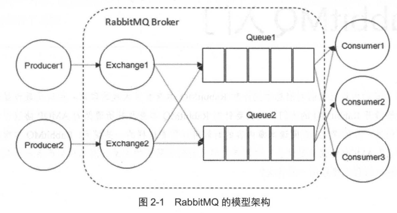

### 2.1.1 生产者和消费者

**Producer: 生产者，就是投递消息的一方。**

+ 生产者创建消息，然后发布到 RabbitMQ 中。
+ 消息一般可以包含 2 个部分:消息体和标签 Label; 消息体也可以称之为 payload，一般是一个带有业务逻辑结构 的数据，比如一个 JSON 字符串。消息的标签用来表述这条消息 ，比如一个交换器的名称和一个路由键 。 
+ RabbitMQ 之后会根据标签把消息发送给感兴趣 的消费者 Consumer。

**Consumer: 消费者 ， 就是接收消息的一方。**

+ 消费者连接到 RabbitMQ 服务器，并订阅到队列上 。 
+ 当消费者消费一条消息时 ，只是消费消息的消息体 payload。 
+ 在消息路由的过程中，消息的标签会丢弃，存入到队列中的消息只有消息体。

**Broker: 消息中间件的服务节点 。**

+ 一个 RabbitMQ Broker 可以简单地看作一个 RabbitMQ 服务节点或者 RabbitMQ服务实例。 

图 2-2展示了生产者将消息存入 RabbitMQ Broker，以及消费者从 Broker中消费数据的整 个流程。

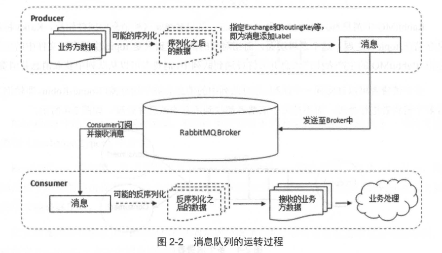

1. 首先生产者将业务方数据进行可能的包装 ，之后封装成消息，发送到 Broker 中 （ AMQP 协议里这个动作对应的命令为 Basic.Publish)。 
2. 消费者订阅并接收消息，经过可能的解包处理得到原始的数据，之后再进行业务处理逻辑。（AMQP 协议里这个动作对应的命令为 Basic.Consume 或者 Basic.Get）
3. 业务处理逻辑并不一定需要和接收消息的逻辑使用同一个线程。消费者进程可以使用一个线程去接收消息，存入到内存中，比如使用 Java 中的 BlockingQueue。业务处理逻辑使用另 一个线程从内存中读取数据，这样可以将应用进一步解稿，提高整个应用的处理效率。


### 2.1.2 队列

**Queue: 队列，是 RabbitMQ 的内部对象，用 于存储消息。**

+ RabbitMQ 中消息都只能存储在队列中 。

  > 这一点和 Kafka 这种消息中间件相反 。Kafka 将消息存储在 topic 主题这个逻辑层面，而相对应的队列逻辑只是 topic 实际存储文件中的位移标识。RabbitMQ 的生产者生产消息井最终投递到队列中，消费者可以从队列中获取消息并消费 。

+ RabbitMQ 的生产者生产消息井最终技递到队列中，消费者可以从队列中获取消息并消费 。 

多个消费者可以订阅同一个队列，这时队列中的消息会被平均分摊给多个消费者进行处理，而不是每个消费者都收到所有的消息井处理，如图 2-4 所示。

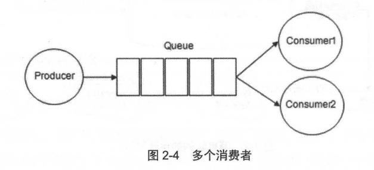

> RabbitMQ 不支持队列 层面的广播消费，如果需要广播消费，需要在其上进行二次开发，处理逻辑会变得异常复杂，同时也不建议这么做。


### 2.1.3 交换器、路由器、绑定

**Exchange: 交换器**

+ 生产者将消息发送到 Exchange 交换器，由交换器将消息路由到一个或者多个队列中。
+ 如果路由不到，或许会返回给生产者，或许直接丢弃。
+ RabbitMQ 中的交换器有四种类型，不同的类型有着不同的路由策略。

交换器的具体示意图如图 2-5 所示。

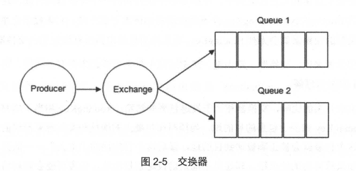

**RoutingKey: 路由键 。**

+ 生产者将消息发给交换器的时候，一般会指定一个 RoutingKey ，用来指定这个消息的路由规则；
+ 这个 RoutingKey 需要与交换器类型和绑定键 BindingKey 联合使用才能最终生效。
+ 在交换器类型和绑定键 (BindingKey) 固定的情况下，生产者可以在发送消息给交换器时， 通过指定 RoutingKey来决定消息流向哪里。

**Binding: 绑定 。** 

+ RabbitMQ 中通过绑定将交换器与队列关联起来，在绑定的时候一般会指定一个绑定键 (BindingKey)，这样 RabbitMQ 就知道如何正确地将消息路由到队列了，如图 2-6 所示。

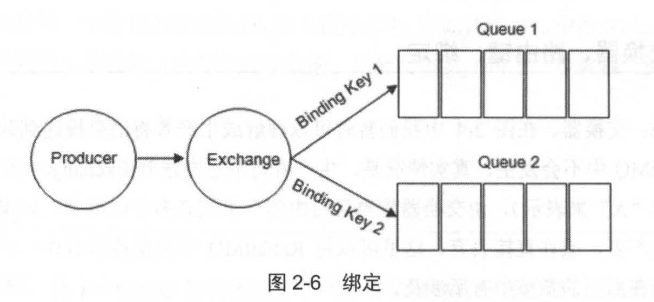

生产者将消息发送给交换器时，需要一个 RoutingKey，当 BindingKey 和 RoutingKey 相匹配时，消息会被路由到对应的队列中。

+ 在绑定多个队列到同一个交换器的时候， 这些绑定允许使用相同的 BindingKey 。
+ BindingKey 并不是在所有的情况下都生效，它依赖于交换器类型，比如 fanout类型的交换器就会无视 BindingKey，而是将消息路由到所有绑定到该交换器的队列中 。

可以对照着下面的代码来理解交换器、路由键和绑定这几个概念：

```java
Connection connection = factory.newConnection(); // 创建链接
Channel channel = connection.createChannel(); // 创建信道
// 创建一个 type = "direct"、持久化的、非自动删除的交换器
channel.exchangeDeclare(EXCHANGE_NAME, "direct", true, false, null);
// 创建一个持久化、非排他的、非自动删除的队列
channel.queueDeclare(QUEUE_NAME, true, false, false, null);
// 将交换器与队列通过路由键绑定
channel.queueBind(QUEUE_NAME, EXCHANGE_NAME, ROUTING_KEY);
// 发送一条持久化的消息： hello world !
String message = "Hello World!";
channel.basicPublish(EXCHANGE_NAME, ROUTING_KEY, MessageProperties.PERSISTENT_TEXT_PLAIN, message.getBytes());
```

以上代码声明了一个 direct类型的交换器，然后将交换器和队列绑定起来。在本该使用 BindingKey 的 channel .queueBind 方法中却和 channel.basicPublish 方法同样使用了 RoutingKey，**保证了交换机能够将消息能顺利发送到对应队列中。**

大多数时候，包括官方文档和 RabbitMQ Java API 中都把 BindingKey 和 RoutingKey 看作 RoutingKey，为了避免混淆，可以这么理解:

+ 在使用绑定的时候，其中需要的路由键是 BindingKey。涉及的客户端方法如: `channel.exchangeBind`、 `channel.queueBind`，对应的 AMQP 命令 (详情参见 2.2 节) 为 `Exchange.Bind`、 `Queue.Bind`。
+ 在发送消息的时候，其中需要的路由键是 RoutingKey。涉及的客户端方法如 `channel.basicPublish`，对应的 AMQP 命令为 `Basic.Publish`。

本文后面的篇幅中也会将两者合称为路由键，需要注意区分其中的不同。


### 2.1.4 交换器类型

RabbitMQ 常用的交换器类型有 fanout、 direct、 topic、 headers 这四种 。 

**1. fanout**

它会把所有发送到该交换器的消息路由到所有与该交换器绑定的队列中。

**2.direct**

direct 类型的交换器路由规则也很简单，它会把消息路由到那些 BindingKey和 RoutingKey 完全匹配的队列中。

以图 2-7为例，交换器的类型为 direct：

+ 如果我们发送一条消息，并在发送消息的时候设置 路由键为 "warning"，则消息会路由到 Queue1和 Queue2；
+ 如果在发送消息的时候设置路由键为" info" 或者 "debug"，消息只会路由到 Queue2；
+ 如果以其他的路由键发送消息，则消息不会路由到这两个队列中。

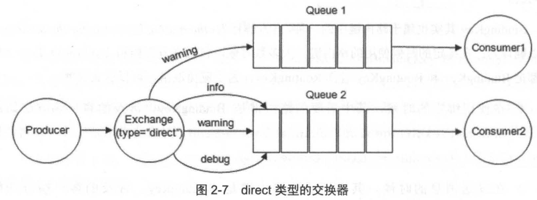

**3.topic**

前面讲到 direct 类型的交换器路由规则是完全匹配 BindingKey 和 RoutingKey，但是这种严格的匹配方式在很多情况下不能满足实际业务的需求。topic 类型的交换器在匹配规则上进行了扩展，匹配规则有些不同，它约定：

+ RoutingKey 为一个点号 "." 分隔的字符串（被点号分隔开的每一段独立的字符串称为一个单词 )，如"com.rabbitmq.client";
+ BindingKey 和 RoutingKey 一样也是点号分隔的字符串;
+ BindingKey 中可以存在两种特殊字符串 * 和 # 用于做模糊匹配：
  + `*` ：匹配正好一个词，例如： `order.*` 可以匹配到 order.insert
  + `#`：匹配一个或者多个词（包括零个词），例如：`order.#` 可以匹配到 order.insert.common

以图 2-8 中的配置为例:

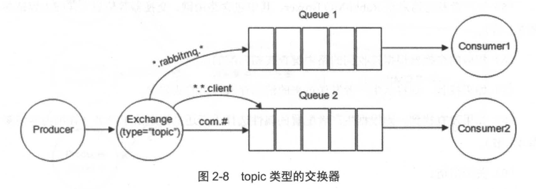

1. 路由键为 "com.rabbitmq.client" 的消息会同时路由到 Queue1 和 Queue2
2. 路由键为 "com.hidden.client" 的消息只会路由到 Queue2 中
3. 路由键为 "com.hidden.demo" 的消息只会路由到 Queue2 中
4. 路由键为 "java.rabbitmq.demo" 的消息只会路由到 Queue1 中
5. 路由键为 "java.util.concurrent" 的消息将会被丢弃或者返回给生产者 (需要设置 mandatory 参数) ，因为它没有匹配任何路由键。

**4.headers**

headers 类型的交换器不依赖于路由键的匹配规则来路由消息，而是根据发送的消息内容中的 headers 属性进行匹配。

+ 在绑定队列和交换器时制定一组键值对 
+ 当发送消息到交换器时，RabbitMQ 会获取到该消息的 headers (也是一个键值对的形式) ，对比其中的键值对 是否完全匹配队列和交换器绑定时指定的键值对，如果完全匹配则消息会路由到该队列，否则不会路由到该队列 
+  headers 类型的交换器性能会很差，而且也不实用，基本上不会看到它的存在。


### 2.1.5 RabbitMQ 运转流程

了解了以上的 RabbitMQ 架构模型及相关术语，再来回顾整个消息队列的使用过程。

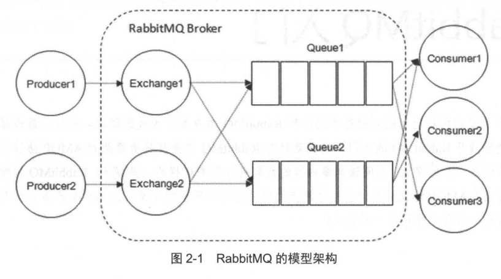

**生产者发送消息的时候 (可依照图 2-1):**

1. 生产者连接到 RabbitMQ Broker， 建立一个连接 Connection，开启一个信道 Channel
2. 生产者声明一个交换器 ，并设置相关属性，比如 交换机类型、是否持久化 等
3. 生产者声明 一个队列井设置相关属性，比如是否排他、是否持久化、是否自动删除等
4. 生产者通过路由键将交换器和队列绑定起来
5. 生产者发送消息至 RabbitMQ Broker，其中包含路由键、交换器等信息
6. 相应的交换器根据接收到的路由键查找相匹配的队列 
7. 如果找到 ，则将从生产者发送过来的消息存入相应的队列中
8. 如果没有找到 ，则根据生产者配置的属性选择丢弃还是回退给生产者
9. 关闭信道
10. 关闭连接

**消费者接收消息的过程:**

1. 消费者连接到 RabbitMQ Broker， 建立一个连接 Connection，开启一个信道 Channel
2. 消费者向 RabbitMQ Broker 请求消费相应队列中的消息，可能会设置相应的回调函数，以及做一些准备工作
3. 等待 RabbitMQ Broker 回应并投递相应队列中的消息，消费者接收消息。
4. 消费者确认 (ack) 接收到的消息 。
5. RabbitMQ 从队列中删除相应己经被确认的消息 。
6. 关闭信道。
7. 关闭连接。

**我们又引入了两个新的概念: Connection和 Channel。**

我们知道无论是生产者还是消费者，都需要和 RabbitMQ Broker 建立连接，这个连接就是一条 TCP 连接，也就是 Connection。

+  一旦 TCP 连接建立起来，客户端紧接着可以创建一个 AMQP 信道 Channel，每个信道都会被指派 一个唯一的 ID；
+ 信道是建立在 Connection 之上的虚拟连接，RabbitMQ 处理的每条 AMQP 指令都是通过信道完成的。

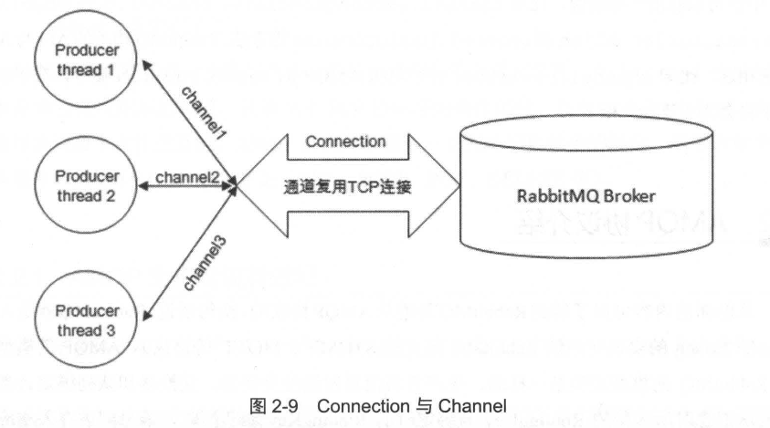

我们完全可以直接使用 Connection 就能完成信道的工作，为什么还要引入信道呢?

+ 试想这样一个场景，一个应用程序中有很多个线程需要从 RabbitMQ 中消费消息，或者生产消息，那么必然需要建立很多个 Connection，也就是许多个 TCP 连接。
+ 然而对于操作系统而言，建立和销毁 TCP 连接是非常昂贵的开销，如果遇到使用高峰，性能瓶颈也随之显现。RabbitMQ 采用类似 NIO' (Non-blocking IO) 的做法，**选择 TCP 连接复用，不仅可以减少性能开销，同时也便于管理 。**

>NIO，也称非阻塞 IO，包含三大核心部分 Channel (信道)、 Buffer (缓冲区)和 Selector (选择器). NIO 基于 Channel 和 Buffer 进行操作，数据总是从信道读取数据到缓冲区中，或者从缓冲区写入到信道中。 Selector 用于监听多个信道的事件 (比如连接打开，数据到达等)。因此，单线程可以监听多个数据的信道。

每个线程把持一个信道，所以信道复用了 Connection 的 TCP 连接。同时 RabbitMQ 可以确 保每个线程的私密性，就像拥有独立的连接一样。

+ 当每个信道的流量不是很大时，复用单一的 Connection 可以在产生性能瓶颈的情况下有效地节省 TCP 连接资源。
+ 但是当信道本身的流量很大时，复用一个 Connection 就会产生性能瓶颈，进而使整体的流量被限制了。 此时就需要开辟多个 Connection，将这些信道均摊到这些 Connection 中，至于这些相关的调优策略需要根据业务自身的实际情况进行调节，更多内容可以参考第 9 章。

**信道 Channel 在 AMQP 中是一个很重要的概念，大多数操作都是在信道这个层面展开的。**

在代码清单 1-1 中也可以看出一些端倪，比如 `channel.exchangeDeclare`、 `channel.queueDeclare`、 `channel.basicPublish ` 和 `channel.basicConsume`等方法。

> RabbitMQ 相关的 API 与 AMQP 紧密相连，比如 channel.basicPublish 对应 AMQP 的 Basic.Publish 命令，在下面的小节中将会为大家一一展开。


## 2.2 AMQP 协议介绍

从前面的内容可以了解到 RabbitMQ是遵从 AMQP协议的， 换句话说 ，RabbitMQ就是 AMQP 协议的 Erlang 的实现。RabbitMQ 中的交换器、交换器类型、队列、绑定、路由键等都是遵循的 AMQP 协议中相应的概念。

AMQP 协议本身包括三层。

1. Module Layer：位于协议最高层，主要定义了一些供客户端调用的命令，客户端可以利用这些命令实现自己的业务逻辑。
2. Session Layer：位于中间层，主要负责将客户端的命令发送给服务器，再将服务端的应答返回给客户端，主要为客户端与服务器之间的通信提供可靠性同步机制和错误处理。
3. Transport Layer：位于最底层，主要传输二进制数据流 ，提供帧的处理、信道复用、错误检测和数据表示等。

**AMQP 说到底还是一个通信协议，通信协议都会涉及报文交互**

+ 从 low-level 举例来说， AMQP 本身是应用层的协议，其填充于 TCP 协议层的数据部分；
+ 从 high-level 来说， AMQP 是通过协议命令进行交互的。AMQP 协议可以看作一系列结构化命令的集合，这里的命令代表 一种操作，类似于HTTP中的方法 (GET、 POST、 PUT、 DELETE等)。


### 2.2.1 AMQP 生产者流转过程

为了形象地说明 AMQP 协议命令的流转过程，这里截取代码清单 1-1 中的关键代码，如代码清单 2-2所示。

```java
Connection connection = factory.newConnection(); // 创建链接
Channel channel = connection.createChannel(); // 创建信道

String message = "Hello World!";
channel.basicPublish(EXCHANGE_NAME, ROUTING_KEY, MessageProperties.PERSISTENT_TEXT_PLAIN, message.getBytes());

// 关闭资源
channel.close()
connection.close()
```

当客户端与 Broker 建立连接的时候，会调用 factory .newConnection 方法，这个方法会进一步封装成 Protocol Header 0-9-1 的报文头发送给 Broker，以此通知 Broker本次交互采用的是 AMQP 0-9-1 协议，**紧接着 Broker 返回 Connection.Start 来建立连接。**

1. 在连接的过程中涉及`Connection.Start`/`.Start-OK`、`Connection.Tune`/`.Tune-Ok`、 `Connection.Open`/ `.Open-Ok `这 6 个命令的交互 。

2. 当客户端调用 connection .createChannel 方法准备开启信道的时候，其包装 `Channel.Open` 命令发送给 Broker，等待 `Channel.Open-Ok` 命令 。

3. 当客户端发送消息的时候，需要调用 channel.basicPublish 方法，对应的 AQMP 命令为 Basic.Publish，注意这个命令和前面涉及的命令略有不同，这个命令还包含了 Content Header 和 ContentBody。

   + ContentHeader 里面包含的是消息体的属性，例如，投递模式 (可以参 考 3.3 节)、优先级等

   + ContentBody 包含消息体本身

4. 当客户端发送完消息需要关闭资源时，涉及 `Channel.Close/.Close-Ok` 与 `Connection.Close/.Close-Ok` 的命令交互。

**详细流转过程如图 2-10 所示 。**

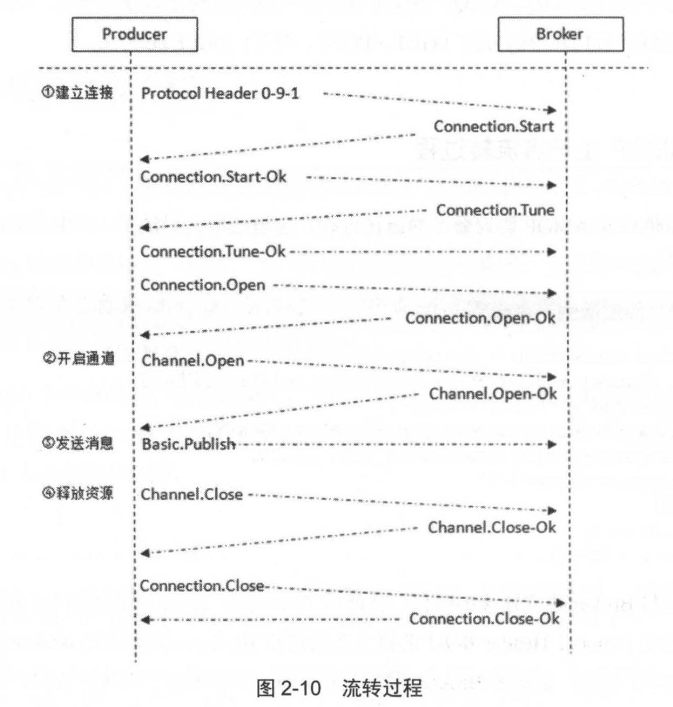


### 2.2.2 AMQP 消费者流转过程

本节我们继续来看消费者的流转过程 ， 参考代码清单 1-2， 截取消费端的关键代码如代码清单 2-3 所示。

```go
//这里的连接方式与生产者的 demo 略有不同 ， 注意辨别区别
Connection connection = factory.newConnection(addresses); // 创建连接
final Channel channel = connection.createChannel(); // 创建信道
channel.basicQos(64); // 设置客户端最多接收的未被 ack 的消息的个数
Consumer consumer = new DefaultConsumer(channel) {...}};
channel.basicConsume(QUEUE_NAME, consumer);

// 等待函数执行完毕之后，关闭资源
TimeUnit.SECONDS.sleep(5);
channel.close();
connection.close();
```

其详细流转过程如图 2-11 所示。

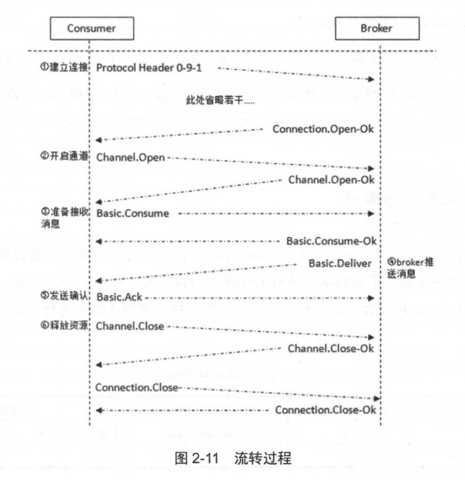

1. 在连接的过程中涉及`Connection.Start`/`.Start-OK`、`Connection.Tune`/`.Tune-Ok`、 `Connection.Open`/ `.Open-Ok `这 6 个命令的交互 。
2. 当客户端调用 connection .createChannel 方法准备开启信道的时候，其包装 `Channel.Open` 命令发送给 Broker，等待 `Channel.Open-Ok` 命令 。
3. 如果在消费之前调用了 `channel.basicQos(int prefetchCount)` 的方法来设置消费者客户端最大能"保持"的未确认的消息数，那么协议流转会涉及 `Basic.Qos/.Qos-Ok `这 两个 AMQP 命令。
4. 在真正消费之前，消费者客户端需要向 Broker 发送 `Basic.Consume` 命令(即调用 channel.basicConsume 方法〉将 Channel 置为接收模式，之后 Broker 回执` Basic.Consume-Ok` 以告诉消费者客户端准备好消费消息。
5. **接着 Broker 向消费者客户端推送 (Push) 消息，即 Basic.Deliver 命令，有意思的是这个和 Basic.Publish 命令一样会携带 ContentHeader和 ContentBody。消费者接收到消息并正确消费之后，向 Broker发送确认，即 Basic.Ack命令。**
6. 当客户端发送完消息需要关闭资源时，涉及 `Channel.Close/.Close-Ok` 与 `Connection.Close/.Close-Ok` 的命令交互。


### 2.2.3 AMQP 命令概览

AMQP 0-9-1 协议中的命令远远不止上面所涉及的这些，为了让读者在遇到其他命令的时候能够迅速查阅相关信息，下面列举了 AMQP 0-9-1 协议主要的命令，包含名称、是否包含内容体 (Content Body)、对应客户端中相应的方法及简要描述等四个维度进行说明，**具体如表 2-1 所示。**

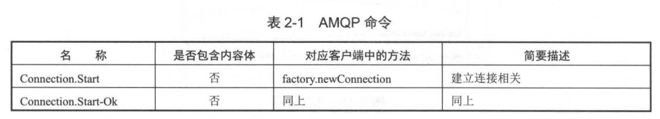

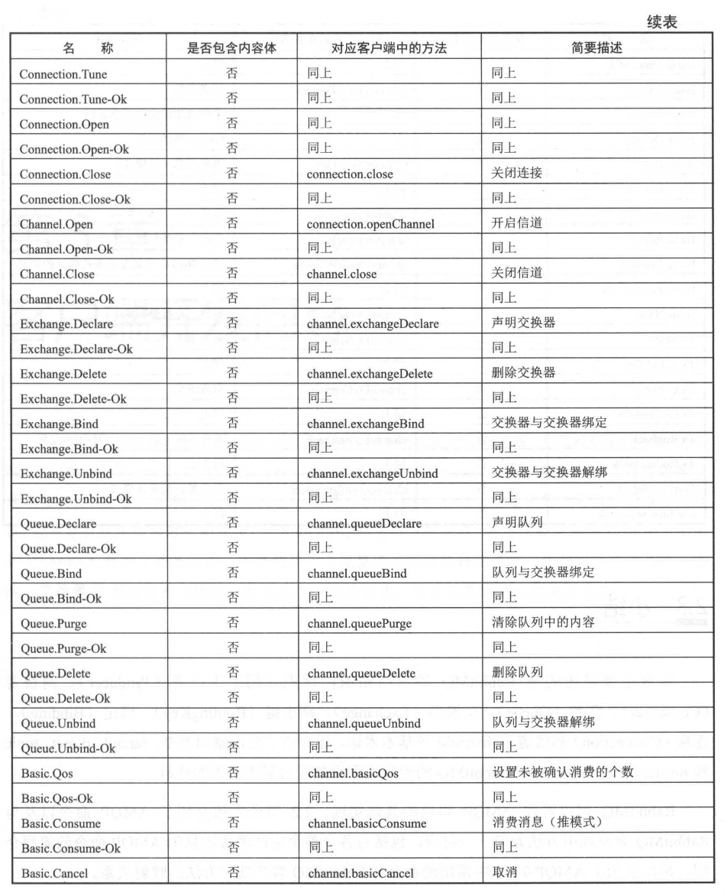

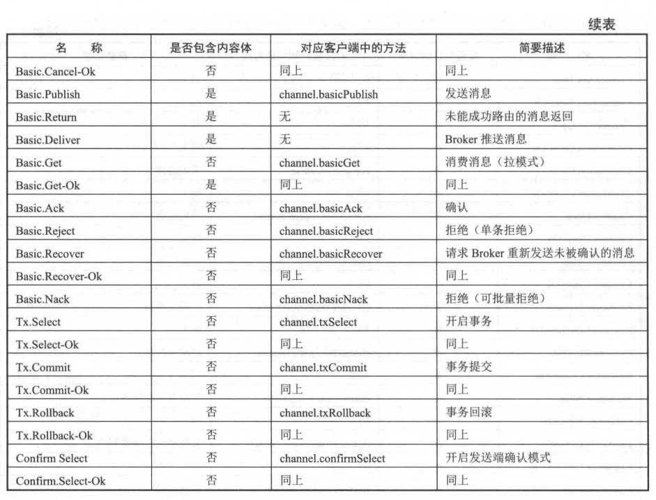


## 2.3 小结

本章主要讲述的是 RabbitMQ 的入门知识，首先介绍了生产者 Producer、消费者 Consumer、队列 Queue、交换器 Exchange、路由键 RoutingKey 、绑定 Binding、 连接 Connection 和信道 Channel 等基本术语 

还介绍了交换器的类型 : fanout、 direct、 topic 和 headers。之后通过介绍 RabbitMQ 的运转流程来加深对基本术语的理解。

RabbitMQ 可以看作 AMQP 协议的具体实现，2.2 节大致介绍了 AMQP 命令以及与 RabbitMQ 客户端中方法如何一一对应，包括对各个整个生产消费消息的 AMQP 命令的流程介绍。最后展示了 AMQP 0-9-1 中常用的命令与 RabbitMQ 客户端中方法的映射关系。