# 第四章 RabbitMQ 进阶

前一章中所讲述的是一些基础的概念及使用方法， 比如创建交换器、队列和绑定关系等。

但是其中有许多细节并未陈述，对使用过程中的一些"坑"也并未提及，一些高级用法也并未 展现，所以本章的内容就是要弥补这些缺憾。

**本章以 RabbitMQ 基础使用知识为前提，阐述一些更具特色的细节及功能，为读者更进一步地掌握 RabbitMQ 提供基准。**


## 4.1 消息何去何从

mandatory 和 immediate 是 channel.basicPublish 方法中的两个参数，它们都有当消息传递过程中不可达目的地时将消息返回给生产者的功能。

RabbitMQ 提供的备份交换器 (Altermate Exchange) 可以将未能被交换器路由的消息(没有绑定队列或者没有匹配的绑定）存储起来，而不用返回给客户端。

#### 4.1.1 mandatory 参数

mandatory 参数的作用如下：

+ 当 mandatory 参数设为 true 时，交换器无法根据自身的类型和路由键找到一个符合条件的队列，那么 RabbitMQ 会调用 Basic.Return 命令将消息返回给生产者 。
+ 当 mandatory 参数设置为 false 时，出现上述情形，则消息直接被丢弃 。

那么生产者如何获取到没有被正确路由到合适队列的消息呢？

+ 这时候可以通过调用 channel.addReturnListener 来添加 ReturnListener 监听器实现。

使用 mandatory 参数的关键代码如代码清单 4-1 所示。

```java
channel.basicPublish(EXCHANGE_NAME, "", true,
                     MessageProperties.PERSISTENT_TEXT_PLAIN,
                     "mandatory test".getBytes());

channel.addReturnListener(new ReturnListener(){
  	public void handleReturn(int replyCode, String replyText,
                            String exchange, String routingKey,
                            AMQP.BasicProperties.basicProperties,
                            byte[] body) throws IOException{
      	String message = new String(body);
      	System.out.println("Basic.Return 返回的结果是: " + message)
    }
});
```

上面代码中生产者没有成功地将消息路由到队列，此时 RabbitMQ 会通过 Basic.Return 返回 "mandatory test" 这条消息，之后生产者客户端通过 ReturnListener 监听到了这个事件，上面代码的最后输出应该是 "Basic.Retum 返回的结果是 : mandatory test"

从 AMQP 协议层面来说，其对应的流转过程如图 4-1 所示。

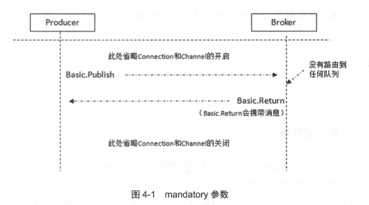


#### 4.1.2 immediate 参数

immediate 参数的作用如下：

+ 当 immediate 参数设为 true 时，如果交换器在将消息路由到队列时发现队列上并不存在任何消费者，那么这条消息将不会存入队列中。
+ 当与路由键匹配的所有队列都没有消费者时 ，该消息会通过 Basic.Return 返回至生产者。

**RabbitMQ 3.0版本开始去掉了对  immediate 参数的支持，对此 RabbitMQ 官方解释是:**

+  immediate 参数会影响镜像队列的性能 ， 增加了代码复杂性 ， 建议采用 TTL 和 DLX 的方法替代。(有关 TTL 和 DLX 的介绍请分别参考 4.2 节和 4.3 节 )。


#### 4.1.3 备份交换器

备份交换器，英文名称为 AltemateExchange，简称 AE 。

> 生产者在发送消息的时候如果不设置 mandatory 参数 ，那么消息在未被路由的情况下将会丢失；如果设置了 mandatory 参数，那么需要添加 ReturnListener 的编程逻辑，生产者的代码将变得复杂。

如果既不想复杂化生产者的编程逻辑，又不想消息丢失，那么可以使用备份交换器，**这样可以将未被路由的消息存储在 RabbitMQ 中，再在需要的时候去处理这些消息。**

可以通过在声明交换器（调用 channel.exchangeDeclare 方法）的时候添加 alternate-exchange 参数来实现，也可以通过策略（Policy，详细参考 6.3 节）的方式实现。 如果两者同时使用，则前者的优先级更高，会覆盖掉 Policy 的设置 。

**使用参数设置的关键代码如代码清单 4-2 所示。**

```java
Map<String, Object> args = new HashMap<String, Object>();
args.put("alternate-exchange", "myAe");
channel.exchangeDeclare("normalExchange","direct",true, fa1se, args);
channe1.exchangeDec1are("myAe" , "fanout" , true , fa1se , nu11) ;

channe1.queueDec1are("normalQueue", true, fa1se, fa1se, nu11);
channe1.queueBind( "norma1Queue","norma1Exchange","normalKey");

channel.queueDec1are("unroutedQueue", true ,fa1se ,fa1se ,nu11);
channel.queueBind("unroutedQueue", "myAe", "");
```

上面的代码中声明了两个交换器 normalExchange 和 myAe，分别绑定了 normalQueue 和unroutedQueue 这两个队列，同时将 myAe 设置为 normalExchange 的备份交换器。

**注意 myAe 的交换器类型为 fanout。**

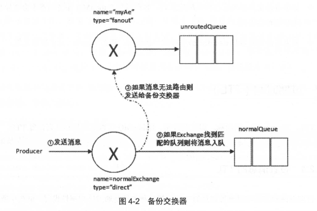

参考图 4-2，如果此时发送一条消息到  normalExchange 上，当路由键等于"normalKey" 的 时候，消息能正确路由到 normalQueue 这个队列中。

如果路由键设为其他值，比如 "errorKey" 即消息不能被正确地路由到与 normalExchange绑定的任何队列上，此时就会发送给 myAe，进而发送到 unroutedQueue 这个队列 。

同样，如果采用 Policy 的方式来设置备份交换器，可以参考如下:

```
rabbitmqctl set_policy AE "^normalExchange$" `{"alternate-exchange":
"myAE"}`
```

备份交换器其实和普通的交换器没有太大的区别，为了方便使用，建议设置为 fanout 类型，如若读者想设置为 direct 或者 topic 的类型也没有什么不妥。**需要注意的是，消息被重新发送到备份交换器时的路由键和从生产者发出的路由键是一样的。**

考虑这样一种情况，如果备份交换器的类型是 direct，并且有一个与其绑定的队列，假设绑定的路由键是 key1，当某条携带路由键为 key2 的消息被转发到这个备份交换器的时候，备份交换器没有匹配到合适的队列，则**消息丢失** 。如果消息携带的路由键为 key1，则可以存储到队列中。

**对于备份交换器，总结了以下几种特殊情况:**

1. 如果设置的备份交换器不存在，客户端和 RabbitMQ 服务端都不会有异常出现，此时消 息会丢失。
2. 如果备份交换器没有绑定任何队列，客户端和 RabbitMQ 服务端都不会有异常出现，此 时消息会丢失。
3. 如果备份交换器没有任何匹配的队列，客户端和 RabbitMQ 服务端都不会有异常出现， 此时消息会丢失。
4. 如果备份交换器和 mandatory 参数一起使用，那么 mandatory 参数无效。


## 4.2 过期时间 TTL

TTL，Time to Live 的简称，即过期时间 。 RabbitMQ 可以对消息和队列设置 TTL。

#### 4.2.1 设置消息的 TTL

目前有两种方法可以设置消息的 TTL。

+ 第一种方法是通过队列属性设置，队列中所有消息都有相同的过期时间。
+ 第二种方法是对消息本身进行单独设置，每条消息的 TTL 可以不同。
+ 如果两种方法一起使用，则消息的 TTL 以两者之间较小的那个数值为准。

**消息在队列中的生存时间一旦超过设置的 TTL 值时，就会变成"死信" (Dead Message)，消费者将无法再收到该消息 （这点不是绝对的，可以参考 4.3节）。**

------

通过队列属性设置消息 TTL 的方法是在 channel.queueDeclare 方法中加入 x-message-ttl 参数实现的，这个参数的单位是毫秒。

**示例代码如代码清单 4-3 所示 。**

```java
Map<String, Object> argss = new HashMap<String, Object>();
argss.put("x-message-ttl", 6000);
channel.queueDeclare(queueName, durable, exclusive, autoDelete, argss) ;
```

同时也可以通过 Policy 的方式来设置 TTL 示例如下 :

```
rabbitmqctl set_policy TTL ".*" '{"message-ttl":60000}' --apply-to queues
```

如果不设置 TTL 则表示此消息不会过期 ;

**如果将 TTL 设置为 0，则表示除非此时可以直接将消息投递到消费者，否则该消息会被立即丢弃，这个特性可以部分替代 RabbitMQ 3.0 版本之前的 immediate 参数，之所以部分代替，是因为 immediate 参数在投递失败时会用 Basic.Return将消息返回（这个功能可以用死信队列来实现，详细参考 4.3节）。**

针对每条消息设置 TTL 的方法是在 channel.basicPublish 方法中加入 expiration 的属性参数，单位为毫秒。

**关键代码如代码清单 4-4所示：**

```java
// 设置消息的属性
AMQP.BasicProperties.Builder builder = new AMQP.BasicProperties.Builder();

// 设置消息持久化，2表示持久化消息
builder.deliveryMode(2);

// 设置TTL (Time-to-Live) 为60000ms (60秒)
builder.expiration("60000");

// 构建消息的属性
AMQP.BasicProperties properties = builder.build();

// 定义交换机和路由键
String exchangeName = "your_exchange_name";  // 替换成实际的交换机名称
String routingKey = "your_routing_key";      // 替换成实际的路由键
boolean mandatory = true;  // 根据需要设置

// 发送消息
String message = "ttlTestMessage";  // 消息内容
channel.basicPublish(exchangeName, routingKey, mandatory, properties, message.getBytes());

System.out.println("Message sent: " + message);
```

**也可以使用如代码清单 4-5 所示的方式:**

```java
// 设置消息的属性
AMQP.BasicProperties properties = new AMQP.BasicProperties() ;
properties.setDeliveryMode(2);
properties.setExpiration("60000");

// 构建消息的属性
AMQP.BasicProperties properties = builder.build();

// 定义交换机和路由键
String exchangeName = "your_exchange_name";  // 替换成实际的交换机名称
String routingKey = "your_routing_key";      // 替换成实际的路由键
boolean mandatory = true;  // 根据需要设置

// 发送消息
String message = "ttlTestMessage";  // 消息内容
channel.basicPublish(exchangeName, routingKey, mandatory, properties, message.getBytes());

System.out.println("Message sent: " + message);
```

------

TTL 的处理方式：

+ **对于队列TTL：**对于设置队列 TTL属性的方法，一旦消息过期，就会从队列中抹去
+ **对于消息TTL：**也不会马上从队列中抹去，因为每条消息是否过期是在即将投递到消费者之前判定的。

**为什么这两种方法处理的方式不一样?**

+ **对于队列TTL：** 队列中己过期的消息肯定在队列头部， RabbitMQ 只要定期从队头开始扫描是否有过期的消息即可。
+ **对于消息TTL：** 每条消息的过期时间不同，如果要删除所有过期消息势必要扫描整个队列，所以不如等到此消息即将被消费时再判定是否过期 ，如果过期再进行删除即可。


#### 4.2.2 设置队列的 TTL

通过 channel.queueDeclare 方法中的 x-expires 参数可以控制**队列被自动删除** 前处于未使用状态的时间。

+ 未使用的意思是队列上没有任何的消费者，队列也没有被重新声明，并且在过期时间段 内也未调用过 Basic.Get 命令。
+ RabbitMQ 会确保在过期时间到达后将队列删除，但是不保障删除的动作有多及时。在 RabbitMQ 重启后，持久化的队列的过期时间会被重新计算。

用于表示过期时间的 x-expires 参数以毫秒为单位 ， 井且服从和 x-message-ttl 一样的约束条件，不过不能设置为 0。比如该参数设置为 1000，则表示该队列如果在 1 秒钟之内未使用则会被删除。

**代码清单 4-6 演示了创建一个过期时间为 30 分钟的队列：**

```java
Map<String, Object> argss = new HashMap<String, Object>();
argss.put("x-expires", 1800000);
channel.queueDeclare(queueName, durable, exclusive, autoDelete, argss) ;
```


## 4.3 死信队列 DLX

DLX，全称为 Dead-Letter-Exchange，可以称之为死信交换器，也有人称之为死信邮箱。

当消息在一个队列中变成死信 (dead message) 之后，它能被重新被发送到另一个交换器中，这个交换器就是 DLX，绑定 DLX 的队列就称之为死信队列。

**消息变成死信一般是由于以下几种情况:**

1. **消息被拒绝 (Basic.Reject/ Basic.Nack)，井且设置 requeue 参数为 false;**
2. **消息过期**
3. **队列达到最大长度**

DLX 也是一个正常的交换器，和一般的交换器没有区别，它能在任何的队列上被指定，实 际上就是设置某个队列的属性。当这个队列中存在死信时，RabbitMQ 就会自动地将这个消息重新发布到设置的 DLX 上去 ，进而被路由到另一个队列，即死信队列。

可以监听这个队列中的消息、以进行相应的处理，这个特性与将消息的 TTL 设置为 0 配合使用可以弥补 imrnediate 参数的功能。

> immediate 参数的作用如下：
>
> + 当 immediate 参数设为 true 时，如果交换器在将消息路由到队列时发现队列上并不存在任何消费者，那么这条消息将不会存入队列中。
> + 当与路由键匹配的所有队列都没有消费者时 ，该消息会通过 Basic.Return 返回至生产者。

通过设置 **消息 TTL** 为 0 来控制消息过期时的行为，并结合 **死信队列**（DLQ），可以实现 immediate 相关功能：

1. **消息 TTL 设置为 0**：
   - 消息的 TTL 设置为 0，意味着消息一旦不能被路由到任何队列时，会立即过期。通常，消息的过期会导致消息被丢弃，或者如果设置了死信队列（DLX），则消息会转到死信队列。
   - 设置消息的 TTL 为 0，这样消息会在没有消费者时过期并转发到死信队列。
2. **结合死信队列和 TTL**：
   - 如果消息因为路由问题（例如没有消费者）而无法消费，或者消息 TTL 设置为 0 导致其过期，它可以被转发到一个死信队列，作为一种处理方式。

------

**通过在 channel.queueDeclare 方法中设置 x-dead-letter-exchange 参数来为这个队列添加 DLX (代码清单 4-7 中的 dlx exchange):**

```java
// 1. 声明死信交换机
String dlxExchange = "dlx_exchange";
channel.exchangeDeclare(dlxExchange, "direct");  // 声明死信交换机类型为 direct

// 2. 设置死信交换机参数
Map<String, Object> args = new HashMap<>();
args.put("x-dead-letter-exchange", dlxExchange);  // 设置队列的死信交换机

// 3. 声明主队列并设置死信交换机
String mainQueue = "myqueue";
channel.queueDeclare(mainQueue, false, false, false, args);  // 将死信交换机绑定到主队列

System.out.println("Queue 'myqueue' with DLX 'dlx_exchange' created successfully.");
```

**下面创建一个队列 ，为其设置 TTL 和 DLX 等，如代码清单 4-8 所示。**

```java
import com.rabbitmq.client.*;

import java.util.HashMap;
import java.util.Map;

public class RabbitMQExample {

    public static void main(String[] args) throws Exception {
        // 创建连接工厂
        ConnectionFactory factory = new ConnectionFactory();
        factory.setHost("localhost");

        try (Connection connection = factory.newConnection(); 
             Channel channel = connection.createChannel()) {

            // 1. 声明死信交换机 (DLX)
            String dlxExchange = "exchange.dlx";
            channel.exchangeDeclare(dlxExchange, "direct", true);  // 设置为 direct 类型，持久化交换机

            // 2. 声明正常交换机
            String normalExchange = "exchange.normal";
            channel.exchangeDeclare(normalExchange, "fanout", true);  // 设置为 fanout 类型，持久化交换机

            // 3. 配置正常队列的属性
            Map<String, Object> args = new HashMap<>();
            args.put("x-message-ttl", 10000);  
            args.put("x-dead-letter-exchange", dlxExchange);  // 设置死信交换机为 exchange.dlx
            args.put("x-dead-letter-routing-key", "routingkey");  // 设置死信路由键

            // 4. 声明正常队列并绑定到正常交换机
            String normalQueue = "queue.normal";
            channel.queueDeclare(normalQueue, true, false, false, args);  // 声明持久化队列
            channel.queueBind(normalQueue, normalExchange, "");  // 将队列绑定到正常交换机上，空路由键

            // 5. 声明死信队列并绑定到死信交换机
            String dlxQueue = "queue.dlx";
            channel.queueDeclare(dlxQueue, true, false, false, null);  // 声明死信队列
            channel.queueBind(dlxQueue, dlxExchange, "routingkey");  // 将死信队列绑定到死信交换机上，使用路由键

            // 6. 发布消息到正常交换机
            String message = "dlx";
            channel.basicPublish(normalExchange, "rk", MessageProperties.PERSISTENT_TEXT_PLAIN, message.getBytes());
            System.out.println("Message sent: " + message);
        }
    }
}
```

这里创建了两个交换器 exchange.normal 和 exchange.dlx， 分别绑定两个队列 queue.normal 和 queue.dlx。

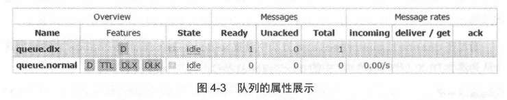

由 Web 管理页面(图 4-3) 可以看出，两个队列都被标记了 "D" 这个是 durable 的缩写， 即设置了队列持久化。 queue.normal 这个队列还配置了 TTL、 DLX 和 DLK，其中 DLX 指的是 x-dead-letter-routing-key 这个属性。

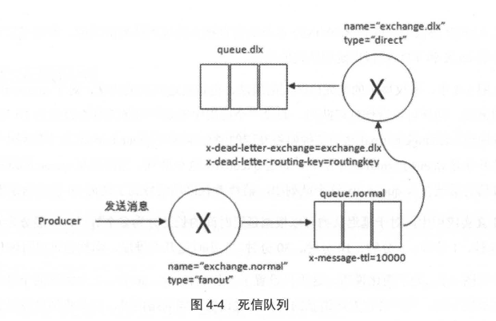

参考图 4-4：

1. 生产者首先发送一条携带路由键为 "rk" 的消息，然后经过交换器 exchange.normal 顺利地存储到队列 queue.normal 中 。
2. 由于队列 queue.normal 设置了过期时间为 10s， 在这 10s 内没有消费者消费这条消息，那么判定这条消息为过期。
3. 由于设置了 DLX，过期之时，消息被丢给交换器 exchange.dlx 中，这时找到与 exchange.dlx 匹配的队列 queue.dlx， 最后消息被存储在 queue.dlx 这个死信队列中。

**对于 RabbitMQ 来说，DLX 是一个非常有用的特性。它可以处理异常情况下，消息不能够被消费者正确消费（消费者调用了 Basic.Nack 或者 Basic.Reject ）而被置于死信队列中的情况，后续分析程序可以通过消费这个私信队列中的内容来分析当时所遇到的异常情况，进而改善和优化系统。**

DLX 配合 TTL 使用还可以实现延迟队列的功能，详细请看下 一节 。


## 4.4 延迟队列

延迟队列存储的对象是对应的延迟消息。

延迟消息：指当消息被发送以后，**并不想让消费者立刻拿到消息** ，而是等待特定时间后，消费者才能拿到这个消息进行消费 。

**延迟队列的使用场景有很多，比如:**

+ 订单系统中，一个用户下单之后通常有 30 分钟的时间进行支付，如果 30 分钟之内没有支付成功，那么这个订单将进行异常处理，这时就可以使用延迟队列来处理这些订单了 。
+ 用户希望通过手机远程遥控家里的智能设备在指定的时间进行工作。这时候就可以将用户指令发送到延迟队列，当指令设定的时间到了再将指令推送到智能设备 。

在 AMQP 协议中，或者 RabbitMQ 本身没有直接支持延迟队列的功能，但是可以通过前面所介绍的 DLX 和 TTL 模拟出延迟队列的功能。

------


在图 4-4 中，不仅展示的是死信队列的用法，也是延迟队列的用法，对于 queue.dlx 这个死信队列来说，同样可以看作延迟队列。

1. 假设一个应用中需要将每条消息都设置为 10 秒的延迟，生产者通过 exchange.normal 这个交换器将发送的消息存储在 queue.normal 这个队列中。
2. 消费者订阅的并非是 queue.normal 这个队列，而是 queue.dlx 这个队列 。
3. 当消息从 queue.normal 这个队列中过期之后被存入 queue.dlx 这个队列中，**消费者就恰巧消费到了延迟 10 秒的这条消息**  。

在真实应用中，对于延迟队列可以根据延迟时间的长短分为多个等级，一般分为 5 秒、 10 秒、 30秒、 1分钟、 5分钟、 10分钟、 30分钟、 1小时这几个维度，当然也可以再细化一下。

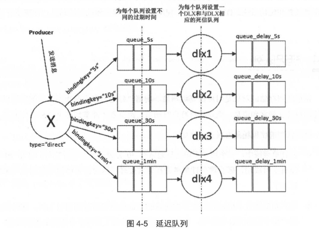

参考图 4-5，为了简化说明，这里只设置了 5 秒、 10 秒、 30 秒、1分钟这四个等级。

1. 根据应用需求的不同，生产者在发送消息的时候通过设置不同的路由键，以此将消息发送到与交换器绑定的不同的队列中。
2. 这里队列分别设置了过期时间为 5 秒、 10 秒、 30 秒、 1分钟，同时也分别配置了 DLX 和相应的死信队列。
3. 当相应的消息过期时，就会转存到相应的死信队列（即延迟队列）中，这样消费者根据业务自身的情况，分别选择不同延迟等级的延迟队列进行消费。


## 4.5 优先级队列

#### 4.5.1 优先级队列设置

优先级队列，顾名思义：

+ 具有高优先级的队列具有高的优先权
+ 优先级高的消息具备优先被消费的特权

**可以通过设置队列的 x-max-priority 参数来实现。示例代码如代码清单 4-9 所示。**

```java
Map<String, Object> args = new HashMap<String, Object>();
args.put("x-rnax-priority", 10);
channel.queueDeclare("queue.priority", true, false, false, args);
```

通过Web管理页面可以看到 "Pri" 的标识， 如图4-6所示。

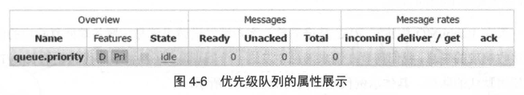

**上面的代码演示的是如何配置一个队列的最大优先级。在此之后 ，需要在发送时在消息中设置消息当前的优先级。示例代码如代码清单 4-10 所示。**

```java
AMQP.BasicProperties.Builder builder = new AMQP.BasicProperties.Builder();
builder.priority(5);
AMQP.BasicProperties properties = builder.build();

channel.basicPublish(
    "exchange_priority", // 交换机名称
    "rk_priority", // 路由键
    properties, // 消息属性
    "messages".getBytes() // 消息内容，转换为字节数组
);
```

上面的代码中设置消息的优先级为 5；默认最低为 0，最高为队列设置的最大优先级。

+ 优先级高的消息可以被优先消费，这个也是有前提的：如果在消费者的消费速度大于生产者的速度且 Broker 中没有消息堆积的情况下，对发送的消息设置优先级也就没有什么实际意义。
+ 因为生产者刚发送完一条消息就被消费者消费了，那么就相当于 Broker 中至多只有一条消息，对于单条消息来说优先级是没有什么意义的。

任务调度的优先级场景：

+ **场景**：假设你有一个后台任务处理系统，其中包含不同优先级的任务。例如，紧急修复（如系统故障）需要比普通报告生成任务优先处理。
+ **应用**：可以通过设置不同的优先级值来确保紧急任务（优先级高）先被处理，而低优先级任务在队列后面等待。

------

#### 4.5.2 优先级队列的实现原理

RabbitMQ 中的优先级队列（Priority Queue）的实现原理主要依赖于以下几个关键概念和机制：

1. **消息优先级的指定**

在 RabbitMQ 中，优先级是通过为每个消息指定一个优先级值来实现的。优先级的范围是从 `0` 到 `255`，即每条消息都可以有一个介于这两个值之间的优先级。

- 优先级值越大，消息的优先级越高。
- 默认情况下，RabbitMQ 队列的优先级为 `0`，即消息按发送顺序处理。

2. **队列内部的消息存储**

RabbitMQ 使用 **堆（Heap）** 数据结构来管理优先级队列。具体来说，优先级队列会根据每条消息的优先级排序，通常使用一个 **小顶堆**（Min-Heap）来实现消息的优先级管理。

- **小顶堆（Min-Heap）**：是一个完全二叉树数据结构，其中每个节点的值都不小于其父节点的值。在 RabbitMQ 中，高优先级的消息会被放置在堆的顶部，而低优先级的消息则会被放置在堆的底部。
- 消息被插入队列时，会根据优先级自动调整堆的结构。这样，高优先级的消息会被优先消费。

3. **优先级队列的实现机制**

RabbitMQ 的优先级队列并不完全按照传统的优先级排序（如使用堆结构），它采用了一种 **分段存储** 的方式，这样可以避免频繁的排序操作。

3.1 消息的插入

当一条消息带有优先级属性时，RabbitMQ 会根据优先级将消息放入队列中，优先级越高的消息会排在队列的前面，等待消费者消费。RabbitMQ 会将不同优先级的消息放在队列的不同分段中。消息的插入过程如下：

- 消息首先通过优先级属性被分配到队列的不同优先级“槽”中（在实现上，队列通常会有一个数组来存储不同优先级的消息段）。
- 每个槽内的消息会按时间顺序插入和处理，因此，尽管高优先级的消息会被优先消费，但同一优先级的消息会按消息的接收顺序处理。

3.2 消息的消费

RabbitMQ 消费者会按照以下规则消费消息：

- 消费者会首先尝试消费高优先级的消息。如果队列中有多个高优先级的消息，消费者会依次消费这些消息。
- 一旦高优先级消息被消费完，消费者会继续消费较低优先级的消息。

消费者在消费消息时，优先考虑队列中的最高优先级消息。RabbitMQ 会保持对消息的优先级排序，以确保队列中优先级最高的消息被首先交给消费者。

4. **性能和限制**

尽管优先级队列可以让消息按照优先级进行排序，但这种机制可能会带来一定的性能开销，特别是在消息的数量很大时。以下是一些常见的性能考虑：

- **内存使用**：优先级队列可能会占用更多的内存，因为它需要维护消息的优先级顺序，尤其是当队列中的消息数量很大时。
- **处理延迟**：RabbitMQ 在处理优先级队列时，可能需要进行较多的消息排序操作（尤其是堆排序），这可能会增加延迟，特别是在消息的优先级差异很大时。

为了避免这种性能开销，RabbitMQ 会尽量优化优先级队列的实现方式，并限制队列中优先级的数量。在 RabbitMQ 3.x 和 4.x 中，优先级队列的最大优先级数量通常为 `10`，并且支持的优先级值范围是 `0` 到 `255`。

5. **优先级队列的队列声明**

在 RabbitMQ 中启用优先级队列，需要在声明队列时指定 `x-max-priority` 参数。例如，设置队列的优先级范围为 10（优先级从 0 到 10）：

```java
Map<String, Object> args = new HashMap<>();
args.put("x-max-priority", 10); // 设置最大优先级为10
channel.queueDeclare("priorityQueue", true, false, false, args);
```

6. **注意事项**

- **公平性**：优先级队列可能导致低优先级的消息长时间得不到处理，尤其是在高优先级的消息持续大量到达时。因此，RabbitMQ 会使用一些策略来平衡各个优先级之间的消费。
- **消息堆积**：如果优先级队列中高优先级的消息数量远远大于低优先级消息，低优先级消息可能会被长期延迟处理。这种情况可能会导致性能瓶颈或者消息积压。
- **消息处理的平滑性**：高优先级消息的快速消费可能会导致低优先级消息的积压，因此在设计使用优先级队列时，要确保消费者的处理能力足够，以免造成系统不平衡。


## 4.6 RPC 实现

RPC，是 Remote Procedure Call 的简称，即远程过程调用。RPC 的主要功用是让构建分布式计算更容易，在提供强大的远程调用能力时不损失本地调用的语义简洁性。

一般在 RabbitMQ 中进行 RPC 是很简单。客户端发送请求消息，服务端回复响应的消息 。为了接收响应的消息，我们需要在请求消息中发送一个回调队列（参考下面代码中的 replyTo）。 

**可以使用默认的队列 ， 具体示例代码如代码清单 4-11 所示。**

```java
// 声明回调队列
String callbackQueueName = channel.queueDeclare().getQueue();

// 设置消息属性，包括 replyTo 指定回调队列
// replyTo 设置为回调队列的名称，告知服务器响应消息应发送到该队列
BasicProperties props = new BasicProperties.Builder()
    .replyTo(callbackQueueName)  // 设置回调队列
    .build();

// 发送消息到 rpc queue
String message = "Hello, RPC!";
channel.basicPublish(
    "",                // 默认交换机
    "rpc queue",       // 队列名称
    props,             // 消息属性
    message.getBytes() // 消息内容
);

// 创建一个消费者来从回调队列中接收响应
QueueingConsumer consumer = new QueueingConsumer(channel);
channel.basicConsume(callbackQueueName, true, consumer);

// 等待响应
while (true) {
    // 获取响应消息
    QueueingConsumer.Delivery delivery = consumer.nextDelivery();
    String response = new String(delivery.getBody());
    System.out.println("Received response: " + response);
    break;  // 假设只需要处理一次响应
}
```

如果像上面的代码中一样，为每个 RPC 请求创建一个回调队列，则是非常低效的：

```java
// replyTo 设置为回调队列的名称，告知服务器响应消息应发送到该队列
BasicProperties props = new BasicProperties.Builder()
    .replyTo(callbackQueueName)  // 设置回调队列
    .build();

// 发送消息到 rpc queue
String message = "Hello, RPC!";
channel.basicPublish(
    "",                // 默认交换机
    "rpc queue",       // 队列名称
    props,             // 消息属性
    message.getBytes() // 消息内容
);
```

**但是幸运的是这里有一个通用的解决方案：可以为每个客户端创建一个单一的回调队列。**

这样就产生了 一个新的问题，对于回调队列而言，在其接收到 一条回复的消息之后，它并不知道这条消息应该和哪一个请求匹配。

**这里就用到 correlationld 这个属性:** 

1. 我们应该为每一个请求设置一个唯一的 correlationld；
2. 之后在回调队列接收到回复的消息时，可以根据这个属性匹配到相应的请求；
3. 如果回调队列接收到一条未知 correlationld 的回复消息，可以简单地将其丢弃 。

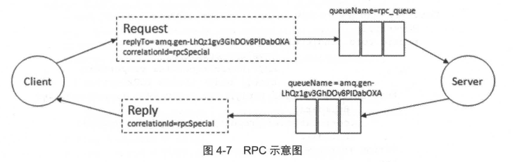

**根据图4-7所示， RPC的处理流程如下:**

1. 当客户端启动时，创建一个匿名的回调队列(名称由 RabbitMQ 自动创建，图 4-7 中 的回调队列为 amq.gen-LhQzlgv3GhDOv8PIDabOXA)。
2. 客户端为 RPC 请求设置 2 个属性 : replyTo 用来告知 RPC 服务端回复请求时的目的队列，即回调队列; correlationld 用来标记一个请求。
3. 请求被发送到 rpc_queue 队 列中。
4. **RPC 服务端监听 rpc_queue 队列中的请求，当请求到来时，服务端会处理并且把带有结果的消息发送给客户端 。 接收的队列就是 replyTo 设定的回调队列。**
5. 客户端监听回调队列，当有消息时，检查 correlationld 属性，如果与请求匹配，那就是结果了。

------

**下面沿用 RabbitMQ 官方网站的一个例子来做说明 ，RPC 客户端通过 RPC 来调用服务端的方法以便得到相应的斐波那契值。**

**首先是服务端的关键代码，代码清单 4-12所示。**

```java
import com.rabbitmq.client.*;

import java.io.IOException;

public class RPCServer {

    private static final String RPC_QUEUE_NAME = "rpc_queue";

    public static void main(String[] args) throws Exception {
        // 创建连接和通道
        ConnectionFactory factory = new ConnectionFactory();
        factory.setHost("localhost"); // RabbitMQ 服务器地址
        try (Connection connection = factory.newConnection(); 
             Channel channel = connection.createChannel()) {

            // 声明 RPC 队列
            channel.queueDeclare(RPC_QUEUE_NAME, false, false, false, null);
            channel.basicQos(1);  // 只处理一个任务，确保公平调度

            System.out.println(" [x] A waiting RPC requests ");

            // 创建消费者
          	// 3.服务器接收到请求后，计算 Fibonacci 数值，返回结果到客户端指定的回调队列。
            Consumer consumer = new DefaultConsumer(channel) {
                @Override
                public void handleDelivery(String consumerTag, Envelope envelope,
                                            AMQP.BasicProperties properties, byte[] body) throws IOException {
                    AMQP.BasicProperties replyProps = new AMQP.BasicProperties.Builder()
                            .correlationId(properties.getCorrelationId()) // 设置响应的 correlationId
                            .build();
                    String response = "";

                    try {
                        // 获取消息内容并处理
                        String message = new String(body, "UTF-8");
                        int n = Integer.parseInt(message);
                        System.out.println(" [.] fib(" + message + ")");
                        response += fib(n); // 调用 Fibonacci 函数计算
                    } catch (RuntimeException e) {
                        System.out.println(" [.] " + e.toString());
                    } finally {
                        // 发送响应消息
                        channel.basicPublish(
                                "",                 // 使用默认交换机
                                properties.getReplyTo(), // 回复的队列名
                                replyProps,         // 设置响应的属性
                                response.getBytes("UTF-8")
                        );
                        // 手动确认消息
                        channel.basicAck(envelope.getDeliveryTag(), false);
                    }
                }
            };

            // 开始消费 RPC 队列中的消息
            channel.basicConsume(RPC_QUEUE_NAME, false, consumer);
        }
    }

    // Fibonacci 函数
    private static int fib(int n) {
        if (n == 0) return 0;
        if (n == 1) return 1;
        return fib(n - 1) + fib(n - 2);
    }
}
```

1. **服务器**：服务器通过 `queueDeclare` 声明一个名为 `rpc_queue` 的队列，并监听来自客户端的请求。每当收到请求时，会调用 `fib` 方法来计算斐波那契数，并将结果返回给客户端。
2. **响应**：客户端发送请求时，指定一个 `replyTo` 队列来接收结果，服务器处理完后会将响应通过该队列返回。

**RPC客户端的关键代码如代码清单 4-13所示。**

```java
import com.rabbitmq.client.*;

public class RPCClient {

    private static final String RPC_QUEUE_NAME = "rpc_queue";

    public static void main(String[] args) throws Exception {
        // 创建连接和通道
        ConnectionFactory factory = new ConnectionFactory();
        factory.setHost("localhost");
        try (Connection connection = factory.newConnection(); 
             Channel channel = connection.createChannel()) {

            // 创建临时回调队列
            String callbackQueueName = channel.queueDeclare().getQueue();

            // 创建消费者来接收响应
            final String corrId = ...;
            Consumer consumer = new DefaultConsumer(channel) {
                @Override
                public void handleDelivery(String consumerTag, Envelope envelope,
                                            AMQP.BasicProperties properties, byte[] body) {
                    if (properties.getCorrelationId().equals(corrId)) {
                        String response = new String(body);
                        System.out.println(" [.] Got '" + response + "'");
                    }
                }
            };

            // 在回调队列上消费响应
          	// 步骤3: 客户端通过 `basicConsume` 来监听回调队列，一旦收到消息，就根据 `correlationId` 匹配并处理响应。
            channel.basicConsume(callbackQueueName, true, consumer);

            // 发送消息请求 Fibonacci 计算
          	// 步骤1：客户端向 `rpc_queue` 发送消息，带有 `replyTo` 属性指定回调队列 ，同时设置 `correlationId` 用于标识响应。
            String message = "10"; // 请求 Fibonacci(10)
            AMQP.BasicProperties props = new AMQP.BasicProperties.Builder()
                    .replyTo(callbackQueueName) // 设置回调队列
                    .correlationId(corrId) // 设置 correlationId
                    .build();

            channel.basicPublish("", RPC_QUEUE_NAME, props, message.getBytes("UTF-8"));
            System.out.println(" [x] Sent '" + message + "'");
        }
    }
}
```

在客户端中，你需要设置 `replyTo` 队列来接收响应，并传递 `correlationId` 来确保匹配正确的响应。

**RPC 整体流程：**

1. **客户端**：客户端向 `rpc_queue` 发送消息，带有 `replyTo` 属性指定回调队列 ，同时设置 `correlationId` 用于标识响应。
2. **服务器**：服务器接收到请求后，计算 Fibonacci 数值，返回结果到客户端指定的回调队列。
3. **客户端接收响应**：客户端通过 `basicConsume` 来监听回调队列，一旦收到消息，就根据 `correlationId` 匹配并处理响应。


## 4.7 持久化

持久化可以提高 RabbitMQ 的可靠性，以防在异常情况（重启、关闭、宕机等）下的数据丢失。RabbitMQ 的持久化分为三个部分：

1. 交换器的持久化
2. 队列的持久化
3. 消息的持久化 

**交换器的持久化**

+ 通过在声明交换器时将 durable 参数置为 true实现的，详细可以参考 3.2.1 节。
+ 如果交换器不设置持久化，那么在 RabbitMQ 服 务重启之后，相关的交换器元数据会丢失，不过消息不会丢失，只是不能将消息发送到这个交换器中了。
+ 对一个长期使用的交换器来说， 建议将其置为持久化的。

**队列的持久化**

+ 是通过在声明队列时将 durable 参数置为 true 实现的，详细内容可以参考 3.2.2 节 。 
+ 如果队列不设置持久化，那么在 RabbitMQ 服务重启之后，相关队列的元数据会丢失， 此时数据也会丢失。

**消息的持久化**

+ 队列的持久化能保证其本身的元数据不会因异常情况而丢失，但是并不能保证内部所存储的消息不会丢失。

+ 要确保消息不会丢失 ， 需要将其设置为持久化。通过将消息的投递模式 （BasicProperties 中的 deliveryMode 属性）设置为 2 即可实现消息的持久化。前面示例 中多次提及的 MessageProperties.

+ PERSISTENT_TEXT_PLAIN 实际上是封装了这个属性 :

  ```java
  import com.rabbitmq.client.BasicProperties;
  
  public class Example {
      public static final BasicProperties PERSISTENT_TEXT_PLAIN = new BasicProperties.Builder()
          .contentType("text/plain")   // 设置内容类型
          .deliveryMode(2)             // 设置持久性，2表示消息持久
          .build();                    // 构建 BasicProperties 实例
  }	
  ```

```java
// 发送消息
channel.basicPublish(
    "",                      // 默认交换机
    QUEUE_NAME,              // 队列名称
    PERSISTENT_TEXT_PLAIN,   // 消息属性，使用持久化和文本类型
    message.getBytes("UTF-8") // 消息内容，转换为字节数组
);
```

**更多发送消息的详细内容可以参考 3.3 节。**

设置了队列和消息的持久化，当 RabbitMQ 服务重启之后，消息依旧存在。

+ 单单只设置队 列持久化，重启之后消息会丢失；
+ 单单只设置消息的持久化，重启之后队列消失，继而消息也丢失。

**单单设置消息持久化而不设置队列的持久化显得毫无意义。**

------

**注意要点**

> 可以将所有的消息都设直为持久化，但是这样会严重影响 RabbitMQ 的性能（随机）。写入磁盘的速度比写入内存的速度慢得不只一点点。
>
> 对于可靠性不是那么高的消息可以不采用持久化处理以提高整体的吞吐量。在选择是否要将消息持久化时，需要在可靠性和吐吞量之间做一个权衡。

**将交换器、队列、消息都设置了持久化之后就能百分之百保证数据不丢失了吗?**

**答案是否定的 。**

1. 首先从消费者来说，如果在订阅消费队列时将 autoAck 参数设置为 true，那么当消费者接 收到相关消息之后，**还没来得及处理就看机了，这样也算数据丢失** 。这种情况很好解决，将 autoAck 参数设置为 false， 并进行手动确认，详细可以参考 3.5 节 。
2. 其次，在持久化的消息正确存入 RabbitMQ 之后，还需要有一段时间（虽然很短，但是不 可忽视）才能存入磁盘之中。 RabbitMQ 并不会为每条消息都进行同步存盘（调用内核的 fsyncl 方法）的处理，可能仅仅保存到操作系统缓存之中而不是物理磁盘之中。**如果在这段时间内 RabbitMQ 服务节点发生了岩机、重启等异常情况，消息保存还没来得及落盘，那么这些消息将会丢失。**

> fsync在 Linux 中的意义在于同步数据到存储设备上。
>
> 大多数块设备的数据都是通过缓存进行的，将数据写到文件上通常将该数据由内核复制到缓存中，如果缓存尚未写满，则不将其排入输出队列上，而是等待其写满或者当内核需要重用该缓存时，再将该缓存排入输出队列，进而同步到设备上 。
>
> 这种策略的好处是减少了磁盘读写次数，不足的地方是降低了文件内容的更新速度，使其不能时刻同步到存储设备上， 当系统发生故障时，这种机制很有可能导致了文件内容的丢失。因此，内核提供了 fsync 接口，用户可以根据自己的需要通过此接口更新数据到存储设备上。

**这个问题怎么解决呢？**

+ 这里可以引入 RabbitMQ 的镜像队列机制（详细参考 9.4节），相当于配置了副本，如果主节点 （master） 在此特殊时间内挂掉，可以自动切换到从节点 （slave ），这样有效地保证了高可用性，除非整个集群都挂掉。
+ 虽然这样也不能完全保证 RabbitMQ 消息不丢失，但是配置了镜像队列要比没有配置镜像队列的可靠性要高很多，**在实际生产环境中的关键业务队列一般都会设置镜像队列。**

+ 除此之外，还可以在发送端引入**事务机制或者发送方确认机制** 来保证消息己经正确地发送并存储至 RabbitMQ 中，前提还要保证在调用 channel.basicPublish 方法的时候交换器能够将消息 正确路由到相应的队列之中。

详细可以参考下一节。


## 4.8 生产者确认

在使用 RabbitMQ 的时候，可以通过消息持久化操作来解决因为服务器的异常崩溃而导致 的消息丢失。除此之外，我们还会遇到一个问题：

**当消息的生产者将消息发送出去之后，消息到底有没有正确地到达服务器呢？**

+ 如果不进行特殊配置，默认情况下发送消息的操作是不会返回任何信息给生产者的，也就是默认情况下生产者是不知道消息有没有正确地到达服务器。
+ **如果在消息到达服务器之前己经丢失，持久化操作也解决不了这个问题，因为消息根本没有到达服务器 ，何谈持久化？**

RabbitMQ 针对这个问题，提供了两种解决方式: 

+ 通过事务机制实现
+ 通过发送方确认 （publisher confirm）机制实现。

#### 4.8.1 事务机制

RabbitMQ 客户端中与事务机制相关的方法有三个：

1. channel.txSelect ：用于将当前的信道设置成事务模式
2. channel.txCommit：用于提交事务 
3. channel.txRollback：用于事务回滚

在通过 channel.txSelect 方法开启事务之后，我们便可以发布消息给 RabbitMQ 了， 如果事务提交成功，则消息一定到达了 RabbitMQ 中，如果在事务提交执行之前由于 RabbitMQ 异常崩溃或者其他原因抛出异常，这个时候我们便可以将其捕获，进而通过执行 channel . txRollback 方法来实现事务回夜。

**注意这里的 RabbitMQ 中的事务机制与大多数数据库中的事务概念井不相同，需要注意区分。**

**关键示例代码如代码清单 4-14 所示。**

```java
// 开始事务
channel.txSelect();

// 发送消息
channel.basicPublish(
    EXCHANGE_NAME,            // 交换机名称
    ROUTING_KEY,              // 路由键
    MessageProperties.PERSISTENT_TEXT_PLAIN, // 消息属性，确保消息持久化
    "transaction messages".getBytes("UTF-8") // 消息内容
);

// 提交事务
channel.txCommit();
```

上面代码对应的 AMQP 协议流转过程如图 4-8 所示。

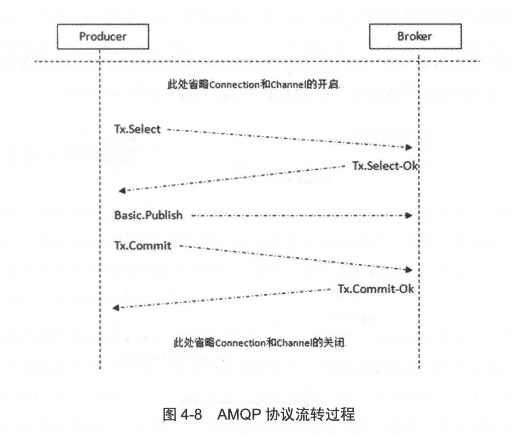

可以发现开启事务机制与不开启（参考图 2-10） 相比多了四个步骤:

1. 客户端发送 Tx.Select，将信道置为事务模式；
2. Broker 回复 Tx.Select-Ok，确认己将信道置为事务模式；
3. 在发送完消息之后，客户端发送 Tx.Commit 提交事务；
4. Broker 回复 Tx.Commit-Ok，确认事务提交。

上面所陈述的是正常的情况下的事务机制运转过程，而事务回滚是什么样子呢？我们先来参考下面一段示例代码（代码清单4-15），来看看怎么使用事务回滚。

```java
try {
    // 开始事务
    channel.txSelect();
    channel.basicPublish(
      EXCHANGE_NAME,            // 交换机名称
      ROUTING_KEY,              // 路由键
      MessageProperties.PERSISTENT_TEXT_PLAIN, // 消息属性，确保消息持久化
      "transaction messages".getBytes("UTF-8") // 消息内容
    );
    int result = 1 / 0;
    channel.txCommit();
    System.out.println(" [x] Sent 'transaction messages'");
} catch (Exception e) {
    // 发生异常时打印异常并回滚事务
    e.printStackTrace();
    channel.txRollback(); // 回滚事务
}
```

上面代码中很明显有一个 java.lang.ArithmeticException，在事务提交之前捕获到异常，之后显式地提交事务回滚，其 AMQP 协议流转过程如图 4-9 所示。

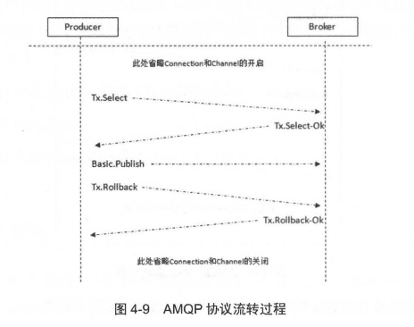

**如果要发送多条消息，则将 channel.basicPublish 和 channel.txCommit 等方法包裹进循环内即可，可以参考如下示例代码（代码清单 4-16）。**

```java
// 开始事务
channel.txSelect();

// 发送消息循环
for (int i = 0; i < LOOP_TIMES; i++) {
  try {
    // 发送消息
    channel.basicPublish(EXCHANGE_NAME, ROUTING_KEY, null, ("messages" + i).getBytes());

    // 提交事务
    channel.txCommit();
  } catch (IOException e) {
    // 如果发送消息失败，打印异常并回滚事务
    e.printStackTrace();
    channel.txRollback();
  }
}
```

**事务确实能够解决消息发送方和 RabbitMQ 之间消息确认的问题，只有消息成功被 RabbitMQ 接收，事务才能提交成功，否则便可在捕获异常之后进行事务回滚，与此同时可以进行消息重发。**

>在 RabbitMQ 中，如果你在事务操作过程中遇到 `txCommit()` 失败，通常会抛出一个异常。这个失败会发生在尝试提交事务时，而不是在消息发布时。
>
>事务提交失败的原因：
>
>1. **网络问题**：如果在事务提交时遇到网络中断或 RabbitMQ 服务不可用，`txCommit()` 可能会失败。
>2. **服务器故障**：如果 RabbitMQ 在事务提交期间发生崩溃或重启，事务提交也会失败。
>3. **资源问题**：如果 RabbitMQ 的资源（如内存、磁盘等）不足，可能会导致事务提交失败。
>
>处理 `txCommit()` 失败：
>
>在 RabbitMQ 中，`txCommit()` 本身可能会抛出异常。如果提交失败，你通常会收到一个异常，例如 `IOException` 或 `AMQPException`。这些异常表明提交事务时发生了问题，你可以在 `catch` 块中捕获并处理这个异常。
>
>如何处理 `txCommit()` 失败：
>
>1. **回滚事务**：在捕获 `txCommit()` 失败的异常时，你可以回滚事务，确保在事务中的所有操作都被撤销。
>2. **重试机制**：如果是临时的网络问题或其他偶发问题，你可以在捕获异常后尝试重试提交事务。
>3. **记录日志**：在捕获到异常时，你可以记录详细的日志信息，帮助后续排查问题。

------

**但是使用事务机制会吸干 RabbitMQ 的性能，那么有没有更好的方法既能保证消息发送方确认消息已经正确送达，又能基本上不带来性能上的损失呢？**

+ 从 AMQP 协议层面来看并没有更好的办法，但是 RabbitMQ 提供了一个改进方案 ，即发送方确认机制，详情请看下一 节的介绍。


#### 4.8.2 发送方确认机制

**前面介绍了 RabbitMQ 可能会遇到的一个问题，即消息发送方（生产者）并不知道消息是否真正地到达了 RabbitMQ。**

+ 采用事务机制实现会严重降低 RabbitMQ 的消息吞吐量
+ **这里引入了一种轻量级的方式：发送方确认 publisher confirm 机制 **

生产者将信道设置成 confirm 模式，一旦信道进入 confirm 模式：

1. 所有在该信道上面发布的消息都会被指派一个唯一的 ID（从 1 开始）。
2. 一旦消息被投递到所有匹配的队列之后， RabbitMQ 就会发送一个确认 （Basic.Ack） 给生产者（包含消息的唯一 ID），这就使得生产者知晓消息已经正确到达了目的地了。

3. 如果消息和队列是可持久化的，那么确认消息会在消息写入磁盘之后发出。 

**RabbitMQ 回传给生产者的确认消息中的 deliveryTag 包含了确认消息的序号，此外 RabbitMQ 也可以设置 channel.basicAck 方法中的 multiple 参数，表示到这个序号之前的所有消息都己经得到了处理，可以参考图 4-10。**

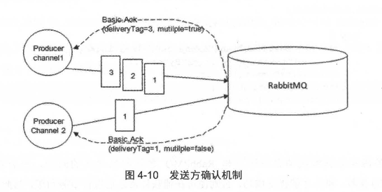

------

事务机制在一条消息发送之后会使发送端阻塞，以等待 RabbitMQ 的回应，之后才能继续 发送下一条消息。相比之下，发送方确认机制最大的好处在于它是异步的，一旦发布一条消息，生产者应用程序就可以在等信道返回确认的同时继续发送下一条消息：

+ 当消息最终得到确认之后，生产者应用程序便可以通过回调方法来处理该确认消息；
+ 如果 RabbitMQ 因为自身内部错误导致消息丢失，就会发送一条 nack （Basic.Nack）命令，生产者应用程序同样可以在回调方法中处理该 nack 命令。

生产者通过调用 channel.confirmSelect 方法（即 Confirm.Select 命令）将信道设置为 confirm 模式，之后 RabbitMQ 会返回 Confirm.Select-Ok 命令表示同意生产者将当前信道设置为 confirm 模式 。

所有被发送的后续消息都被 ack 或者 nack 一次，不会出现一条消息既被 ack 又被 nack 的情况 ，并且 RabbitMQ 也并没有对消息被 confirm 的快慢做任何保证。

**下面看一下 publisher confirm 机制怎么运作，简要代码如代码清单 4-17 所示。**

```java
import com.rabbitmq.client.*;

public class PublisherConfirmExample {

    private static final String EXCHANGE_NAME = "exchange";
    private static final String ROUTING_KEY = "routingKey";

    public static void main(String[] args) throws Exception {
        // 创建连接工厂并创建连接
        ConnectionFactory factory = new ConnectionFactory();
        factory.setHost("localhost");
        try (Connection connection = factory.newConnection();
             Channel channel = connection.createChannel()) {

            // 开启 Publisher Confirms 模式
            channel.confirmSelect();

            // 发送消息
            channel.basicPublish(EXCHANGE_NAME, ROUTING_KEY, null, "publisher confirm test".getBytes());

            // 等待消息确认
            if (!channel.waitForConfirms()) {
                System.out.println("send message failed");
                // 可以在这里进行其他处理，例如重试、记录日志等
            }

            System.out.println("Message sent successfully!");

        } catch (InterruptedException e) {
            e.printStackTrace();
        }
    }
}
```

如果发送多条消息，只需要将 channel.basicPublish 和 channel.waitForConfirms 方法包裹在循环里面即可，可以参考事务机制，不过不需要把 channel.confirmSelect 方法包裹在循环内部。

------

**在 publisher confirm 模式下发送多条消息的 AMQP 协议流转过程可以参考图 4-11 。**

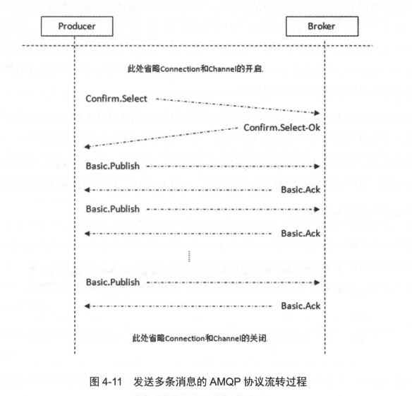

对于 channel.waitForConfirms 而言，在 RabbitMQ 客户端中它有 4 个同类的方法:

```java
boolean waitForConfirms() throws InterruptedException;
boolean waitForConfirms(long timeout) throws InterruptedException, TimeoutException;
void waitForConfirmsOrDie() throws IOException, InterruptedException;
void waitForConfirmsOrDie(long timeout) throws IOException, InterruptedException , TimeoutException ;
```

**业务代码可以根据自身的特性灵活地运用这四种方法来保障消息的可靠发送，其对应的特点如下：**

1. 如果信道没有开启 publisher confirm 模式，则调用任何 waitForConfirms 方法都会报出 `java.lang.illegalStateException`。
2. 对于没有参数的 waitForConfirms 方法来说， 其返回的条件是客户端收到了相应的 Basic.Ack/.Nack 或者被中断。
3. 参数 timeout 表示超时时间，一旦等待 RabbitMQ 回应超时就会抛出 java.util.concurrent.TimeoutException 的异常。
4. 两个 waitForConfirmsOrDie 方法在接收到 RabbitMQ 返回的 Basic.Nack 之后会抛出 java.io.IOException。

**RabbitMQ 引入了 publisher confirm 机制来弥补事务机制的缺陷，提高了整体的吞吐量。**

------

```java
// 开启 Publisher Confirms 模式
channel.confirmSelect();

// 发送消息
channel.basicPublish(EXCHANGE_NAME, ROUTING_KEY, null, "publisher confirm test".getBytes());

// 等待消息确认
if (!channel.waitForConfirms()) {
  System.out.println("send message failed");
  // 可以在这里进行其他处理，例如重试、记录日志等
}
```

**对于上述的代码， publisher confirm 与事务机制相比， QPS 井没有提高多少，难道是 RabbitMQ 欺骗了我们？**

+ 可以发现 publisher confirm 模式是每发送一条消息后就调用 channel.waitForConfirms 方法，之后等待服务端的确认，这实际上是一种串行同步等待的方式。
+ 事务机制和它一样，发送消息之后等待服务端确认，之后再发送消息。两者的存储确认原理相同，尤其对于持久化的消息来说，两者都需要等待消息确认 **落盘** 之后才会返回**（调用 Linux 内核的 fsync 方法）** 。
+ 在同步等待的方式下，publisher confirm 机制发送一条消息需要通信交互的命令是 2 条：`Basic.Publish` 和 `Basic.Ack`; 事务机制是 3 条：`Basic.Publish`、 `Tx.Commmit/.Commit-Ok` （或者 `Tx.Rollback/.Rollback-Ok`），事务机制多了一个命令帧报文的交互，所以 QPS 会略微下降。

> **注意要点:**
>
> 1. 事务机制和 publisher firm 机制两者是互斥的，不能共存。如果企图将已开启事务模式的信道再设直为 publisher confirm 模式，RabbitMQ 会报错；或者如果企图将已开启 publisher confum 模式的信道再设直为事务模式， RabbitMQ 也会报错。
>
> 2. 事务机制和 publisher confirm 机制确保的是消息能够正确地发送至 RabbitMQ，这里的 **"发送至 RabbitMQ" 的含义是指消息被正确地发往至 RabbitMQ 的交换器** ，如果此交换器没有匹配的队列，那么消息也会丢失。所以在使用这两种机制的时候要确保所涉及的交换器能够有匹配的队列， 更进一步地讲，发送方要配合 mandatory 参数或者备份交换器一起使用来提高消息传输的可靠性。

------

**publisher confirm 的优势在于并不一 定需要同步确认。这里我们改进了一下使用方式，总结有如下两种:**

+ 批量 confirm 方法：每发送一批消息后，调用 channel.waitForConfirms 方法，等待服务器的确认返回 。
+ 异步 confirm 方法：提供一个回调方法，服务端确认了一条或者多条消息后客户端会回调这个方法进行处理。


#### 4.8.3 批量 confirm

在批量 confirm 方法中，客户端程序需要定期或者定量（达到多少条），亦或者两者结合起 来调用 channel.waitForConfirms 来等待 RabbitMQ 的确认返回。

> 相比于前面示例中的普通 confirm 方法，批量极大地提升了 confirm 的效率。
>
> 但是问题在于出现返回 Basic.Nack 或者超时情况时，客户端需要将这一批次的消息全部重发，这会带来明显的重复消息数量，并且当消息经常丢失时，批量 confirm 的性能应该是不升反降的。

**批量 confirm 方法的示例代码如代码清单 4-18 所示 。**

```java
import com.rabbitmq.client.*;

import java.io.IOException;
import java.util.ArrayList;
import java.util.List;

public class PublisherConfirmBatch {

    private static final String EXCHANGE_NAME = "exchange";
    private static final String ROUTING_KEY = "routingKey";
    private static final int BATCH_COUNT = 100;  // 每批次的消息数
    private static final String MESSAGE = "batch confirm test";

    public static void main(String[] args) {
        // 创建连接工厂并创建连接
        ConnectionFactory factory = new ConnectionFactory();
        factory.setHost("localhost");

        try (Connection connection = factory.newConnection();
             Channel channel = connection.createChannel()) {

            // 开启 Publisher Confirms 模式
            channel.confirmSelect();

            // 用于缓存消息的容器
            List<byte[]> messageCache = new ArrayList<>();
            int msgCount = 0;

            while (true) {
                // 发送消息
                byte[] message = MESSAGE.getBytes();
                channel.basicPublish(EXCHANGE_NAME, ROUTING_KEY, null, message);

                // 将发送的消息存入缓存
                messageCache.add(message);
                msgCount++;

                // 达到批量发送数量时，等待确认
                if (msgCount >= BATCH_COUNT) {
                    msgCount = 0;  // 重置消息计数

                    try {
                        // 等待确认并清空缓存
                        if (channel.waitForConfirms()) {
                            System.out.println("Batch of messages confirmed successfully!");
                            messageCache.clear();  // 清空缓存
                        }
                    } catch (InterruptedException e) {
                        e.printStackTrace();
                        // 如果确认失败，可以重新发送缓存中的消息
                        System.out.println("Waiting for confirm was interrupted.");
                        resendMessages(channel, messageCache);
                    } catch (IOException e) {
                        e.printStackTrace();
                        // 如果发送失败，重新发送缓存中的消息
                        System.out.println("Error while waiting for confirm.");
                        resendMessages(channel, messageCache);
                    }
                }
            }

        } catch (IOException | TimeoutException e) {
            e.printStackTrace();
        }
    }

    // 重新发送缓存中的消息
    private static void resendMessages(Channel channel, List<byte[]> messageCache) {
        for (byte[] msg : messageCache) {
            try {
                channel.basicPublish(EXCHANGE_NAME, ROUTING_KEY, null, msg);
            } catch (IOException e) {
                e.printStackTrace();
                System.out.println("Failed to resend message.");
            }
        }
    }
}

```


#### 4.8.4 异步 confirm

异步 confirm 方法的编程实现最为复杂。

在客户端 Channel 接口中提供的 addConfirmListener 方法可以添加 ConfirmListener 这个回调接口，这个 ConfirmListener 接口包含两个方法： **handleAck 和 handleNack，分别用来处理 RabbitMQ 回传的 Basic.Ack 和 Basic.Nack。**

+ 这两个方法中都包含有一个参数 deliveryTag （在 publisher confirm模式下用来标记消息的唯一有序序号）。
+ 我们需要为每一个信道维护一个 "unconfirm" 的消息序号集合 ， 每发送一条消息，集合中的元素加 1。每当调用 ConfirmListener 中的 handleAck 方法时 ， "unconfirm" 集合中删掉相应的一条 （multiple 设置为 false）或者多条（multiple 设置为 true）记录。 
+ 从程序运行效率上来看，这个 "unconfirm" 集合最好采用有序集合 SortedSet 的存储结构。事实上，Java客户端 SDK 中的 waitForConfirms 方法也是通过 SortedSet 维护消息序号的。

**代码清单 4-19 为我们演示了异步 confirm 的编码实现，其中的 confirmSet 就是一个 SortedSet 类型的集合。**

```java
import com.rabbitmq.client.*;

import java.io.IOException;
import java.util.TreeSet;

public class PublisherConfirmWithListener {

    private static final String EXCHANGE_NAME = "exchange";
    private static final String ROUTING_KEY = "routingKey";
    private static final String MESSAGE = "batch confirm test";

    public static void main(String[] args) throws Exception {
        // 创建连接工厂并创建连接
        ConnectionFactory factory = new ConnectionFactory();
        factory.setHost("localhost");

        try (Connection connection = factory.newConnection();
             Channel channel = connection.createChannel()) {

            // 开启 Publisher Confirms 模式
            channel.confirmSelect();

            // 用于存储待确认的消息的序列号
            TreeSet<Long> confirmSet = new TreeSet<>();

            // 注册确认监听器
            channel.addConfirmListener(new ConfirmListener() {

                // 处理 ACK 确认
                @Override
                public void handleAck(long deliveryTag, boolean multiple) throws IOException {
                    System.out.println("Ack, SeqNo: " + deliveryTag + ", multiple: " + multiple);
                    if (multiple) {
                        // 如果是多个消息被确认，移除所有小于等于 deliveryTag 的序列号
                        confirmSet.headSet(deliveryTag + 1).clear();
                    } else {
                        // 移除当前的序列号
                        confirmSet.remove(deliveryTag);
                    }
                }

                // 处理 NACK 拒绝
                @Override
                public void handleNack(long deliveryTag, boolean multiple) throws IOException {
                    System.out.println("Nack, SeqNo: " + deliveryTag + ", multiple: " + multiple);
                    if (multiple) {
                        // 如果是多个消息被拒绝，移除所有小于等于 deliveryTag 的序列号
                        confirmSet.headSet(deliveryTag + 1).clear();
                    } else {
                        // 移除当前的序列号
                        confirmSet.remove(deliveryTag);
                    }
                    // 处理消息重发的场景
                    resendMessages(channel, deliveryTag);
                }
            });

            // 发送消息的循环
            while (true) {
                // 获取下一个发布的消息序列号
                long nextSeqNo = channel.getNextPublishSeqNo();

                // 发送消息到指定交换机和路由键
                channel.basicPublish(EXCHANGE_NAME, ROUTING_KEY, 
                        MessageProperties.PERSISTENT_TEXT_PLAIN, MESSAGE.getBytes());

                // 将消息的序列号添加到 confirmSet 中
                confirmSet.add(nextSeqNo);

                // 等待一定时间或执行其他任务
                // 这里可以根据需要添加逻辑来暂停或限制发送频率
            }

        } catch (IOException | TimeoutException e) {
            e.printStackTrace();
        }
    }

    // 处理消息重发的场景
    private static void resendMessages(Channel channel, long failedSeqNo) {
        try {
            System.out.println("Resending message with SeqNo: " + failedSeqNo);
            // 这里你可以根据需要选择重发特定消息
            // 如果需要重发消息，可以使用记录的消息内容以及相关信息来重新发送
            // 示例：重新发送之前的消息（这里需要根据实际情况调整重发策略）
            channel.basicPublish(EXCHANGE_NAME, ROUTING_KEY, 
                    MessageProperties.PERSISTENT_TEXT_PLAIN, "retry message".getBytes());
        } catch (IOException e) {
            e.printStackTrace();
        }
    }
}
```

在生产者端，`Basic.Ack` 和 `Basic.Nack` 都是由 RabbitMQ 发送的，用于告知生产者关于消息投递的状态。生产者通过这两种机制可以知道消息是否成功到达 RabbitMQ 的队列并被正确处理。

- **`Basic.Ack`**：表示消息成功投递，生产者可以确认该消息已经成功到达并被 RabbitMQ 正常处理。
- **`Basic.Nack`**：表示消息投递失败，生产者需要采取相应的操作（例如重试投递消息）。生产者需要根据该信息决定是否重新投递该消息或执行其他错误处理逻辑。

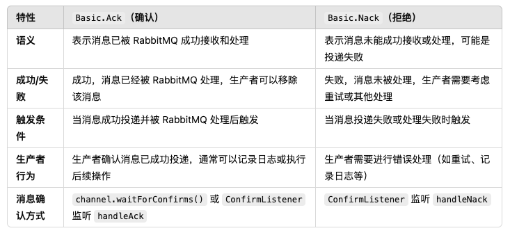

------

**使用技巧：**

**批量 confirm 方式的问题在于遇到 RabbitMQ 服务端返回 Basic.Nack 需要重发批量消息而导致的性能降低。异步 confirm 方式编程模型最为复杂，而且和批量 confirm 方式一样需要在客户端维护状态。在实际生产环境中采用何种方式，这里就仁者见仁智者见智了，不过强烈建议读者使用异步 confirm 的方式 。**


## 4.9 消费端要点介绍

**3.4节和 3.5节介绍了如何正确地消费消息：**

+ 消费者客户端可以通过推模式或者拉模式的方式来获取井消费消息，当消费者处理完业务逻辑需要手动确认消息己被接收，这样 RabbitMQ 才能把当前消息从队列中标记清除。
+ 当然如果消费者由于某些原因无法处理当前接收到的消息，可以通过 channel.basicNack 或者 channel.basicReject 来拒绝掉 。

**这里对于 RabbitMQ 消费端来说，还有几点需要注意:**

1. 消息分发
2.  消息顺序性
3. 弃用 QueueingConsumer

#### 4.9.1 消息分发

**当 RabbitMQ 队列拥有多个消费者时，队列收到的消息将以轮询的分发方式 发送给消费者；每条消息只会发送给订阅列表里的一个消费者。**

1. 这种方式非常适合扩展，而且它是专门为并发程序设计的。如果现在负载加重，那么只需要创建更多的消费者来消费处理消息即可。
2. 很多时候轮询的分发机制也不是那么优雅。试想一下，如果某些消费者任务繁重，来不及消费那么多的消息，而某些其他消费者由于某些原因（比如业务逻辑简单、机器性能卓越等）很快地处理完了所分配到的消息，进而进程空闲，这样就会造成整体应用吞吐量的下降。

**那么该如何处理轮询导致的这种情况呢？**

这里就要用到 `channel.basicQos(int prefetchCount)` 这个方法，如前面章节所述， channel.basicQos 方法允许限制信道上的消费者所能保持的最大未确认消息的数量。

**举例说明:**

1. 在订阅消费队列之前，消费端程序调用了 channel.basicQos(5) ，之后订阅了某个队列进行消费。 
2. RabbitMQ 会保存一个消费者的列表，每发送一条消息都会为对应的消费者计数，如果达到了所设定的上限，那么 RabbitMQ 就不会向这个消费者再发送任何消息。 
3. 直到消费者确认了某条消息之后 ，RabbitMQ将相应的计数减 1 ，之后消费者可以继续接收消息直到再次到达计数上限。这种机制可以类比于TCP 中的滑动窗口。

**注意要点： Basic.Qos 的使用对于拉模式的消费方式无效。**

------

对于一个信道来说，它可以同时消费多个队列，当设置了 prefetchCount 大于 0 时，这个 信道需要和各个队列协调以确保发送的消息都没有超过所限定的 prefetchCount 的值，这样会使 RabbitMQ 的性能降低，尤其是这些队列分散在集群中的多个 Broker 节点之中。

**RabbitMQ 为了提升相关的性能，在 AMQP 协议之上重新定义了 global 这个参数，对比如表 4-1 所示。**

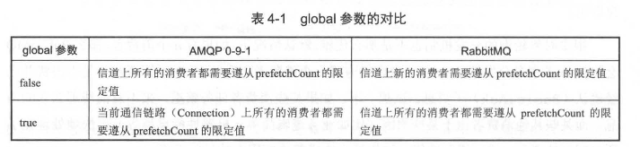

**前面章节中的 channel.basicQos 方法的示例都是针对单个消费者的，而对于同一个信道上的多个消费者而言，如果设置了 prefetchCount 的值，那么都会生效。**

**下面的代码中有两个消费者，各自的能接收到的未确认消息的上限都为 10。**

```java
Channel channel = ...;
Consumer consumer1 = ...;
Consumer consumer2 = ...;
channel.basicQos(10); // Per consumer 1imit
channel.basicConsume("my-queue1", false, consumer1);
channel.basicConsume("my-queue2", false, consumer2);
```

**如果在订阅消息之前，既设置了 global 为 true 的限制，又设置了 global 为 false 的限制，那么哪个会生效呢？**

RabbitMQ 会确保两者都会生效。举例说明：

1. 当前有两个队列 queue1 和 queue2
2. queue1 有 10 条消息，分别为 1 到 10
3. queue2 也有 10 条消息，分别为 11 到 20

有两个消费者分别消费这两个队列，代码如下：

```java
Channel channel = ...;
Consumer consumer1 = ...;
Consumer consumer2 = ...;
channel.basicQos(3, false); // Per consumer 1imit
channel.basicQos(5, true); // Per channel 1imit
channel.basicConsume("queue1", false, consumer1);
channel.basicConsume("queue2", false, consumer2);
```

**那么这里每个消费者最多只能收到 3 个未确认的消息，两个消费者能收到的未确认的消息 个数之和的上限为 5。**

> 在未确认消息的情况下，如果 consumer1 接收到了消息 1、 2 和 3，那么 consumer2至多只能收到 11和 12。
>
> 如果像这样同时使用两种 global 的模式，则会增加 RabbitMQ 的负载，因为 RabbitMQ 需要更多的资源来协调完成这些限制。如无特殊需要，最好只使用 global 为 false 的设置，这也是默认的设置。


#### 4.9.2 消息顺序性

消息的顺序性是指消费者消费到的消息和发送者发布的消息的顺序是一致的。

> 举个例子，不考虑消息重复的情况，如果生产者发布的消息分别为 msg1、msg2、msg3，那么消费者必然也是按照 msg1、msg2、msg3 的顺序进行消费的。

**目前很多资料显示 RabbitMQ 的消息能够保障顺序性，这是不正确的，或者说这个观点有很大的局限性:**

+ 在不使用任何 RabbitMQ 的高级特性 ，也没有消息丢失、网络故障之类异常的情况发生，并且只有一个消费者的情况下，最好也只有一个生产者的情况下可以保证消息的顺序性。
+ 如果有多个生产者同时发送消息，无法确定消息到达 Broker 的前后顺序，也就无法验证消息的顺序性。

**那么哪些情况下 RabbitMQ 的消息顺序性会被打破呢？下面介绍几种常见的情形：**

1. 如果生产者使用了事务机制，在发送消息之后遇到异常进行了事务回滚，那么需要重新补偿发送这条消息，如果补偿发送是在另一个线程实现的，那么消息在生产者这个源头就出现了错序。
2. 同样，如果启用 publisher comfirm 时，在发生超时、中断，又或者是收到 RabbitMQ 的 Basic.Nack 命令时，那么同样需要补偿发送，结果与事务机制一样会错序。
3.  如果生产者发送的消息设置了不同的超时时间，井且也设置了死信队列， 整体上来说相当于一个延迟队列，那么消费者在消费这个延迟队列的时候，消息的顺序必然不会和生产者发送消息的顺序一致。
4. 如果消息设置了优先级，那么消费者消费到的消息也必然不是顺序性的 。

**包括但不仅限于以上几种情形会使 RabbitMQ 消息错序 。** 

**如果要保证消息的顺序性，需要业务方使用 RabbitMQ 之后做进一步的处理，比如在消息体内添加全局有序标识（类似 Sequence ID）来实现。**


#### 4.9.3 弃用 QueueingConsumer

 QueueingConsumer 本身有几个大缺陷 ，需要读者在使用时特别注意:

1. 内存溢出的问题：如果由于某些原因，队列之中堆积了比较多的消息，就可能导致消费者客户端内存溢出假死，于是发生恶性循环，队列消息不断堆积而得不到消化 。原因是 QueueingConsumer 内部使用了无限制的 LinkedList 作为数据结构。
   + 内存溢出的问题可以使用 ` Basic.Qos` 来得到有效的解决，Basic.Qos 可以限制某个消费者所保持未确认消息的数量 ，也就是间接地限制了 QueueingConsumer 中的LinkedBlockingQueue 的大小 。
   + 注意一定要在调用 Basic.Consume 之前调用 Basic.Qos才能生效。

2. QueueingConsumer 会拖累同一个 Connection 下的所有信道，使其性能降低
3. 同步递归调用 QueueingConsumer 会产生死锁
4. RabbitMQ 的自动连接恢复机制不支持 Queueing Consumer 的这种形式
5. QueueingConsumer 不是事件驱动的。 

**为了避免不必要的麻烦，建议在消费的时候尽量使用继承 DefaultConsumer 的方式。**


## 4.10 消息可靠传输

**消息可靠传输一般是业务系统接入消息中间件时首要考虑的问题，一般消息中间件的消息传输保障分为三个层级。**

+ At most once：最多一次。消息可能会丢失，但绝不会重复传输 。
+ At least once：最少一次。消息绝不会丢失，但可能会重复传输。
+ Exactly once：恰好一次。每条消息肯定会被传输一次且仅传输一次。

RabbitMQ 支持其中的最多一次和最少一次。

**其中最少一次投递实现需要考虑以下这个几个方面的内容：**

1. 消息生产者需要开启事务机制或者 publisher confirm 机制，以确保消息可以可靠地传输到 RabbitMQ 中。
2. 消息生产者需要配合使用 mandatory 参数或者备份交换器来确保消息能够从交换器路由到队列中，进而能够保存下来而不会被丢弃。
3. 消息和队列都需要进行持久化处理，以确保 RabbitMQ 服务器在遇到异常情况时不会造成消息丢失 。
4. 消费者在消费消息的同时需要将 autoAck 设置为 false，然后通过手动确认的方式去确认己经正确消费的消息，以避免在消费端引起不必要的消息丢失。 

**最多一次的方式就无须考虑以上那些方面，生产者随意发送，消费者随意消费，不过这样很难确保消息不会丢失。**

------

**恰好一次是 RabbitMQ 目前无法保障的：**

**考虑这样一种情况：**

1. 消费者在消费完一条消息之后向 RabbitMQ 发送确认 Basic.Ack 命令，此时由于网络断开或者其他原因造成 RabbitMQ 并没有收到这个确认命令，那么 RabbitMQ 不会将此条消息标记删除。
2. 在重新建立连接之后， 消费者还是会消费到这一条消息，这就造成了重复消费。

**再考虑一种情况：**

1. 生产者在使用 publisher confirm 机制的时候，发送完一条消息等待 RabbitMQ 返回确认通知，此时网络断开
2.  生产者捕获到异常情况，为了确保消息可靠性选择重新发送，这样 RabbitMQ 中就有两条同样的消息，在消费的时候，消费者就会重复消费 。

**那么 RabbitMQ有没有去重的机制来保证 "恰好一次" 呢？答案是并没有，不仅是 RabbitMQ， 目前大多数主流的消息中间件都没有消息去重机制，也不保障"恰好一次"。**

**去重处理一般是在业务客户端实现，建议在实际生产环境中，业务方根据自身的业务特性进行去重，比如业务消息本身幂等性，或者借助 Redis 等其他产品进行去重处理。**


## 4.11 小结

**提升数据可靠性有以下一些途径:** 

1. 设置 mandatory 参数或者备份交换器
2. 设置 publisher confirm 机制或者事务机制
3. 设置交换器、队列和消息都为持久化
4. 设置消费端对应的 autoAck 参数为 false 井在消费完消息之后再进行消息确认。

**本章不仅介绍了数据可靠性的一些细节，还展示了 RabbitMQ 的几种己具备或者衍生的高级特性：**

1. TTL
2. 死信队列
3. 延迟队列
4. 优先级队列
5. RPC 功能

**这些功能在实际使用中可以让相应应用的实现变得事半功倍 。**