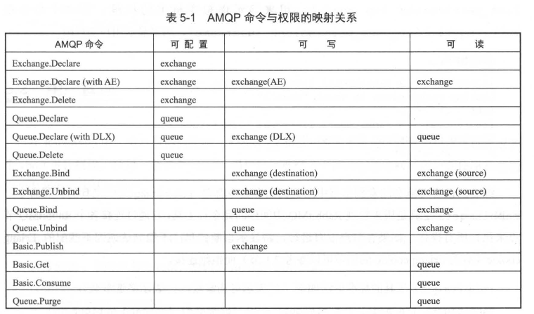
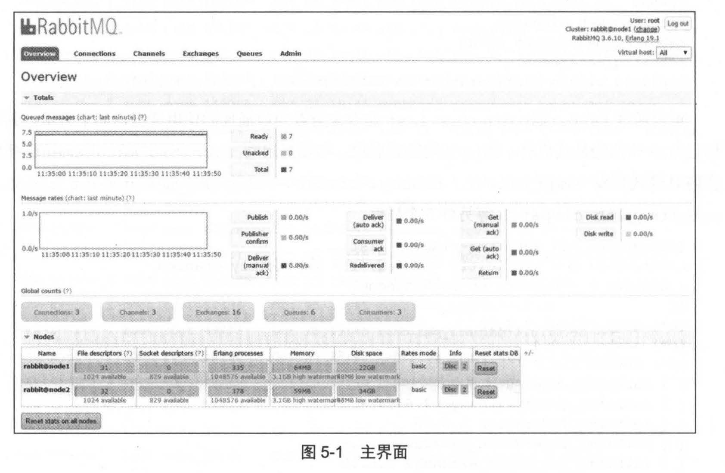
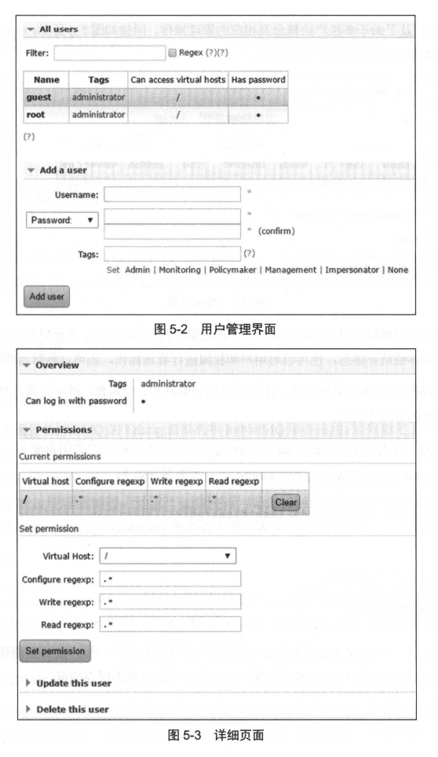
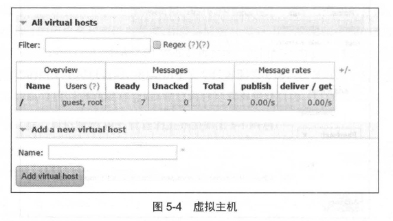

# 第五章 RabbitMQ 管理

到目前为止，我们可以熟练地使用客户端程序来发送和消费消息，但是距离掌控 RabbitMQ 还有一段距离。本章会从服务端的角度介绍 RabbitMQ 的一些工具应用，包括 rabbitmqctl 工具和 rabbitmq management 插件。 

+ rabbitmqctl 工具是一个系列的工具，运用这个工具可以执行大部分的 RabbitMQ 的管理操作。
+ 而 rabbitmq management 插件是 RabbitMQ 提供的一个管理插件，让用户可以通过图形化的方式来管理 RabbitMQ。

### 5.1 多租户与权限

**每一个 RabbitMQ 服务器都能创建虚拟的消息服务器，我们称之为虚拟主机 virtualhost，简称为 vhost。 vhost 的相关特点如下：**

1. 每一个 vhost 本质上是一个独立的小型 RabbitMQ 服务器，拥有自己独立的队列、 交换器及绑定关系等，井且它拥有自己独立的权限。
2. vhost 就像是虚拟机与物理服务器一样，它们在各个实例间提供逻辑上的分离，为不同程序安全保密地运行数据，它既能将同一个 RabbitMQ 中的众多客户区分开，又可以避免队列和交换器等命名冲突。
3. vhost 之间是绝对隔离的，无法将 vhost1 中的交换器与 vhost2 中的队列进行绑定，这样既保证了安全性，又可以确保可移植性。
4. 如果在使用 RabbitMQ 达到一定规模的时候，建议用户对业务功能、场景进行归类区分，并为之分配独立的 vhost。

**vhost 是 AMQP 概念的基础，客户端在连接的时候必须制定一个 vhost。**

RabbitMQ 默认创建的 vhost 为 "/"，如果不需要多个 vhost 或者对 vhost 的概念不是很理解，那么用这个默认的 vhost 也是非常合理的，使用默认的用户名 guest 和密码 guest 就可以访问它。

------

1. 新建 vhost ： `rabbitmqctl add_vhost vhost1`
2. 查看 vhost: `rabbitmqctl list_vhosts name tracing`

3. 删除 vhost: `rabbitmqctl delete_vhost vhost1`

------

**AMQP 协议中并没有指定权限在 vhost 级别还是在服务器级别实现，由具体的应用自定义。**

+ 在 RabbitMQ 中，权限控制则是以 vhost 为单位的 。
+ 当创建一个用户时，用户通常会被指派给至少一个 vhost，并且只能访问被指派的 vhost 内的队列、交换器和绑定关系等。
+ 因此，RabbitMQ 中的授予权限是指在 vhost 级别对用户而言的权限授予 。

**相关的授予权限命令为: `rabbitmqctl set_permissions [-p vhost] {user) {conf) {write) {read)`。其中各个参数的含义如下所述。**

1.  vhost：授予用户访问权限的 vhost 名称，可以设置为默认值，即 vhost 为 "/" 
2. user：可以访问指定 vhost 的用户名
3. conf：一个用于匹配用户在哪些资源上拥有可配置权限的正则表达式。
4. write： 一个用于匹配用户在哪些资源上拥有可写权限的正则表达式。
5. read： 一个用于匹配用户在哪些资源上拥有可读权限的正则表达式 。

> 可配直指的是队列和交换器的创建及删除之类的操作；可写指的是发布消息；可读指与消息有关的操作，包括读取消息及清空整个队列等。

**表 5-1 中展示了不同 AMQP 命令的列表和对应的权限。**



授予 root 用户可访问虚拟主机 vhost1，并在所有资源上都具备可配置、可写及可读的权限,示例如下:

```
[root@node1 ~] rabbitmqctl set_permissions -p vhost1 root ".*" ".*" ".*"
Setting permissions for user "root" in vhost "vhostl"
```

授予 root 用户可访问虚拟主机 vhost2， 在以 "queue" 开头的资源上具备可配置权限， 并在所有资源上拥有可写、可读的权限，示例如下:

```
[root@node1 ~] rabbitmqctl set_permissions -p vhost2 root "queue.*" ".*" ".*"
Setting permissions for user "root" in vhost "vhost2"
```

清除权限也是在 vhost 级别对用户而言的。清除权限的命令为 `rabbitmqctl clear_permissions [-p vhost] {username}`。 其中 vhost 用于设置禁止用户访问的虚拟主机的名称 ， 默认为`/`；username 表示禁止访问特定虚拟主机的用户名称 。

```
[root@node1 ~] rabbitmqctl clare_permissions -p vhost1 root 
Clearing permissions for user "root" in vhost "vhost1"
```

在 RabbitMQ 中有两个 Shell 命令可以列举权限信息。第一个命令是 `rabbitmqctl list permissions [-p vhost]`，用来显示虚拟主机上的权限;第二个命令是 `rabbitmqctl list _user_permissions {username} ` ，用来显示用户的权限。

```
[root@node1 ~] rabbitmqctl list_permissions -p vhost1 
Listing permissions in vhost "vhostl"
root .* .* .*


[root@node1 ~] rabbitmqctl list_user_permissions root 
Listing permissions for user "root"
/ .* .* .*
vhost1 .* .* .*
```

rabbitmqctl 工具的标准语法如下( [] 表示可选参数， {}表示必选参数):

```
rabbitmqctl [-n node] [-t timeout] [-q] (command) [command options...]
```

对于 [- node]：默认节点是"rabbit@hostname"，此处的 hostname 是主机名称。在一个名为 node.hidden.com 的主机上， RabbitMQ 节点的名称通常是 rabbit@node。

 hostname -s 命令的输出通常是"@"标志后的东西。


### 5.2 用户管理

在 RabbitMQ 中，用户是访问控制的基本单元，且单个用户可以跨越多个 vhost 进行授权。针对一至多个 vhost，用户可以被赋予不同级别的访问权限，并使用标准的用户名和密码来认证用户。

1. 创建用户：`rabbitmqctl add_user root root123`
2. 更改用户密码：`rabbitmqctl change_password root root123`

3. 清除密码：`rabbitmqctl clear_password root`

4. 验证用户和密码：`rabbitmqctl authenticate_user root root123`

5. 删除用户：`rabbitmqctl delet_user root`
6. 列出所有用户：`rabbitmqctl list_users`

用户的角色分为 5 种类型：

1. none：无任何角色。新创建的用户的角色默认为 none。
2. management：可以访问 Web 管理页面，Web 管理页面在 5.3 节中会有详细介绍 。
3. policymaker：包含 management 的所有权限，并且可以管理策略 (Policy) 和参数 (Parameter)。详细内容可参考 6.3 节。
4. monitoring：包含 management 的所有权限，并且可以看到所有连接、信道及节点相关的信息。
5. administartor：包含 monitoring 的所有权限，井且可以管理用户、 虚拟主机、 权限、策略、参数等，administator 代表了最高的权限 。

**用户的角色可以通过 `rabbitmqctl set user_tags {username} {tag ..}`命令设置 。** 

```
[root@nodel ~] #rabbitmqctl set_user_tags root policymaker, management
setting tags for user "root" to ['policymaker,management']

[root@nodel ~] #rabbitmqctl list_users -q
guest [administrator]
root [policymaker,management]
```


### 5.3 Web 端管理

为了能够运行 rabbitmqctl 工具，当前的用户需要拥有访问 Erlang cookie 的权限，由于服务器可能是以 guest 或者 root 用户身份来运行的，因此你需要获得这些文件的访问权限 ，这样就引申出来一些权限管理的问题。

RabbitMQ 的开发团队 也考虑到了这种情况，并且开发了 RabbitMQ management 插件 。

> RabbitMQ management 插件可以提供 Web 管理界面用来管理如前面所述的虚拟主机 、用户等，也可以用来管理队列、交换器 、绑定关系、策略、 参数等 ，还可以用来监控 RabbitMQ 服务的状态及一些数据统计类信息，可谓是功能强大，基本上能够涵盖所有 RabbitMQ 管理的功能。

在使用 Web 管理界面之前需要先启用 RabbitMQ management 插件：

```
rabbitmq-plugins enable rabbitmq_management
```

除此之外，可以通过 rabbitmq-plugins list 命令来查看当前插件的使用情况。

**之后就可以通过浏览器访问 http://localhost:15672/。这样会出现一个认证登录的界面，可以通过默认的 guest/guest 的用户名和密码来登录。**



#### 5.3.1 用户操作



#### 5.3.2 vhost 操作



对于 Web 管理页面的其他功能，比如创建和删除队列、交换器、绑定关系、参数和策略等 操作会在后面的介绍中提及。


### 5.4 应用与集群管理

本节主要阐述应用与集群相关的一些操作管理命令，包括关闭、重置、 开启服务，还有建立集群的一些信息。有关集群搭建更多的信息可以参考 7.1 节。

#### 5.4.1 应用管理

1. 停止运行 RabbitMQ 的 Erlang虚拟机和 RabbitMQ服务应用：`rabbitmqctl stop`
2. 停止运行 RabbitMQ 的 Erlang虚拟机和 RabbitMQ服务应用：`rabbitmqctl shutdown`
3. 停止 RabbitMQ 服务应用，但是 Erlang 虚拟机还是处于运行状态: `rabbitmqctl stop_app`
4. 启动 RabbitMQ 应用: `rabbitmqctl start_app`
5. 等待 RabbitMQ 应用的启动：`rabbitmqctl wait [pid_file]`
6. 将 RabbitMQ 节点重置还原到最初状态。包括从原来所在的集群中删除此节点，从管理数据库中删除所有的配置数据，如己配置的用户、vhost 等，以及删除所有的持久化消息：`rabbitmqctl reset`
7. 强制将 RabbitMQ 节点重置还原到最初状态 : `rabbitmqctl force_reset`
8. 指示 RabbitMQ 节点轮换日志文件：`rabbitmqctl rotate_logs {suffix}`

> 示例如下所示，原日志文件为 rabbit@nodel.log 和 rabbit@nodel-sasl.log。 轮换日志之后， 原日志文件中的内容就被迫加到 rabbit@nodel.log.1 和 rabbit@nodel-sasl.log.1 日志中，之后重新建立 rabbit@nodel.log 和 rabbit@nodel-sasl.log 文件用来接收新的日志。

#### 5.4.2 集群管理

1. 将节点加入指定集群中，在这个命令执行前需要停止 RabbitMQ 应用井重置节点：`rabbitmqctl join_cluster {cluster_node} [--ram]`
2. 显示集群的状态：`rabbitmqctl cluster_status`
3. 修改集群节点的类型，在这个命令执行前需要停止 RabbitMQ 应用：`rabbitmqctl change_cluster_node_type {disc|ram}`
4. 将节点从集群中删除，允许离线执行: `rabbitmqctl forget_cluster_node`
5. 在集群中的节点应用启动前咨询 clusternode节点的最新信息，井更新相应的集群信息:  `rabbitmqctl update_cluster_nodes {clusternode}`

> 这个和 join cluster 不同，它不加入集群。考虑这样一种情况 ， 节点 A 和节点 B 都在集群中，当节点 A 离线了，节点 C 又和节点 B 组成了一个集群，然后节点 B 又离开了集群 ， 当 A 醒来的时候，它会尝试联系节点 B，但是这样会失败 ， 因为节点 B 己经不在集群中了。

`Rabbitmqctl  update_cluster_nodes -n A C `  可以解决这种场景下出现的问题。

6. 确保节点可以启动，即使它不是最后一个关闭的节点：`rabbitmqctl force_boot`

7. 指示未同步队列 queue 的 slave 镜像可以同步 master镜像行的内容: `rabbitmqctl sync_queue [-p vhost]{queue}` ； 同步期间此队列会被阻塞(所有此队列的生产消费者都会被阻塞)，直到同步完成。
8. 设置集群名称： `rabbit set_cluster_name {name}`

> 集群名称在客户端连接时会通报给客户端。 Federation 和 Shovel 插件也会有用到集群名称的地方，详细内容可以参考第 8 章。集群名称默认是集群中第一个节点的名称， 通过这个命令可以重新设置。在 Web 管理界面的右上角(可参考图 5-1)有个 "change" 的地方，点击也可以修改集群名称。


### 5.5 服务端状态

#### 5.5.1 队列状态

```
rabbitmqctl list_queues [-p vhost] [queueinfoitem...]
```

此命令返回队列的详细信息，如果无 [-p vhost] 参数，将显示默认的 vhost 为 "/" 中的队列详情 。 

queueinfoitem 参数用于指示哪些队列的信息项会包含在结果集中，结果集的列顺序将匹配参数的顺序 。queueinfoitem 可以是下面列表中的任何值：

1. **name**：队列的名称。
2. **durable**：队列是否持久化。`true` 表示队列持久化，`false` 表示队列非持久化。
3. **auto_delete**：队列是否自动删除。`true` 表示队列在没有消费者时自动删除，`false` 表示队列永远存在，直到显式删除。
4. **arguments**：队列的参数，通常包括与消息持久化、延迟消息等相关的配置。
5. **policy**：应用到队列上的策略名称，通常用于管理队列的生命周期、消息过期等。
6. **pid**：队列关联的 Erlang 进程的 ID。
7. **owner_pid**：处理排他队列连接的 Erlang 进程 ID。如果队列是非排他的，则此值为空。
8. **exclusive**：队列是否是排他的。`true` 表示队列是排他的，`false` 表示队列是共享的。
9. **exclusive_consumer_pid**：订阅到排他队列的消费者相关的信道关联的 Erlang 进程 ID。如果队列是非排他的，则此值为空。
10. **exclusive_consumer_tag**：订阅到排他队列的消费者的 `consumerTag`，如果队列是非排他的，则此值为空。
11. **messages_ready**：准备发送给消费者的消息个数。
12. **messages_unacknowledged**：发送给消费者但尚未应答的消息个数。
13. **messages**：准备发送给消费者和未应答消息的总和。
14. **messages_ready_ram**：驻留在内存中的 `messages_ready` 的消息个数。
15. **messages_unacknowledged_ram**：驻留在内存中的 `messages_unacknowledged` 的消息个数。
16. **messages_ram**：驻留在内存中的消息总数。
17. **persistent**：队列中持久化消息的个数。对于非持久化队列，值总是 0。
18. **bytes**：队列中所有消息的大小总和，不包括消息属性或其他附加数据。
19. **messages_bytes_ready**：准备发送给消费者的消息的大小总和。
20. **messages_bytes_unacknowledged**：发送给消费者但尚未应答的消息的大小总和。
21. **messages_bytes_ram**：驻留在内存中的 `messages_bytes`。
22. **messages_bytes_persistent**：队列中持久化消息的字节数。
23. **disk_reads**：从队列启动开始，已从磁盘中读取该队列的消息总次数。
24. **disk_writes**：从队列启动开始，已向磁盘队列写入消息的总次数。
25. **consumer_count**：消费者的数量。
26. **consumer_utilisation**：队列中的消息能够立即投递给消费者的比率，介于 0 和 1 之间，受网络拥塞或 `Basic.Qos` 限制影响。
27. **memory**：与队列相关的 Erlang 进程所消耗的内存字节数，包括栈、堆及内部结构。
28. **slave_pids**：如果队列是镜像的，列出所有镜像的 Erlang 进程 ID。
29. **synchronised_slave_pids**：如果队列是镜像的，列出所有已同步的镜像的 Erlang 进程 ID。
30. **state**：队列的状态。正常情况下是 `running`；如果队列正在同步数据，可能会显示 `{syncing, MsgCount}`；如果队列所在的节点掉线，队列会显示为 `down`，此时大部分队列信息将不可用。

**你可以列出所有队列的相关信息（例如名称、持久性、消息数量等）：**

```
rabbitmqctl list_queues name durable auto_delete messages messages_ready messages_unacknowledged messages_bytes
```

该命令将显示所有队列的以下信息：

- `name`：队列名称
- `durable`：队列是否持久化
- `auto_delete`：队列是否自动删除
- `messages`：队列中的消息数量
- `messages_ready`：准备发送给消费者的消息数量
- `messages_unacknowledged`：已发送但未确认的消息数量
- `messages_bytes`：队列中消息的总字节数

**如果你想查看某个特定队列（例如名为 `my_queue`）的详细信息，可以使用以下命令：**

```
rabbitmqctl list_queues name durable auto_delete arguments policy messages messages_ready messages_unacknowledged state -p /my_vhost
```

这会列出队列 `my_queue` 在虚拟主机 `/my_vhost` 下的相关信息。

**如果你想查看队列的磁盘读取/写入次数以及内存消耗，可以使用：**

```
rabbitmqctl list_queues name disk_reads disk_writes memory -p /my_vhost
```

这将显示队列的：

- `disk_reads`：从磁盘读取消息的次数
- `disk_writes`：向磁盘写入消息的次数
- `memory`：队列进程消耗的内存字节数


#### 5.5.2 交换器状态

`rabbitmqctl list_exchanges` 命令用于列出所有交换器（exchanges）的详细信息。如果不指定 `-p vhost` 参数，则默认显示当前虚拟主机（vhost）下的交换器信息。

```
rabbitmqctl list_exchanges [-p vhost] [exchangeinfoitem...]
```

- `-p vhost`：指定虚拟主机名称，默认为 `/`。如果你的 RabbitMQ 配置中有多个虚拟主机，可以使用此选项来查询指定虚拟主机下的交换器。
- `[exchangeinfoitem...]`：你可以指定要显示的交换器信息项，多个信息项可以用空格分隔。如果不指定该参数，默认只显示交换器的名称和类型。

在执行 `rabbitmqctl list_exchanges` 命令时，你可以选择显示一些与交换器相关的详细信息。这些信息项与客户端代码中声明交换器时所用的参数基本一致。常用的信息项包括：

1. **name**：交换器的名称。
2. **type**：交换器的类型。常见的交换器类型包括 `direct`、`fanout`、`topic` 和 `headers`。
3. **durable**：是否持久化交换器。`true` 表示交换器持久化，意味着交换器的信息会被写入磁盘并在 RabbitMQ 重启时保留；`false` 表示交换器非持久化，重启后会丢失。
4. **auto_delete**：是否自动删除交换器。`true` 表示当交换器没有任何队列绑定时，交换器会被自动删除；`false` 表示交换器会一直存在，直到显式删除。
5. **internal**：是否为内置交换器。`true` 表示这是一个内置的交换器，通常由 RabbitMQ 内部使用；`false` 表示该交换器是应用层创建的。
6. **arguments**：交换器的额外参数。这些参数通常用于配置交换器的某些特殊行为。例如，`alternate-exchange` 参数用来指定备用交换器。
7. **policy**：应用于交换器的策略名称。例如，可以应用负载均衡、消息路由等策略。

如果没有指定 `exchangeinfoitem`：

如果你没有指定 `exchangeinfoitem` 参数，默认情况下，命令会显示交换器的 **名称** 和 **类型**。这些是最基本的信息，可以帮助你了解交换器的基本结构。

1. **列出所有交换器的名称和类型**：

   ```
   rabbitmqctl list_exchanges
   ```

2. **列出指定虚拟主机中的交换器信息**： 假设你有一个名为 `my_vhost` 的虚拟主机，你可以使用 `-p` 参数来指定虚拟主机。

   ```
   rabbitmqctl list_exchanges -p my_vhost
   ```

3. **列出交换器的详细信息**（包括名称、类型、持久化、自动删除等）：

   ```
   rabbitmqctl list_exchanges name type durable auto_delete arguments
   ```

4. **列出所有交换器的详细信息，并且应用特定策略**：

   ```
   rabbitmqctl list_exchanges name type durable auto_delete policy
   ```


#### 5.5.3 绑定状态

`rabbitmqctl list_bindings` 命令用于列出 RabbitMQ 中的所有绑定关系。绑定关系是指交换器（Exchange）与队列（Queue）之间的关联，它定义了消息从交换器如何路由到队列。

```
rabbitmqctl list_bindings [-p vhost] [bindinginfoitem ...]
```

- `-p vhost`：指定虚拟主机的名称。如果不指定，默认会显示 `/`（根虚拟主机）下的绑定关系。
- `[bindinginfoitem...]`：你可以指定要显示的绑定信息项，可以包含一个或多个。例如，`source name`（源名称）、`destination name`（目标名称）等。

你可以指定多个信息项来定制你想查看的绑定细节。常用的绑定信息项包括：

1. **source name**：绑定中消息的来源（通常是交换器的名称）。
2. **source kind**：消息来源的类别或类型（例如 `exchange` 类型的源）。
3. **destination name**：绑定中消息的目的地（通常是队列的名称）。
4. **destination kind**：消息目的地的种类（例如 `queue` 类型的目标）。
5. **routing key**：绑定的路由键（routing key）。用于决定消息如何从交换器路由到队列。
6. **arguments**：绑定时的其他参数。比如，`x-match` 参数（用于指定匹配规则），`alternate-exchange` 等。

如果没有指定任何 `bindinginfoitem`，该命令将返回所有绑定关系的完整信息，包括交换器与队列之间的绑定信息。

假设我们有一个 RabbitMQ 集群，并运行以下命令：

```
rabbitmqctl list_bindings -q
```

这将列出所有绑定关系，其中每一行表示一个交换器和队列之间的绑定。`-q` 参数用于让输出更简洁（每行一个绑定关系）。

例如，输出可能如下所示：

```
exchangel queue1 queue queue1 []
exchange queue2 queue queue2 []
exchange queue1 queue queue1 rkl []
```

输出解释：

- 第一行：`exchangel` 交换器与 `queue1` 队列通过默认的绑定关系进行绑定。
- 第二行：`exchange` 交换器与 `queue2` 队列通过默认的绑定关系进行绑定。
- 第三行：`exchange` 交换器与 `queue1` 队列通过 `rkl` 路由键进行绑定。


#### 5.5.4 信道状态

**command**: `rabbitmqctl list_connections [connectioninfoitem ...]`

这个命令返回所有当前的 TCP/IP 连接的统计信息。`connectioninfoitem` 是一个可选的参数，用来指定你想查看哪些连接信息。多个信息项可以以空格分隔，结果集的列顺序将与参数的顺序匹配。

**connectioninfoitem 参数**：你可以指定以下信息项来定制返回的结果：

1. **pid**：与该连接相关的 Erlang 进程 ID。
2. **name**：连接的名称。
3. **port**：服务器端口。
4. **host**：服务器的主机名或 IP 地址（通常是通过反向 DNS 查询得到的）。
5. **peer port**：服务器对端端口（当客户端与服务器连接时，服务器会记录客户端的端口号）。
6. **ssl**：是否启用了 SSL 加密。
7. **ssl protocol**：SSL 协议版本（如 TLSv1）。
8. **ssl key exchange**：SSL 密钥交换算法（如 RSA）。
9. **ssl cipher**：SSL 加密算法（如 AES 256 CBC）。
10. **ssl hash**：SSL 哈希算法（如 SHA1）。
11. **peer cert_subject**：对端 SSL 安全证书的主题信息（按照 X.500 格式显示）。
12. **peer cert issuer**：对端 SSL 安全证书的发行者信息（按照 X.500 格式显示）。
13. **peer cert validity**：对端 SSL 安全证书的有效期。
14. **state**：连接的当前状态，可能的值包括：`starting`、`running`、`flow`、`blocked`、`closing`、`closed` 等。
15. **channels**：该连接上的信道数。
16. **protocol**：使用的 AMQP 协议版本（如 0-9-1 或 0-8-0）。
17. **auth mechanism**：使用的 SASL 认证机制（如 PLAIN、AMQPLAIN、EXTERNAL）。
18. **user**：与连接相关的用户名。
19. **vhost**：与连接相关的虚拟主机（vhost）名称。
20. **timeout**：连接的超时时间或心跳间隔（单位为秒）。
21. **frame max**：最大传输帧大小（单位为字节）。
22. **channel max**：最大信道数。如果设置为 0，则表示无限制。
23. **client properties**：连接时客户端发送的属性信息。
24. **recv oct**：接收到的字节数。
25. **recv cnt**：接收到的数据包个数。
26. **send oct**：发送的字节数。
27. **send cnt**：发送的数据包个数。
28. **send pend**：待发送队列的大小。
29. **connected at**：连接建立的时间戳。

**默认显示项**： 如果没有指定 `connectioninfoitem` 参数，则默认会返回以下信息：

- **user**：用户名
- **peer host**：对端主机（客户端主机名或 IP）
- **peer port**：对端端口
- **state**：连接状态

假设你输入以下命令：

```
rabbitmqctl list_connections name port host state
```

那么返回的结果会包括：

- **name**：连接的名称
- **port**：服务器端口
- **host**：服务器的主机名或 IP 地址
- **state**：连接的当前状态（如 "running" 或 "closed"）

------

**command**: `rabbitmqctl list_channels [channelinfoitem ...]`

这个命令返回当前所有信道的统计信息。你可以通过指定 `channelinfoitem` 参数，选择要显示的特定信息项。返回的结果将按照你指定的参数顺序排列。

**channelinfoitem 参数**：你可以指定以下信息项来定制返回的结果：

1. **pid**：与该信道相关的 Erlang 进程 ID。
2. **connection**：信道所属连接的 Erlang 进程 ID。
3. **name**：信道的名称。
4. **number**：信道的序号（每个信道都有一个唯一的编号）。
5. **user**：与信道相关的用户名称（即创建该信道的用户）。
6. **vhost**：与信道相关的虚拟主机（vhost）名称。
7. **transactional**：信道是否处于事务模式。如果该值为 `true`，则表示信道当前处于事务模式。
8. **confirm**：信道是否处于 publisher confirm 模式。如果该值为 `true`，表示信道在发布消息时需要确认。
9. **consumer count**：当前信道上连接的消费者数量。
10. **messages unacknowledged**：已经投递但是还未被 `ack` 确认的消息数量。
11. **messages uncommitted**：已接收到但尚未提交事务的消息数量。
12. **acks uncommitted**：已收到的 `ack` 消息，但尚未提交事务的数量。
13. **messages unconfirmed**：已发送但尚未确认的消息数量。如果信道不处于 publisher confirm 模式下，这个值为 0。
14. **prefetch count**：新的消费者的 Qos（质量服务）个数限制，表示每个消费者在确认之前可以消费的最大消息数。如果该值为 `0`，则表示没有上限。
15. **global prefetch count**：整个信道的 Qos 个数限制，即所有消费者的消息数总和的限制。如果该值为 `0`，表示没有上限。

**默认显示项**： 如果没有指定 `channelinfoitem` 参数，默认会返回以下信息：

- **pid**：信道的 Erlang 进程 ID。
- **user**：与信道相关的用户名。
- **consumer count**：当前信道上消费者的数量。
- **messages unacknowledged**：已投递但尚未被 `ack` 确认的消息数量。

以下是命令的使用示例：

1. **默认显示的示例**：

   ```
   rabbitmqctl list_channels -q
   ```

   输出的结果会显示每个信道的 **pid**、**user**、**consumer count** 和 **messages unacknowledged** 等信息。

2. **指定 `pid` 和 `connection` 显示的示例**：

   ```
   rabbitmqctl list_channels pid connection -q
   ```

   输出的结果将显示每个信道的 **pid** 和 **connection**（即信道所属的连接的 Erlang 进程 ID）。


#### 5.5.5 其他状态

这段文字描述了 **RabbitMQ** 的几个管理命令及其用途，主要包括 `list_consumers`、`status`、`node_health_check`、`environment` 和 `report` 等命令。以下是每个命令的详细含义和用途：

1. **`rabbitmqctl list_consumers [-p vhost]`**

- **用途**：列举当前的消费者信息。

- 参数：

  - `-p vhost`：指定虚拟主机（vhost），如果没有指定，默认为默认虚拟主机（default）。

- 输出：每行输出显示一个订阅队列的详细信息，信息项由制表符分隔，通常包括：

  - **队列名称**：消费者订阅的队列名称。
  - **信道进程标识**：信道的 Erlang 进程 ID。
  - **consumerTag**：消费者标识符。
  - **是否需要消费端确认**：是否启用了消费者确认（`true` 或 `false`）。
  - **prefetch_count**：每个消费者的最大 QoS 消息限制数。
  - **参数列表**：其他相关参数。

- 示例输出：

  ```
  rabbitmqctl list_consumers -p default -q queue4
  ```

  输出示例：

  ```
  <rabbit@node1.1.1628.11>    consumer    zzh    true    0    []
  ```

2. **`rabbitmqctl status`**

- **用途**：显示 RabbitMQ broker 的状态。
- **输出**：显示当前 Erlang 节点上运行的应用程序、RabbitMQ 的 Erlang 版本、操作系统的名称、内存使用情况、文件描述符统计信息等。
- **示例**： 运行该命令时，输出会包括类似以下内容：
  - Erlang 节点信息。
  - RabbitMQ 版本。
  - 系统内存使用情况。
  - 系统文件描述符统计。
  - 节点是否正常运行等信息。

3. **`rabbitmqctl node_health_check`**

- **用途**：对 RabbitMQ 节点进行健康检查，确认节点是否正常运行。

- 输出：检查是否存在问题，并返回健康检查的结果。

  - 如果健康检查通过，输出：`Health check passed`。
  - 如果检查失败，输出详细的错误信息。

- 示例：

  ```
  rabbitmqctl node_health_check
  ```

  输出示例：

  ```
  Timeout: 70.0 seconds
  Checking health of node rabbit@node1
  Health check passed
  ```

4. **`rabbitmqctl environment`**

- **用途**：显示 RabbitMQ 的运行环境和每个环境变量的名称和值。

- **输出**：列出当前运行的环境变量及其对应的值，例如系统配置、RabbitMQ 配置参数、Erlang 环境变量等。

- **示例**： 运行该命令时，输出可能类似：

  ```
  RABBITMQ_LOGS=/var/log/rabbitmq
  RABBITMQ_NODE_PORT=5672
  RABBITMQ_CONFIG_FILE=/etc/rabbitmq/rabbitmq.conf
  ...
  ```

5. **`rabbitmqctl report`**

- **用途**：生成 RabbitMQ 服务器的状态报告，并将其输出到文件。

- **输出**：生成一个包含 RabbitMQ 节点状态、队列、连接、信道、消费者等信息的报告文件。报告会输出到指定的文件中（如 `report.txt`）。

- 示例：

  ```
  rabbitmqctl report > report.txt
  ```

  该命令将生成的报告输出到 

  ```
  report.txt
  ```

   文件中，文件包含 RabbitMQ 节点的状态、配置信息等详细内容。

这些命令用于 RabbitMQ 的管理和诊断：

- `list_consumers`：列出所有消费者的信息。
- `status`：查看 RabbitMQ broker 的状态。
- `node_health_check`：检查 RabbitMQ 节点的健康状况。
- `environment`：显示当前 RabbitMQ 运行的环境变量。
- `report`：生成 RabbitMQ 服务器的状态报告。

这些工具对于 RabbitMQ 管理员在进行故障排除、性能监控或配置检查时非常有用。


### 5.6 HTTP API 接口管理（可忽略）

 **RabbitMQ Management 插件** 提供的 **HTTP API 接口**，使得用户能够通过 API 调用来管理 RabbitMQ 的各项资源，比如队列的创建、删除、修改等操作。除了通过 Web 界面进行管理，RabbitMQ 还提供了方便的 RESTful API，可以使用 HTTP 请求对 RabbitMQ 进行操作。

1. **RabbitMQ Management 插件的功能**：

- **Web 管理界面**：RabbitMQ 提供了一个基于 Web 的管理界面，允许用户通过浏览器访问和管理 RabbitMQ 系统。这个界面可以查看队列、交换机、消费者、连接、消息等信息，并进行相关的操作。
- **HTTP API 接口**：除了 Web 界面，RabbitMQ 还通过 RESTful API 提供了一种程序化方式来操作 RabbitMQ。通过调用这些 API，用户可以完成类似创建队列、发布消息、获取队列信息等操作。

2. **创建队列的 API 调用**：

- 创建队列可以通过 **HTTP PUT 请求** 来实现，具体的 URL 格式为：

  ```
  /api/queues/vhost/name
  ```

  其中，`vhost` 是虚拟主机的名称，`name` 是队列的名称。

- **示例：使用 `curl` 命令创建队列**： 该示例展示了如何使用 `curl` 命令通过 HTTP API 创建一个名为 `queue` 的队列，属于虚拟主机 `vhost`，并指定队列的一些属性：

  ```
  curl -i -u root:root123 -H "Content-Type: application/json" -X PUT -d '{"auto_delete": false, "durable": true, "node": "rabbit@node2"}' http://192.168.0.2:15672/api/queues/%2F/queue
  ```

  - `-i`：显示响应的 HTTP 头部信息。
  - `-u root:root123`：用 `root` 用户和 `root123` 密码进行认证。
  - `-H "Content-Type: application/json"`：指定请求头为 JSON 格式。
  - `-X PUT`：使用 PUT 方法（用于创建或更新资源）。
  - `-d '{"auto_delete": false, "durable": true, "node": "rabbit@node2"}'`：指定队列的属性。此处 `auto_delete` 为 `false`（即该队列不会在没有消费者时自动删除），`durable` 为 `true`（即队列在 RabbitMQ 重启后依然存在），`node` 指定该队列所在的节点。
  - `http://192.168.0.2:15672/api/queues/%2F/queue`：这是 API 接口的地址，`%2F` 是虚拟主机（`/`）的 URL 编码，表示默认虚拟主机（`/`）。

- **响应**： 如果队列创建成功，返回一个 **HTTP 201 Created** 的响应，表示资源已成功创建。响应的头部信息如下：

  ```
  HTTP/1.1 201 Created
  Server: Cowboy
  Date: Fri, 25 Aug 2017 06:03:17 GMT
  Content-Length: 0
  Content-Type: application/json
  Vary: accept, accept-encoding, origin
  ```

  其中，`HTTP/1.1 201 Created` 表示队列已成功创建，`Content-Length: 0` 表示响应体为空，因为创建队列时不需要返回具体的数据内容。


### 5.7 小结

本章主要围绕 RabbitMQ 的管理功能展开，涵盖了多租户管理、权限控制、用户管理、应用配置、集群管理和服务端状态监控等方面。所有这些操作都可以通过 `rabbitmqctl` 一系列命令行工具进行管理。作为 RabbitMQ 中最复杂的 CLI 管理工具，`rabbitmqctl` 提供了丰富的命令，几乎涵盖了所有的管理功能，读者可以将本章内容作为 `rabbitmqctl` 工具的使用手册来查阅和参考。

此外，本章还重点介绍了 **RabbitMQ Management 插件**。该插件不仅提供了图形化的管理界面，方便用户进行操作，还具备了强大的监控功能。更重要的是，`rabbitmq_management` 插件还提供了 HTTP API 接口，供用户方便地进行编程调用。后续章节（如第 7.4 和 7.5 节）将详细讲解如何使用这些 API 接口完成特定功能。