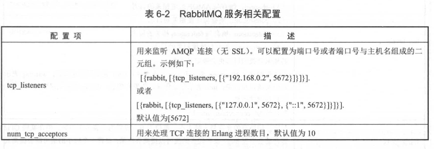
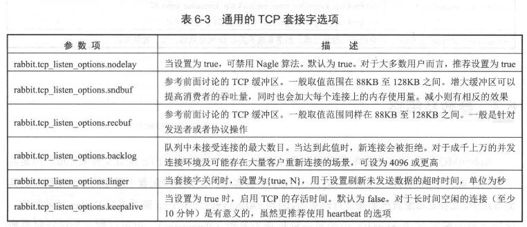

# 第六章 RabbitMQ 配置

通常情况下，RabbitMQ 可以使用默认的内建配置来正常运行，大多数情况下无需修改其配置。然而，为了更好地定制和优化 RabbitMQ 的运行，用户可以根据需求调整一些系统参数。

RabbitMQ 提供了三种主要方式来进行定制化配置：

1. **环境变量 (Environment Variables)**：通过设置环境变量来调整 RabbitMQ 服务端的参数，比如节点名称、RabbitMQ 配置文件的路径、节点间通信端口等。
2. **配置文件 (Configuration File)**：在配置文件中可以定义 RabbitMQ 服务和插件的设置，诸如 TCP 监听端口、网络相关的设置、内存和磁盘限制等。
3. **运行时参数和策略 (Runtime Parameters and Policies)**：在运行时，可以设置集群级别的服务参数和策略。

需要注意的是，具体的配置方法和配置文件位置可能因操作系统或 RabbitMQ 安装包的不同而有所不同，在配置时应特别关注相关细节。


## 6.1 环境变量

RabbitMQ 的环境变量以 "RABBITMQ_" 开头，可以通过两种方式进行配置：在 Shell 环境中设置，或通过 `rabbitmq-env.conf` 文件进行配置。如果是在非 Shell 环境中配置，则需要去掉 "RABBITMQ" 前缀。配置的优先级依次是：

+ Shell 使用时的配置优先
+  `rabbitmq-env.conf` 文件中的配置
+ 最后是默认配置。

当使用 `rabbitmq-server -detached` 启动 RabbitMQ 服务时，默认情况下节点的名称会自动以 `rabbit@` 加上当前 Shell 环境的主机名（如 `rabbit@nodel`）来命名。如果需要自定义节点名称，可以在启动命令前设置 `RABBITMQ_NODENAME` 环境变量。例如，设置为 `RABBITMQ_NODENAME=rabbit@node2` 可以将节点名称指定为 `rabbit@node2`。

需要注意的是，如果在执行命令时先设置了 `RABBITMQ_NODENAME=rabbit@nodel`，再运行 `rabbitmq-server -detached`，则 `RABBITMQ_NODENAME` 的设置会被忽略，实际使用的会是默认值。

------

关于配置 `rabbitmq-env.conf` 文件，通常该文件位于 `$RABBITMQ_HOME/etc/rabbitmq/` 目录下，可以通过启动命令指定该文件的路径。文件内容包括定义节点名称、通信端口、配置文件路径等。默认的环境变量配置在 `$RABBITMQ_HOME/sbin/rabbitmq-defaults` 文件中，但不推荐直接修改该文件，建议在 `rabbitmq-env.conf` 文件中进行配置。

**如果没有特殊需求，通常不建议更改 rabbitmq-env.conf 中的变量。但在生产环境中，如果需要定制配置文件或日志目录，rabbitmq-env.conf可以参考以下配置：**

- 配置文件路径：`CONFIG_FILE=/apps/conf/rabbitmq/rabbitmq`
- 环境变量配置文件路径：`CONF_ENV_FILE=/apps/conf/rabbitmq/rabbitmq-env.conf`
- 服务日志路径：`LOG_BASE=/apps/logs/rabbitmq`
- Mnesia 数据库路径：`MNESIA_BASE=/apps/dbdat/rabbitmq/mnesia`


## 6.2 配置文件（默认配置文件）

RabbitMQ 的默认配置文件位置取决于操作系统和安装方式。要确定当前使用的配置文件路径，可以通过以下方法：

1. **检查 RabbitMQ 服务日志**：在启动 RabbitMQ 服务时，日志中会显示配置文件的路径。例如：

   ```
   node           : rabbit@node1
   home dir       : /var/lib/rabbitmq
   config file(s) : /etc/rabbitmq/rabbitmq.conf
   ```

   如果日志中显示 "not found"，表示未找到配置文件。此时，可以检查日志中列出的路径，确认配置文件是否存在，或检查配置文件路径是否正确设置（通过 `RABBITMQ_CONFIG_FILE` 环境变量或 `rabbitmq-env.conf` 文件）。如果 `rabbitmq.config` 文件不存在，可以手动创建它。

2. **查看进程信息**：使用以下命令查看 RabbitMQ 进程信息：

   ```
   ps aux | grep rabbitmq
   ```

   如果 `rabbitmq.config` 文件不在默认路径中，启动命令中可能包含 `-config` 选项，指示正在使用的配置文件路径。例如：

   ```
   rabbitmq-server -config /etc/rabbitmq/rabbitmq.conf
   ```

   这表示 RabbitMQ 正在使用 `/etc/rabbitmq/rabbitmq.conf` 作为配置文件。

**通过上述方法，可以确定 RabbitMQ 当前使用的配置文件路径。**

#### 6.2.1 配置项

一个简化的 `rabbitmq.config` 文件配置示例如下所示（请注意尾部的点号）：

```
[rabbit, {tcp_listeners, [5673]}].
```

上面的配置将 RabbitMQ 监听 AMQP 0-9-1 客户端连接的默认端口号从 5672 修改为 5673。在第 8 章的 Shovel 和第 10 章的网络分区处理中，将会涉及到 `rabbitmq.config` 的使用。

表 6-2 展示了与 RabbitMQ 服务相关的大部分配置项。一般情况下，除非有特别需求，否则不建议随意修改这些默认配置。需要注意的是，与插件相关的配置项并未在表中列出。




#### 6.2.2 配置加密

在 RabbitMQ 配置文件中，某些敏感的配置项可以被加密，以避免它们以明文形式出现在配置文件中。加密后的值会被以 `(encrypted, 加密值)` 的形式包裹。例如，使用口令 `"zzhpassphrase"` 加密密码 `"guest"`，加密后的值可能是这样的形式：

```
{encrypted, << "HuVPYgSUdbogWL+2jGsgDMGZpDfiz+HurDuedpG8dQX/U+DMHcBluA15a5jRnAb s+OviX5EmsJJ+cOXgRRcADA==" >>}
```

在这个例子中，`passphrase` 配置项包含口令，`encrypted` 部分则包含加密后的密码。需要注意，配置中的 `loopback_users` 被设置为 `[ ]`，意味着允许非本地网络访问 RabbitMQ。如果启用了 RabbitMQ Management 插件，则可以使用 `guest/guest` 用户凭据访问 Web 管理界面。

加密的值是通过 `rabbitmqctl encode` 命令生成的，例如：

```
rabbitmqctl encode '<<"guest">>' zzhpassphrase
```

该命令会输出加密后的字符串。解密时，可以使用 `rabbitmqctl encode --decode` 命令，例如：

```
rabbitmqctl encode --decode '{encrypted,<<"加密值">>}, zzhpassphrase
```

默认情况下，RabbitMQ 使用 PBKDF2 加密机制来派生密钥，默认的 Hash 算法是 SHA512，迭代次数为 1000，加密算法为 AES 256 CBC。这些配置可以在配置文件中修改，如下所示：

```
{rabbit, [
  {config_entry_decoder, [
    {passphrase, "zzhpassphrase"},
    {cipher, blowfish_cfb64},
    {hash, sha256},
    {iterations, 10000}
  ]}
]} 
```

或者通过 `rabbitmqctl encode` 命令指定：

```
rabbitmqctl encode --cipher blowfish_cfb64 --hash sha256 --iterations 10000 '<<"guest">>' zzhpassphrase
```

`rabbitmqctl encode` 命令的完整格式为：

```
rabbitmqctl encode [--decode] [<value>] [<passphrase>] [--list-ciphers] [--list-hashes] [--cipher <cipher>] [--hash <hash>] [--iterations <iterations>]
```

`--list-ciphers` 和 `--list-hashes` 参数分别列出当前 RabbitMQ 支持的加密算法和 Hash 算法。例如：

```
rabbitmqctl encode --list-ciphers
```

会列出支持的加密算法，如 `aes cbc`, `blowfish cfb64`, `des3 cbc` 等；而：

```
rabbitmqctl encode --list-hashes
```

会列出支持的 Hash 算法，如 `sha256`, `sha512`, `md5` 等。


#### 6.2.3 优化网格配置

**网络是客户端与 RabbitMQ 之间通信的媒介，RabbitMQ 支持的所有协议都是基于 TCP 层面的。** 操作系统和 RabbitMQ 本身提供了许多可调节的参数，除了操作系统内核参数和 DNS 相关设置，其他所有 RabbitMQ 设置都可以通过在 `rabbitmq.config` 配置文件中进行配置。

**网络配置是一个非常广泛的话题，涉及很多选项，这些选项可能会对某些任务产生积极或消极的影响。本节不会涵盖所有细节，而是提供一些关键的可调节参数供参考。**

RabbitMQ 在等待客户端连接时，需要绑定一个或多个网络接口（可以理解为 IP 地址）并监听特定的端口。网络接口的配置通过 `rabbit.tcp_listeners` 选项来进行。默认情况下，RabbitMQ 会在所有可用的网络接口上监听 5672 端口。

**以下是一个示例，展示了如何在指定的 IP 地址和端口上监听：**

```
[
	{rabbit, [ 
		{tcp_listeners, [{"192.168.0.2", 5672}]}
	]} 
].
```

**如果要同时监听 IPv4 和 IPv6，可以这样配置：**

```
[
	{rabbit, [  
			{tcp_listeners, [{"127.0.0.1", 5672}, 
						{ "::1", 5672}  ]}
	]}
].
```

**优化网络配置的一个重要目标是提高吞吐量，通常的方法包括禁用 Nagle 算法和增大 TCP 缓冲区的大小。**

+ 每个 TCP 连接都会分配缓冲区，一般来说，缓冲区越大，吞吐量越高，但每个连接上消耗的内存也会增多，从而增加系统的总体内存消耗，因此需要权衡。
+ 在 Linux 系统中，TCP 缓冲区大小通常会自动调节，默认设置为 80KB 到 120KB 之间。如果想要提高吞吐量，可以通过 `rabbit.tcp_listeners_options` 来增大配置。
+ 例如，以下配置将 TCP 缓冲区大小设置为 192KB：

```
[
	{rabbit, [  
			{tcp_listeners_options, [
					{backlog, 128},
					{sedbuf, 196608},
					{recbuf, 196608}
			]}
	]}
].
```

**这些配置有助于优化网络性能。**

------

**Erlang 在运行时使用线程池来异步执行 I/O 操作。线程池的大小可以通过`RABBITMQ_SERVER_ADDITIONAL_ERL_ARGS` 环境变量来调节，示例如下：**

```
RABBITMQ_SERVER_ADDITIONAL_ERL_ARGS=" +A 128"
```

**在 RabbitMQ 3.6.x 版本中，默认的线程池大小为 128。**

+ 如果机器的内核数大于或等于 8，建议将此值设置为大于或等于 96，这样可以确保每个内核上至少能运行 12 个 I/O 线程。需要注意的是，这个值并不是越大越好，它并不总是能提高吞吐量。

**大部分操作系统都限制了同一时间可以打开的文件句柄数。在优化并发连接数时，确保系统有足够的文件句柄来支持客户端和 RabbitMQ 之间的交互非常重要。**

+ 可以通过计算每个节点上连接的数目乘以 1.5 粗略估算所需的文件句柄数。
+ 例如，要支持 10 万个 TCP 连接，文件句柄数应该设置为 15 万。适当增加文件句柄数可能会增加内存的使用，但这需要合理权衡。

如前所述，增大 TCP 缓冲区的大小可以提高吞吐量，而减小 TCP 缓冲区的大小可以减少每个连接上的内存使用量。如果更关注并发量而非吞吐量，可以考虑减小此值。

------

前面提到的禁用 Nagle 算法可以提高吞吐量，但它主要是用于减少延迟。RabbitMQ 内部节点之间的交互可以在 `kernel.inet_default_connect_options` 和 `kernel.inet_default_listen_options` 配置项中配置 `{nodelay, true}` 来禁用 Nagle 算法。`rabbit.tcp_listen_options` 也需要包含相同的配置，且默认已配置为：


**当优化井发连接数时，恰当的 Erlang 虚拟机的1/0 线程池的大小也很重要，具体可以参考 前面的内容。**

------

当客户端数量较少时，新建立的连接分布可能会比较不均匀，但由于连接数量不多，因此这种不均匀性不会产生太大影响。

+ 然而，当连接数量达到数万或更多时，确保服务器能够处理入站连接变得非常重要。
+ 如果未能接受到的 TCP 连接会被放入一个有限长度的队列中，这个队列的长度可以通过 `rabbit.tcp_listen_options.backlog` 参数进行配置。
+ 默认情况下，队列的长度为 128。
+ 当挂起的连接数量超过这个值时，新的连接将被操作系统拒绝。

表 6-3 展示了 TCP 套接字的一些常见选项。



与操作系统相关的网络设置也会影响 RabbitMQ 的运行，因此理解这些设置选项同样非常重要。需要注意的是，这些内核参数应当在 `/etc/sysctl.conf` 文件（适用于 Linux 操作系统）中进行配置，而不是在 `rabbitmq.config` 文件中。

**表 6-4 列出了一些重要的可配置相关选项。**


## 6.3 参数及策略

RabbitMQ 中绝大多数配置可以通过修改 `rabbitmq.config` 配置文件来完成，但有些配置不适合在该文件中实现。例如，**有些配置不需要同步到集群中的其他节点，或者需要在运行时动态更改，** 因为修改 `rabbitmq.config` 后需要重启 Broker 才能生效。**这些类型的配置在 RabbitMQ 中被称为参数（Parameter）。**

参数可以通过 `rabbitmqctl` 工具或者 RabbitMQ Management 插件提供的 HTTP API 接口进行设置。RabbitMQ 中有两种类型的参数：

+ vhost 级别的参数：由组件名称、名称和值组成
+ global 级别的参数：由名称和值组成

无论是 vhost 级别还是 global 级别的参数，其值都是 JSON 类型的。

> 举个例子，`federation-upstream` 是一个 vhost 级别的参数，用来定义 Federation 上游的信息，它的组件名称是 `federation-upstream`，名称就是它本身的名称，值则是与上游相关的连接参数等。类似地，`Shovel` 也可以通过参数进行设置，组件名称为 `shovel`。有关 Federation 或 Shovel 的更多细节可以参考第 8 章。

------

vhost 级别的参数对应的 `rabbitmqctl` 命令有三种：

+ `set_parameter`
+ ``list_parameters`
+ `clear_parameter`。

与 `rabbitmqctl` 工具相对应的 HTTP API 接口如下：

- 设置一个参数：`PUT /api/parameters/{component_name}/vhost/name`
- 清除一个参数：`DELETE /api/parameters/{component_name}/vhost/name`
- 列出指定 vhost 中的所有参数：`GET /api/parameters`

------

对于 global 级别参数，`set`、`clear` 和 `list` 的功能分别对应的 `rabbitmqctl` 工具命令和 HTTP API 接口也在表 6-5 中列出。

global级别 Parameter 的 set、 clear和 list功能所对应的 rabbitmqctl 工具与 HTTP API 接口如表 6-5 所示。


------

除了某些固定的参数（例如 `durable` 或 `exclusive`），客户端在创建交换器或队列时可以设置一些可选的属性参数，以实现不同的功能，如 `x-message-ttl`、`x-expires`、`x-max-length` 等。**一旦这些属性参数成功设置，就不能再修改或添加，除非删除原有的交换器或队列，并重新创建新的。**

**Policy 可以很好地解决这个问题，它是 vhost 级别的一种特殊参数用法。**

+ 一个 Policy 可以匹配一个或多个队列（或交换器，或两者兼有），方便进行批量管理。同时，Policy 支持动态修改一些属性参数，从而大大提高了应用的灵活性。
+ 通常，Policy 用于配置 Federation、镜像、备份交换器、死信等功能。
+ 如果两个或多个 Policy 同时作用于同一个交换器或队列，并且这些 Policy 的优先级相同，则参数项最多的 Policy 将具有决定权。
+ 如果参数项数量相同，则最后添加的 Policy 会具有决定权。

**在第 8 章的 Federation 和第 9 章的镜像队列中，将有更多关于 Policy 使用的介绍。**


## 6.4 结论

RabbitMQ 在配置方面相当完善，在许多情况下，默认配置就足以让 RabbitMQ 良好地提供服务，无需修改任何设置。

然而，也存在一些特殊情况，例如默认的 5672 端口被其他应用程序占用时，这时需要修改环境变量 `RABBITMQ_NODE_PORT` 或者调整配置文件中的 `tcp_listeners`。

如果希望最大化 RabbitMQ 的性能，配置参数的调优就变得至关重要。比如，禁用 Nagle 算法或增大 TCP 缓冲区大小可以提高吞吐量，更多的优化细节可以通过进一步探索来发现。