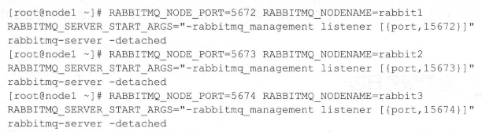
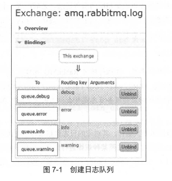

# 第七章 RabbitMQ 运维

在 RabbitMQ 使用过程中，可能会遇到各种异常情况，包括客户端异常和服务端异常。

+ 客户端的异常通常是由于应用代码的缺陷造成的，这方面 RabbitMQ 本身无法控制。
+ 而对于服务端的异常（有些客户端异常也是由服务端问题引起的），虽然不能完全避免，但可以采取一些有效的监测和管理手段。
  + 当某些指标超过阈值时，可以及时采取措施进行修复，以防止发生不必要的故障（如单点故障、集群故障等）。
  + 同时当故障发生时，服务端也应能快速修复。


## 7.1 集群搭建

在 1.4 节中，我们介绍了如何安装和运行单机版的 RabbitMQ 服务，但单机版无法满足实际应用的需求。**例如，如果 RabbitMQ 服务器发生内存崩溃、机器掉电或主板故障，应该如何应对？**

+ 虽然单台 RabbitMQ 服务器可以处理每秒 1000 条消息；
+ 但如果需要处理每秒 10 万条消息的吞吐量，仅靠提升单机服务器性能显然不够。
+ **因此，搭建 RabbitMQ 集群是解决实际问题的关键。**

RabbitMQ 集群允许消费者和生产者在某个节点崩溃的情况下继续运行，且可以通过增加更多节点来线性扩展吞吐量。即使集群中某个节点**失效** ，客户端仍能连接到其他节点，继续进行消息的生产和消费。

**然而，RabbitMQ 集群并不能保证消息的绝对安全。** 即使消息、队列和交换器设置为持久化，且生产端和消费端正确使用了确认机制，**当集群中的一个节点崩溃时，该节点上的所有队列消息将丢失。**

------

在 RabbitMQ 集群中，所有节点都会备份一些元数据信息，包括：

- **队列元数据**：队列的名称及属性；
- **交换器**：交换器的名称及属性；
- **绑定关系元数据**：交换器与队列或交换器之间的绑定关系；
- **vhost元数据**：为 vhost 内的队列、交换器和绑定提供命名空间和安全属性。

**然而，RabbitMQ 集群不会备份消息内容。**

> 通过特殊配置（如镜像队列）可以解决这一问题，详细内容将在第 9.4 节中介绍。

基于存储空间和性能的考虑 ， 在 RabbitMQ 集群中创建队列，**集群只会在单个节点而不是在所有节点上创建队列的进程井包含完整的队列信息(元数据 、状态、内容)。这样:**

+ 只有队列的**宿主节点**  ， 即所有者节点知道队列的所有信息
+ 所有其他非所有者节点只知道队列的元数据和指向该队列存在的那个节点的指针
+ 当节点崩溃时，队列的进程、绑定关系以及附加的消费者都会丢失，相关的消息也会消失。

**与队列不同，交换器本身并不拥有独立进程，它只是一个名称和绑定列表。**

+ 当消息发送到交换器时，实际由信道将消息的路由键与交换器的绑定列表进行比较，然后路由消息。
+ 创建新交换器时，RabbitMQ 只需将绑定列表添加到集群中所有节点，确保每个节点上的信道都能访问到新的交换器。

接下来，本节将介绍如何正确有效地搭建一个 RabbitMQ 集群，并应用于实际生产环境。此外，还会讨论如何在单机上配置多个 RabbitMQ 实例，以便在资源有限的情况下进行集群测试。


### 7.1.1 多机多节点配置

多机多节点是针对下一节的单机多节点而言的，主要是指在每台机器中部署一个 RabbitMQ 服务节点，进而由多台机器组成一个 RabbitMQ 集群。

假设这里一共有三台物理主机，均已正确地安装了 RabbitMQ：

+ 主机名分别为 node1，node2 和 node3。
+ RabbitMQ 集群对延迟非常敏感，应当只在本地局域网内使用。在广域网中不应该使用集群，而应该使用 Federation 或 Shovel 来代替。

接下来需要按照以下步骤执行。

1. 第一步，配置各个节点的 hosts 文件，让各个节点都能互相识别对方的存在。比如在 Linux 系统中可以编辑 /etc/hosts 文件，在其上添加 IP 地址与节点名称的映射信息：

   ```
   192.168.0.2 node1
   192.168.0.3 node2
   192.168.0.4 node3
   ```

2. 第二步，编辑 RabbitMQ 的 cookie 文件，以确保各个节点的 cookie 文件使用的是同一个值。cookie 相当于密钥令牌，集群中的 RabbitMQ 节点需要通过交换密钥令牌以获得相互认证。

   + 可以读取 node1 节点的 cookie 值，然后将其复制到 node2 和 node3 节点中。cookie 文件默认路径为 /var/lib/rabbitmq/.erlang.cookie 或者 $HOME/.erlang.cookie。

   + 如果节点的密钥令牌不一致，那么在配置节点时就会有如下的报错：

     ```
     Authentication failed (rejected by the remote node) , please check the Erlanq cookie
     ```

3. **第三步，配置集群。配置集群有三种方式：通过 rabbitmqctl 工具配置。**

   + 首先启动 node1、node2 和 node3 这三个节点的 RabbitMQ 服务。

   ```
   [root@node1 -]# rabbitmq-server -detached
   [root@node2 -]# rabbitmq-server -detached
   [root@node3 -]# rabbitmq-server -detached
   ```

   + 这样，这三个节点目前都是以独立节点存在的单个集群。通过 `rabbitmqctl cluster_status` 命令来查看各个节点的状态。

   ```
   [root@node1 -]# rabbitmqctl cluster_status
   Cluster status of node rabbit@node1
   [{nodes, [{disc, [rabbit@node1]}]} , {running_nodes, [rabbit@node1]} , {cluster_name,<<"rabbit@node1">>}, {partitions, []}, {alarms, [{rabbit@node1 , []}]}]
   ...
   ```

   + 为了将这三个节点组成一个集群，需要以 node1 节点为基准，将 node2 和 node3 节点加入 node1 节点的集群中。这三个节点是平等的，如果想调换彼此的加入顺序也未尝不可。

   + 首先将 node2 节点加入 node1 节点的集群中，需要执行如下 4 个命令步骤。

     ```
     [root@node2 -]# rabbitmqctl stop_app
     [root@node2 -]# rabbitmqctl reset
     [root@node2 -]# rabbitmqctl join_cluster rabbit@node1
     [root@node2 -]# rabbitmqctl start_app
     ```

     如此，node1 节点和 node2 节点便处于同一个集群之中，我们在这两个节点上都执行 `rabbitmqctl cluster_status` 命令可以看到同样的输出。

     ```
     [{nodes, [{disc, [rabbit@node1 , rabbit@node2]}]} , {running_nodes, [rabbit@node1 , rabbit@node2]} , {cluster_name,<<"rabbit@node1">>} , {partitions, []}, {alarms, [{rabbit@node1 , []}, {rabbit@node2 , []}]}]
     ```

     最后将 node3 节点也加入 node1 节点所在的集群中，这三个节点组成了一个完整的集群。在任意一个节点中都可以看到如下的集群状态。

     ```
     [{nodes, [{disc, [rabbit@node1, rabbit@node2, rabbit@node3]}]} , {running_nodes, [rabbit@node1, rabbit@node2, rabbit@node3]} , {cluster_name,<<"rabbit@node1">>} , {partitions, []}, {alarms, [{rabbit@node1, []}, {rabbit@node2, []}, {rabbit@node3, []}]}]
     ```

------

**现在已经完成了集群的搭建。如果集群中某个节点关闭了，那么集群会处于什么样的状态？**

这里我们在 node2 节点上执行 `rabbitmqctl stop_app` 命令来主动关闭 RabbitMQ 应用。此时，在 node1 上查看集群状态时，`running_nodes` 中已经没有了 `rabbit@node2` 这一节点。具体状态如下：

```
[{nodes, [{disc, [rabbit@node1, rabbit@node2, rabbit@node3]}]} , 
 {running_nodes, [rabbit@node1, rabbit@node3]} , 
 {cluster_name,<<"rabbit@node1">>} , 
 {partitions, []} , 
 {alarms, [{rabbit@node1, []}, {rabbit@node3, []}]}]
```

**如果关闭了集群中的所有节点，需要确保在重新启动时最后关闭的那个节点是第一个启动的节点。**

如果第一个启动的节点不是最后关闭的节点，那么它会等待最后关闭的节点启动。**等待时间为 30 秒，如果超过这个时间没有等到，先启动的节点会失败。最新版本中有重试机制，默认重试 10 次，每次等待 30 秒。**

```
=INFO REPORT==== 23-Jul-2017::12:08:10 ===
Waiting for Mnesia tables for 30000 ms, 9 retries left

=WARNING REPORT==== 23-Jul-2017::12:08:40 ===
Error while waiting for Mnesia tables: {timeout_waiting_for_tables,
[rabbit_user, rabbit_user_permissions, rabbit_vhost, rabbit_durable_route,
rabbit_durable_exchange, rabbit_runtime_parameters, rabbit_durable_queue]}
```

在重试失败之后，当前节点会因为失败而关闭自身。例如，假设 node1 是最后关闭的节点，此时先启动 node2 节点，等待若干时间后，发现 node1 仍然没有启动，就会报如下错误：

```
BOOT FAILED
Timeout contacting cluster nodes: [rabbit@node1]. BACKGROUND
This cluster node was shut down while other nodes were still running.
To avoid losing data, you should start the other nodes first, then start this one.
To force this node to start, first invoke "rabbitmqctl force_boot".
If you do so, any changes made on other cluster nodes after this one was shut down may be lost.
```

**如果最后关闭的节点因某些异常无法启动，可以通过 `rabbitmqctl forget_cluster_node` 命令将该节点从集群中剔除，具体内容可以参考 7.1.3 节。**

如果集群中的所有节点由于非正常原因（如断电）关闭，集群中的节点会认为其他节点仍然在运行，**此时需要调用 `rabbitmqctl force_boot` 命令来启动一个节点，之后集群才能正常启动。**

```
[root@node2 -]# rabbitmqctl force_boot
Forcing boot for Mnesia dir /opt/rabbitmq/var/lib/rabbitmq/mnesia/rabbit@node2
[root@node2 -]# rabbitmq-server -detached
```


### 7.1.2 集群节点类型

在使用 `rabbitmqctl cluster_status` 命令查看集群状态时，`{nodes, [{disc, [rabbit@node1, rabbit@node2, rabbit@node3]}]}` 中的 `disc` 标明了 RabbitMQ 节点的类型。

**RabbitMQ 中的每个节点， 无论是单节点系统还是集群的一部分，都可以是内存节点（RAM node）或磁盘节点（Disc node）。**

+ 内存节点将所有队列、交换器、绑定关系、用户、权限和 vhost 的元数据存储在内存中
+ 而磁盘节点则将这些信息存储在磁盘上。

**在单节点集群中，节点必须是磁盘节点，否则在重启 RabbitMQ 后，系统的配置信息会丢失。**

但在集群中，可以将部分节点配置为内存节点，从而提升性能。例如，将 `node2` 节点加入到 `node1` 时，可以将 `node2` 配置为内存节点：

```
[root@node2 -]# rabbitmqctl join_cluster rabbit@node1 --ram
```

这样，在由 `node1` 和 `node2` 组成的集群中，就会有一个磁盘节点和一个内存节点。如果不加 `--ram` 参数，则 `node2` 会是磁盘节点。可以通过 `rabbitmqctl cluster_status` 查看集群状态：

```
[root@node2 -]# rabbitmqctl cluster_status
Cluster status of node rabbit@node2
[{nodes, [{disc, [rabbit@node1]}, {ram, [rabbit@node2]}]} , 
 {running_nodes, [rabbit@node1, rabbit@node2]} , 
 {cluster_name,<<"rabbit@node1">>} , 
 {partitions, []} , 
 {alarms, [{rabbit@node1, []}, {rabbit@node2, []}]}]
```

**如果集群已搭建完成，也可以使用 `rabbitmqctl change_cluster_node_type` 命令来切换节点的类型。比如，将 `node2` 从内存节点转换为磁盘节点：**

```
[root@node2 -]# rabbitmqctl stop_app
Stopping rabbit application on node rabbit@node2

[root@node2 -]# rabbitmqctl change_cluster_node_type disc
Turning rabbit@node2 into a disc node

[root@node2 -]# rabbitmqctl start_app
Starting node rabbit@node2

[root@node2 -]# rabbitmqctl cluster_status
Cluster status of node rabbit@node2
[{nodes, [{disc, [rabbit@node1, rabbit@node2]}]} , 
 {running_nodes, [rabbit@node1, rabbit@node2]} , 
 {cluster_name,<<"rabbit@node1">>} , 
 {partitions, []} , 
 {alarms, [{rabbit@node1, []}, {rabbit@node2, []}]}]
```

------

**在集群中创建队列、交换器或绑定关系时，必须等待所有集群节点成功提交元数据变更才能返回。**

+ 对内存节点来说，这意味着将变更写入内存；
+ 而对磁盘节点来说，则需要执行磁盘写入操作。
+ 内存节点能够提供更高的性能，而磁盘节点则能确保集群配置信息的可靠性。

**那么，如何在这两者之间进行抉择呢？**

**RabbitMQ 要求集群中至少有一个磁盘节点，其他节点可以是内存节点。**

+ **当节点加入或离开集群时，必须将变更通知至少一个磁盘节点。** 如果集群中只有一个磁盘节点，且该节点崩溃，则集群可以继续处理消息，但无法进行创建队列、交换器、绑定关系、用户操作或修改权限等变更。
+ 因此，为了避免这种情况，建议在集群中至少有两个磁盘节点。
+ 内存节点在重启后会连接到预先配置的磁盘节点，并下载当前集群元数据的副本。当添加内存节点时，必须告知其所有的磁盘节点（内存节点只会存储集群中磁盘节点的地址）。只要内存节点能找到至少一个磁盘节点，它就能在重启后重新加入集群。

**除非使用 RabbitMQ 的 RPC 功能，通常操作是生产和消费消息，因此为了保证集群信息的可靠性，建议在不确定选择磁盘节点还是内存节点时，优先选择全部使用磁盘节点。**


### 7.1.3 剔除单个节点

创建集群的过程可以看作是将节点添加到集群中的过程。那么，如果需要将一个节点从集群中剔除呢？这可以帮助节省硬件资源或更换性能更好的节点。

以 `nodel`、`node2` 和 `node3` 组成的集群为例，有两种方式可以将 `node2` 从集群中剔除。

------

**第一种方式**：首先在 `node2` 节点上执行 `rabbitmqctl stop_app` 或 `rabbitmqctl stop` 命令来关闭 RabbitMQ 服务。然后，在 `nodel` 节点或 `node3` 节点上执行 `rabbitmqctl forget_cluster_node rabbit@node2` 命令将 `node2` 剔除出集群。这种方式适用于 `node2` 节点不再运行 RabbitMQ 服务的情况。

```
[root@nodel -]# rabbitmqctl forget_cluster_node rabbit@node2
Removing node rabbit@node2 from cluster
```

如果集群中的节点关闭顺序是 `node3`、`node2`、`nodel`，且某个节点因异常无法启动，可以通过 `rabbitmqctl forget_cluster_node` 命令将无法启动的节点剔除。例如，在 `node2` 节点上执行该命令，将 `nodel` 节点剔除出集群：

```
[root@node2 -]# rabbitmqctl forget_cluster_node rabbit@nodel --offline
Removing node rabbit@nodel from cluster
```

此时，`nodel` 节点被成功剔除，`node2` 会继续作为集群中的一部分。如果没有添加 `--offline` 参数，则必须确保 `node2` 节点的 RabbitMQ 服务处于运行状态，才能执行该命令。

------

**第二种方式**：可以在 `node2` 上执行 `rabbitmqctl reset` 命令来将其从集群中剔除。

**如果不是像上面由于启动顺序的缘故而不得不删除一个集群节点，建议采用这种方式。**

```
[root@node2 -]# rabbitmqctl stop_app
Stopping rabbit application
[root@node2 -]# rabbitmqctl reset
Resetting node rabbit@node2
[root@node2 -]# rabbitmqctl start_app
Starting node rabbit@node2
```

使用 `rabbitmqctl reset` 后，`node2` 节点会变成一个独立的节点。在集群中的剩余节点（如 `nodel` 和 `node3`）会看到 `node2` 已不再是集群的一部分。

`rabbitmqctl reset` 命令会清空节点的状态，并将其恢复到空白状态。当该命令在集群节点上执行时，它会与集群中的磁盘节点进行通信，告知它们该节点正离开集群。


### 7.1.4 集群节点的升级

如果 RabbitMQ 集群只有一个节点，升级版本比较简单。只需关闭原有服务，解压新版本并启动即可。

> 但要确保原节点的 Mnesia 数据不会丢失，并且新版本的 Mnesia 路径需要指向原节点的数据路径。具体方法是保留原节点的 Mnesia 数据，将新版本的 Mnesia 路径指向保留的数据，或者直接复制原 Mnesia 数据到新版本的相应目录，最后启动新版本的服务。

**如果 RabbitMQ 集群由多个节点组成，可以参考单节点的升级。具体步骤如下：**

1. 关闭所有节点的服务，使用 `rabbitmqctl stop` 命令关闭。
2. 保存各节点的 Mnesia 数据。
3. 解压新版本的 RabbitMQ 到指定目录。
4. 设置新版本的 Mnesia 路径为步骤 2 中保存的路径。
5. 启动新版本的服务，确保先重启最后关闭的节点。

步骤 4 和步骤 5 可以一起操作，比如通过命令 `RABBITMQ_MNESIA_BASE=/opt/mnesia rabbitmq-server -detached` 启动新版本，其中 `/opt/mnesia` 是保存 Mnesia 数据的路径。

由于 RabbitMQ 版本众多，可能会出现数据格式不兼容的问题，尤其是较旧版本之间。升级前最好先测试不同版本之间的兼容性，再在生产环境中进行操作。

如果集群的配置和数据可以丢弃，可以删除旧版本并重新安装配置。如果数据和配置不可丢弃，则需要保存元数据，然后关闭所有生产者，等待消费者消费完队列中的数据，接着关闭所有消费者，再重新安装 RabbitMQ 并重建元数据。

如果有新版本的集群，也可以考虑将集群从旧版本迁移到新版本，集群迁移的具体方法可以参考 7.4 章节。


### 7.1.5 单机多节点配置

在一些限制条件下，可能需要在单台物理机器上创建多个 RabbitMQ 服务节点的集群，或出于实验目的验证集群特性，而不想浪费多台物理机器。

**要在一台机器上部署多个 RabbitMQ 节点，需要确保每个节点有独立的名称、数据存储位置、端口号等。**

例如，在名为 nodel 的机器上创建一个包含 `rabbit1@nodel`、`rabbit2@nodel` 和 `rabbit3@nodel` 的集群。首先，确保机器上已经安装了 Erlang 和 RabbitMQ。

**然后，为每个 RabbitMQ 节点配置不同的端口和节点名称启动服务：**

```
[root@nodel -]# RABBITMQ_NODE_PORT=5672 RABBITMQ_NODENAME=rabbit1 rabbitmq-server -detached
[root@nodel -]# RABBITMQ_NODE_PORT=5673 RABBITMQ_NODENAME=rabbit2 rabbitmq-server -detached
[root@nodel -]# RABBITMQ_NODE_PORT=5674 RABBITMQ_NODENAME=rabbit3 rabbitmq-server -detached
```

启动 `rabbit1@nodel` 后，继续启动 `rabbit2@nodel` 和 `rabbit3@nodel` 时，可能会遇到启动失败，通常是由于配置冲突，如 RabbitMQ Management 插件冲突。

**如果启用了该插件，需要为每个节点配置不同的插件端口号，命令如下：**



**然后，使用以下命令将 `rabbit2@nodel` 节点加入 `rabbit1@nodel` 节点的集群：**

```
[root@nodel -]# rabbitmqctl -n rabbit2@nodel stop_app
[root@nodel -]# rabbitmqctl -n rabbit2@nodel reset
[root@nodel -]# rabbitmqctl -n rabbit2@nodel join_cluster rabbit1@nodel
[root@nodel -]# rabbitmqctl -n rabbit2@nodel start_app
```

接着，执行类似的操作将 `rabbit3@nodel` 加入集群。

**最后，可以使用 `rabbitmqctl cluster_status` 命令查看集群状态：**

```
[root@nodel -]# rabbitmqctl -n rabbit1@nodel cluster_status
[root@nodel -]# rabbitmqctl -n rabbit2@nodel cluster_status
[root@nodel -]# rabbitmqctl -n rabbit3@nodel cluster_status
```

上述操作成功后，三个节点将形成一个集群。虽然单机多节点配置适用于实验，但如果在生产环境中使用，最好参考正式的多机多节点集群配置，因为多机集群不仅能扩容，还能提供更好的容灾能力。


## 7.2 查看服务日志

在使用 RabbitMQ 时，遇到异常情况时，查看 RabbitMQ 的服务日志能够帮助快速定位和解决问题。

+ 默认情况下，RabbitMQ 的日志存放在 `$RABBITMQ_HOME/var/log/rabbitmq` 文件夹下。RabbitMQ 会生成两个日志文件：`RABBITMQ_NODENAME-sasl.log` 和 `RABBITMQ_NODENAME.log`。
+ 当 RabbitMQ 记录与 Erlang 相关的信息时，它会将日志写入 `RABBITMQ_NODENAME-sasl.log` 文件，例如 Erlang 崩溃报告，可以帮助调试 RabbitMQ 节点无法启动的问题。

+ 如果需要查看 RabbitMQ 应用服务的日志，则应查看 `RABBITMQ_NODENAME.log` 文件。这个文件就是我们所说的 RabbitMQ 服务日志。

### 7.2.1 启动 MQ 服务日志

启动 RabbitMQ 服务可以通过执行 `rabbitmq-server -detached` 命令，这个命令不仅启动 RabbitMQ 服务，还会启动 Erlang 虚拟机。而使用 `rabbitmqctl start_app` 命令只会启动 RabbitMQ 应用服务，前提是 Erlang 虚拟机已经在运行。

执行 `rabbitmq-server -detached` 后，服务会生成相应的日志:

1. 包含了多个信息：例如，日志中会显示 RabbitMQ 的版本号、Erlang 的版本号、节点名称、cookie 的哈希值、配置文件路径、内存限制、磁盘限制、默认账户 `guest` 的创建和权限配置等。
2. 日志中常见的有 "INFO REPORT" 和 "WARNING REPORT" 等日志级别。RabbitMQ 的日志有五个级别：none、error、warning、info 和 debug。
3. 可以通过 `rabbitmq.config` 配置文件中的 `log_levels` 参数来设置日志级别，默认为 `[ {connection, info} ]`。

如果启用了 RabbitMQ Management 插件，启动日志会多出一些信息，例如插件启动的日志，以及一些统计信息的初始化日志。统计日志中包含了一些指标，如队列的统计信息、消息传递统计等，通常不需要深入了解，除非对这些指标有特别的需求。

如果使用 `rabbitmqctl stop_app` 命令关闭了 RabbitMQ 应用服务，再使用 `rabbitmqctl start_app` 启动时，生成的日志与 `rabbitmq-server` 启动时的日志相同。


### 7.2.2 关闭 MQ 服务日志

如果使用 `rabbitmqctl stop` 命令，它会关闭 Erlang 虚拟机。而如果使用 `rabbitmqctl stop_app` 命令，则只会关闭 RabbitMQ 应用服务，Erlang 虚拟机保持运行。在关闭 RabbitMQ 时，需要特别注意这两者的区别。

具体来说，当执行 `rabbitmqctl stop_app` 时，服务日志会显示：

- `Stopping RabbitMQ`
- `stopped TCP Listener on [::]:5672`
- `Stopped RabbitMQ application`

如果使用 `rabbitmqctl stop` 命令关闭服务时，日志还会多出一条信息，表示 Erlang 虚拟机被停止：

- `Halting Erlang VM`


### 7.2.3 建立集群服务日志

在 RabbitMQ 中建立集群的操作比较常见。以将节点 `rabbit@node2` 和 `rabbit@nodel` 组成集群为例，首先需要在 `rabbit@node2` 节点执行 `rabbitmq-server -detached` 来启动 Erlang 虚拟机和 RabbitMQ 应用服务。然后，执行 `rabbitmqctl stop_app` 关闭 RabbitMQ 应用服务，相关的日志内容参考前面所述。

接下来，要重置 `rabbit@node2` 节点的数据，可以执行 `rabbitmqctl reset`，这时会在日志中看到如下信息：

- `Resetting Rabbit`

随后，使用 `rabbitmqctl join_cluster rabbit@nodel` 将 `rabbit@node2` 节点加入 `rabbit@nodel` 节点，组成集群，日志中会显示：

- `Clustering with [rabbit@node1] as disc node`

与此同时，在 `rabbit@nodel` 节点也会显示：

- `node rabbit@node2 up`

如果在 `rabbit@node2` 节点执行 `rabbitmqctl stop_app` 时，`rabbit@nodel` 节点的日志会显示：

- `rabbit on node rabbit@node2 down`

这些日志可以帮助我们了解 RabbitMQ 节点在不同时间点的启动和关闭情况。


### 7.2.4 其他日志信息

在 RabbitMQ 中，查看服务日志不仅限于手动查看 `rabbit@$HOSTNAME.log` 文件，还可以通过程序化的方式来查看。

+ **RabbitMQ 默认会创建一个名为 `arnq.rabbitmq.log` 的交换器，用来收集所有的服务日志，集群中的所有日志都会被发送到这个交换器。**
+ **该交换器的类型为 topic，可以收集不同级别的日志，如 `debug`、`info`、`warning` 和 `error`。**

可以创建四个日志队列：`queue.debug`、`queue.info`、`queue.warning` 和 `queue.error`，分别绑定到 `arnq.rabbitmq.log` 交换器，并使用相应的路由键（`debug`、`info`、`warning`、`error`）来收集不同级别的日志。如果想收集所有级别的日志，可以使用 `#` 路由键。

**如下这样创建生产者：**



对于单节点的 RabbitMQ 集群，这四个日志队列可以收集到该节点的所有日志。而在多节点的集群中，这些队列会收到每个节点的日志，但日志是交错的，无法区分具体是哪个节点的日志。

**代码清单 7-1 接收服务日志示例程序**

```java
import com.rabbitmq.client.*;

import java.io.IOException;
import java.util.concurrent.TimeoutException;

public class ReceiveLog {
    public static void main(String[] args) {
        try {
            // 创建连接工厂并连接到RabbitMQ
            ConnectionFactory factory = new ConnectionFactory();
            factory.setHost("localhost"); // 根据实际情况设置RabbitMQ的地址
            factory.setUsername("guest"); // 用户名
            factory.setPassword("guest"); // 密码
            factory.setVirtualHost("/");  // 虚拟主机

            // 创建连接
            Connection connection = factory.newConnection();
            
            // 创建多个频道
            Channel channelDebug = connection.createChannel();
            Channel channelInfo = connection.createChannel();
            Channel channelWarn = connection.createChannel();
            Channel channelError = connection.createChannel();

            // 设置基本QoS（根据需求进行调整）
            // channelDebug.basicQos(1); // 一次只处理一个消息
            // channelInfo.basicQos(1);
            // channelWarn.basicQos(1);
            // channelError.basicQos(1);

            // 消费消息并绑定到队列
            channelDebug.basicConsume("queue.debug", false, new ConsumerThread(channelDebug, "DEBUG"));
            channelInfo.basicConsume("queue.info", false, new ConsumerThread(channelInfo, "INFO"));
            channelWarn.basicConsume("queue.warning", false, new ConsumerThread(channelWarn, "WARNING"));
            channelError.basicConsume("queue.error", false, new ConsumerThread(channelError, "ERROR"));
        } catch (IOException | TimeoutException e) {
            e.printStackTrace();
        }
    }

    // 定义一个消费者线程来处理消息
    public static class ConsumerThread extends DefaultConsumer {
        private String logLevel;

        public ConsumerThread(Channel channel, String logLevel) {
            super(channel);
            this.logLevel = logLevel;
        }

        @Override
        public void handleDelivery(String consumerTag, Envelope envelope,
                                   AMQP.BasicProperties properties, byte[] body) throws IOException {
            // 获取消息内容
            String log = new String(body);
            
            // 打印出日志和日志级别
            System.out.println("[" + logLevel + "] " + consumerTag + " REPORT====\n" + log);

            // 确认消息已被消费
            getChannel().basicAck(envelope.getDeliveryTag(), false);
        }
    }
}
```

**解释**

1. **创建连接和频道**：代码首先通过 `ConnectionFactory` 创建了与 RabbitMQ 的连接，并为每种日志类型（`debug`、`info`、`warning`、`error`）创建了不同的频道。
2. **消费者线程**：`ConsumerThread` 类继承自 `DefaultConsumer`，用于处理每个队列中的消息。`handleDelivery` 方法会在接收到日志消息时打印出日志内容，并确认消息已被消费。
3. **消息消费**：每个队列通过 `basicConsume` 进行消费，同时传入一个消费者线程类来处理消息。日志级别（如 `DEBUG`、`INFO`、`WARNING`、`ERROR`）将会通过不同的消费者处理，并分别打印。

**注意事项：**

- 确保你的 RabbitMQ 服务正在运行，并且队列如 `queue.debug`、`queue.info`、`queue.warning`、`queue.error` 已经存在。
- `channel.basicQos(1)` 控制每次处理一个消息。可以根据实际需求调整它。
- 程序依赖于 RabbitMQ Java 客户端库 `com.rabbitmq.client`，需要在项目中正确引入依赖。如果使用 Maven，可以添加如下依赖：

```xml
<dependency>
    <groupId>com.rabbitmq</groupId>
    <artifactId>amqp-client</artifactId>
    <version>5.15.0</version> <!-- 确保版本正确 -->
</dependency>
```

这个示例可以用于接收并处理 RabbitMQ 中不同级别的服务日志。

通过程序化的方式查看服务日志，可以设置逻辑规则来过滤和保存有用的日志信息，以便后续的服务应用。此外，还可以对日志进行监控，例如对日志内容进行关键字检索。

> 举例来说，在第10章中会讨论网络分区的概念，可以通过检索日志中的“running partitioned network”关键字及时发现网络分区，并迅速采取措施来确保集群服务的鲁棒性。当然，也可以使用第三方工具（如 Logstash）来实现日志的监控和处理，有兴趣的读者可以进一步学习相关内容。


## 7.3 单节点故障恢复

在使用 RabbitMQ 的过程中，可能会遇到单节点故障，通常包括机器硬件故障、掉电、网络异常和服务进程异常。单点故障指的是集群中某个节点发生故障，可能导致集群服务不可用或数据丢失。为了提高集群的可用性和可靠性，可以配置镜像队列以防止单点故障的影响。

对于机器硬件故障，如硬盘、内存、主板等故障，无法通过软件恢复时，需要在其他节点执行 `rabbitmqctl forget_cluster_node {nodename}` 命令，将故障节点从集群中剔除。如果客户连接到了故障节点，需要将该节点从连接列表中删除，确保客户端重新连接到集群中的其他节点。如果故障机器修复或有备用机器，可以将其重新添加到集群中。

在机器掉电的情况下，待电源恢复后需要重启机器，但要避免直接重启 RabbitMQ 服务，以免引发网络分区。**此时，先将节点从集群中剔除，删除故障节点的 Mnesia 数据（相当于重置），然后重启服务，最后将其作为新节点加入集群。**

网络故障可能由网线松动或网卡损坏引起。网线问题通常不会影响集群，但建议关闭故障节点的 RabbitMQ 进程并修复网线。**网卡故障则可能引发网络分区，此时应立即关闭故障节点的 RabbitMQ 进程，等待网卡修复后再决定是否重启。若已发生网络分区，可参考相关方法进行手动恢复。**

对于服务进程异常，如 RabbitMQ 进程非预期终止，需要评估风险。如果风险较大，可以考虑抛弃该节点；一般情况下，重新启动服务即可。

这些是常见的 RabbitMQ 单点故障，解决方案还可以根据实际情况进行调整和验证。


## 7.4 集群监控

运维负责；或直接通过可视化界面监控


## 7.5 小结

RabbitMQ 作为一个成熟的消息中间件，不仅要为应用提供强大的功能支持，也要能够维护自身状态的稳定，而这个维护就需要强大的运维层面的支撑。

**运维本身就是一个大学问，涵盖多方面的内容，比如容量评估、资源分配、集群管控、系统调优、升级扩容、故障修复、监控告警、负载均衡等。**

本章从最基本的集群搭建开始到故障修复，从集群迁移再到集群监控，并不要求能解决所有 RabbitMQ 的运维问题，希望能够在多个层面为读者提供解决问题的方法和思路。