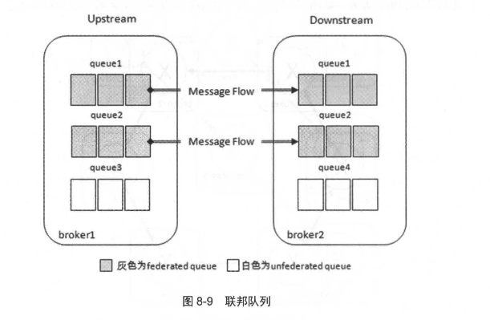

# 第八章 跨越集群的界限

**RabbitMQ 可以通过 3 种方式实现分布式部署：集群、 Federation 和 Shovel。**

这 3 种方式不是互斥的，可以根据需要选择其中的一种或者以几种方式的组合来达到分布式部署的目的 。

+ Federation 和 Shovel 可以为 RabbitMQ 的分布式部署提供更高的灵活性，但同时也提高了部署的复杂性 。

+ 本章主要阐述 Federation 与 Shovel 的相关的原理、用途及使用方式等 。
+ 最后在小结部分中将集群与 Federation/Shovel 的部署方式进行对比区分，以加深对相关知识点的理解 。

## 8.1 Federation

**Federation 插件的设计目标是让 RabbitMQ 在不同的 Broker 节点之间传递消息，而不需要建立集群，这在很多场景下都非常有用。其关键特点包括：**

- **跨管理域消息传递**：Federation 插件可以在不同管理域之间传递消息，这些管理域可能有不同的用户、vhost，或者运行在不同版本的 RabbitMQ 和 Erlang 上。
- **容忍网络不稳定**：该插件基于 AMQP 0-9-1 协议进行跨 Broker 的通信，设计时考虑到网络连接不稳定的情况。
- **灵活的交换器配置**：在一个 Broker 节点上，可以同时存在联邦交换器（或队列）和本地交换器（或队列），只需为特定的交换器或队列创建 Federation 连接（即 Federation link）。
- **简化的连接方式**：Federation 插件不需要在 N 个 Broker 节点之间创建 O(N²) 个连接，意味着它可以更容易扩展。

**Federation 插件可以将多个交换器或多个队列连接成一个联邦。**

+ 联邦交换器（Federated exchange）或联邦队列（Federated queue）能够接收来自上游的消息，这里的上游指的是位于其他 Broker 上的交换器或队列
+ 联邦交换器会将上游交换器发送的消息路由到本地队列中
+ 联邦队列则允许本地消费者从上游队列接收消息。

接下来，我们会从架构层面分析联邦交换器和联邦队列，并进一步讲解如何使用 Federation 插件。

### 8.1.1 联邦交换器

假设图 8-1 中 broker1 部署在北京， broker2 部署在上海，而 broker3 部署在广州，彼此之间相距甚远，网络延迟是一个不得不面对的问题。

**考虑以下几个业务场景：**

1. 有一个在广州的业务 ClientA 需要连接 broker3，井向其中的交换器 exchangeA 发送消息此时的网络延迟很小， ClientA可以迅速将消息发送至 exchangeA 中，就算在开启了 publisher confirm 机制或者事务机制的情况下，也可以迅速收到确认信息。
2. 此时又有 一个在北京的业务 ClientB 需要向 exchangeA 发送消息，那么 ClientB 与 broker3 之间有很大的网络延迟， ClientB 将发送消息至 exchangeA会经历一定的延迟，尤其是在开启了 publisher confirm 机制或者事务机制的情况下， **ClientB 会等待很长的延迟时间来接收 broker3 的确认信息，进而必然造成这条 发送线程的性能降低，甚至造成一定程度上的阻塞。**

**那么要怎么优化业务 ClientB 呢？**

> 将业务 ClientB 部署到广州的机房中可以解决这个问题
>
> 但是如果 ClientB调用的另一些服务都部署在北京，那么又会引发新的时延问题，总不见得将所有业务全部部署在一个机房，那么容灾又何以实现？
>
> 这里使用 Federation 插件就可以很好地解决这个问题 。

**如图 8-2 所示，在 broker3 中为交换器 exchangeA (broker3 中的队列 queueA 通过 "rkA" 与 exchangeA进行了绑定) 与北京的 broker1 之间建立一条单向的 Federation link。**

此时 Federation 插件会在 broker1 上会建立一个**同名的交换器 exchangeA**  (这个名称可以配置，默认同名)，同时建立一个 **内部的交换器**  "exchangeA→broker3 B "，并通过路由键 "rkA" 将这两个交换器绑定起来。

> 这个交换器" exchangeA broker3 B" 名字中的 "broker3 "是集群名，可以通过 rabbitmqctl set cluster name {new name}命令进行修改。

与此同时 Federation插件 还会在 broker1 上建立一个队列 **"federation: exchangeA• broker3 B"** 井与交换器 "exchangeA  broker3 B" 进行绑定。

**Federation 插件会在队列 "federation: exchangeA broker3 B" 与 broker3 中的交换器 exchangeA 之间建立一条 AMQP 连接来实时地消费队列 "federation: exchangeA broker3 B" 中的数据 。**

这些操作都是内部的，对外部业务客户端来说这条 Federation link 建立在 broker1 的exchangeA 和 broker3 的 exchangeA 之间。

------

回到前面的问题，部署在北京的业务 ClientB 可以连接 broker1 并向 exchangeA 发送消息，这样 ClientB 可以迅速发送完消息并收到确认信息 ，而之后消息会通过 Federation link 转发到 broker3 的交换器 exchangeA 中 。

+ **最终消息会存入与 exchangeA 绑定的队列 queueA 中，消费者最终可以消费队列 queueA 中的消息。**

+ 经过 Federation link 转发的消息会带有特殊的 headers 属性标记。
+ 例如向 broker1 中的交换器 exchangeA发送一条内容为 "federation test payload."的持久化消息，之后可以在 broker3 中的队列 queueA 中消费到这条消息，详细如图 8-3 所示。

------

Federation 不仅便利于消息生产方，同样也便利于消息消费方：

1. 假设某生产者将消息存入 broker1 中的某个队列 queueB，在广州的业务 ClientC 想要消费 queueB 的消息，消息的流转及确认必然要忍受较大的网络延迟 ，内部编码逻辑也会因这一因素变得更加复杂，这样不利于 ClientC 的发展。
2. 不如将这个消息转发的过程以及内部复杂的编程逻辑交给 Federation 去完成， 而业务方在编码时不必再考虑网络延迟的问题。 **Federation使得生产者和消费者可以异地部署而又让这两方感受不到过多的差异 。**

图 8-2 中 broker1 的队列 "federation: exchangeA -> broker3 B" 是一个相对普通的队列，可以直接通过客户端进行消费 。 假设此时还有一个客户端 ClientD 通过 Basic.Consume 来消费队列 "federation: exchangeA broker3 B" 的消息 ：

1. 那么发往 brokerl 中 exchangeA 的 消息会有一部分被 Client D 消费掉
2. 而另一半会发往 broker3 的 exchangeA。

**所以：**

+ 如果业务应用有要求所有发往 broker1 中 exchangeA 的消息都要转发至 broker3 的 exchangeA 中，此时就要注意队列 "federation: exchangeA broker3 B" 不能有其他的消费者;
+ 对于"异地均摊消费" 这种特殊需求，队列 "federation: exchangeA broker3 B" 这种天生特性提供了支持 。 **对于 broker1 的交换器 exchangeA 而言，它是一个普通的交换器，可以创建一个新的队列绑定它，对它的用法没有什么特殊之处 。**

------

**如图 8-4 所示， 一个 federated exchange 同样可以成为另一个交换器的 upstream exchange。**

**同样如图 8-5 所示，两方的交换器可以互为 federated exchange 和 upstream exchange。其中参数 "max_hops=1" 表示一条消息最多被转发的次数为 10。**

> 需要特别注意的是，对于默认的交换器（每个 vhost 下都会默认创建一个名为""的交换器）和内部交换器而言，不能对其使用 Federation的功能。 

**对于联邦交换器而言，还有更复杂的拓扑逻辑部署方式。比如图 8-6 中 "fan-out" 的多叉树形式，或者图 8-7 中"三足鼎立"的情形。**

### 8.1.2 联邦队列

**除了联邦交换器， RabbitMQ 还可以支持联邦队列 （federated queue）：**

+ 联邦队列可以在多个 Broker节点（或者集群）之间为单个队列提供均衡负载的功能 。
+ 一个联邦队列可以连接一个或者多个上游队列 (upstream queue) ，并从这些上游队列中获取消息以满足本地消费者消费消息的需求 。

**图 8-9 演示了位于两个 Broker 中的几个联邦队列（灰色）和非联邦队列（白色）。**

1. 队列 queue1 和 queue2 原本在 broker2 中，由于某种需求将其配置为 federated queue 并将 broker1作为 upstream。
2. Federation 插件会在 broker1 上创建同名的队列 queue1 和 queue2，与 broker2 中的队列 queuel 和 queue2 分别建立两条单向独立的 Federation link。
3. 当有消费者 ClinetA连接 broker2 并通过 Basic.Consume 消费队列 queue1 (或 queue2) 中的消息时，如果队列 queue1 (或 queue2) 中本身有若干消息堆积，那么 ClientA直接消费这些消息，**此时 broker2 中的 queue1 (或 queue2) 并不会拉取 broker1中的 queuel (或 queue2) 的消息**
4. 如果队列 queue1 (或 queue2) 中没有消息堆积或者消息被消费完了，那么它会通过 Federation link 拉取在 broker1 中的上游队列 queue1 (或 queue2) 中的消息(如果有消息)，然后存储到本地，之后再被消费者 ClientA 进行消费 。

消费者既可以消费 broker2 中的队列，又可以消费 broker1中的队列， Federation 的这种分布式队列的部署可以提升单个队列的容量 。

+ 如果在 broker1 一 端部署的消费者来不及消费队列 queue1 中的消息，那么 broker2 一端部署的消费者可以为其分担消费，也可以达到某种意义上的负载均衡 。

+ **和 federated exchange 不同， 一条消息可以在联邦队列间转发无限次 。** 

**如图 8-10 中两个队列 queue 互为联邦队列 。**

**队列中的消息除了被消费，还会转向有多余消费能力的 一方，如果这种 "多余的消费能力" 在 broker1 和 broker2 中来回切换，那么消费也会在 broker1 和 broker2 中的队列 queue 中来回转发 。**

可以在其中一个队列上发送一条消息、"msg"，然后再分别创建两个消费者 ClientB 和 ClientC 分别连接 broker1 和 broker2， 井消费队列 queue 中的消息，但是并不需要确认消息(消费完消息不需要调用 Basic.Ack)。

**来回开启/关闭 ClientB和 ClientC可以发现消息"msg"会在 brokerl 和 broker2 之间串来串去 。**

图 8-11 中的 broker2 的队列 queue 没有消息堆积或者消息被消费完之后并不能通过 Basic.Get 来获取 broker1 中队列 queue 的消息。

+ 因为 Basic. Get 是一个异步的方法，如果要从 broker1 中队列 queue 拉取消息。
+ 必须要阻塞等待通过 Federation link 拉取消息存入 broker2 中的队 列 queue 之后再消费消息，**所以对于 federated dqueue而言只能使用 Basic.Consume进行消费。**

**federated queue 并不具备传递性。**

考虑图 8-11 的情形，队列 queue2 作为 federated queue 与 队列 queuel 进行联邦 ，而队列 queue2又作为队列 queue3 的 upstream queue，但是这样队列 queue1 与 queue3 之间并没有产生任何联邦的关系。

**如果队列 queue1 中有消息堆积 ，消费者连接 broker3 消费 queue3 中的消息，无论 queue3 处于何种状态，这些消费者都消费不到 queue1 中的消息， 除非 queue2 有消费者 。**

> 理论上可以将一个 federated queue 与一个 federated exchange 绑定起来，不过这样会导放一些不可预测的结果，如果对结果评估不足，建议慎用这种搭配方式 。

### 8.1.3 Federation 的使用

为了能够使用 Federation 功能， 需要配置以下 2 个内容 :

1. 需要配置一个或多个 upstream，每个 upstream 均定义了到其他节点的 Federation link 。 这个配置可以通过设置运行时的参数 (Runtime Parameter) 来完成，也可以通过 federation management 插件来完成。
   + Federation 插件默认在 RabbitMQ 发布包中，执行 rabbitmq-plugins enable rabbitmq_federation 命令可以开启 Federation 功能。
2. 需要定义匹配交换器或者队列的一种/多种策略 (Policy)。

3. 除此之外，要开启 Federation 的管理插件，需要执行 rabbitmq-plugins enable rabbitmq federation_management 命令。

开启 rabbitmq federation management 插件之后，在 RabbitMQ 的管理界面中 "Admin" 的右侧会多出 "FederationStatus" 和 "FederationUpstreams" 两个 Tab页，如图 8-12 所示:

注意：当需要在集群中使用 Federation功能的时候，集群中所有的节点都应该开启 Federation插件。

------

**有关 Federation upstream 的信息全部都保存在 RabbitMQ 的 Mnesia 数据库中，包括用户信息、权限信息 、队列信息等。**

**在 Federation 中存在三种级别的配置：**

1. **Upstreams**：每个 Upstream 用于定义与其他 Broker（消息代理）建立连接的信息。
2. **Upstream Sets**：每个 Upstream Set 用于对一系列使用 Federation 功能的 Upstream 进行分组。在简单的使用场景中，通常可以忽略 Upstream Set 的存在，因为存在一个名为“all”的隐式定义的 Upstream Set，所有的 Upstream 都会自动添加到这个 Set 中。
3. **Policies**：每个 Policy 会选择一组交换器（Exchange）、队列（Queue）或者两者都有，并将其应用于一个单独的 Upstream 或 Upstream Set，以实现特定的限制或配置。

Upstreams 和 Upstream Sets 是运行时参数，类似于交换器和队列。每个虚拟主机（vhost）都可以拥有不同的运行时参数和策略集合。关于运行时参数和策略的更多详细信息，可以参考第 6.3 节。

------

Federation 相关的运行时参数和策略可以通过以下三种方式配置：

1. 使用 `rabbitmqctl` 工具。
2. 通过 RabbitMQ Management 插件提供的 HTTP API 接口（详细信息可参考第 5.6 节）。
3. 使用 RabbitMQ Federation Management 插件提供的 Web 管理界面（这是最方便且通用的方式）。不过，Web 管理界面无法提供所有功能，例如无法对 Upstream Set 进行管理。

------

**下面就详细讲解如何正确地使用 Federation 插件：**

首先以图 8-2 中 broker1 (IP 地址: 192.168.0.2) 和 broker3 (IP地址: 192.168.0.4)的关系来讲述如何建立 federated exchange。

1. **在 Broker1 和 Broker3 中开启 rabbitmq_federation 插件，并最好同时开启 rabbitmq_federation_management 插件。**

2. 在 broker3 中定义一个 upstream。**通过在 Web 管理界面中添加的方式，在 "Admin" → "PederationUpst reams" "Add a new upstream" 中创建，可参考图 8-13。**

   

> **Acknowledgement Mode（确认模式，`ack-mode`）** 是 Federation 链接中消息确认的方式，共有三种选项：
>
> 1. **`on-confirm`**：这是默认选项。在这种模式下，Federation 链接会在收到下游（下游 Broker）的确认消息（即等待下游的 `Basic.Ack`）之后，才向上游（上游 Broker）发送消息确认。这种方式可以确保在发生网络故障或 Broker 崩溃时不会丢失消息，但它的处理速度是最慢的。
> 2. **`on-publish`**：在这种模式下，消息发送到下游后（但不需要等待下游的 `Basic.Ack`），Federation 链接会立即向上游发送消息确认。这种方式可以在网络故障时确保消息不会丢失，但不能保证在 Broker 崩溃时消息不会丢失。
> 3. **`no-ack`**：在这种模式下，消息不需要进行任何确认。这种方式的处理速度最快，但也是最容易丢失消息的选项。

> **适用于 Federated Exchange 的参数:**
>
> 1. **Exchange (exchange)**：指定上游 Exchange 的名称。默认情况下，上游 Exchange 的名称与 Federated Exchange 同名，例如图 8-2 中的 `exchangeA`。
>
> 1. **Max hops (max-hops)**：指定消息在 Federation 链路中被丢弃前的最大跳转次数。默认值为 1。即使将 `max-hops` 设置为大于 1 的值，同一条消息也不会在同一个 Broker 中出现两次，但可能会在多个节点中被复制。
> 2. **Expires (expires)**：指定 Federation 链路断开后，Federated Queue 对应的上游队列（例如图 8-2 中的队列 `federation:exchangeA•broker3B`）的超时时间。默认值为 `"none"`，表示不会删除队列，单位为毫秒。此参数类似于普通队列的 `x-expires` 参数。设置该值可以避免 Federation 链路断开后，生产者继续向 Broker1 中的 `exchangeA` 发送消息，而这些消息无法被转发到 Broker3 中被消费，从而导致 Broker1 中消息堆积。
> 3. **Message TTL (message-ttl)**：为 Federated Queue 对应的上游队列（例如图 8-2 中的队列 `federation:exchangeA•broker3B`）设置消息的超时时间。默认值为 `"none"`，表示消息没有超时时间。此参数类似于普通队列的 `x-message-ttl` 参数。
> 4. **HA Policy (ha-policy)**：为 Federated Queue 对应的上游队列（例如图 8-2 中的队列 `federation:exchangeA•broker3B`）设置高可用性策略。默认值为 `"none"`，表示队列没有高可用性策略。此参数类似于普通队列的 `x-ha-policy` 参数。
>
> **适用于 Federated Queue 的参数:**
>
> 1. **Queue (queue)**：指定上游队列的名称。默认情况下，上游队列的名称与 Federated Queue 同名，可以参考图 8-10 中的 `queue`。

3. **定义一个 Policy用于匹配交换器 exchangeA，井使用第二步中所创建的 upstream。通过在 Web 管理界面中添加的方式，在 "Admin -> policies -> add/update a policy" 中创建，可参考图8-14。**

------

通过上述三个步骤，这样就创建了一个 Federationlink，可以在 Web管理界面中"Admin"→"FederationStatus" -> "Running Links" 查看到相应的链接 。

通常情况下，针对每个 upstream 都会有一条 Federation link， 该 Federation link对应到一个交换器上 。 

## 8.2 Shovel

与 Federation 的数据转发功能类似，Shovel 能够以可靠和持续的方式从一个 Broker 中的队列（作为源端，即 **source**）拉取消息，并将这些消息转发到另一个 Broker 中的交换器（作为目的端，即 **destination**）。源端队列和目的端交换器可以位于同一个 Broker 上，也可以位于不同的 Broker 上。

> Shovel 的名字可以翻译为“铲子”，这是一个非常形象的比喻——它就像一个“铲子”，可以把消息从一个地方“铲到”另一个地方。Shovel 的行为类似于一个优秀的客户端应用程序，它负责连接源端和目的端，负责消息的读取和写入，并且能够处理连接失败等问题。

Shovel 的主要优势包括：

1. **松耦合**：Shovel 可以在不同管理域中的 Broker（或集群）之间移动消息。这些 Broker（或集群）可以有不同的用户、不同的 vhost，甚至可以使用不同的 RabbitMQ 和 Erlang 版本。
2. **支持广域网**：Shovel 插件基于 AMQP 协议在 Broker 之间通信，被设计为能够容忍时断时续的网络连接，并且能够保证消息的可靠性。
3. **高度定制**：当 Shovel 成功连接后，可以对其进行配置，以执行相关的 AMQP 命令。

### 8.2.1 Shovel 的原理

图 8-15 展示了 Shovel 的结构示意图。图中包含两个 Broker：**Broker1**（IP 地址：192.168.0.2）和 **Broker2**（IP 地址：192.168.0.3）。在 **Broker1** 中，有一个交换器 **exchange1** 和一个队列 **queue1**，它们通过路由键 **"rk1"** 进行绑定；在 **Broker2** 中，有一个交换器 **exchange2** 和一个队列 **queue2**，它们通过路由键 **"rk2"** 进行绑定。

在 **queue1** 和 **exchange2** 之间配置了一个 Shovel link。当一条内容为 **"shovel test payload"** 的消息从客户端发送到 **exchange1** 时，这条消息会经过图 8-15 所示的数据流转过程，最终存储在 **queue2** 中。

> 如果在配置 Shovel link 时将 **add-forward-headers** 参数设置为 **true**，则在消费 **queue2** 中的消息时，消息会带有特殊的 **headers** 属性标记，具体细节可以参考图 8-16。

在使用 Shovel 时，通常会将队列配置为源端，交换器配置为目的端，如图 8-15 所示。

然而，也可以将队列配置为目的端，如图 8-17 所示。虽然从表面上看，队列 **queue1** 似乎通过 Shovel link 直接将消息转发到 **queue2**，但实际上，消息在转发过程中仍然会经过 **Broker2** 中的交换器。只不过在这个场景中，所经过的交换器是 **Broker2** 的默认交换器（Default Exchange）。

------

如图 8-18 所示，将交换器配置为源端也是可以实现的。尽管从表面上看，交换器 **exchange1** 似乎通过 Shovel link 直接将消息转发到 **exchange2**，但实际上，在 **Broker1** 中会自动生成一个新的队列（队列名称由 RabbitMQ 自动生成，例如图 8-18 中的 `"amq.gen-ZwolUsoUchY6a7xaPyrZZH"`），并且该队列会与 **exchange1** 绑定。消息从 **exchange1** 发出后，会先存储在这个自动生成的队列中，然后 Shovel 从这个队列中拉取消息，并将其转发到 **exchange2**。

在前面提到的场景中，**Broker1** 和 **Broker2** 中的 **exchange1**、**queue1**、**exchange2** 和 **queue2** 并不一定需要在建立 Shovel link 之前预先创建。这些组件可以在 Shovel 成功连接到源端或目的端 Broker 之后，通过执行一系列 AMQP 配置声明首次创建。

此外，Shovel 允许为源端或目的端配置多个 Broker 的地址。这样，当某个 Broker 失效时，Shovel 可以尝试连接到其他可用的 Broker（随机选择）。为了避免因重连行为导致网络泛洪，可以设置 **reconnect delay** 参数来控制重连的间隔时间。如果需要，也可以在重连失败后直接停止连接尝试。

无论源端还是目的端，所有相关的配置声明会在重连成功后重新发送，以确保消息转发的连续性和可靠性。

### 8.2.2 Shovel 的使用

+ Shovel 插件默认包含在 RabbitMQ 的安装包中。要启用 Shovel 功能，可以运行以下命令：rabbitmq-plugins enable rabbitmq_shovel
+ 根据前面的介绍，Shovel 内部是基于 AMQP 协议来转发数据的。因此，当启用 `rabbitmq_shovel` 插件时，AMQP 客户端插件（`amqp_client`）也会自动启用。如果需要启用 Shovel 的管理功能（例如通过管理界面或 API 管理 Shovel 配置），还需要运行以下命令： rabbitmq-plugins enable rabbitmq_shovel_management

+ 总结来说，Shovel 插件的启用会自动依赖 AMQP 客户端插件，而管理功能则需要单独启用 `rabbitmq_shovel_management` 插件。

------

开启 rabbitmq shovel management 插件之后 ， 在 RabbitMQ 的管理界面中 "A也nin" 的右侧会多出 "Shovel Status" 和 "Shovel Management" 两个 Tab 页，如图 8-19 所示。

Shovel 既可以部署在源端，也可以部署在目 的端。有两种方式可以部署 Shovel: 

+ 静态方式是指在 rabbitmq. config 配置文件中设置，
+ 而动态方式是指通过 Runtime Parameter 设置。

------

**静态方式：**

每一条 Shovel 配置条目定义了消息从源端到目的端的转发关系，其名称（Shovel name）必须是唯一的。每条 Shovel 的定义格式如下：

- **名称**：`{shovel name, ...}`
- **源端配置**：`{sources, [...]}`
- **目的端配置**：`{destinations, [...]}`
- **队列名称**：`{queue, queue_name}`
- **预取计数**：`{prefetch_count, count}`
- **确认模式**：`{ack_mode, a_mode}`
- **发布属性**：`{publish_properties, [...]}`
- **发布字段**：`{publish_fields, [...]}`
- **重连延迟**：`{reconnect_delay, reconn_delay}`

其中，`sources`、`destinations` 和 `queue` 是必须定义的，而其他参数可以使用默认值。与图 8-15 对应的详细 Shovel 配置示例可以在代码清单 8-1 中找到。

------

**动态方式：**

与 Federation upstream 类似，Shovel 的动态部署方式的配置信息会被保存在 RabbitMQ 的 Mnesia 数据库中。这些信息包括权限信息、用户信息和队列信息等内容。每个 Shovel link 都由一个对应的 Parameter 定义，这些 Parameter 可以通过以下三种方式进行设置：

1. 使用 `rabbitmqctl` 工具；
2. 使用 RabbitMQ Management 插件提供的 HTTP API 接口；
3. 使用 `rabbitmq_shovel_management` 插件提供的 Web 管理界面。

### 8.2.3 案例：消息堆积的治理

消息堆积是使用消息中间件时常见的现象，它是一把双刃剑。

+ 适量的消息堆积可以起到削峰填谷和缓存的作用
+ 但如果堆积过多，就会对其他队列的使用产生影响，导致整体服务质量下降。

对于一台普通的服务器而言，一个队列中堆积1万至10万条消息通常不会造成问题。然而，当堆积量超过1千万甚至1亿条消息时，就可能引发严重问题，比如内存或磁盘告警，进而导致所有连接被阻塞，具体可参考9.2节。

当消息堆积严重时，可以选择清空队列，或者通过空消费程序丢弃部分消息。

+ 对于重要数据，丢弃消息显然不可行。
+ 另一种方法是提升下游消费者的消费能力，可以通过优化代码逻辑或增加消费者实例来实现。然而，在紧急情况下，代码优化往往来不及发挥作用，而且有些业务场景也无法简单地通过增加消费者实例来提升消费能力。

**在这种情况下，可以考虑使用Shovel。当某个队列的消息堆积量超过设定的阈值时，可以通过Shovel将队列中的消息转移到另一个集群中。**

如图 8-21 所示，这里有如下几种情形。

1. 当检测到当前运行的集群 **cluster1** 中的队列 **queue1** 出现严重消息堆积时，例如通过 `/api/queues/vhost/name` 接口获取到队列的消息数量（messages）超过 2 千万，或者消息占用的内存大小（message bytes）超过 10GB，此时启用 **shovel1**，将队列 **queue1** 中的消息转发到备份集群 **cluster2** 中的队列 **queue2**。

2. 在情形 1 的基础上，当检测到队列 **queue1** 的消息数量低于 1 百万，或者消息占用的内存大小低于 1GB 时，停止 **shovel1**，并让原本队列 **queue1** 中的消费者继续处理剩余的消息。
3. 当检测到队列 **queue1** 的消息数量低于 10 万，或者消息占用的内存大小低于 100MB 时，启用 **shovel2**，将队列 **queue2** 中暂存的消息返还给队列 **queue1**。
4. 在情形 3 的基础上，当检测到队列 **queue1** 的消息数量超过 1 百万，或者消息占用的内存大小高于 1GB 时，停止 **shovel2**。

通过上述机制，队列 **queue1** 拥有了队列 **queue2** 这个“保镖”来为其保驾护航。在当前的场景中，队列 **queue2** 作为 **queue1** 的备份，确保在消息堆积或其他问题出现时，能够及时分担压力或恢复数据。

如果需要实现“一备多”的场景，可以考虑使用镜像队列（Mirror Queue）或者引入 Federation 功能来实现更复杂的备份和负载均衡机制。不过在当前描述的场景中，采用的是“一备一”的模式，即一个主队列对应一个备份队列。

## 8.3 小结

**集群（Cluster）**

集群是一种在第 7 章中详细讨论的部署方式，也是最通用的部署方式之一。它通过将多个 Broker 节点连接起来，组成逻辑上独立的单个 Broker。集群内部使用 Erlang 进行消息传输，因此每个节点的 Erlang cookie 必须保持一致。此外，集群内部的网络必须是可靠的，RabbitMQ 和 Erlang 的版本也必须一致。

在集群中，虚拟主机、交换器、用户、权限等配置会自动同步到各个节点。队列可以部署在单个节点上，也可以通过镜像部署到多个节点。

**客户端连接到集群中的任意节点时，都能看到集群中所有的队列，即使队列不在所连接的节点上。集群通常用于提高可靠性和吞吐量，但只能部署在局域网内。**

------

**联邦（Federation）**

Federation（联邦）是一种通过 AMQP 协议（可配置 SSL）实现消息转发的机制。它允许原本发送到某个 Broker（或集群）中的交换器（或队列）的消息被转发到另一个 Broker（或集群）中的交换器（或队列）。在这种机制下，交换器或队列看起来是以“联邦”的形式协同工作。为了确保消息能够正确转发，必须确保这些“联邦”交换器或队列具备合适的用户和权限。

联邦交换器（Federated Exchange）通过单向点对点的连接（Federation link）进行通信。默认情况下，消息只会被 Federation 连接转发一次，但可以通过复杂的路由拓扑增加转发次数。如果消息到达联邦交换器后无法路由到合适的队列，则不会被再次转发到上游交换器。Federation 可以用于连接广域网中的各个 RabbitMQ 服务器，实现消息的生产和消费。

联邦队列（Federated Queue）同样通过单向点对点连接进行通信，消息可以根据消费者的配置状态在联邦队列中游离任意次数。

------

**Shovel**

Shovel 是一种用于连接各个 RabbitMQ Broker 的机制，其概念与 Federation 类似，但工作在更低的层次。与 Federation 不同，Shovel 从一个 Broker 的队列中消费消息，然后将消息转发到另一个 Broker 的交换器。它也可以在单台服务器上使用，例如将一个队列中的数据移动到另一个队列中。

如果需要比 Federation 更多的控制，可以在广域网中使用 Shovel 连接各个 RabbitMQ Broker，以实现消息的生产和消费。

------

**总结**

- **集群**：通过多个 Broker 节点组成逻辑上独立的单个 Broker，适用于局域网内，用于提高可靠性和吞吐量。
- **Federation**：通过 AMQP 协议实现交换器或队列之间的消息转发，适用于广域网，支持复杂的路由拓扑。
- **Shovel**：通过低层次的消息转发机制，从队列消费消息并转发到交换器，适用于需要更多控制的场景，支持广域网部署。

这三种机制各有特点，可以根据实际需求选择合适的部署方式。

**通过以上分析， 会发现这三种方式间有着一定的区别和联系，具体请看表 8-1。**

