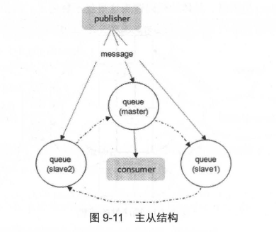

# 第九章 RabbitMQ 高阶（实现原理）

**了解RabbitMQ的实现原理非常必要，它有助于我们在遇到问题时能够透过表象看清本质。比如：**

1. 一个队列的内部存储实际上是由5个子队列来协作的
2. 队列中的消息可能有4种不同的状态。

**通过这些原理，我们可以明白在使用RabbitMQ时要尽量避免消息堆积过多，否则可能会影响整体服务的性能。**


## 9.1 存储机制

无论是持久化消息还是非持久化消息，都可以被写入磁盘。

+ 持久化的消息在到达队列时就会被写入磁盘，并且如果可能的话，也会在内存中保存一份备份，以提高性能。当内存不足时，备份会从内存中清除。
+ 非持久化的消息通常只保存在内存中，但在内存紧张时会被换入磁盘以节省内存空间。
+ RabbitMQ中这两种消息的磁盘处理都在“持久层”中完成。

持久层是一个逻辑概念，实际由两个部分组成：

1. 队列索引（`rabbit_queue_index`）：负责维护队列中磁盘消息的相关信息，比如消息的存储位置、是否已被交付给消费者、是否已被消费者ack等。
2. 消息存储（`rabbit_msg_store`）：以键值对的形式存储消息，它被所有队列共享， 在每个节点中有且只有一个。

从技术层面上，`rabbit_msg_store`可以细分为两个部分：

1. `msg_store_persistent`负责持久化消息的存储，确保在重启后消息不会丢失；
2. `msg_store_transient`则负责非持久化消息的存储，重启后这些消息会丢失。
3. 通常，我们将这两个部分一起看作一个整体的`rabbit_msg_store`。

消息（包括消息体、属性和headers）可以直接存储在`rabbit_queue_index`中，也可以存储在`rabbit_msg_store`中。

默认情况下，`$RABBITMQ_HOME/var/lib/mnesia/rabbit@$HOSTNAME/`路径下会包含`queues`、`msg_store_persistent`、`msg_store_transient`这三个文件夹，用于分别存储对应的信息。

------

**最佳的配置：**

+ 较小的消息存储在`rabbit_queue_index`中
+ 较大的消息存储在`rabbit_msg_store`中

消息大小的界定可以通过配置`queue_index_embed_msgs_below`来设置，默认值为4096字节（B）。

> 这里的大小指的是消息体、属性和headers的总大小。当消息小于设定的大小时，它会存储在`rabbit_queue_index`中，从而提升性能。

`rabbit_queue_index`中的消息以顺序段文件存储，文件名从0开始累加，后缀为`.idx`。每个段文件包含固定数量的记录，默认是16384条记录。

+ 每次从磁盘读取`rabbit_queue_index`中的消息时，至少需要在内存中加载一个段文件。
+ 因此，调整`queue_index_embed_msgs_below`的值时需要谨慎，因为即使是小幅度的增大，也可能导致内存占用急剧增长。

所有经过`rabbit_msg_store`处理的消息都会以追加的方式写入文件。

+ 当文件大小超过指定限制（`file_size_limit`）时，会关闭当前文件并创建新文件继续写入。
+ 文件名（后缀是`.rdq`）从0开始累加，因此文件名最小的文件是最老的文件。

**在存储过程中，RabbitMQ会在Erlang的ETS（Erlang Term Storage）表中记录每条消息在文件中的位置映射（`Index`）和文件的相关信息（`FileSummary`）。**

1. 在读取消息时，RabbitMQ首先根据消息的ID（`msg_id`）找到对应的存储文件。
2. 如果文件存在且没有被锁住，它会直接打开文件并从指定位置读取消息。
3. 如果文件不存在或被锁住，则会发送请求，由`rabbit_msg_store`处理。

**消息的删除操作只是从ETS表中移除指定消息的相关信息，同时更新消息对应存储文件的相关数据。**

1. 在文件中，消息并不会立即被删除，而是仅标记为垃圾数据。
2. 只有当一个文件中全部数据都是垃圾数据时，才会删除这个文件。
3. 当检测到前后两个文件中的有效数据可以合并为一个文件，并且所有垃圾数据的大小占比超过设置的垃圾比例阈值（`GARBAGE_FRACTION`，默认为0.5）时，垃圾回收才会触发，两个文件会被合并。

进行文件合并时，必须是逻辑上相邻的两个文件。合并过程首先会锁定这两个文件，整理前一个文件中的有效数据，再将后一个文件中的有效数据写入到前一个文件，并更新ETS表中关于消息的记录。最后，删除后一个文件。


### 9.1.1 队列的结构

**通常，队列由`rabbit_amqqueue_process`和`backing_queue`两部分组成：**

1. `rabbit_amqqueue_process`负责处理与协议相关的消息，比如接收生产者发布的消息、向消费者交付消息、处理消息确认（包括生产端的`confirm`和消费端的`ack`）等。
2. `backing_queue`则是消息存储的具体实现和引擎，它向`rabbit_amqqueue_process`提供相关接口供其调用。

**如果消息投递的目标队列为空且有消费者订阅了该队列，消息会直接发送给消费者，而不会经过队列存储。**

当消息无法直接投递给消费者时，它会暂时存入队列，以便重新投递。**存入队列的消息并不会固定不变，它会随着系统负载的变化在队列中流动，消息的状态也会不断变化。RabbitMQ中的队列消息可能会处于以下四种状态：**

1. **alpha**: 消息内容（包括消息体、属性和headers）以及消息索引都存储在内存中。
2. **beta**: 消息内容存储在磁盘中，消息索引存储在内存中。
3. **gamma**: 消息内容存储在磁盘中，消息索引同时存储在磁盘和内存中。
4. **delta**: 消息内容和索引都存储在磁盘中。

对于持久化消息，消息内容和消息索引必须首先保存在磁盘上，才能处于上述四种状态之一。**而gamma状态的消息只有持久化消息才会有。**

------

RabbitMQ在运行时会根据统计的消息传送速度定期计算当前内存中能够保存的最大消息数量（`target_ram_count`）。当**alpha**状态的消息数量超过此值时，消息会发生状态转换，多余的消息可能会转为**beta**、**gamma**或**delta**状态。

这四种状态的主要作用是满足不同的内存和CPU需求：

1. **alpha**状态最耗内存，但消耗CPU较少；
2. **delta**状态几乎不消耗内存，但需要更多的CPU和磁盘I/O操作；**delta**状态的消息读取需要执行两次I/O操作——一次读取消息索引（从`rabbit_queue_index`中），一次读取消息内容（从`rabbit_msg_store`中）；
3. 而**beta**和**gamma**状态的消息只需要一次I/O操作（从`rabbit_msg_store`中）就能读取。

**对于没有设置优先级和镜像的普通队列，`backing_queue`的默认实现是`rabbit_variable_queue`，它通过五个子队列（Q1、Q2、Delta、Q3、Q4）来体现消息的不同状态。**


整个队列包括`rabbit_amqqueue_process`和`backing_queue`的各个子队列，队列的结构大致如下：

- **Q1**和**Q4**只包含**alpha**状态的消息。
- **Q2**和**Q3**包含**beta**和**gamma**状态的消息。
- **Delta**只包含**delta**状态的消息。

通常情况下，消息会按照`Ql → Q2 → Delta → Q3 → Q4`的顺序流动，但并不是每条消息都一定会经历所有的状态，具体情况取决于系统的负载状况。消息从**Q1**到**Q4**的过程基本是从内存到磁盘，再从磁盘回到内存的过程。

> 这样，在队列负载较高时，部分消息会存入磁盘以节省内存，而当负载降低时，这些消息又会回到内存中供消费者读取，使得整个队列具备较好的弹性。

> 消费者获取消息时也会触发消息的状态转换。
>
> + 消费者首先会从**Q4**中获取消息，如果成功获取则返回。
> + 如果**Q4**为空，系统会尝试从**Q3**中获取消息。此时，如果**Q3**为空，则返回队列为空，意味着队列中没有消息。
> + 如果**Q3**不为空，系统会取出**Q3**中的消息，并检查**Q3**和**Delta**中的消息数量。
>   + 如果这两个队列都为空，则可以认为**Q2**、**Delta**、**Q3**和**Q4**都为空，此时会将**Q1**中的消息转移至**Q4**，下次会直接从**Q4**中获取消息。
>   + 如果**Q3**为空但**Delta**不为空，则会将**Delta**中的消息转移到**Q3**，下次可以直接从**Q3**中获取消息。
>   + 在将消息从**Delta**转移到**Q3**的过程中，消息是按索引分段读取的。首先读取某一段，判断读取的消息个数与**Delta**中的消息个数是否相等。如果相等，说明**Delta**中没有消息了，此时会将**Q2**中的消息和刚读取的消息一起放入**Q3**。如果不相等，则只会将此次读取到的消息转移到**Q3**。
>
> 这里有两个疑问：
>
> 1. 为什么**Q3**为空时可以认为整个队列为空？假设**Q3**为空而**Delta**不为空，那么在从**Q3**取出最后一条消息时，**Delta**中的消息会被转移到**Q3**，这与**Q3**为空的说法矛盾。类似地，如果**Q2**不为空，则在从**Q3**取出最后一条消息时，**Q2**的消息会被移到**Q3**，这也与**Q3**为空矛盾。而且在从**Q3**取出最后一条消息后，如果**Q2**、**Delta**、**Q3**都为空，且**Ql**不为空时，**Ql**中的消息会被转移到**Q4**，这又与**Q4**为空矛盾。
> 2. 为什么当**Q3**和**Delta**都为空时，可以认为**Q2**、**Delta**、**Q3**和**Q4**都为空？这个问题的答案就在于系统会根据当前负载和队列的状态来调整消息的流动。负载较低时，消息会从**Q1**到**Q4**逐步流动，而当负载较高时，消息可能会停滞在较深的队列中，导致处理效率降低。

通常在负载正常的情况下，如果消息的消费速度不低于接收新消息的速度，且不需要保证可靠性（即消息可以丢失），消息可能会一直处于**alpha**状态。

对于设置了`durable`属性的消息，它们会进入**gamma**状态，并且只有在开启`publisher confirm`机制时，消息进入**gamma**状态后才会确认该消息已经接收。如果消息消费速度足够快，内存充足，这些消息也不会继续进入下一个状态。

当系统负载较高时，已接收的消息如果无法及时消费，就会积压在队列中，**导致处理每个消息的平均开销增加，因为要花更多的时间和资源处理堆积的消息，这样，用来处理新流入的消息的能力就会降低，导致后流入的消息又会被积压到很深的队列中。**  之后，会继续增大处理每个消息的平均开销，继而情况变得越来越恶化，使得系统的处理能力大大降低。

**应对这一问题一般有三种措施：**

1. 增加`prefetch_count`的值，即一次性发送更多消息给消费者，从而加快消息消费速度（详见4.9.1节）。
2. 使用`multiple ack`，减少处理`ack`的开销（详见3.5节）。
3. 启用流量控制（详见9.3节）。


### 9.1.2 惰性队列

从RabbitMQ 3.6.0版本开始，引入了惰性队列（Lazy Queue）的概念。惰性队列会尽可能将消息存入磁盘，只有在消费者消费消息时，才会将其加载到内存中。

+ 其主要设计目标是支持更长的队列，也就是能够存储更多的消息。
+ 当消费者因各种原因（如下线、崩溃或维护等）无法及时消费消息，导致消息堆积时，惰性队列就变得非常有用。

**默认情况下，生产者发送消息到RabbitMQ时，队列中的消息会尽量存储在内存中，这样可以更快速地将消息发送给消费者。**

+ 即使是持久化的消息，在写入磁盘的同时，也会在内存中保存一份备份。
+ 当RabbitMQ需要释放内存时，它会将内存中的消息换页至磁盘，这个过程会消耗较长时间，并阻塞队列操作，进而影响接收新消息的能力。
+ 虽然RabbitMQ的开发者在优化相关算法，但在消息量特别大的情况下，效果仍然有限。

**惰性队列会直接将接收到的消息存储到文件系统中，无论消息是否持久化，这样可以减少内存消耗，但会增加磁盘I/O操作。**

+ 如果消息是持久化的，这样的I/O操作是不可避免的，因此惰性队列和持久化消息非常契合。
+ 需要注意的是，如果惰性队列中存储的是非持久化消息，内存使用会保持稳定，但在重启后这些消息会丢失。

队列有两种模式：**default**和**lazy**。

1. 默认模式为**default**，这在RabbitMQ 3.6.0之前的版本中是默认行为，无需更改。
2. **lazy**模式就是惰性队列模式，可以通过调用`channel.queueDeclare`方法时设置，也可以通过`Policy`来设置。如果一个队列同时使用这两种方式设置，`Policy`的设置优先级更高。
3. 如果要通过声明的方式改变现有队列的模式，必须先删除队列，再重新声明一个新的队列。

在队列声明时，可以通过`x-queue-mode`参数来设置队列的模式，取值为`default`和`lazy`。例如，声明一个惰性队列的代码如下：

```java
Map<String, Object> args = new HashMap<String, Object>();
args.put("x-queue-mode", "lazy");
channel.queueDeclare("myqueue", false, false, false, args);
```

对于`Policy`的设置，可以使用以下命令：

```
rabbitmqctl set_policy Lazy "myqueue$" '{"queue-mode":"lazy"}' --apply-to queues
```

惰性队列与普通队列相比，内存开销非常小。

虽然具体数值会根据情况有所不同，但我们可以通过类比来理解：如果发送1000万条消息，每条消息大小为1KB，且没有消费者：

+ 则普通队列会消耗约1.2GB的内存
+ 惰性队列仅消耗约1.5MB的内存

根据官方的测试数据，对于普通队列：

+ 发送1000万条消息需要约801秒，平均发送速度为13000条/秒
+ 使用惰性队列时，发送相同数量的消息需要约421秒，平均发送速度为24000条/秒。

**性能差异的原因是普通队列在内存不足时需要将消息换页到磁盘，而惰性队列则减少了内存消耗，尽管可能需要更多的磁盘I/O。**

> 如果有消费者消费时，惰性队列会耗费将近 40MB 的空间来发送消息，对于一个 消费者的情况，平均的消费速度约为 14000条/秒。

如果想将普通队列转换为惰性队列，需要首先将内存中的消息换页到磁盘，之后才能开始接收新消息。而将惰性队列转换为普通队列时，和恢复一个队列执行同样的操作，需要将磁盘中的消息批量地导入到内存中。。


## 9.2 内存以及磁盘告警

**当RabbitMQ的内存使用超过配置的阈值，或者磁盘剩余空间低于配置的阈值时，RabbitMQ会暂时阻塞客户端连接，并停止接收客户端发送的消息，以避免服务崩溃。**

同时，客户端与服务端的心跳检测也会失效。可以通过命令行或者Web管理界面查看RabbitMQ的状态。例如，使用命令`rabbitmqctl list connections`可以查看连接的状态。


被阻塞的 Connection 的状态要么是 blocking，要么是 blocked。

+ blocking 对应于并不试图发送消息的 Connection，比如消费者关联的 Connection，这种状态下的 Connection 可以继续运行。
+ 而 blocked 对应于一直有消息发送的 Connection，这种状态下的 Connection会被停止发送消息。 

**需要注意的是，在一个集群中，如果某个Broker节点的内存或磁盘受限，这会导致整个集群中的所有连接都被阻塞。**

**理想情况下，当发生阻塞时，RabbitMQ应该只阻止生产者而不影响消费者的运行。**

然而，在AMQP协议中，一个信道（Channel）可以同时承载生产者和消费者，而一个连接（Connection）中也可以包含多个生产者和消费者的信道，这样就可能导致阻塞逻辑混乱。

**虽然大多数情况下不会出现问题，但为了避免这种情况，建议将生产者和消费者的逻辑分配到独立的Connection中，从而使两者之间不发生任何交集。**

客户端程序可以通过添加`BlockedListener`来监控连接的阻塞状态，相关示例可以参考代码清单 7-11 。


### 9.2.1 内存告警

RabbitMQ 服务器会在启动或者执行 `rabbitmqctl set_vm_memory_high_watermark fraction` 命令时计算系统内存的大小。

> 默认情况下 vm memory high watermark 的值为 0.4， 即内存阈值为 0.4， 表示当 RabbitMQ 使用的内存超过 40%时，就会产生内存告警井阻塞所有生产者的连接 。
>
> 一旦告警被解除(有消息被消费或者从内存转储到磁盘等情况的发生)， 一切都会恢复正常。

默认情况下将 RabbitMQ 所使用内存阈值设置为 40%， 这并不意味着此时 RabbitMQ 不能使用超过 40%的内 存，这仅仅只是限制了 RabbitMQ 的消息生产者。在最坏的情况下， Erlang 的垃圾回收机制会导致两倍的内存消耗，也就是 80%的使用占比 。

内存阔值可以通过 rabbitmq.config 配置文件来配置，下面 示例中设置了默认的内存阈值为 0.4:

```
[
	{
		rabbit,[
			{vm_memory_high_watermark, 0.4}
		]
	}
]
```

与此配置对应的 rabbitmqctl 系列的命令为 : 

```
rabbitmqctl set_vm_memory_high_watermark {fraction}
```

> fraction 对应上面配置中的 0.4，表示占用内存的百分比，取值为大于等于 0 的浮点数。 设置对应的百分比值之后， RabbitMQ 中会打印服务日志。

当在内存为 7872MB 的节点中设置内存阈值为 0.4时， 会有如下信息 :

```
=INFO REPORT==== 4-Sep - 2017::20:30:09 === 
Memory limit set to 3148MB of 7872MB total.
```

此时又将 fraction 设置为 0.1，同时发出了内存告警，相应的服务日志会打印如下信息:

```
=INFO REPORT==== 4-Sep - 2017::20:30:09 === 
Memory limit set to 787MB of 7872MB total.

=INFO REPORT==== 4-Sep - 2017::20:30:09 === 
vm_memory_high_watermark set. Memory used:1163673112 allowed:825482444.

=INFO REPORT==== 4-Sep - 2017::20:30:09 === 
memory resource 1imit a1arm set on node rabbit@node1. 

Pub1ishers wi11 be blocked until this alarm clears
```

之后又设置 fraction 为 0.4 以消除内存告警 ，相应的服务日志会打印如下信息 :

```
=INFO REPORT==== 4-Sep - 2017::20:30:09 === 
vm_memory_high_watermark clear. Memory used:93482232 allowed:825482444.

=INFO REPORT==== 4-Sep - 2017::20:30:09 === 
memory resource 1imit alarm cleared on node rabbit@node1

=INFO REPORT==== 4-Sep - 2017::20:30:09 === 
memory resource limit alarm cleared across the cluster
```

**如果设置 fraction 为 0，所有的生产者都会被停止发送消息 。**

+ 这个功能可以适用于需要禁止集群中所有消息发布的情况。
+ 正常情况下建议取值在 0.4 到 0.66 之间， 不建议取值超过 0.7。

假设机器的内存为 4GB ， 那么就代表 RabbitMQ 服务的内存阈值的绝对值为 4GB x 0.4=1.6 GB。 

> 如果是 32 位的 Windows 操作系统，那么可用内存被限制为 2GB，也就意味着 RabbitMQ 服务的内存阈值的绝对值为 820MB 左右。

除了通过百分比的形式， RabbitMQ 也可以采用绝对值的形式来设置内存阈值 ， 默认单位为 B。 同理，可以通过 rabbitmqctl 系列命令进行设置。

> rabbitmqctl 命令，在服务器重启之后所设置的阈值都会失效，而通过配置文件的方式设置的阈值则不会在重启之后失效，但是修改后的配置需要在重启之后才能生效 。

------

**在某个 Broker 节点触及内存井阻塞生产者之前，它会尝试将队列中的消息换页到磁盘以释放内存空间。**

+ 持久化和非持久化的消息都会被转储到磁盘中
+ 其中持久化的消息本身就在磁盘中有一份副本，这里会将持久化的消息从内存中清除掉

默认情况下，在内存到达内存阈值的 50% 时会进行换页动作。也就是说，在默认的内存阈值为 0.4 的情况下，当内存超过 0.4x0.5=0.2 时会进行换页动作。

可以通过在配置文件中配置 vm_memory_high_watermark_paging_ratio 项来修改此值 。 下面示例中将换页比率从默认的 0.5 修改为 0.75:

```
[
	{
		rabbit,[
			{vm_memory_high_watermark_paging_ratio, 0.75}
			{vm_memory_high_watermark, 0.4}
		]
	}
]
```

**上面的配置会在 RabbitMQ 内存使用率达到 30% 时进行换页动作，并在 40% 时阻塞生产者。** 

> 可以将 vm memory high watermark paging ratio 值设置为大于 1 的浮点数，这种配 置相当于禁用了换页功能。注意这里 RabbitMQ 中井没有类似 rabbitmqctl vm m em ory high watermark paging ratio {xxx} 的命令。


### 9.2.2 磁盘告警

**当RabbitMQ的剩余磁盘空间低于设定的阈值时，它会阻塞生产者，以避免因非持久化消息的不断换页耗尽磁盘空间，导致服务崩溃。**

+ 默认情况下，磁盘阈值为50MB，也就是说，当磁盘剩余空间低于50MB时，RabbitMQ会阻塞生产者并停止内存中消息的换页动作。
+ 这个阈值可以调整，但不能完全消除因磁盘耗尽而导致的崩溃风险。比如在两次检测之间，磁盘空间可能从大于50MB 降到 0MB。
+ 一个相对谨慎的做法是将磁盘阈值设置为与操作系统所显示的内存大小一致。

**RabbitMQ会定期检查磁盘剩余空间，检查频率与剩余空间大小有关。正常情况下，每10秒检测一次，当磁盘剩余空间接近阈值时，检测频率会增加，最高可达到每秒10次，以便更快响应磁盘空间变化，但也可能增加系统负载。**

磁盘阈值可以通过配置文件中的`disk_free_limit`项进行设置。例如，可以将磁盘阈值设置为1GB，配置如下：

```
[
	{
		rabbit,[
			{disk_free_limit, 1000000000}
		]
	}
]
```

也可以使用单位进行设置（如KB、MB、GB等）。此外，可以根据机器内存大小设置相对磁盘阈值，例如：

```
rabbit, [{disk_free_limit, "1GB"}]
```

还可以参考机器内存的大小为磁盘阈值设置一个相对的比值。比如将磁盘阈值设置为与集群内存一样大:

```
[
	{
		rabbit,[
			{disk_free_limit, {mem_relative, 1.0}}
		]
	}
]
```

与绝对值和相对值这两种配置对应的 rabbitmqctl 系列的命令为: 

+ `rabbitmqctl set_disk_free_limit {disk_limit}`
+ `rabbitmqctl set_disk_free_limit_mem_relative {fraction} `

和内存阈值的设置命令一样， Broker 重启之后将会失效。同样，通过配置文件的方式设置的阑值则不会在重启之后失效，但是修改后的配置需要在重启之后才能生效。

正常情况下，建议 disk_free_limit_mem_relative 的取值为1.0 和 2.0 之间。


## 9.3 流控

RabbitMQ可以对内存和磁盘使用量设置阈值，当达到这些阈值时，生产者会被阻塞，直到资源恢复正常。

**除了内存和磁盘阈值，从2.8.0版本开始，RabbitMQ还引入了流控机制，以确保系统稳定性。流控机制是为了避免消息发送速率过快，导致服务器无法承受。**

+ 内存和磁盘告警触发的是全局流控（Global Flow Control），会阻塞集群中所有的连接。
+ 而本节讨论的流控机制是针对单个连接的，可以称为每连接流控（Per-Connection Flow Control）或内部流控（Internal Flow Control）。

### 9.3.1 流控的原理

Erlang 进程之间不共享内存，而是通过消息传递来通信，每个进程都有自己的进程邮箱。

+ 默认情况下，Erlang 没有对进程邮箱的大小设置限制，因此当大量消息持续发送到某个进程时，进程的邮箱可能会变得非常大，最终导致内存溢出并崩溃。
+ 在RabbitMQ中，如果生产者以很高的速率发送消息，而消费者消费速度较慢，没有流控机制时，进程邮箱可能会迅速达到内存阈值。

**为了避免这个问题，RabbitMQ使用了一种基于信用证算法（credit-based algorithm）的流控机制来限制消息的发送速率。**

1. 它通过监控各个进程的邮箱，当某个进程负载过高而来不及处理消息时，这个进程的进程邮箱就会开始堆积消息 ；
2. 当进程的邮箱堆积到一定量时，就会阻塞而不再接收上游的新消息；
3. 这样，上游进程的邮箱也会开始堆积消息；
4. 当上游堆积到一定量时也会阻塞而停止接收上游的上游的消息，最后就会使负责网络数据包接收的进程阻塞而暂停接收新的数据 。

------


以图 9-4 为例，进程 A 接收消息并转发到进程 B，进程 B 接收消息并转发到进程 C ：

+ 每个进程都有一对关于收发消息的信用值 credit值 。以进程B为例：
  + `{{credit from, C}, value}` 表示能发送多少条消息给 C，发送一条消息时该值减 1，当为 0 时，进程 B 停止向 C 发送消息，也不再接收来自 A 的消息。
  + `{{credit to, A}, value}` 表示接收多少条消息后会向 A 发送增加信用值的通知。进程 A 接收到通知后，增加相应的信用值，从而可以继续发送消息。
+ 当上游发送速率高于下游接收速率时， credit 值就会被逐渐耗光，这时进程就会被阻塞，阻塞的情况会一直传递到最上游。
+ 当上游进程收到来自下游进程的增加 credit 值的通知时，若此时上游进程处于阻塞状态则解除阻塞，开始接收更上游进程的消息，一个一个传导最终能够解除最上游的阻塞状态。

**由此可知，基于信用证的流控机制最终将消息发送进程的发送速率限制在消息处理进程的处理能力范围之内。**

> 一个连接 (Connection) 触发流控时会处于 "flow" 的状态，也就意味着这个 Connection 的状态每秒在 blocked 和 unblocked 之间来回切换数次，这样可以将消息发送的速率控制在服务器能够支撑的范围之内。

可以通过 rabbitmqctl list connections 命令或者 Web 管理界面来查看 Connection 的状态，如图 9-5 所示。


------

处于 flow 状态的 Connection 和处于 running 状态的 Connection 并没有什么不同，这个状态只是告诉系统管理员相应的发送速率受限了。 而对于客户端而言 ，它看到的只是服务器的带宽要比正常情况下要小一些。

**流控机制不只是作用于 Connection，同样作用于信道和队列 。 从 Connection 到 Channel，再到队列，最后是消息持久化存储形成一个完整的流控链，对于处于整个流控链中的任意进程，只要该进程阻塞，上游的进程必定全部被阻塞 。**

也就是说，如果某个进程达到性能瓶颈，必然会导致上游所有的进程被阻塞。所以我们可以利用流控机制的这个特点找出瓶颈之所在 。 处理消息的几个关键进程及其对应的顺序关系如图 9-6 所示 。


其中的各个进程如下所述：

+ **Rabbit Reader**：处理连接的进程，负责接收和解析AMQP协议数据包等。
+ **Rabbit Channel**：处理通道的进程，负责处理AMQP协议中的各种方法并进行路由解析等。
+ **Rabbit AMQQueue Process**：队列的处理进程，负责实现队列的所有逻辑。
+ **Rabbit Msg Store**：负责实现消息的持久化。

**当某个 Connection 处于 flow 状态，但这个 Connection 中没有一个 Channel 处于 flow 状态时，这就意味这个 Connection 中有一个或者多个 Channel 出现了性能瓶颈 。**

+ 某些 Channel 进程的运作（比如处理路由逻辑）会使得服务器 CPU 的负载过高从而导致了此种情形 。
+ 尤其是在发送大量较小的非持久化消息时，此种情形最易显现。

**当某个 Connection 处于 flow 状态 ，并且这个 Connection 中也有若干个 Channel 处于 flow 状态，但没有任何一个对应的队列处于 flow 状态时，这就意味着有一个或者多个队列出现了性能瓶颈。**

+ 这可能是由于将消息存入队列的过程中引起服务器 CPU 负载过高，或者是将队列中 的消息存入磁盘的过程中引起服务器 IO 负载过高而引起的此种情形。
+ 尤其是在发送大量较小的持久化消息时，此种情形最易显现。

**当某个 Connection 处于 flow 状态 ，同时这个 Connection 中也有若干个 Channel 处 于 flow 状态，井且也有若干个对应的队列处于 flow 状态时，这就意味着在消息持久化时出现了性能瓶颈。**

+ 在将队列中的消息存入磁盘的过程中引起服务器 IO 负载过高而引起的此种情形。
+ 尤其 是在发送大量较大的持久化消息时，此种情形最易显现。


### 9.3.2 案例：打破队列的瓶颈


图 9-6 中描绘了一条消息从接收到存储的一个必需的流控连。

+ 一般情况下，向一个队列里推送消息时，往往会在 rabbit_amqqueue_process 中（即队列进程中）产生性能瓶颈。
+ 在向一个队列中快速发送消息的时候， Connection 和 Channel 都会处于 flow 状态，而队列处于 running 状态。

这样通过 9.3.1 节末尾的分析可以得出在队列进程中产生性能瓶颈的结论。

> 在一台 CPU 主频为 2.6Hz、 CPU 内核为 4、内存为 8GB、磁盘为 40GB 的虚拟机中测试向单个队列中发送非持久化、大小为 10B 的消息，消息发送的 QPS 平均为 18k 左右。如果开启 publisher confirm 机制、持久化消息及增大 payload 都会降低这个 QPS 的数值。

**这里就引入了本节所要解决的问题：如何提升队列的性能？**

**一般可以有两种解决方案：**

1. 是开启 Erlang 语言的 HiPE 功能，这样保守估计可以提高 30%~40%的性能，不过在较旧版本的 Erlang 中，这个功能不太稳定，建议使用较新版本的 Erlang，版本至少是 18.x。不管怎样， HiPE 显然不是本节的主题。

**第二种是寻求打破 rabbit amqqueue process 的性能瓶颈。这里的打破是指以多个 rabbit_amqqueue_process 替换单个 rabbit_amqqueue_process，这样可以 充分利用上 rabbit reader 或者 rabbit channel 进程中被流控的性能，如图 9-7 所示。**

> **Rabbit AMQQueue Process**：队列的处理进程，负责实现队列的所有逻辑。


**这里读者会有疑问，这不就变成了多个队列了吗？**

> 的确，如果在应用代码中直接使用多个队列，则会侵入原有代码的逻辑使其复杂化，同时可读性也差。这里所要做的一件事就是封装。 
>
> 将交换器、队列、绑定关系、生产和消费的方法全部进行封装，这样对于应用来说好比在操作一个逻辑队列。

**为了将封装表述地更加清晰 ， 这里分三个步骤来讲述其中的实现细节：**

1. **声明交换器、 队列 、 绑定关系** 
2. **封装生产者**
3. **封装消费者**

不管是哪个步骤，都需要先与 Broker 建立连接，可以参考代码清单 7-13 中 AMQPPing 类 的实现方式来完成连接的逻辑。

+ 声明交换器和原先的实现没有什么差别；
+ 但是声明队列和绑定 关系就需要注意了，在这个逻辑队列背后是多个实际的物理队列。物理队列的个数需要事先规划好，对于这个个数我们也可以称之为" 分片数"，即代码清单 9-1 中的 subdivisionNumo 假设这里的分片数为 4 个；

实际声明队列和绑定关系就各自需要 4 次。

> 比如逻辑队列名称为 "queue"， 那么就需要转变为类似 "queue_0"、 "queue_1"、 "queue-2"、 "queue-3" 这 4个物理队列，类似的路由键也需要从"rk" 转变为 "rk_0"、rk_1"、 "rk_2"、 "rk_3"；最后达到如图 9-8 所示的效果。

至于用 "_" 进行分割还是用 "@" 或者 "#" 之类的可以任凭开发者的喜好，这样做只是为了增加辨识度。


**声明交换器、队列、绑定关系的示例代码如代码清单 9-1 所示。**

**代码清单 9-1 封装声明的示例代码:**

```java
import com.rabbitmq.client.*;

import java.io.IOException;
import java.util.Map;
import java.util.HashMap;
import java.util.concurrent.TimeoutException;

public class RmqEncapsulation {
    private static String host = "localhost";
    private static int port = 5672;
    private static String vhost = "/";
    private static String username = "guest";
    private static String password = "guest";
    private static Connection connection;
    private static int subdivisionNum; // 分片数，表示一个逻辑队列背后的实际队列数

    // 构造函数
    public RmqEncapsulation(int subdivisionNum) {
        this.subdivisionNum = subdivisionNum;
    }

    // 创建 Connection
    public static void newConnection() throws IOException, TimeoutException {
        ConnectionFactory connectionFactory = new ConnectionFactory();
        connectionFactory.setHost(host);
        connectionFactory.setVirtualHost(vhost);
        connectionFactory.setPort(port);
        connectionFactory.setUsername(username);
        connectionFactory.setPassword(password);

        // 创建连接
        connection = connectionFactory.newConnection();
    }

    // 获取 Connection，若为 null 则调用 newConnection 进行创建
    public static Connection getConnection() throws IOException, TimeoutException {
        if (connection == null) {
            newConnection();
        }
        return connection;
    }

    // 关闭 Connection
    public static void closeConnection() throws IOException {
        if (connection != null) {
            connection.close();
        }
    }

    // 声明交换器
    public void exchangeDeclare(Channel channel, String exchange, boolean durable, boolean autoDelete, Map<String, Object> arguments) throws IOException {
        channel.exchangeDeclare(exchange, "direct", durable, autoDelete, arguments); // 假设交换器类型为 direct
    }

    // 声明队列
    public void queueDeclare(Channel channel, String queue, boolean durable, boolean exclusive, boolean autoDelete, Map<String, Object> arguments) throws IOException {
        for (int i = 0; i < subdivisionNum; i++) {
            String queueName = queue + "_" + i; // 使用下划线分隔队列名称和分片数
            channel.queueDeclare(queueName, durable, exclusive, autoDelete, arguments);
        }
    }

    // 创建绑定关系
    public void queueBind(Channel channel, String queue, String exchange, String routingKey, Map<String, Object> arguments) throws IOException {
        for (int i = 0; i < subdivisionNum; i++) {
            String routingKeyName = routingKey + "_" + i; // 使用下划线分隔路由键和分片数
            String queueName = queue + "_" + i;
            channel.queueBind(queueName, exchange, routingKeyName, arguments);
        }
    }

    // 示例代码：生产者发送消息
    public void sendMessage(Channel channel, String exchange, String routingKey, String message) throws IOException {
        channel.basicPublish(exchange, routingKey, null, message.getBytes());
    }

    // 示例代码：消费者消费消息
    public void consumeMessages(Channel channel, String queue, DeliverCallback deliverCallback, CancelCallback cancelCallback) throws IOException {
        channel.basicConsume(queue, true, deliverCallback, cancelCallback);
    }

    // 示例的回调方法
    public static DeliverCallback deliverCallback = (consumerTag, delivery) -> {
        String message = new String(delivery.getBody(), "UTF-8");
        System.out.println("Received message: " + message);
    };

    public static CancelCallback cancelCallback = consumerTag -> {
        System.out.println("Consumer was canceled");
    };
    
    public static void main(String[] args) {
        try {
            RmqEncapsulation rmqEncapsulation = new RmqEncapsulation(3); // 设置分片数为3
            Connection connection = RmqEncapsulation.getConnection();
            Channel channel = connection.createChannel();

            // 声明交换器和队列
            Map<String, Object> argsMap = new HashMap<>();
            rmqEncapsulation.exchangeDeclare(channel, "test_exchange", true, false, argsMap);
            rmqEncapsulation.queueDeclare(channel, "test_queue", true, false, false, argsMap);
            rmqEncapsulation.queueBind(channel, "test_queue", "test_exchange", "test_routingKey", argsMap);

            // 发送消息
            rmqEncapsulation.sendMessage(channel, "test_exchange", "test_routingKey", "Hello RabbitMQ!");

            // 消费消息
            rmqEncapsulation.consumeMessages(channel, "test_queue", deliverCallback, cancelCallback);

            // 关闭连接
            RmqEncapsulation.closeConnection();
        } catch (IOException | TimeoutException e) {
            e.printStackTrace();
        }
    }
}

```

上述示例中，`queueDeclare` 方法是为单个 Broker 设计的，如果是集群环境，`queueDeclare` 方法需要修改，以便将分片队列均匀分布到集群的各个节点，从而实现负载均衡。具体实现可以参考代码清单 7-6。

**代码清单 9-2 中演示了如何使用 RmqEncapsulation 类来声明交换器 "exchange"、队列 "queue" 及之间的绑定关系。**

```java
RmqEncapsulation rmqEncapsulation = new RmqEncapsulation(4); // Initialize with 4 subdivisions

try {
  // Get connection and create channel
  Connection connection = rmqEncapsulation.getConnection();
  Channel channel = connection.createChannel();

  // Declare exchange, queue and bind queue to exchange
  rmqEncapsulation.exchangeDeclare(channel, "exchange", "direct", true, false, null);
  rmqEncapsulation.queueDeclare(channel, "queue", true, false, false, null);
  rmqEncapsulation.queueBind(channel, "queue", "exchange", "rk", null);

} catch (IOException | TimeoutException e) {
  e.printStackTrace();
} finally {
  try {
    // Close the connection in the finally block to ensure proper resource cleanup
    RmqEncapsulation.closeConnection();
  } catch (IOException e) {
    e.printStackTrace();
  }
}
```

**生产者的封装代码非常简单，只需要转换下原先的路由键即可，代码清单 9-3 给出了具体实现。**

```java
// 生产者的封装代码
public void basicPublish(Channel channel, String exchange, String routingKey, boolean mandatory, AMQP.BasicProperties props, byte[] body) throws IOException {
    // 随机挑选一个队列发送
    Random random = new Random();
    int index = random.nextInt(subdivisionNum); // 随机选择一个队列编号
    String rkName = routingKey + " " + index;    // 为不同的队列生成唯一的 routing key

    // 发布消息到随机选择的队列
    channel.basicPublish(exchange, rkName, mandatory, props, body);
}


//basicPublish 方法的使用示例如下 :
for (int i = 0; i < 100; i++) {
  // 创建消息对象
  Message message = new Message();
  message.setMsgSeq(i);  // 设置消息序列号
  message.setMsgBody("rabbitmq encapsulation");  // 设置消息体内容

  // 将消息对象转换为字节数组
  byte[] body = getBytesFromObject(message);

  // 发布消息
  rmqEncapsulation.basicPublish(channel, "exchange", "rk", false,                             MessageProperties.PERSISTENT_TEXT_PLAIN, body);
}

```

**代码清单 9-3 中演示的是发送 100 条消息的情况。 细心的读者可能会注意到这里引入了两个新的东西：Message 类和 getBytesFrornObject 方法。**

**Message 类的是用来封装消息的， 具体定义如代码清单 9-4 所示。**

```java
// Message 类的实现
import java.io.Serializable;

public class Message implements Serializable {
    private static final long serialVersionUID = 1L;  // 修复了语法错误

    private long msgSeq;  // 消息序列号
    private String msgBody;  // 消息体
    private long deliveryTag;  // 消息的 deliveryTag

    // 省略 Getter 和 Setter 方法
    @Override
    public String toString() {
        return "[msgSeq=" + msgSeq + ", msgBody=" + msgBody + ", deliveryTag=" + deliveryTag + "]";
    }
}
```

+ Message 类中的 msgSeq 表示消息的序号，本节末尾的内容会用到这个成员变量。 
+ msgBody 表示消息体本身。
+ deliveryTag 用于消息确认，详细可以参考 3.5 节的内容 。 

getBytesFrornObject 方法 ， 还有与其对应的 getObjectFrornBytes 方法分别用来将对象转换为字节数组和将字节数组转换为对象，具体的实现非常简单，可以参考代码清单 9-5。

```java
import java.io.*;

public class ObjectUtils {
    public static byte[] getBytesFromObject(Object object) throws IOException {
        if (object == null) {
            return null;
        }
        ByteArrayOutputStream bo = new ByteArrayOutputStream();
        ObjectOutputStream oo = new ObjectOutputStream(bo);
        oo.writeObject(object);
        oo.close();
        bo.close();
        return bo.toByteArray();
    }

    public static Object getObjectFromBytes(byte[] body) throws IOException, ClassNotFoundException {
        if (body == null || body.length == 0) {
            return null;
        }
        ByteArrayInputStream bi = new ByteArrayInputStream(body);
        ObjectInputStream oi = new ObjectInputStream(bi);
        Object object = oi.readObject();
        oi.close();
        bi.close();
        return object;
    }
}
```

图 9-9 展示了封装后的逻辑队列（即 4 个物理队列——和单个独立队列之间的 QPS 对比，测试环境同本节开篇所述 。

**可以看到封装后的逻辑队列与原先的单个队列相比性能提升了不止一倍，可以得出打破单个队列进程的性能瓶颈的结论。**


------

**再来看一下消费者的封装代码，这个就略微显得有些复杂了。**

由 3.4 节的介绍可知 ， RabbitMQ 的消费分推模式和拉模式。相对于推模式消费的封装实现，拉模式消费的封装实现还算简单。

**下面首先演示下拉模式的封装实现 ，如代码清单 9-6 所示。**

```java
// 拉模式封装实现
public GetResponse basicGet(Channel channel, String queue, boolean autoAck) throws IOException {
    GetResponse getResponse = null;
    Random random = new Random();
    int index = random.nextInt(subdivisionNum);
    getResponse = channel.basicGet(queue + " " + index, autoAck);
    
    if (getResponse == null) {
        for (int i = 0; i < subdivisionNum; i++) {
            String queueName = queue + " " + i;
            getResponse = channel.basicGet(queueName, autoAck);
            if (getResponse != null) {
                return getResponse;
            }
        }
    }
    return getResponse;
}
```

1. 以上代码中首先随机拉取一个物理队列中的数据，如果返回为空 ，则再按顺序拉取。
2. 这样实现比直接顺序拉取的方式要好很多，因为当生产者发送速度大于消费者消费速度时 ，顺序拉取可能只拉取到第一个物理队列的数据 ，即 "queue_0" 中的数据 ， 而其余 3 个物理队列的数据可能会被长久积压。


------

推模式的封装实现需要在 RmqEncapsulation 类中添加一个 `ConcurrentLinkedDeque<Message>` 类型的成员变量 blockingQueue ，用来缓存推送的数据以方便消费者消费。

具体实现逻辑如代码清单 9-7所示。

```java
// 推模式封装实现
import com.rabbitmq.client.*;
import java.io.IOException;
import java.util.concurrent.ConcurrentLinkedDeque;
import java.util.concurrent.TimeUnit;

public class RmqEncapsulation {
    // 省略 host、 port、 vhost、 username、 password 的定义及实现
  
    private int subdivisionNum; // 分片数，表示一个逻辑队列背后的实际队列数
    private ConcurrentLinkedDeque<Message> blockingQueue; // 阻塞队列

    // 构造函数
    public RmqEncapsulation(int subdivisionNum) {
        this.subdivisionNum = subdivisionNum;
        this.blockingQueue = new ConcurrentLinkedDeque<>(); // 初始化队列
    }

    // 省略 newConnection 方法、getConnection 方法、closeConnection 方法的实现
    // 省略 exchangeDeclare 方法、queueDeclare 方法、queueBind 方法的实现
		// 省略 basicPublish 方法和 basicGet 方法的实现
    

    // 开始消费
    private void startConsume(Channel channel, String queue, boolean autoAck, String consumerTag, ConcurrentLinkedDeque<Message> newblockingQueue) throws IOException {
        for (int i = 0; i < subdivisionNum; i++) {
            String queueName = queue + " " + i;
          	// 用到封装后的 NewConsumer
            channel.basicConsume(queueName, autoAck, consumerTag + i, new NewConsumer(channel, newblockingQueue));
        }
    }

    // 消费消息
    public void basicConsume(Channel channel, String queue, boolean autoAck, String consumerTag, ConcurrentLinkedDeque<Message> newblockingQueue, IMsgCallback iMsgCallback) throws IOException {
        startConsume(channel, queue, autoAck, consumerTag, newblockingQueue);
        while (true) {
            Message message = newblockingQueue.peekFirst();
            if (message != null) {
                ConsumeStatus consumeStatus = iMsgCallback.consumeMsg(message);
                newblockingQueue.removeFirst();
                if (consumeStatus == ConsumeStatus.SUCCESS) {
                    channel.basicAck(message.getDeliveryTag(), false);
                } else {
                    channel.basicReject(message.getDeliveryTag(), false);
                }
            } else {
                try {
                    TimeUnit.MILLISECONDS.sleep(100);
                } catch (InterruptedException e) {
                    e.printStackTrace();
                }
            }
        }
    }

    // 消费者类
    public static class NewConsumer extends DefaultConsumer {
        private ConcurrentLinkedDeque<Message> newblockingQueue;

        public NewConsumer(Channel channel, ConcurrentLinkedDeque<Message> newblockingQueue) {
            super(channel);
            this.newblockingQueue = newblockingQueue;
        }

        @Override
        public void handleDelivery(String consumerTag, Envelope envelope, AMQP.BasicProperties properties, byte[] body) throws IOException {
            try {
                Message message = (Message) getObjectFromBytes(body);
                message.setDeliveryTag(envelope.getDeliveryTag());
                newblockingQueue.addLast(message);
            } catch (ClassNotFoundException e) {
                e.printStackTrace();
            }
        }
    }
}
```

代码清单 9-7 的篇幅有点较长 ， 真正在使用推模式消费时调用的方法为 basicConsume，与 原生客户端的方法 channel .basicConsume 类似。

1. 关于 NewConsumer 这个内部类就不多做介绍，其功能只是获取 Broker 中的数据然后存入RmqEncapsulation 的成员变量 blockingQueue 中。
2. 这里需要关注的是 basicConsume 方法中的工 MsgCallback，这是包含一 回调函数 consumeMsg(Message message) 的接口， consumeMsg 方法返回值为一个枚举类型 ConsumeStatus ：
   + 当消费端消费成功后返回 ConsumeStatus.SUCCESS 
   + 反之则返回 ConsumeStatus.FAIL

**有关 IMsgCallback 接口和 ConsumeStatus 的枚举类的定义如代码清单 9-8所示。**

```java
// IMsgCallback 和 ConsumeStatus 的实现
// 消息回调接口
public interface IMsgCallback {
  ConsumeStatus consumeMsg(Message message);
}

// 消费状态枚举
public enum ConsumeStatus {
  SUCCESS,
  FAILURE
}
```

**拉模式的消费非常简单，这里就不做演示了。推模式的消费示例如下:**

```java
// 创建一个频道并设置 QoS
Channel channel = connection.createChannel();
channel.basicQos(64); // 每次最多处理64条消息

// 启动消费，传入队列名、自动确认、消息队列以及消费回调
rmqEncapsulation.basicConsume(channel, "queue", false, "consumer_zzh", rmqEncapsulation.blockingQueue, new IMsgCallback() {

    @Override
    public ConsumeStatus consumeMsg(Message message) {
        ConsumeStatus consumeStatus = ConsumeStatus.FAIL; // 默认消费失败

        // 如果消息不为空，则打印消息内容并将消费状态标记为成功
        if (message != null) {
            System.out.println("Consumed message: " + message); // 打印消费的消息
            consumeStatus = ConsumeStatus.SUCCESS; // 设置为消费成功
        }
        
        // 返回消费状态
        return consumeStatus;
    }
});

```


------

注意要点:

为了简化演示，本节的代码示例省去了很多的功能， 局限性很强，比如：

+ 没有使用 publisher confirm 机制
+ 没有设置 mandatory 参数
+ 只能使用一个 Connection
+ 消息没有使用 Protostuff 这种性能较高的序列化工具进行序列化和反序列化

**如果读者要借鉴本节中的内容，建议进一步优化示例代码。**

> 这里还有 一个问题，在上面的封装示例中消息随机发送和随机消费都会影响到 RabbitMQ 本身消息的顺序性。虽然在 4.9.2 节中我们做过分析，知道 RabbitMQ 消息本身的顺序性比较受限，并非是绝对保证。

**如果应用程序要求有一定的顺序性，井且代码逻辑也能遵循 4.9.2 节中顺序性的要求，那么上面的封装示例就需要修改了。**


如图 9-10 所示 ， 发送端根据 Message 的消息序号 msgSeq 对分片个数进行取模运算，之后将对应的消息发送到对应的队列中，这样消息可以均匀且顺序地在每个队列中存储。

1. 在消费端为每个队列创建一个消息槽 (slot)，从队列中读取的消息都存入对应的槽中，发送到下游的消息可以依次从 slot0 至 slot3 中进行读取。
2. 更严谨的做法是根据上一条消息的 msgSeq，从 slot0 至 slot3 中读取 msgSeq 的消息。
3. 具体的代码逻辑这里就不赘述了，留给读者自己实现。


## 9.4 镜像队列

### 9.4.1 镜像队列的作用

**如果 RabbitMQ集群中只有一个 Broker节点，那么该节点的失效将导致整体服务的临时性不可用，并且也可能会导致消息的丢失。**

1. 可以将所有消息都设置为持久化，并且对应队列的 durable 属性也设置为 true，但是这样仍然无法避免由于缓存导致的问题：因为消息在发送之后和被写入磁盘井执行刷盘动作之间存在一个短暂却会产生问题的时间窗。
2. 通过 publisher confirm 机制能够确保客户端知道哪些消息己经存入磁盘，尽管如此，一般不希望遇到因单点故障导致的服务不可用。

**如果 RabbitMQ 集群是由多个 Broker 节点组成的，那么从服务的整体可用性上来讲，该集群对于单点故障是有弹性的，但是同时也需要注意：**

1. 尽管交换器和绑定关系能够在单点故障问题上幸免于难
2. 但是队列和其上的存储的消息却不行，这是因为队列进程及其内容仅仅维持在单个节点之上，所以一个节点的失效表现为其对应的队列不可用。

**引入镜像队列 (MirrorQueue) 的机制，可以将队列镜像到集群中的其他 Broker节点之上， 如果集群中的一个节点失效了，队列能自动地切换到镜像中的另一个节点上以保证服务的可用性。**



**在通常的用法中，针对每一个配置镜像的队列(以下简称镜像队列〉都包含一个主节点 (master) 和若干个从节点 (slave)，相应的结构可以参考图 9-11。**

1. slave会准确地按照 master 执行命令的顺序进行动作，故 slave 与 master上维护的状态应该是相同的。
2. 如果 master 由于某种原因失效，那么"资历最老"的 slave 会被提升为新的 master。 根据 slave 加入的时间排序，时间最长的 slave 即为"资历最老"。
3. 发送到镜像队列的所有消息会被同时发往 master 和所有的 slave上，如果此时 master挂掉了，消息还会在 slave 上，这样 slave 提升为 master 的时候消息也不会丢失。
4. 除发送消息 (Basic.Publish) 外的所有动作都只会向 master发送，然后再由 master将 命令执行的结果广播给各个 slave 。

**如果消费者与 slave 建立连接井进行订阅消费，其实质上都是从 master 上获取消息，只不过看似是从 slave 上消费而己。**

> 比如消费者与 slave 建立了 TCP 连接之后执行一个 Basic.Get 的操作，那么首先是由 slave 将 Basic.Get 请求发往 master，再由 master 准备好数据返回给 slave，最后由 slave 投递给消费者。

**读者可能会有疑问，大多的读写压力都落到了 master 上， 那么这样是否负载会做不到有效的均衡？**

+ 或者说是否可以像 MySQL 一样能够实现 master 写而 slave读呢？
+ 注意这里的 master和 slave 是针对队列而言的，而队列可以均匀地散落在集群的各个 Broker 节点中以达到负载均衡的目的，因为真正的负载还是针对实际的物理机器而言的，而不是内存中驻留的队列进程。


**在图 9-12 中，集群中的每个 Broker 节点都包含 1 个队列的 master 和 2 个队列的 slave：**

+ Q1 的负载大多都集中在 broker1 上
+ Q2 的负载大多都集中在 broker2 上
+ Q3 的负载大多都集中在 broker3 上

**只要确保队列的 master 节点均匀散落在集群中的各个 Broker 节点即可确保很大程度上的负载均衡（每个队列的流量会有不同，因此均匀散落各个队列的 master也无法确保绝对的负载均衡）。**

> 至于为什么不像 MySQL 一样读写分离， RabbitMQ 从编程逻辑上来说完全可以实现，但是这样得不到更好的收益，即读写分离并不能进一步优化负载，却会增加编码实现的复杂度，增加出错的可能，显得得不偿失。


### 9.4.2 镜像队列注意要点

注意要点:

**RabbitMQ 的镜像队列同时支持 publisher confirm 和 事务两种机制：**

1. 在事务机制中，只有当前事务在全部镜像中执行之后，客户端才会收到 Tx . Commit-Ok 的消息。
2. 同样的，在 publisher confirm 机制中，生产者进行当前消息确认的前提是该消息被全部进行所接收了 。


不同于普通的非镜像队列（参考图 9-2），镜像队列的 backing_queue 比较特殊，其实现井非是 rabbit_variable_queue ，它内部包裹了普通 backing_queue 进行本地消息消息持久化处理，**在此基础上增加了将消息和 ack 复制到所有镜像的功能 。**


**镜像队列的结构可以参考图 9-13：**

+ master 的 backing_queue 采用的是 rabbit_mirror_queue_master
+ slave 的 backing queue 实现是 rabbit mirror queue slave

**所有对 rabbit mirror queue master 的操作都会通过组播 GM(Guaranteed Multicast) 的方式同步到各个 slave 中。**

1. GM 负责消息的广播， rabbit mirror queue slave 负责回调处理，而 master 上的回调处理是由 coordinator 负责完成的 。 
2. 如前所述，除了 Basic.Publish，所有的操作都是通过 master 来完成的， master 对消息进行处理的同时将消息的处理通过 GM 广播给所有的 slave
3. slave 的 GM 收到消息后，通过回调交由 rabbit_mirror queue slave 进行实际的处理。

**GM 模块实现的是一种可靠的组播通信协议，该协议能够保证组播消息的原子性，即保证组中活着的节点要么都收到消息要么都收不到。它的实现大致为:**

1. 将所有的节点形成 一个循环链表，每个节点都会监控位于自己左右两边的节点
2. 当有节点新增时，相邻的节点保证当前广播的消息会复制到新的节点上
3. 当有节点失效时，相邻的节点会接管以保证本次广播的消息会复制到所有的节点
4. 在 master和 slave上的这些 GM 形成一个组 (gm_group)，这个组的信息会记录在Mnesia 中。
5. 不同的镜像队列形成不同的组。

**操作命令从 master 对应的 GM 发出后， 顺着链表传送到所有的节点。由于所有节点组成了一个循环链表， master 对应的 GM 最终会收到自己发送的操作命令，这个时候 master 就知道该操作命令都同步到了所有的 slave 上。**

**新节点的加入过程可以参考图 9-14：整个过程就像在链表中间插入一个节点。**

> 注意每当一 个节点加入或者重新加入到这个镜像链路中时，之前队列保存的内容会被全部清空。


**当 slave 挂掉之后，除了与 slave 相连的客户端连接全部断开，没有其他影响。**

**当 master 挂掉之后，会有以下连锁反应 :**

1. 与 master连接的客户端连接全部断开。
2. 选举最老的 slave 作为新的 master，因为最老的 slave 与旧的 master 之间的同步状态应该是最好的。如果此时所有 slave 处于未同步状态，则未同步的消息会丢失。
3. 新的 master 重新入队所有 unack 的消息，因为新的 slave 无法区分这些 unack 的消息是否己经到达客户端 ，或者是 ack 信息丢失在老的 master 链路上，再或者是丢失在老的 master 组播 ack 消息到所有 slave 的链路上，所以出于消息可靠性的考虑，重新入队所有 unack 的消息，**不过此时客户端可能会有重复消息**。

4. 如果客户端连接着 slave，并且 Basic.Consume 消费时指定了 x-cancel-on-ha­ failover 参数，那么断开之时客户端会收到一个 Consumer Cancellation Notification 的通知，消费者客户端中会回调 Consumer 接口的 handleCancel 方法。
5. **如果未指定 x-cancel­-on-ha-failover参数，那么消费者将无法感知 master岩机。** 

------


### 9.4.3 镜像队列配置

RabbitMQ 中镜像队列的配置，主要通过 `rabbitmqctl set_policy` 命令来实现，其中的 `definition` 部分需要包含三个关键配置项：`ha-mode`、`ha-params` 和 `ha-sync-mode`。

1. **ha-mode**：指定镜像队列的模式，支持以下几种值：
   - `all`：表示在集群中所有节点上进行镜像。
   - `exactly`：表示在指定数量的节点上进行镜像，具体的节点数量由 `ha-params` 指定。
   - `nodes`：表示在指定的具体节点上进行镜像，节点名称由 `ha-params` 指定，通常是像 `rabbit@hostname` 这样的格式。
2. **ha-params**：根据 `ha-mode` 的不同，`ha-params` 的值也不同。比如，`exactly` 模式下，`ha-params` 是指定要镜像的节点个数；`nodes` 模式下，`ha-params` 则是指定要镜像的节点名称。
3. **ha-sync-mode**：定义队列中消息同步的方式，支持以下两种值：
   - `automatic`：表示自动同步。
   - `manual`：表示手动同步。

例如，要将所有队列名称以 "queue_" 开头的队列在集群中的两个节点上进行镜像，可以使用以下命令：

```
rabbitmqctl set_policy --priority 0 --apply-to queues mirror_queue "^queue_" '{"ha-mode":"exactly","ha-params":2,"ha-sync-mode":"automatic"}'
```

另外需要注意的是，`ha-mode` 对排他（exclusive）队列无效，因为排他队列是连接独占的，当连接断开时队列会自动删除，因此 `ha-mode` 对排他队列没有意义。

------

**将新节点加入到已经存在的镜像队列时的行为和注意事项，主要包括 `ha-sync-mode` 配置的作用、队列同步的流程和一些操作细节如下：**

1. **默认 `ha-sync-mode` 为 `manual`**：当新节点加入镜像队列时，默认的 `ha-sync-mode` 是 `manual`，这意味着新的 slave 不会主动同步消息，除非手动触发同步操作。同步操作开始后，队列会阻塞，无法进行其他操作，直到同步完成。
   + **由于同步过程的限制，所以不建议对生产环境中正在使用的队列进行操作。**
2. **`ha-sync-mode` 设置为 `automatic`**：当 `ha-sync-mode` 设置为 `automatic` 时，新加入的 slave 会自动同步已有的镜像队列。
3. **同步队列的操作**：
   - 可以使用 `rabbitmqctl list_queues {queue_name} slave_pids synchronised_slave_pids` 命令查看哪些 slave 已经完成同步。
   - 手动同步队列的命令是 `rabbitmqctl sync_queue {queue_name}`，而取消同步操作的命令是 `rabbitmqctl cancel_sync_queue {queue_name}`。
4. **关于队列停机和 slave 接管**：
   - 如果所有 slave 都未完成同步，并且 `ha-promote-on-shutdown` 设置为 `when-synced`（默认值），当 master 因为主动原因停止（如通过 `rabbitmqctl stop` 命令或优雅关机），slave 不会接管 master，导致镜像队列不可用。
   - `ha-promote-on-shutdown` 设置为 `when-synced`（默认值），如果 master 因被动原因停止（如 Erlang 虚拟机崩溃或操作系统崩溃），slave 会自动接管 master。**这个配置项隐含的 价值取向是保证消息可靠不丢失，同时放弃了可用性。**
   - 如果 `ha-promote-on-shutdown` 设置为 `always`，无论 master 停止的原因是什么，slave 都会接管 master，优先保证可用性，但可能会导致消息丢失。
5. **节点启动顺序**：
   - 镜像队列的最后一个停止的节点会是 master，启动时必须先启动 master 节点。如果 slave 先启动，它会等待最多 30 秒来查找 master 节点，如果在 30 秒内没有找到 master，slave 会自动停止。
   - 如果所有节点同时因为故障（如断电）离线，节点会认为自己不是最后一个停止的节点，恢复镜像队列时可以尝试在 30 秒内启动所有节点。

总结来说，这段话主要解释了镜像队列中节点同步的行为，如何手动同步、以及不同情况下 master 和 slave 之间的接管规则和节点启动顺序。


## 9.5 小结

本章讨论了消息在队列中的不同状态及其存储方式。

1. **RabbitMQ 存储机制**：消息在 RabbitMQ 中有四种状态：`alpha`、`beta`、`gamma`、`delta`。这些消息会在 5 个子队列（`Ql`、`Q2`、`Delta`、`Q3`、`Q4`）中流转。为了提升性能，应该尽量避免消息堆积过多。
2. **持久化消息和惰性队列**：对于持久化的消息，建议与惰性队列搭配使用。这样可以在提高性能的同时，减少内存的消耗。
3. **资源限制**：内存、磁盘和流控机制用于限制消息流入的速度，以避免服务进程因无法及时处理消息而崩溃。
4. **镜像队列的优势**：镜像队列可以显著提升 RabbitMQ 的可用性和可靠性，提供数据冗余备份并避免单点故障。因此，建议在实际应用中为每个重要的队列配置镜像队列。

总体来说，本文强调了消息存储和流转机制、资源管理以及镜像队列在提升可靠性方面的重要性。

